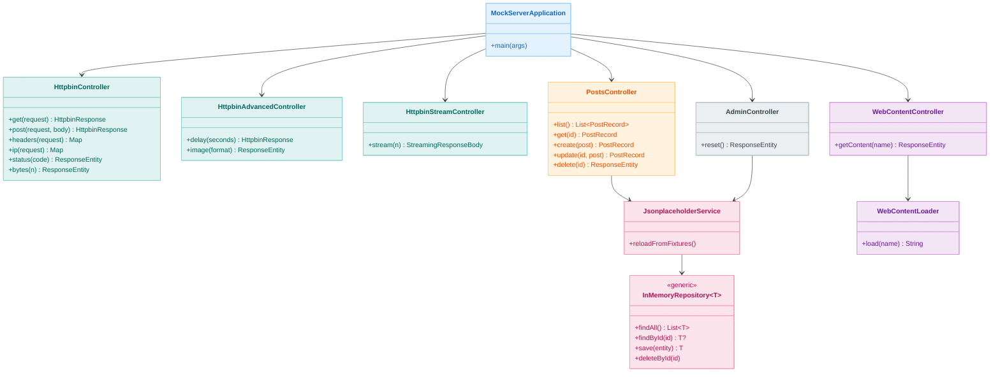
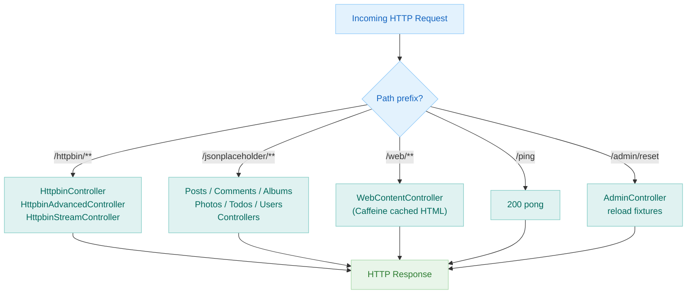
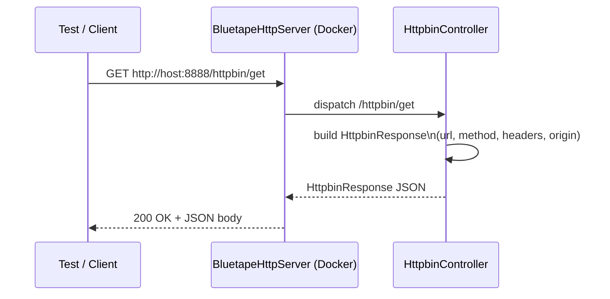

# Module bluetape4k-mock-server

English | [한국어](./README.ko.md)

A self-contained Spring Boot HTTP mock server that replaces external HTTP dependencies in integration tests.
It simulates **httpbin.org**, **jsonplaceholder.typicode.com**, and a simple web-content endpoint, all in one Docker image (`bluetape4k/mock-server`).

## Overview

| Replaces | Prefix |
|----------|--------|
| [httpbin.org](https://httpbin.org) — HTTP inspection API | `/httpbin/**` |
| [jsonplaceholder.typicode.com](https://jsonplaceholder.typicode.com) — REST fixture API | `/jsonplaceholder/**` |
| Generic HTML / web content fixtures | `/web/**` |
| Health check | `/ping` |
| Admin / data reset | `/admin/reset` |

## Endpoints

### Core

| Method | Path | Description |
|--------|------|-------------|
| `GET` | `/ping` | Health check — returns `pong` |
| `POST` | `/admin/reset` | Reloads all in-memory fixture data from classpath JSON files |

### `/httpbin/**`

| Method | Path | Description |
|--------|------|-------------|
| `GET` | `/httpbin/get` | Echoes GET request info |
| `POST` | `/httpbin/post` | Echoes POST request + body |
| `PUT` | `/httpbin/put` | Echoes PUT request + body |
| `PATCH` | `/httpbin/patch` | Echoes PATCH request + body |
| `DELETE` | `/httpbin/delete` | Echoes DELETE request info |
| `GET` | `/httpbin/headers` | Returns all request headers |
| `GET` | `/httpbin/ip` | Returns client IP |
| `GET` | `/httpbin/user-agent` | Returns User-Agent header |
| `GET` | `/httpbin/uuid` | Returns a random UUID |
| `ANY` | `/httpbin/anything/**` | Echoes any request |
| `ANY` | `/httpbin/status/{code}` | Returns the given HTTP status code |
| `GET` | `/httpbin/bytes/{n}` | Returns `n` random bytes |
| `GET` | `/httpbin/delay/{seconds}` | Responds after a delay |
| `GET` | `/httpbin/stream/{n}` | Streams `n` JSON lines |
| `GET` | `/httpbin/image/{format}` | Returns a sample image (png/jpeg/svg/webp) |

### `/jsonplaceholder/**`

Mirrors [jsonplaceholder.typicode.com](https://jsonplaceholder.typicode.com). All resources support full CRUD.

| Resource | Base Path |
|----------|-----------|
| Posts | `/jsonplaceholder/posts` |
| Comments | `/jsonplaceholder/comments` |
| Albums | `/jsonplaceholder/albums` |
| Photos | `/jsonplaceholder/photos` |
| Todos | `/jsonplaceholder/todos` |
| Users | `/jsonplaceholder/users` |

### `/web/**`

| Method | Path | Description |
|--------|------|-------------|
| `GET` | `/web/{name}` | Returns cached HTML content by name |

## Architecture

### Class Diagram



### Request Routing Flowchart



### Sequence Diagram — httpbin GET



## Configuration

`src/main/resources/application.yml` defaults:

| Key | Value | Notes |
|-----|-------|-------|
| `server.port` | `8888` | Fixed container port |
| `spring.threads.virtual.enabled` | `true` | Virtual Threads (JDK 21+) |
| `spring.cache.type` | `caffeine` | In-process caching |
| `spring.cache.cache-names` | `html-content`, `fixture-data`, `httpbin-image` | Caffeine cache names |
| `server.http2.enabled` | `true` | HTTP/2 support |

## Build & Run

### Build Docker image with Jib

```bash
./gradlew :bluetape4k-mock-server:jibBuildTar
```

This produces `build/jib-image.tar`. Load it into Docker:

```bash
docker load < testing/mock-server/build/jib-image.tar
```

### Run directly

```bash
docker run --rm -p 8888:8888 bluetape4k/mock-server:latest
```

### Use via Testcontainers (`BluetapeHttpServer`)

```kotlin
val server = BluetapeHttpServer.Launcher.bluetapeHttpServer

// Pre-built URL helpers
println(server.url)                // http://localhost:<dynamic-port>
println(server.httpbinUrl)         // http://localhost:<port>/httpbin
println(server.jsonplaceholderUrl) // http://localhost:<port>/jsonplaceholder
println(server.webUrl)             // http://localhost:<port>/web
```

## Adding the Dependency

The mock-server module is a Docker image, not a library dependency.
To run it in tests, add the testcontainers module:

```kotlin
dependencies {
    testImplementation("io.github.bluetape4k:bluetape4k-testcontainers:${version}")
}
```

## References

- [httpbin.org](https://httpbin.org)
- [jsonplaceholder.typicode.com](https://jsonplaceholder.typicode.com)
- [Testcontainers](https://www.testcontainers.org/)
- [Jib — Containerize Java apps](https://github.com/GoogleContainerTools/jib)
