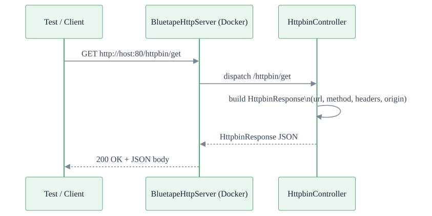

# bluetape4k-mock-web-server

한국어 | [English](./README.md)

외부 HTTP 의존성을 통합 테스트에서 대체하기 위한 독립형 Spring Boot 4 + Virtual Threads HTTP Mock 서버입니다.
**httpbin.org**, **jsonplaceholder.typicode.com**, 그리고 간단한 웹 컨텐츠 엔드포인트를 하나의 Docker 이미지(
`bluetape4k/mock-web-server`)로 제공합니다.

## Architecture

`bluetape4k-mock-web-server`는 포트 **80**(HTTP) / **443**(HTTPS)에서 실행되는 Spring Boot 4 MVC 애플리케이션입니다.
`spring.threads.virtual.enabled=true` 설정으로 JDK 21+ Virtual Threads를 사용하여 OS 스레드를 블로킹하지 않고 고동시성 요청을 처리합니다. 모든 Fixture 데이터는 클래스패스 JSON 파일에서 로드되어 인메모리에 저장되며, 제네릭
`InMemoryRepository<T>`를 통해 `JsonplaceholderService`가 관리합니다. 정적 HTML 컨텐츠는 Caffeine 캐시를 사용하는
`WebContentLoader`를 통해 제공됩니다.

| 엔드포인트 그룹        | Prefix                | 설명                                               |
|-----------------|-----------------------|--------------------------------------------------|
| 헬스 체크           | `/ping`               | `pong` 반환                                        |
| 관리              | `/admin/**`           | 인메모리 Fixture 데이터 초기화                             |
| httpbin         | `/httpbin/**`         | httpbin.org HTTP 요청 검사 API 모방                    |
| jsonplaceholder | `/jsonplaceholder/**` | jsonplaceholder.typicode.com REST Fixture API 모방 |
| web             | `/web/**`             | 캐시된 HTML/웹 컨텐츠 Fixture                           |

## UML

### 요청 라우팅 개요



### 클래스 다이어그램



### 시퀀스 다이어그램 — httpbin GET 요청



## Features

- **Spring Boot 4 + Virtual Threads**: JDK 21+ Virtual Threads(`spring.threads.virtual.enabled=true`)로 고동시성 요청 처리
- **포트 80(HTTP) / 443(HTTPS)**: 결정론적 테스트 구성을 위한 표준 컨테이너 포트
- **httpbin 시뮬레이션**: `/httpbin/**`에서 HTTP 요청 검사 전체 API 제공 — 요청 에코, 헤더/IP/UUID 반환, 스트리밍, 지연, 이미지
- **jsonplaceholder 시뮬레이션**: `/jsonplaceholder/**`에서 6개 전체 CRUD 리소스 (posts/comments/albums/photos/todos/users)
- **웹 컨텐츠 Fixture**: Caffeine 캐시를 통한 `/web/{name}` HTML 컨텐츠
- **관리 초기화**: `POST /admin/reset`으로 클래스패스 JSON 파일에서 전체 인메모리 Fixture 데이터 재적재
- **Docker 이미지**: `bluetape4k/mock-web-server` — Jib으로 빌드, Dockerfile 불필요
- **Testcontainers 통합**: `BluetapeHttpServer` 컴패니언 오브젝트가 통합 테스트용 URL 헬퍼 제공

### 설정

`src/main/resources/application.yml` 기본값:

| 키                                | 값                                               | 설명                          |
|----------------------------------|-------------------------------------------------|-----------------------------|
| `server.port`                    | `80`                                            | HTTP 컨테이너 포트                |
| `bluetape4k.https.port`          | `443`                                           | HTTPS 컨테이너 포트               |
| `server.http2.enabled`           | `true`                                          | HTTP/2 지원                   |
| `server.tomcat.threads.max`      | `16000`                                         | 최대 플랫폼 스레드 수 (고동시성 벤치마크 지원) |
| `server.tomcat.max-connections`  | `16000`                                         | 최대 동시 연결 수                  |
| `server.tomcat.accept-count`     | `16000`                                         | 연결 대기 큐 크기                  |
| `spring.threads.virtual.enabled` | `true`                                          | Virtual Threads (JDK 21+)   |
| `spring.cache.type`              | `caffeine`                                      | 인프로세스 캐시                    |
| `spring.cache.cache-names`       | `html-content`, `fixture-data`, `httpbin-image` | Caffeine 캐시 이름              |

## Examples

### Docker로 실행

```bash
docker run --rm -p 80:80 -p 443:443 bluetape4k/mock-web-server:latest
```

### Jib으로 Docker 이미지 빌드

```bash
./gradlew :bluetape4k-mock-web-server:jibDockerBuild --no-configuration-cache
```

### Testcontainers로 사용 (`BluetapeHttpServer`)

```kotlin
val server = BluetapeHttpServer.Launcher.bluetapeHttpServer

// 미리 구성된 URL 헬퍼
println(server.url)                // http://localhost:<동적포트>
println(server.httpbinUrl)         // http://localhost:<port>/httpbin
println(server.jsonplaceholderUrl) // http://localhost:<port>/jsonplaceholder
println(server.webUrl)             // http://localhost:<port>/web
```

### Testcontainers 의존성 추가

```kotlin
dependencies {
    testImplementation("io.github.bluetape4k:bluetape4k-testcontainers:${version}")
}
```

### 엔드포인트 참조

#### 기본

| Method | Path           | 설명                                 |
|--------|----------------|------------------------------------|
| `GET`  | `/ping`        | 헬스 체크 — `pong` 반환                  |
| `POST` | `/admin/reset` | 인메모리 Fixture 데이터를 클래스패스 JSON에서 재적재 |

#### `/httpbin/**`

| Method   | Path                       | 설명                                   |
|----------|----------------------------|--------------------------------------|
| `GET`    | `/httpbin/get`             | GET 요청 정보 반환                         |
| `POST`   | `/httpbin/post`            | POST 요청 + body 반환                    |
| `PUT`    | `/httpbin/put`             | PUT 요청 + body 반환                     |
| `PATCH`  | `/httpbin/patch`           | PATCH 요청 + body 반환                   |
| `DELETE` | `/httpbin/delete`          | DELETE 요청 정보 반환                      |
| `GET`    | `/httpbin/headers`         | 모든 요청 헤더 반환                          |
| `GET`    | `/httpbin/ip`              | 클라이언트 IP 반환                          |
| `GET`    | `/httpbin/user-agent`      | User-Agent 헤더 반환                     |
| `GET`    | `/httpbin/uuid`            | 랜덤 UUID 반환                           |
| `ANY`    | `/httpbin/anything/**`     | 임의 요청 에코                             |
| `ANY`    | `/httpbin/status/{code}`   | 지정된 HTTP 상태 코드 반환                    |
| `GET`    | `/httpbin/bytes/{n}`       | `n` 바이트의 랜덤 바이너리 반환                  |
| `GET`    | `/httpbin/delay/{seconds}` | 지연 후 응답 (`0.5` = 500ms, 범위 0.0–10.0) |
| `GET`    | `/httpbin/stream/{n}`      | JSON 라인 `n`개 스트리밍                    |
| `GET`    | `/httpbin/image/{format}`  | 샘플 이미지 반환 (png/jpeg/svg/webp)        |

#### `/jsonplaceholder/**`

[jsonplaceholder.typicode.com](https://jsonplaceholder.typicode.com)을 그대로 모방합니다. 모든 리소스는 전체 CRUD를 지원합니다.

| 리소스      | 기본 경로                       |
|----------|-----------------------------|
| Posts    | `/jsonplaceholder/posts`    |
| Comments | `/jsonplaceholder/comments` |
| Albums   | `/jsonplaceholder/albums`   |
| Photos   | `/jsonplaceholder/photos`   |
| Todos    | `/jsonplaceholder/todos`    |
| Users    | `/jsonplaceholder/users`    |

#### `/web/**`

| Method | Path          | 설명                   |
|--------|---------------|----------------------|
| `GET`  | `/web/{name}` | 이름으로 캐시된 HTML 컨텐츠 반환 |

## 참고

- [httpbin.org](https://httpbin.org)
- [jsonplaceholder.typicode.com](https://jsonplaceholder.typicode.com)
- [Testcontainers](https://www.testcontainers.org/)
- [Jib — Java 앱 컨테이너화](https://github.com/GoogleContainerTools/jib)
