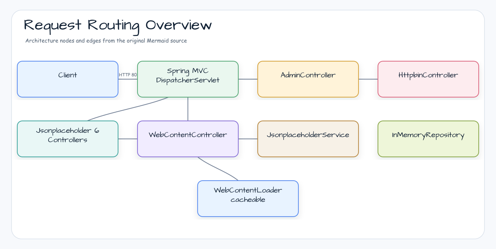
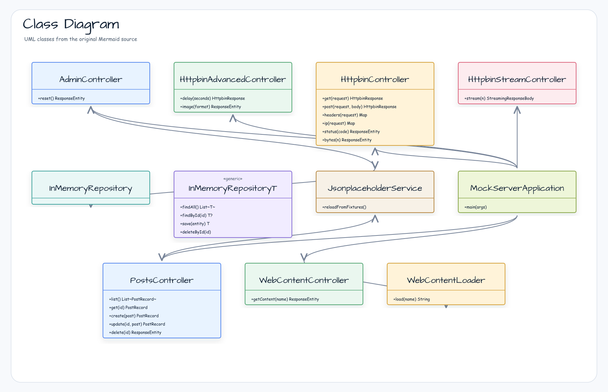
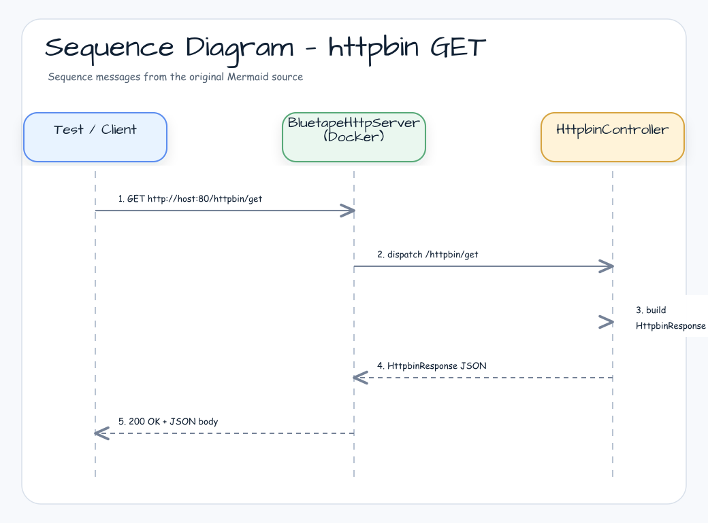

# bluetape4k-mock-web-server

[한국어](./README.ko.md) | English

A self-contained Spring Boot 4 + Virtual Threads HTTP mock server that replaces external HTTP dependencies in integration tests. It simulates
**httpbin.org**, **jsonplaceholder.typicode.com**, and a simple web-content endpoint, all in one Docker image (
`bluetape4k/mock-web-server`).

## Architecture

`bluetape4k-mock-web-server` is a Spring Boot 4 MVC application that runs on port **80** (HTTP) / **443
** (HTTPS). It uses Virtual Threads (
`spring.threads.virtual.enabled=true`) for high-concurrency handling without blocking OS threads. All fixture data is stored in-memory (loaded from classpath JSON files) and managed by
`JsonplaceholderService` through a generic `InMemoryRepository<T>`. Static HTML content is served via
`WebContentLoader` with Caffeine caching.

| Endpoint Group  | Prefix                | Description                                           |
|-----------------|-----------------------|-------------------------------------------------------|
| Health check    | `/ping`               | Returns `pong`                                        |
| Admin           | `/admin/**`           | Reset in-memory fixture data                          |
| httpbin         | `/httpbin/**`         | Mirrors httpbin.org HTTP inspection API               |
| jsonplaceholder | `/jsonplaceholder/**` | Mirrors jsonplaceholder.typicode.com REST fixture API |
| web             | `/web/**`             | Cached HTML/web content fixtures                      |

## UML

### Request Routing Overview



### Class Diagram



### Sequence Diagram — httpbin GET



## Features

- **Spring Boot 4 + Virtual Threads**: High-concurrency request handling with JDK 21+ Virtual Threads (
  `spring.threads.virtual.enabled=true`)
- **Port 80 (HTTP) / 443 (HTTPS)**: Standard container ports for deterministic test configuration
- **httpbin simulation**: Full HTTP inspection API at
  `/httpbin/**` — echoes requests, returns headers/IP/UUID, streams, delays, and images
- **jsonplaceholder simulation**: 6 full CRUD resources (posts/comments/albums/photos/todos/users) at
  `/jsonplaceholder/**`
- **Web content fixtures**: Cached HTML content at `/web/{name}` via Caffeine
- **Admin reset**: `POST /admin/reset` reloads all in-memory fixture data from classpath JSON files
- **Docker image**: `bluetape4k/mock-web-server` — built with Jib, no Dockerfile required
- **Testcontainers integration**: `BluetapeHttpServer` companion provides URL helpers for integration tests

### Configuration

`src/main/resources/application.yml` defaults:

| Key                              | Value                                           | Notes                                                     |
|----------------------------------|-------------------------------------------------|-----------------------------------------------------------|
| `server.port`                    | `80`                                            | HTTP container port                                       |
| `bluetape4k.https.port`          | `443`                                           | HTTPS container port                                      |
| `server.http2.enabled`           | `true`                                          | HTTP/2 support                                            |
| `server.tomcat.threads.max`      | `16000`                                         | Max platform threads (high-concurrency benchmark support) |
| `server.tomcat.max-connections`  | `16000`                                         | Max simultaneous connections                              |
| `server.tomcat.accept-count`     | `16000`                                         | Connection backlog queue size                             |
| `spring.threads.virtual.enabled` | `true`                                          | Virtual Threads (JDK 21+)                                 |
| `spring.cache.type`              | `caffeine`                                      | In-process caching                                        |
| `spring.cache.cache-names`       | `html-content`, `fixture-data`, `httpbin-image` | Caffeine cache names                                      |

## Examples

### Run via Docker

```bash
docker run --rm -p 80:80 -p 443:443 bluetape4k/mock-web-server:latest
```

### Build Docker image with Jib

```bash
./gradlew :bluetape4k-mock-web-server:jibDockerBuild --no-configuration-cache
```

### Use via Testcontainers (`BluetapeHttpServer`)

```kotlin
val server = BluetapeHttpServer.Launcher.bluetapeHttpServer

// Pre-built URL helpers
println(server.url)                // http://localhost:<dynamic-port>
println(server.httpbinUrl)         // http://localhost:<port>/httpbin
println(server.jsonplaceholderUrl) // http://localhost:<port>/jsonplaceholder
println(server.webUrl)             // http://localhost:<port>/web
```

### Add the Testcontainers dependency

```kotlin
dependencies {
    testImplementation("io.github.bluetape4k:bluetape4k-testcontainers:${version}")
}
```

### Endpoint Reference

#### Core

| Method | Path           | Description                                                  |
|--------|----------------|--------------------------------------------------------------|
| `GET`  | `/ping`        | Health check — returns `pong`                                |
| `POST` | `/admin/reset` | Reloads all in-memory fixture data from classpath JSON files |

#### `/httpbin/**`

| Method   | Path                       | Description                                             |
|----------|----------------------------|---------------------------------------------------------|
| `GET`    | `/httpbin/get`             | Echoes GET request info                                 |
| `POST`   | `/httpbin/post`            | Echoes POST request + body                              |
| `PUT`    | `/httpbin/put`             | Echoes PUT request + body                               |
| `PATCH`  | `/httpbin/patch`           | Echoes PATCH request + body                             |
| `DELETE` | `/httpbin/delete`          | Echoes DELETE request info                              |
| `GET`    | `/httpbin/headers`         | Returns all request headers                             |
| `GET`    | `/httpbin/ip`              | Returns client IP                                       |
| `GET`    | `/httpbin/user-agent`      | Returns User-Agent header                               |
| `GET`    | `/httpbin/uuid`            | Returns a random UUID                                   |
| `ANY`    | `/httpbin/anything/**`     | Echoes any request                                      |
| `ANY`    | `/httpbin/status/{code}`   | Returns the given HTTP status code                      |
| `GET`    | `/httpbin/bytes/{n}`       | Returns `n` random bytes                                |
| `GET`    | `/httpbin/delay/{seconds}` | Responds after a delay (`0.5` = 500 ms, range 0.0–10.0) |
| `GET`    | `/httpbin/stream/{n}`      | Streams `n` JSON lines                                  |
| `GET`    | `/httpbin/image/{format}`  | Returns a sample image (png/jpeg/svg/webp)              |

#### `/jsonplaceholder/**`

Mirrors [jsonplaceholder.typicode.com](https://jsonplaceholder.typicode.com). All resources support full CRUD.

| Resource | Base Path                   |
|----------|-----------------------------|
| Posts    | `/jsonplaceholder/posts`    |
| Comments | `/jsonplaceholder/comments` |
| Albums   | `/jsonplaceholder/albums`   |
| Photos   | `/jsonplaceholder/photos`   |
| Todos    | `/jsonplaceholder/todos`    |
| Users    | `/jsonplaceholder/users`    |

#### `/web/**`

| Method | Path          | Description                         |
|--------|---------------|-------------------------------------|
| `GET`  | `/web/{name}` | Returns cached HTML content by name |

## References

- [httpbin.org](https://httpbin.org)
- [jsonplaceholder.typicode.com](https://jsonplaceholder.typicode.com)
- [Testcontainers](https://www.testcontainers.org/)
- [Jib — Containerize Java apps](https://github.com/GoogleContainerTools/jib)
