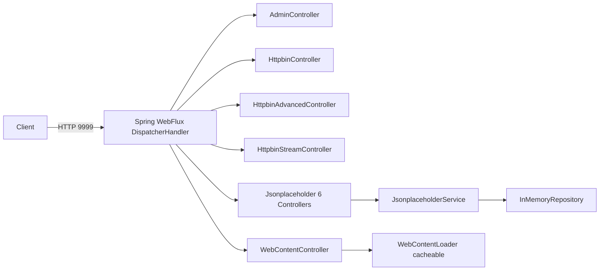

# bluetape4k-mock-webflux-server

한국어 | [English](./README.md)

통합 테스트용 독립형 Spring Boot 4 + WebFlux 목(mock) 서버입니다. [httpbin.org](https://httpbin.org) 및 [jsonplaceholder.typicode.com](https://jsonplaceholder.typicode.com)과 호환되는 HTTP 엔드포인트를 제공하며, Kotlin Coroutines(`suspend fun`, `Flow`)로 완전히 구현되어 있습니다.

## Architecture

`bluetape4k-mock-webflux-server`는 기본 포트 **9999**에서 수신 대기하는 독립 실행형 Spring Boot 애플리케이션으로 패키징됩니다(모듈명: `bluetape4k-mock-webflux-server`, Docker 이미지명: `bluetape4k/mock-webflux-server`). 외부 네트워크 없이 실제 HTTP 서버가 필요한 통합 테스트 스위트에서 Testcontainers의 `GenericContainer`로 실행하도록 설계되었습니다.

### `bluetape4k-mock-web-server`와의 차이점

| 항목 | `mock-web-server` (MVC) | `mock-webflux-server` (WebFlux) |
|---|---|---|
| 스택 | Spring MVC (Servlet) | Spring WebFlux (Reactive) |
| 핸들러 | 일반 `fun` | `suspend fun` / `Flow` |
| 스트리밍 | 미지원 | `Flow` 기반 SSE / 청크 전송 |
| 코루틴 | 선택 사항 | 기본 지원 |
| I/O 모델 | 스레드-퍼-요청 | 이벤트 루프 (Netty) |

## UML



## Features

- **Httpbin 엔드포인트** — `/get`, `/post`, `/put`, `/delete`, `/patch`, `/headers`, `/ip`, `/status/{code}`, `/delay/{seconds}`, `/redirect/{n}`, `/cookies`, `/basic-auth/{user}/{passwd}`, `/bearer`, `/anything`
- **Httpbin Advanced** — `/gzip`, `/deflate`, `/brotli`, `/encoding/utf8`, `/html`, `/xml`, `/json`, `/robots.txt`, `/deny`
- **Httpbin Streaming** — `/stream/{n}` (Flow 기반), `/stream-bytes/{n}`, `/drip`, `/sse`
- **Jsonplaceholder** — `posts`, `comments`, `albums`, `photos`, `todos`, `users`에 대한 CRUD 전체 지원 (InMemoryRepository 기반)
- **WebContent** — `@Cacheable` 로더를 통한 임의 웹 콘텐츠 제공
- **Admin** — `/admin/reset`, `/admin/info`, `/ping`
- **글로벌 예외 핸들러** — 일관된 JSON 오류 응답
- **Spring Boot 4 + Kotlin Coroutines** — 모든 핸들러가 `suspend fun` 또는 `Flow` 반환

## Examples

### Testcontainers 의존성 추가

```kotlin
// build.gradle.kts
testImplementation("io.bluetape4k:bluetape4k-mock-webflux-server")
```

### 테스트에서 서버 시작

```kotlin
import org.testcontainers.containers.GenericContainer
import org.testcontainers.utility.DockerImageName

val mockServer = GenericContainer(DockerImageName.parse("bluetape4k/mock-webflux-server:latest"))
    .withExposedPorts(9999)

@BeforeAll
fun startServer() {
    mockServer.start()
}

@AfterAll
fun stopServer() {
    mockServer.stop()
}
```

### Jsonplaceholder 엔드포인트 호출

```kotlin
val client = WebClient.create("http://${mockServer.host}:${mockServer.getMappedPort(9999)}")

val posts: List<PostRecord> = client.get()
    .uri("/posts")
    .retrieve()
    .awaitBody()
```

### Flow를 통한 스트리밍 응답

```kotlin
val events: Flow<String> = client.get()
    .uri("/stream/5")
    .retrieve()
    .bodyToFlow()

events.collect { line -> println(line) }
```

### 애플리케이션 직접 실행 (Docker 없이)

```bash
./gradlew :bluetape4k-mock-webflux-server:bootRun
# 서버가 http://localhost:9999 에서 시작됩니다
```

### Docker 이미지 재빌드

```bash
./gradlew :bluetape4k-mock-webflux-server:jibDockerBuild --no-configuration-cache
```
