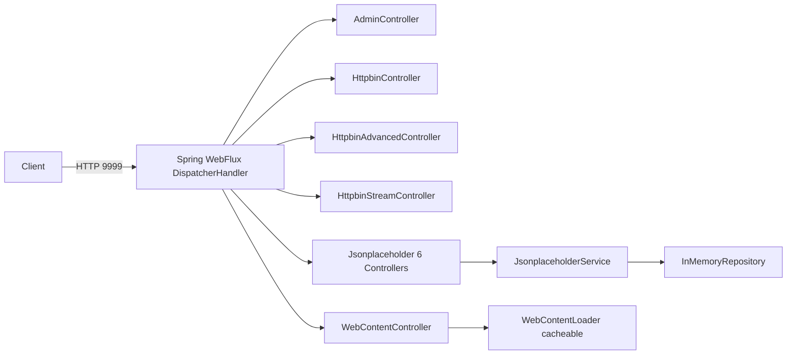

# bluetape4k-mock-webflux-server

[한국어](./README.ko.md) | English

A standalone Spring Boot 4 + WebFlux mock server for integration testing. Provides HTTP endpoints compatible with [httpbin.org](https://httpbin.org) and [jsonplaceholder.typicode.com](https://jsonplaceholder.typicode.com), implemented entirely with Kotlin Coroutines (`suspend fun`, `Flow`).

## Architecture

`bluetape4k-mock-webflux-server` is packaged as a self-contained Spring Boot application (module `bluetape4k-mock-webflux-server`, Docker image `bluetape4k/mock-webflux-server`) that listens on port **9999** by default. It is designed to be launched as a `GenericContainer` via Testcontainers in integration test suites that need a real HTTP server without external network access.

### Comparison with `bluetape4k-mock-web-server`

| Aspect | `mock-web-server` (MVC) | `mock-webflux-server` (WebFlux) |
|---|---|---|
| Stack | Spring MVC (Servlet) | Spring WebFlux (Reactive) |
| Handlers | Regular `fun` | `suspend fun` / `Flow` |
| Streaming | N/A | `Flow`-based SSE / chunked |
| Coroutines | Optional | First-class |
| I/O model | Thread-per-request | Event-loop (Netty) |

## UML



## Features

- **Httpbin endpoints** — `/get`, `/post`, `/put`, `/delete`, `/patch`, `/headers`, `/ip`, `/status/{code}`, `/delay/{seconds}`, `/redirect/{n}`, `/cookies`, `/basic-auth/{user}/{passwd}`, `/bearer`, `/anything`
- **Httpbin Advanced** — `/gzip`, `/deflate`, `/brotli`, `/encoding/utf8`, `/html`, `/xml`, `/json`, `/robots.txt`, `/deny`
- **Httpbin Streaming** — `/stream/{n}` (Flow-based), `/stream-bytes/{n}`, `/drip`, `/sse`
- **Jsonplaceholder** — Full CRUD for `posts`, `comments`, `albums`, `photos`, `todos`, `users` backed by an `InMemoryRepository`
- **WebContent** — Serve arbitrary web content with `@Cacheable` loader
- **Admin** — `/admin/reset`, `/admin/info`, `/ping`
- **Global exception handler** — Consistent JSON error responses
- **Spring Boot 4 + Kotlin Coroutines** — All handlers are `suspend fun` or return `Flow`

## Examples

### Add as a Testcontainers dependency

```kotlin
// build.gradle.kts
testImplementation("io.bluetape4k:bluetape4k-mock-webflux-server")
```

### Start the server in a test

```kotlin
import org.testcontainers.containers.GenericContainer
import org.testcontainers.utility.DockerImageName

val mockServer = GenericContainer(DockerImageName.parse("bluetape4k/mock-webflux-server:latest"))
    .withExposedPorts(9999)

@BeforeAll
fun startServer() {
    mockServer.start()
}

@AfterAll
fun stopServer() {
    mockServer.stop()
}
```

### Call a Jsonplaceholder endpoint

```kotlin
val client = WebClient.create("http://${mockServer.host}:${mockServer.getMappedPort(9999)}")

val posts: List<PostRecord> = client.get()
    .uri("/posts")
    .retrieve()
    .awaitBody()
```

### Stream responses with Flow

```kotlin
val events: Flow<String> = client.get()
    .uri("/stream/5")
    .retrieve()
    .bodyToFlow()

events.collect { line -> println(line) }
```

### Use the application directly (without Docker)

```bash
./gradlew :bluetape4k-mock-webflux-server:bootRun
# Server starts on http://localhost:9999
```

### Rebuild the Docker image

```bash
./gradlew :bluetape4k-mock-webflux-server:jibDockerBuild --no-configuration-cache
```
