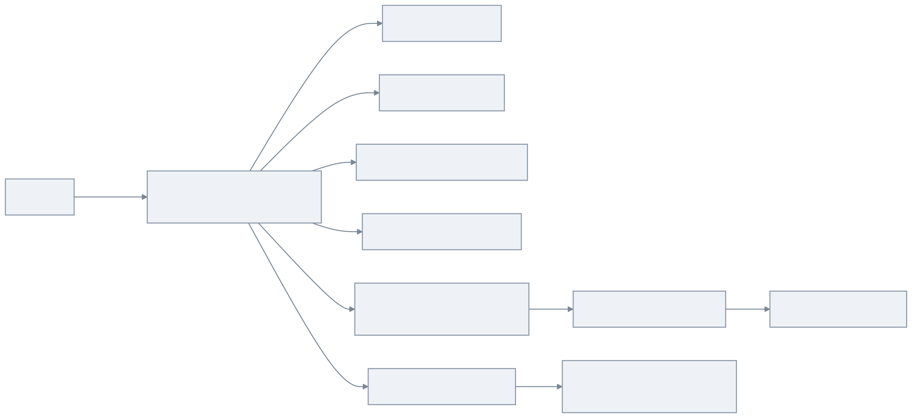
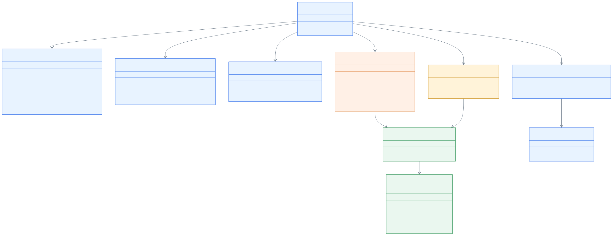
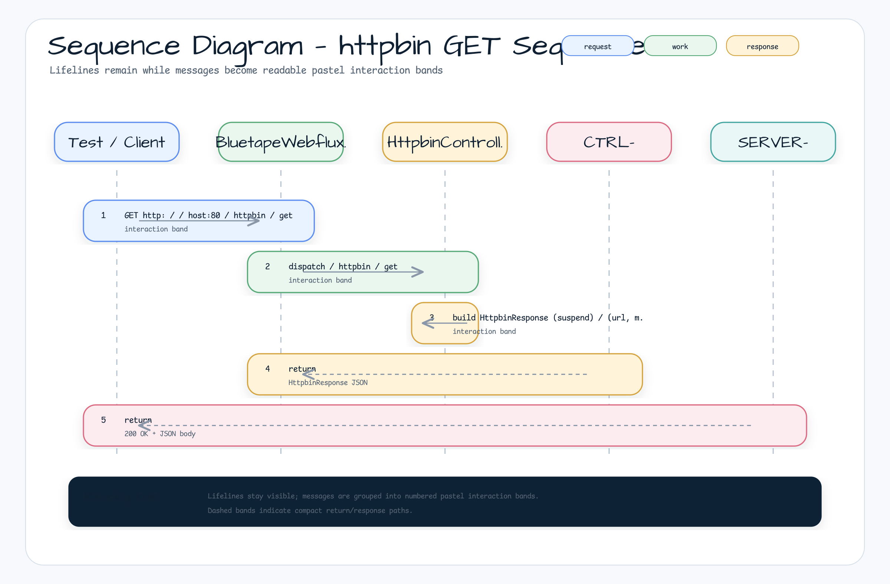

# bluetape4k-mock-webflux-server

[한국어](./README.ko.md) | English

A standalone Spring Boot 4 + WebFlux mock server for integration testing. It provides HTTP endpoints compatible with
[httpbin.org](https://httpbin.org) and [jsonplaceholder.typicode.com](https://jsonplaceholder.typicode.com), implemented with Kotlin Coroutines
(`suspend fun`, `Flow`). It runs on port **80** (HTTP) / **8443** (HTTPS) inside Docker.

## Architecture

`bluetape4k-mock-webflux-server` is packaged as a self-contained Spring Boot application (module
`bluetape4k-mock-webflux-server`, Docker image `bluetape4k/mock-webflux-server`). It is designed to be launched as a
`GenericContainer` via
`BluetapeWebfluxServer` (Testcontainers) in integration test suites that need a real HTTP server without external network access.

### Comparison with `bluetape4k-mock-web-server`

| Aspect     | `mock-web-server` (MVC) | `mock-webflux-server` (WebFlux) |
|------------|-------------------------|---------------------------------|
| Stack      | Spring MVC (Servlet)    | Spring WebFlux (Reactive)       |
| Handlers   | Regular `fun`           | `suspend fun` / `Flow`          |
| Streaming  | N/A                     | `Flow`-based SSE / chunked      |
| Coroutines | Optional                | First-class                     |
| I/O model  | Thread-per-request      | Event-loop (Netty)              |
| HTTP port  | 80                      | 80                              |
| HTTPS port | 443                     | 8443                            |

## Diagrams

### Request Routing Overview



### Class Diagram



### Sequence Diagram — httpbin GET



## Features

- **Spring Boot 4 + Kotlin Coroutines**: All handlers are `suspend fun` or return `Flow` — fully non-blocking
- **Port 80 (HTTP) / 8443 (HTTPS)**: Standard container ports for deterministic test configuration
- **httpbin simulation**: Full HTTP inspection API at
  `/httpbin/**` — echoes requests, returns headers/IP/UUID, streams, delays, and images
- **jsonplaceholder simulation**: 6 full CRUD resources (posts/comments/albums/photos/todos/users) at
  `/jsonplaceholder/**`
- **Web content fixtures**: Cached HTML content at `/web/{name}` via Caffeine
- **Admin reset**: `POST /admin/reset` reloads all in-memory fixture data from classpath JSON files
- **Docker image**: `bluetape4k/mock-webflux-server` — built with Jib
- **Testcontainers integration**: `BluetapeWebfluxServer` provides URL helpers including HTTPS for integration tests

### Configuration

`src/main/resources/application.yml` defaults:

| Key                        | Value                                          | Notes                |
|----------------------------|------------------------------------------------|----------------------|
| `server.port`              | `80`                                           | HTTP container port  |
| `bluetape4k.https.port`    | `8443`                                         | HTTPS container port |
| `spring.cache.type`        | `caffeine`                                     | In-process caching   |
| `spring.cache.cache-names` | `web-content`, `fixture-data`, `httpbin-image` | Caffeine cache names |

## Examples

### Run via Docker

```bash
docker run --rm -p 80:80 -p 8443:8443 bluetape4k/mock-webflux-server:latest
```

### Build Docker image with Jib

```bash
./gradlew :bluetape4k-mock-webflux-server:jibDockerBuild --no-configuration-cache
```

### Use via Testcontainers (`BluetapeWebfluxServer`)

```kotlin
val server = BluetapeWebfluxServer().apply { start() }

// HTTP URL helpers
println(server.url)                // http://localhost:<dynamic-port>
println(server.httpbinUrl)         // http://localhost:<port>/httpbin
println(server.jsonplaceholderUrl) // http://localhost:<port>/jsonplaceholder
println(server.webUrl)             // http://localhost:<port>/web

// HTTPS URL helpers (requires BluetapeSslContext)
val httpsClient = BluetapeSslContext.configureOkHttp(OkHttpClient.Builder()).build()
println(server.httpsUrl)           // https://localhost:<https-port>
```

### Add the Testcontainers dependency

```kotlin
dependencies {
    testImplementation("io.github.bluetape4k:bluetape4k-testcontainers:${version}")
}
```

### Use the application directly (without Docker)

```bash
./gradlew :bluetape4k-mock-webflux-server:bootRun
# Server starts on http://localhost:80
```

### Endpoint Reference

#### Core

| Method | Path           | Description                                                  |
|--------|----------------|--------------------------------------------------------------|
| `GET`  | `/ping`        | Health check — returns `pong`                                |
| `POST` | `/admin/reset` | Reloads all in-memory fixture data from classpath JSON files |

#### `/httpbin/**`

| Method   | Path                        | Description                                             |
|----------|-----------------------------|---------------------------------------------------------|
| `GET`    | `/httpbin/get`              | Echoes GET request info                                 |
| `POST`   | `/httpbin/post`             | Echoes POST request + body                              |
| `PUT`    | `/httpbin/put`              | Echoes PUT request + body                               |
| `PATCH`  | `/httpbin/patch`            | Echoes PATCH request + body                             |
| `DELETE` | `/httpbin/delete`           | Echoes DELETE request info                              |
| `GET`    | `/httpbin/headers`          | Returns all request headers                             |
| `GET`    | `/httpbin/ip`               | Returns client IP                                       |
| `GET`    | `/httpbin/user-agent`       | Returns User-Agent header                               |
| `GET`    | `/httpbin/uuid`             | Returns a random UUID                                   |
| `ANY`    | `/httpbin/anything/**`      | Echoes any request                                      |
| `ANY`    | `/httpbin/status/{code}`    | Returns the given HTTP status code                      |
| `GET`    | `/httpbin/bytes/{n}`        | Returns `n` random bytes                                |
| `GET`    | `/httpbin/delay/{seconds}`  | Responds after a delay (`0.5` = 500 ms, range 0.0–10.0) |
| `GET`    | `/httpbin/stream/{n}`       | Streams `n` JSON lines via `Flow`                       |
| `GET`    | `/httpbin/image/{format}`   | Returns a sample image (png/jpeg/svg/webp)              |
| `GET`    | `/httpbin/gzip`             | Returns gzip-encoded response                           |
| `GET`    | `/httpbin/deflate`          | Returns deflate-encoded response                        |

#### `/jsonplaceholder/**`

Mirrors [jsonplaceholder.typicode.com](https://jsonplaceholder.typicode.com). All resources support full CRUD.

| Resource | Base Path                   |
|----------|-----------------------------|
| Posts    | `/jsonplaceholder/posts`    |
| Comments | `/jsonplaceholder/comments` |
| Albums   | `/jsonplaceholder/albums`   |
| Photos   | `/jsonplaceholder/photos`   |
| Todos    | `/jsonplaceholder/todos`    |
| Users    | `/jsonplaceholder/users`    |

#### `/web/**`

| Method | Path          | Description                         |
|--------|---------------|-------------------------------------|
| `GET`  | `/web/{name}` | Returns cached HTML content by name |
| `GET`  | `/web/random` | Returns random HTML content         |
| `GET`  | `/web/naver`  | Returns Naver-like HTML fixture     |

## References

- [httpbin.org](https://httpbin.org)
- [jsonplaceholder.typicode.com](https://jsonplaceholder.typicode.com)
- [Testcontainers](https://www.testcontainers.org/)
- [Kotlin Coroutines](https://kotlinlang.org/docs/coroutines-overview.html)
- [Jib — Containerize Java apps](https://github.com/GoogleContainerTools/jib)
