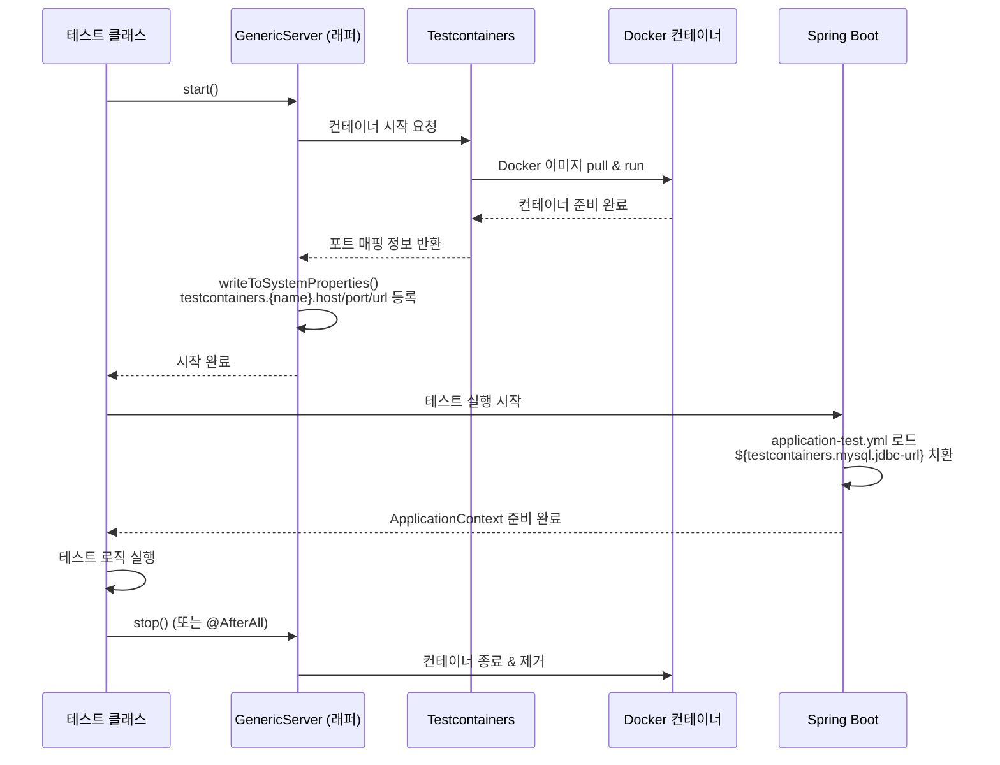
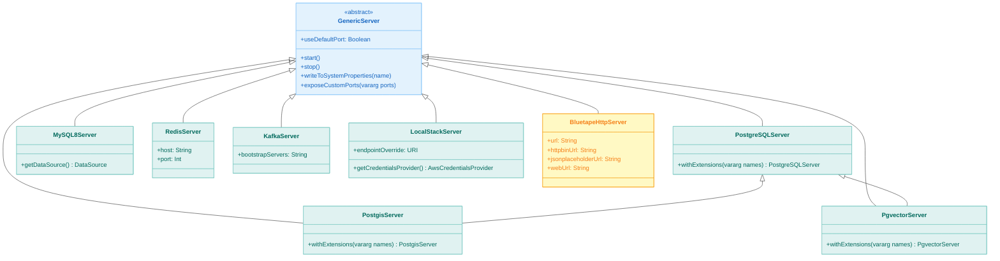
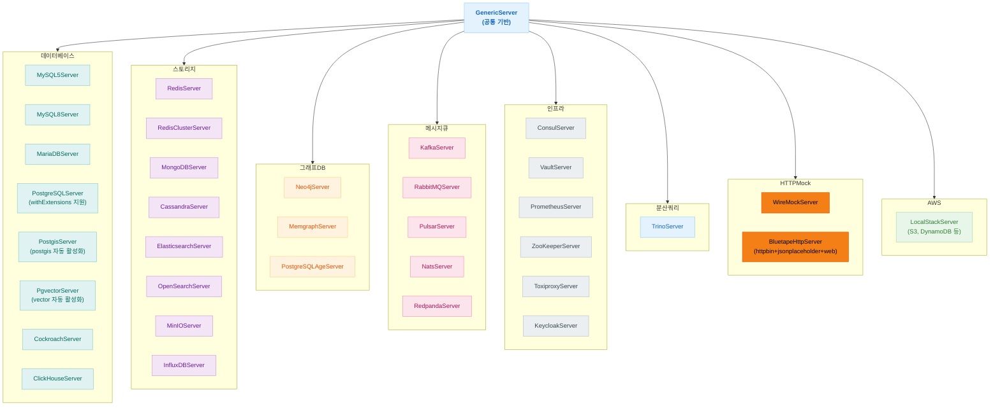
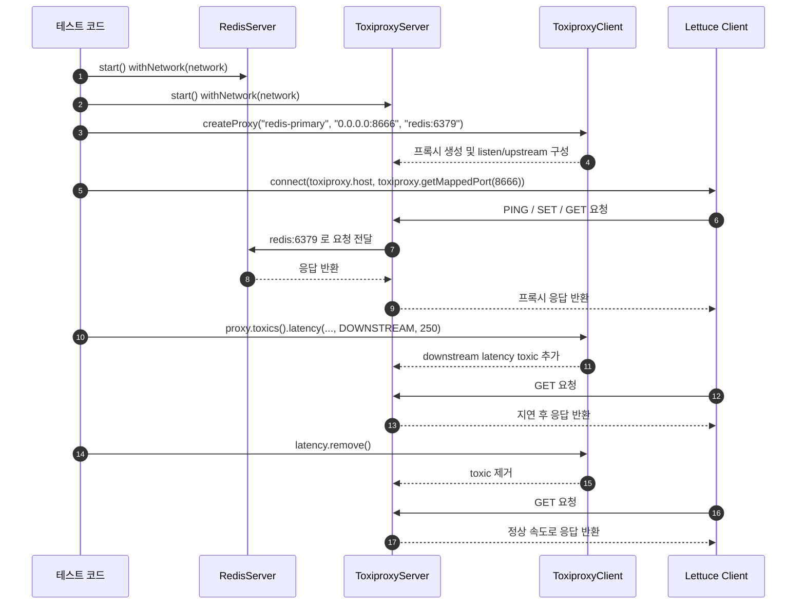

# Module bluetape4k-testcontainers

[English](./README.md) | 한국어

Testcontainers `2.0.3` 기반 통합 테스트를 빠르게 구성하기 위한 서버 래퍼/유틸 라이브러리입니다.

## 아키텍처

### 컨테이너 생명주기 다이어그램



### 지원 컨테이너 클래스 다이어그램



### 지원 컨테이너 구조



## 주요 기능

- **DB 서버 지원**: MySQL, MariaDB, PostgreSQL, PostGIS, pgvector, Cockroach, ClickHouse
- **Graph DB 서버 지원**: Neo4j, Memgraph, PostgreSQL + Apache AGE
- **Storage 서버 지원**: Redis/Redis Cluster, MongoDB, Cassandra, Elastic/OpenSearch, MinIO, InfluxDB
- **MQ 서버 지원**: Kafka, RabbitMQ, Pulsar, Nats, Redpanda
- **Infra 서버 지원**: Consul, Vault, Prometheus, Jaeger, Zipkin, ZooKeeper, Toxiproxy, Keycloak
- **분산 SQL 엔진**: Trino
- **HTTP Mock 지원**: WireMock
- **AWS LocalStack 지원**: S3, DynamoDB 등 로컬 테스트 환경 구성
- **고정 포트 매핑 옵션**: `useDefaultPort=true` 설정 시 기본 포트로 바인딩
- **시스템 프로퍼티 자동 등록**: 컨테이너 시작 시 연결 정보 자동 등록
- **Spring Boot 설정 단순화**: `${testcontainers...}` placeholder로 연결 정보 주입
- **PostgreSQL 확장 자동 활성화**: `PostgisServer`(postgis), `PgvectorServer`(vector)
- **`withExtensions()` API**: 추가 PostgreSQL 확장을 선언적으로 활성화

## 시스템 프로퍼티 Export (PropertyExportingServer)

모든 서버 클래스는 `PropertyExportingServer` 인터페이스를 구현하여, `start()` 시 연결 정보를 시스템 프로퍼티로 자동 등록합니다.

### 키 명명 규칙

모든 프로퍼티 키는 **kebab-case 소문자**를 사용합니다.

시스템 프로퍼티 형식: `testcontainers.{namespace}.{kebab-case-key}`

### 서버별 export 키

| 서버                  | namespace       | 주요 키                                                                                |
|---------------------|-----------------|-------------------------------------------------------------------------------------|
| PostgreSQLServer    | `postgresql`    | `jdbc-url`, `driver-class-name`, `username`, `password`, `database-name`            |
| PostgisServer       | `postgis`       | `jdbc-url`, `driver-class-name`, `username`, `password`, `database-name`            |
| PgvectorServer      | `pgvector`      | `jdbc-url`, `driver-class-name`, `username`, `password`, `database-name`            |
| MySQL8Server        | `mysql`         | `jdbc-url`, `driver-class-name`, `username`, `password`, `database-name`            |
| MariaDBServer       | `mariadb`       | `jdbc-url`, `driver-class-name`, `username`, `password`, `database-name`            |
| CockroachServer     | `cockroach`     | `jdbc-url`, `driver-class-name`, `username`, `password`, `database-name`            |
| ClickHouseServer    | `clickhouse`    | `jdbc-url`, `driver-class-name`, `username`, `password`, `database-name`            |
| TrinoServer         | `trino`         | `jdbc-url`, `username`                                                              |
| RedisServer         | `redis`         | `host`, `port`, `url`                                                               |
| MongoDBServer       | `mongo`         | `host`, `port`, `url`                                                               |
| ElasticsearchServer | `elasticsearch` | `host`, `port`, `url`                                                               |
| KafkaServer         | `kafka`         | `host`, `port`, `url`, `bootstrap-servers`, `bound-port-numbers`                    |
| RedpandaServer      | `redpanda`      | `host`, `port`, `url`, `admin-port`, `schema-registry-port`, `rest-proxy-port`      |
| NatsServer          | `nats`          | `host`, `port`, `url`, `cluster-port`, `monitor-port`                               |
| PulsarServer        | `pulsar`        | `host`, `port`, `url`, `broker-url`, `broker-port`, `broker-http-port`              |
| RabbitMQServer      | `rabbitmq`      | `host`, `port`, `url`, `amqp-url`, `amqp-port`, `amqps-port`, `management-url`      |
| LocalStackServer    | `localstack`    | `host`, `port`, `url`                                                               |
| PrometheusServer    | `prometheus`    | `host`, `port`, `url`, `server-port`, `pushgateway-port`, `graphite-exporter-port`  |
| ConsulServer        | `consul`        | `host`, `port`, `url`, `dns-port`, `http-port`, `rpc-port`                          |
| JaegerServer        | `jaeger`        | `host`, `port`, `url`, `frontend-port`, `zipkin-port`, `config-port`, `thrift-port` |

## 사용 예

### 데이터베이스

```kotlin
val mysql = MySQL8Server(useDefaultPort = true).apply { start() }
val ds = mysql.getDataSource()
```

### PostgreSQL 확장 서버

```kotlin
// PostGIS — postgis 확장 자동 활성화
val server = PostgisServer.Launcher.postgis

// pgvector — vector 확장 자동 활성화
val server = PgvectorServer.Launcher.pgvector

// 추가 확장 withExtensions()으로 선언
PostgisServer()
    .withExtensions("postgis_topology")
    .apply { start() }

PostgreSQLServer()
    .withExtensions("uuid-ossp", "hstore", "pg_trgm")
    .apply { start() }

// 확장 포함 싱글턴 직접 생성
val server = PostgreSQLServer.Launcher.withExtensions("uuid-ossp", "hstore")
```

### Graph DB 서버

```kotlin
// Neo4j 서버
val neo4j = Neo4jServer.Launcher.neo4j
val driver = GraphDatabase.driver(neo4j.boltUrl, AuthTokens.basic(neo4j.username, neo4j.password))

// Memgraph 서버
val memgraph = MemgraphServer.Launcher.memgraph
val driver = GraphDatabase.driver(memgraph.boltUrl, AuthTokens.none())

// PostgreSQL with Apache AGE
val age = PostgreSQLAgeServer.Launcher.postgresqlAge
val conn = DriverManager.getConnection(age.jdbcUrl, age.username, age.password)
```

### HTTP Mock 서버

```kotlin
val wireMock = WireMockServer.Launcher.wireMock

// 스텁 정의
wireMock.stubFor(
    get("/hello")
        .willReturn(ok("Hello!"))
)

// 검증
verify(getRequestedFor(urlEqualTo("/hello")))
```

### BluetapeHttpServer (httpbin + jsonplaceholder + web)

`BluetapeHttpServer`는 `bluetape4k/mock-server` Docker 이미지를 실행합니다.
httpbin, jsonplaceholder, web 컨텐츠 엔드포인트를 하나의 컨테이너에서 제공합니다.

```kotlin
// 싱글턴 — 모든 테스트에서 공유
val server = BluetapeHttpServer.Launcher.bluetapeHttpServer

// 미리 구성된 URL 헬퍼
val baseUrl             = server.url                // http://host:<port>
val httpbinUrl          = server.httpbinUrl         // http://host:<port>/httpbin
val jsonplaceholderUrl  = server.jsonplaceholderUrl // http://host:<port>/jsonplaceholder
val webUrl              = server.webUrl             // http://host:<port>/web
```

#### 자동 등록 시스템 프로퍼티

`start()` 이후 아래 시스템 프로퍼티가 자동으로 등록됩니다:

| 프로퍼티 키 | 예시 값 |
|------------|--------|
| `testcontainers.bluetape-http.host` | `localhost` |
| `testcontainers.bluetape-http.port` | `8888` |
| `testcontainers.bluetape-http.url` | `http://localhost:8888` |
| `testcontainers.bluetape-http.httpbinUrl` | `http://localhost:8888/httpbin` |
| `testcontainers.bluetape-http.jsonplaceholderUrl` | `http://localhost:8888/jsonplaceholder` |
| `testcontainers.bluetape-http.webUrl` | `http://localhost:8888/web` |

#### Spring Boot `application-test.yml`

```yaml
mock:
  server:
    url: ${testcontainers.bluetape-http.url}
    httpbin-url: ${testcontainers.bluetape-http.httpbinUrl}
    jsonplaceholder-url: ${testcontainers.bluetape-http.jsonplaceholderUrl}
```

#### 수동 인스턴스 (싱글턴 미사용)

```kotlin
// 동적 포트 (기본값)
val server = BluetapeHttpServer().apply { start() }

// 포트 8888 고정 바인딩
val server = BluetapeHttpServer(useDefaultPort = true).apply { start() }
```

### 인증 서버

```kotlin
val keycloak = KeycloakServer.Launcher.keycloak
// Keycloak 17+ (Quarkus 기반): context path = "/"
println("Auth Server URL: ${keycloak.getAuthServerUrl()}")
println("Admin Username: ${keycloak.getAdminUsername()}")
println("Admin Password: ${keycloak.getAdminPassword()}")
```

### 시계열 DB

```kotlin
val influxDB = InfluxDBServer.Launcher.influxDB
println("URL: ${influxDB.url}")
println("Admin Token: ${influxDB.adminToken}")
println("Bucket: ${influxDB.bucket}")
println("Organization: ${influxDB.organization}")
```

### 카오스 테스트 (Toxiproxy)



- `RedisServer`는 실제 Upstream 서버입니다.
- `ToxiproxyServer`는 프록시 컨테이너입니다. Control API 포트(`8474`)와 프록시 포트 범위(`8666~8697`)를 노출합니다.
- `ToxiproxyClient`는 Control API에 붙어서 프록시를 만들고 toxic을 추가/삭제하는 관리용 클라이언트입니다.
- `DOWNSTREAM latency`는 Upstream 응답이 클라이언트로 돌아오는 구간을 늦춥니다.

### 분산 SQL 쿼리 엔진

```kotlin
val trino = TrinoServer.Launcher.trino
val conn = DriverManager.getConnection(
    "jdbc:trino://${trino.host}:${trino.port}/memory",
    "test",
    null
)
val stmt = conn.createStatement()
val rs = stmt.executeQuery("SELECT 1 as num")
```

### 시스템 프로퍼티 조회

```kotlin
// 예제 1: start() 후 시스템 프로퍼티 직접 조회
val postgresUrl = System.getProperty("testcontainers.postgresql.jdbc-url")
val kafkaServers = System.getProperty("testcontainers.kafka.bootstrap-servers")

// 예제 2: registerSystemProperties() — 테스트 후 자동 복원
@BeforeEach
fun setup() {
    registration = PostgreSQLServer.Launcher.postgres.registerSystemProperties()
}

@AfterEach
fun cleanup() {
    registration.close()
}
```

## Spring Boot 환경설정

```kotlin
class MyRepositoryTest {
    companion object {
        private val mysql = MySQL8Server(useDefaultPort = true)

        @JvmStatic
        @BeforeAll
        fun beforeAll() {
            mysql.start()  // 내부에서 testcontainers.mysql.* 시스템 프로퍼티 등록
        }
    }
}
```

```yaml
spring:
  datasource:
    driver-class-name: ${testcontainers.mysql.driver-class-name}
    url: ${testcontainers.mysql.jdbc-url}
    username: ${testcontainers.mysql.username}
    password: ${testcontainers.mysql.password}

  data:
    redis:
      host: ${testcontainers.redis.host}
      port: ${testcontainers.redis.port}

  kafka:
    bootstrap-servers: ${testcontainers.kafka.bootstrap-servers}
```

직접 Testcontainers 를 사용할 때 필요한 `@DynamicPropertySource` 등록 코드를, 이 모듈에서는 시스템 프로퍼티 자동 등록으로 단순화할 수 있습니다.

## 최근 안정성 개선

- `GenericContainer.exposeCustomPorts(...)`가 `hostConfig`가 비어 있는 경우에도 포트 바인딩을 생성하도록 보강되었습니다.
- `GenericServer.writeToSystemProperties(...)`는 기본/추가 속성을 일관된 순서로 구성하여 일괄 등록합니다.
- `KafkaServer.Launcher`의 문자열 producer/consumer 생성 시 serializer/deserializer 인스턴스를 호출마다 새로 생성해
  `close()` 이후 재사용 이슈를 방지합니다.
- `TiDBServer`는 Testcontainers 2.x 미지원으로 deprecated 처리되었으며, 신규 테스트에서는 `MySQL8Server` 사용을 권장합니다.

## 의존성 추가

```kotlin
dependencies {
    testImplementation("io.github.bluetape4k:bluetape4k-testcontainers:${version}")
}
```

## 참고

- [Testcontainers](https://www.testcontainers.org/)
- [LocalStack](https://www.localstack.cloud/)

## Colima + LocalStack 문제해결

Colima 환경에서 `LocalStackContainer` 실행 시 Docker 소켓 관련 오류가 나는 경우:

```bash
export DOCKER_HOST="unix://${HOME}/.colima/default/docker.sock"
export TESTCONTAINERS_DOCKER_SOCKET_OVERRIDE="/var/run/docker.sock"
```

문제가 계속되면 Colima 소켓을 정리 후 재시작:

```bash
brew services stop colima
colima stop
rm -f ~/.colima/docker.sock
brew services start colima
```

Ryuk 컨테이너가 문제를 일으키면 아래 설정을 임시로 사용할 수 있습니다:

```bash
export TESTCONTAINERS_RYUK_DISABLED=true
```

> **주의**: `TESTCONTAINERS_RYUK_DISABLED=true`는 리소스 자동 정리에 영향을 줄 수 있으므로 CI/공용 환경에서는 신중히 사용하세요.
