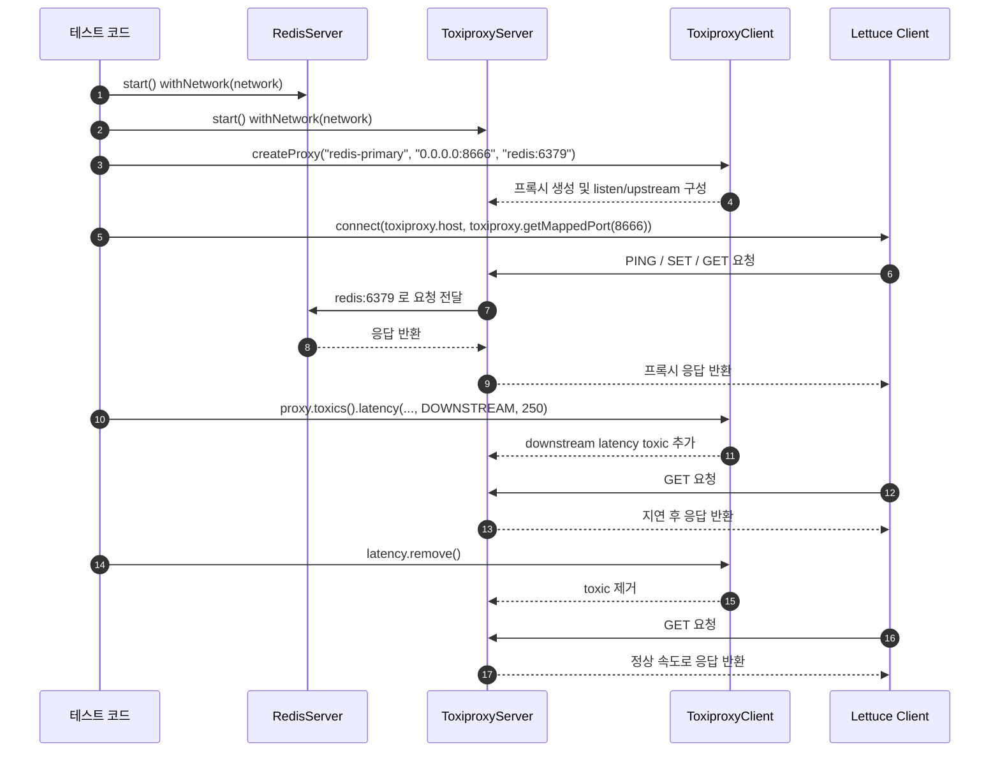
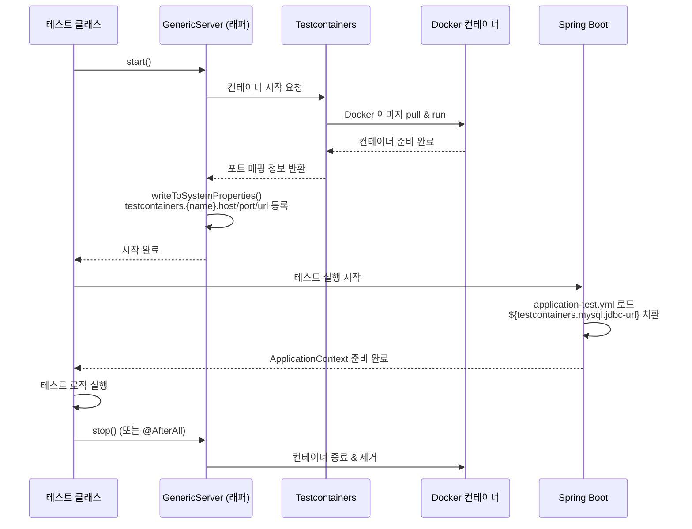
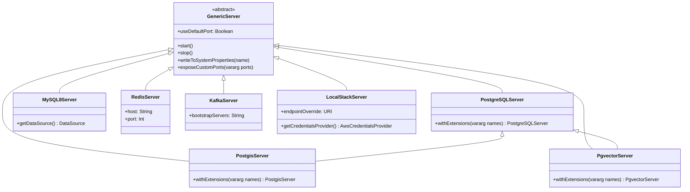
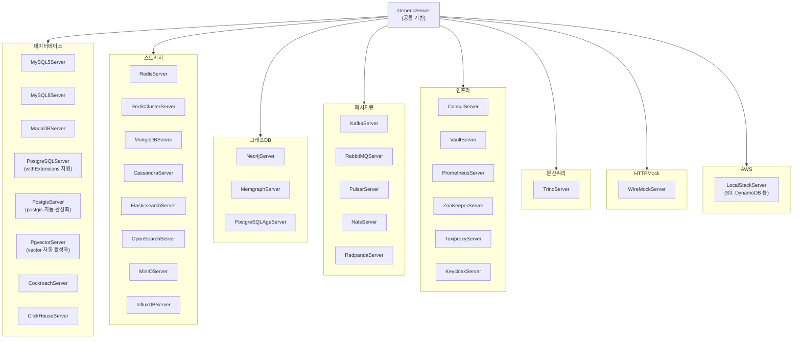

# Module bluetape4k-testcontainers

[English](./README.md) | 한국어

Testcontainers `2.0.3` 기반 통합 테스트를 빠르게 구성하기 위한 서버 래퍼/유틸 라이브러리입니다.

## 주요 기능

- **DB 서버 지원**: MySQL, MariaDB, PostgreSQL, PostGIS, pgvector, Cockroach, ClickHouse, TiDB(Deprecated)
- **Graph DB 서버 지원**: Neo4j, Memgraph, PostgreSQL + Apache AGE
- **Storage 서버 지원**: Redis/Redis Cluster, MongoDB, Cassandra, Elastic/OpenSearch, MinIO, InfluxDB
- **MQ 서버 지원**: Kafka, RabbitMQ, Pulsar, Nats, Redpanda
- **Infra 서버 지원**: Consul, Vault, Prometheus, Jaeger, Zipkin, ZooKeeper, Toxiproxy, Keycloak
- **분산 SQL 엔진**: Trino
- **HTTP Mock 지원**: WireMock
- **AWS LocalStack 지원**: S3, DynamoDB 등 로컬 테스트 환경 구성
- **Container 유틸**: 공통 GenericServer/GenericContainer 확장
- **PostgreSQL 확장 자동 활성화**: `PostgisServer`(postgis), `PgvectorServer`(vector) 시작 시 해당 확장 자동 `CREATE EXTENSION`
- **`withExtensions()` API**: 컨테이너 시작 시 추가 PostgreSQL 확장을 선언적으로 활성화

## 최근 안정성 개선

- `GenericContainer.exposeCustomPorts(...)`가 `hostConfig`가 비어 있는 경우에도 포트 바인딩을 생성하도록 보강되었습니다.
- `GenericServer.writeToSystemProperties(...)`는 기본/추가 속성을 일관된 순서로 구성하여 일괄 등록합니다.
- `KafkaServer.Launcher`의 문자열 producer/consumer 생성 시 serializer/deserializer 인스턴스를 호출마다 새로 생성해 `close()` 이후 재사용 이슈를 방지합니다.
- `TiDBServer`는 Testcontainers 2.x 미지원으로 deprecated 처리되었으며, 신규 테스트에서는 `GenericContainer` 또는 `MySQL8Server` 사용을 권장합니다.

## 직접 Testcontainers 사용 대비 추가 기능

bluetape4k-testcontainers 는 Testcontainers 를 감싼 thin wrapper 이지만, 테스트 코드와 Spring 설정을 단순화하는 기능을 추가 제공합니다.

- **고정 포트 매핑 옵션**: `useDefaultPort=true` 설정 시 랜덤 포트 대신 기본 포트(예: MySQL `3306`, Redis `6379`)로 바인딩할 수 있습니다.
- **시스템 프로퍼티 자동 등록**: 컨테이너 시작 시 `testcontainers.<name>.host|port|url` 및 JDBC 관련 속성이 자동 등록됩니다.
- **Spring Boot 설정 단순화**: `application-test.yml`에서 `${testcontainers...}` placeholder 만으로 연결 정보를 주입할 수 있습니다.
- **공통 유틸 제공**: `getDataSource()` 같은 헬퍼로 JDBC 초기 설정 보일러플레이트를 줄일 수 있습니다.

## 시스템 프로퍼티 Export (PropertyExportingServer)

모든 서버 클래스는 `PropertyExportingServer` 인터페이스를 구현하여, `start()` 시 연결 정보를 시스템 프로퍼티로 자동 등록합니다.

### 키 명명 규칙

모든 프로퍼티 키는 **kebab-case 소문자**를 사용합니다.

시스템 프로퍼티 형식: `testcontainers.{namespace}.{kebab-case-key}`

예:
- `testcontainers.postgresql.jdbc-url`
- `testcontainers.kafka.bootstrap-servers`
- `testcontainers.redis.host`

### 서버별 export 키

| 서버 | namespace | 주요 키 |
|------|-----------|---------|
| PostgreSQLServer | `postgresql` | `jdbc-url`, `driver-class-name`, `username`, `password`, `database-name` |
| PostgisServer | `postgis` | `jdbc-url`, `driver-class-name`, `username`, `password`, `database-name` |
| PgvectorServer | `pgvector` | `jdbc-url`, `driver-class-name`, `username`, `password`, `database-name` |
| MySQL8Server | `mysql` | `jdbc-url`, `driver-class-name`, `username`, `password`, `database-name` |
| MariaDBServer | `mariadb` | `jdbc-url`, `driver-class-name`, `username`, `password`, `database-name` |
| CockroachServer | `cockroach` | `jdbc-url`, `driver-class-name`, `username`, `password`, `database-name` |
| ClickHouseServer | `clickhouse` | `jdbc-url`, `driver-class-name`, `username`, `password`, `database-name` |
| TrinoServer | `trino` | `jdbc-url`, `username` |
| RedisServer | `redis` | `host`, `port`, `url` |
| MongoDBServer | `mongo` | `host`, `port`, `url` |
| ElasticsearchServer | `elasticsearch` | `host`, `port`, `url` |
| KafkaServer | `kafka` | `host`, `port`, `url`, `bootstrap-servers`, `bound-port-numbers` |
| RedpandaServer | `redpanda` | `host`, `port`, `url`, `admin-port`, `schema-registry-port`, `rest-proxy-port` |
| NatsServer | `nats` | `host`, `port`, `url`, `cluster-port`, `monitor-port` |
| PulsarServer | `pulsar` | `host`, `port`, `url`, `broker-url`, `broker-port`, `broker-http-port` |
| RabbitMQServer | `rabbitmq` | `host`, `port`, `url`, `amqp-url`, `amqp-port`, `amqps-port`, `management-url` |
| LocalStackServer | `localstack` | `host`, `port`, `url` |
| PrometheusServer | `prometheus` | `host`, `port`, `url`, `server-port`, `pushgateway-port`, `graphite-exporter-port` |
| ConsulServer | `consul` | `host`, `port`, `url`, `dns-port`, `http-port`, `rpc-port` |
| JaegerServer | `jaeger` | `host`, `port`, `url`, `frontend-port`, `zipkin-port`, `config-port`, `thrift-port` |

### 사용 예제

```kotlin
// 예제 1: start() 후 시스템 프로퍼티 직접 조회
val postgresUrl = System.getProperty("testcontainers.postgresql.jdbc-url")
val kafkaServers = System.getProperty("testcontainers.kafka.bootstrap-servers")

// 예제 2: registerSystemProperties() — 테스트 후 자동 복원
@BeforeEach
fun setup() {
    registration = PostgreSQLServer.Launcher.postgres.registerSystemProperties()
}

@AfterEach
fun cleanup() {
    registration.close()
}

// 예제 3: use {} 블록
PostgreSQLServer().use { server ->
    server.start()
    server.registerSystemProperties().use {
        // 이 블록 안에서만 시스템 프로퍼티 유효
        val url = System.getProperty("testcontainers.postgresql.jdbc-url")
    }
}

// 예제 4: Spring Boot 테스트 (application-test.yml)
// spring:
//   datasource:
//     url: ${testcontainers.postgresql.jdbc-url}
//     driver-class-name: ${testcontainers.postgresql.driver-class-name}
//     username: ${testcontainers.postgresql.username}
//     password: ${testcontainers.postgresql.password}
```

## 의존성 추가

```kotlin
dependencies {
    testImplementation("io.github.bluetape4k:bluetape4k-testcontainers:${version}")
}
```

## 주요 기능 상세

### 1. 데이터베이스 컨테이너

- `database/MySQL5Server.kt`
- `database/MySQL8Server.kt`
- `database/MariaDBServer.kt`
- `database/PostgreSQLServer.kt` — 표준 PostgreSQL, `withExtensions()` 지원
- `database/PostgisServer.kt` — `postgis/postgis` 이미지, postgis 확장 자동 활성화
- `database/PgvectorServer.kt` — `pgvector/pgvector` 이미지, vector 확장 자동 활성화
- `database/CockroachServer.kt`

#### PostgreSQL 확장 서버

`PostgisServer`와 `PgvectorServer`는 각 이미지의 기본 확장(postgis, vector)을 컨테이너 시작 시 자동으로 활성화합니다. 테스트에서 `CREATE EXTENSION` 을 직접 실행할 필요가 없습니다.

**기본 싱글턴 사용:**

```kotlin
// postgis 확장이 자동 활성화된 서버
val server = PostgisServer.Launcher.postgis

// vector 확장이 자동 활성화된 서버
val server = PgvectorServer.Launcher.pgvector
```

**`withExtensions()` — 추가 확장 활성화:**

```kotlin
// postgis + postgis_topology 활성화
PostgisServer()
    .withExtensions("postgis_topology")
    .apply { start() }

// vector + pg_trgm 활성화
PgvectorServer()
    .withExtensions("pg_trgm")
    .apply { start() }

// 표준 postgres 에서 contrib 확장 활성화
PostgreSQLServer()
    .withExtensions("uuid-ossp", "hstore", "pg_trgm")
    .apply { start() }
```

**`Launcher.withExtensions()` — 확장 포함 싱글턴 직접 생성:**

```kotlin
// postgis_topology 까지 활성화된 싱글턴
val server = PostgisServer.Launcher.withExtensions("postgis_topology")

// pg_trgm 까지 활성화된 싱글턴
val server = PgvectorServer.Launcher.withExtensions("pg_trgm")

// uuid-ossp, hstore 가 활성화된 표준 PostgreSQL 싱글턴
val server = PostgreSQLServer.Launcher.withExtensions("uuid-ossp", "hstore")
```

### 2. 스토리지/검색 컨테이너

- `storage/RedisServer.kt`, `storage/RedisClusterServer.kt`
- `storage/MongoDBServer.kt`, `storage/CassandraServer.kt`
- `storage/ElasticsearchServer.kt`, `storage/OpenSearchServer.kt`
- `storage/MinIOServer.kt`

### 3. 그래프 DB 컨테이너

- `graphdb/Neo4jServer.kt` — Neo4j 그래프 DB
- `graphdb/MemgraphServer.kt` — Memgraph 그래프 DB
- `graphdb/PostgreSQLAgeServer.kt` — PostgreSQL + Apache AGE 그래프 확장

### 4. 메시지/인프라/AWS 컨테이너

- `mq/KafkaServer.kt`, `mq/RabbitMQServer.kt`, `mq/PulsarServer.kt`
- `infra/ConsulServer.kt`, `infra/VaultServer.kt`, `infra/PrometheusServer.kt`, `infra/ToxiproxyServer.kt`, `infra/KeycloakServer.kt`
- `aws/LocalStackServer.kt`

### 5. 분산 SQL 및 시계열 DB 컨테이너

- `http/WireMockServer.kt` — HTTP Mock 서버
- `database/TrinoServer.kt` — 분산 SQL 쿼리 엔진
- `storage/InfluxDBServer.kt` — InfluxDB 2.x 시계열 DB

## 사용 예

### 데이터베이스

```kotlin
val mysql = MySQL8Server(useDefaultPort = true).apply { start() }
val ds = mysql.getDataSource()
```

### Graph DB 서버

```kotlin
// Neo4j 서버
val neo4j = Neo4jServer.Launcher.neo4j
val driver = GraphDatabase.driver(neo4j.boltUrl, AuthTokens.basic(neo4j.username, neo4j.password))

// Memgraph 서버
val memgraph = MemgraphServer.Launcher.memgraph
val driver = GraphDatabase.driver(memgraph.boltUrl, AuthTokens.none())

// PostgreSQL with Apache AGE
val age = PostgreSQLAgeServer.Launcher.postgresqlAge
val conn = DriverManager.getConnection(age.jdbcUrl, age.username, age.password)
// conn.createStatement().executeQuery("SELECT * FROM cypher('age', 'MATCH (n) RETURN n') AS (node agtype)")
```

### HTTP Mock 서버

```kotlin
val wireMock = WireMockServer.Launcher.wireMock

// 스텁 정의
wireMock.stubFor(
    get("/hello")
        .willReturn(ok("Hello!"))
)

// 검증
verify(getRequestedFor(urlEqualTo("/hello")))
```

### 인증 서버

```kotlin
val keycloak = KeycloakServer.Launcher.keycloak
// Keycloak 17+ (Quarkus 기반): context path = "/"
println("Auth Server URL: ${keycloak.getAuthServerUrl()}")  // http://localhost:PORT
println("Admin Username: ${keycloak.getAdminUsername()}")
println("Admin Password: ${keycloak.getAdminPassword()}")
```

### 시계열 DB

```kotlin
val influxDB = InfluxDBServer.Launcher.influxDB
println("URL: ${influxDB.url}")
println("Admin Token: ${influxDB.adminToken}")
println("Bucket: ${influxDB.bucket}")
println("Organization: ${influxDB.organization}")
```

### 카오스 테스트

```kotlin
val toxiproxy = ToxiproxyServer.Launcher.toxiproxy
// ToxiproxyClient로 프록시 생성 후 toxic(지연, 중단 등) 주입
```

#### Toxiproxy 동작 구조

`ToxiproxyServer`는 애플리케이션 클라이언트와 실제 Upstream 서버 사이에 프록시를 하나 더 두고,
그 프록시에 지연(latency), 연결 차단(timeout/reset), 대역폭 제한(bandwidth) 같은 네트워크 장애를 주입하는 방식으로 동작합니다.

가장 이해하기 쉬운 시나리오는 `RedisServer + ToxiproxyServer + Lettuce` 조합입니다.
테스트에서는 Redis를 Docker network 안에서 `redis` alias로 띄우고, Toxiproxy가 `redis:6379`를 향하는 프록시 포트(`8666` 등)를 생성합니다.
이후 Lettuce 클라이언트는 Redis에 직접 연결하지 않고, Toxiproxy가 노출한 프록시 포트로 접속합니다.



#### UML 해설

- `RedisServer`는 실제 Upstream 서버입니다. Toxiproxy가 최종적으로 요청을 전달하는 대상입니다.
- `ToxiproxyServer`는 프록시 컨테이너입니다. Control API 포트(`8474`)와 프록시 포트 범위(`8666~8697`)를 노출합니다.
- `ToxiproxyClient`는 Control API에 붙어서 프록시를 만들고 toxic을 추가/삭제하는 관리용 클라이언트입니다.
- `Lettuce Client`는 애플리케이션이 사용하는 실제 Redis 클라이언트입니다. 중요 포인트는 Redis가 아니라 Toxiproxy의 프록시 포트에 연결한다는 점입니다.
- `DOWNSTREAM latency`는 Upstream 응답이 클라이언트로 돌아오는 구간을 늦춥니다. 따라서 `GET` 같은 읽기 호출의 체감 시간이 증가합니다.
- toxic을 제거하면 같은 연결 경로를 유지한 채 정상 지연 시간으로 복구되는지 바로 검증할 수 있습니다.

실제 예제 테스트는 `ToxiproxyServerTest.WithRedisAndLettuce`를 참고하면 됩니다.

### 분산 SQL 쿼리 엔진

```kotlin
val trino = TrinoServer.Launcher.trino
val conn = DriverManager.getConnection(
    "jdbc:trino://${trino.host}:${trino.port}/memory",
    "test",
    null
)
val stmt = conn.createStatement()
val rs = stmt.executeQuery("SELECT 1 as num")
```

## Spring Boot 환경설정

### 1) 테스트 시작 시 컨테이너 구동

```kotlin
class MyRepositoryTest {
    companion object {
        private val mysql = MySQL8Server(useDefaultPort = true)

        @JvmStatic
        @BeforeAll
        fun beforeAll() {
            mysql.start() // 내부에서 testcontainers.mysql.* 시스템 프로퍼티 등록
        }
    }
}
```

### 2) `application-test.yml` 에서 placeholder 사용

모든 프로퍼티 키는 kebab-case입니다.

```yaml
spring:
  datasource:
    driver-class-name: ${testcontainers.mysql.driver-class-name}
    url: ${testcontainers.mysql.jdbc-url}
    username: ${testcontainers.mysql.username}
    password: ${testcontainers.mysql.password}

  data:
    redis:
      host: ${testcontainers.redis.host}
      port: ${testcontainers.redis.port}

# Kafka
spring:
  kafka:
    bootstrap-servers: ${testcontainers.kafka.bootstrap-servers}

# PostgreSQL
spring:
  datasource:
    url: ${testcontainers.postgresql.jdbc-url}
    driver-class-name: ${testcontainers.postgresql.driver-class-name}
    username: ${testcontainers.postgresql.username}
    password: ${testcontainers.postgresql.password}
```

직접 Testcontainers 를 사용할 때 자주 필요한 `@DynamicPropertySource` 등록 코드를, 이 모듈에서는 시스템 프로퍼티 자동 등록으로 단순화할 수 있습니다.

## 컨테이너 생명주기 다이어그램



## 지원 컨테이너 클래스 다이어그램



## 지원 컨테이너 구조



## 참고

- [Testcontainers](https://www.testcontainers.org/)
- [LocalStack](https://www.localstack.cloud/)

## Colima + LocalStack 문제해결

Colima 환경에서 `LocalStackContainer` 실행 시 Docker 소켓 관련 오류가 나는 경우가 있습니다.
대표적으로 다음과 같은 증상이 발생합니다.

- LocalStack 컨테이너가 시작 직후 종료됨
- `docker.sock` 권한/마운트 오류
- Testcontainers가 Docker 데몬에 연결하지 못함

권장 설정:

```bash
export DOCKER_HOST="unix://${HOME}/.colima/default/docker.sock"
export TESTCONTAINERS_DOCKER_SOCKET_OVERRIDE="/var/run/docker.sock"
```

문제가 계속되면 Colima 소켓을 정리 후 재시작:

```bash
brew services stop colima
colima stop
rm -f ~/.colima/docker.sock
brew services start colima
```

추가로 환경에 따라 Ryuk 컨테이너가 문제를 일으키면 아래 설정을 임시로 사용할 수 있습니다.

```bash
export TESTCONTAINERS_RYUK_DISABLED=true
```

주의: `TESTCONTAINERS_RYUK_DISABLED=true`는 리소스 자동 정리에 영향을 줄 수 있으므로 CI/공용 환경에서는 신중히 사용하세요.
