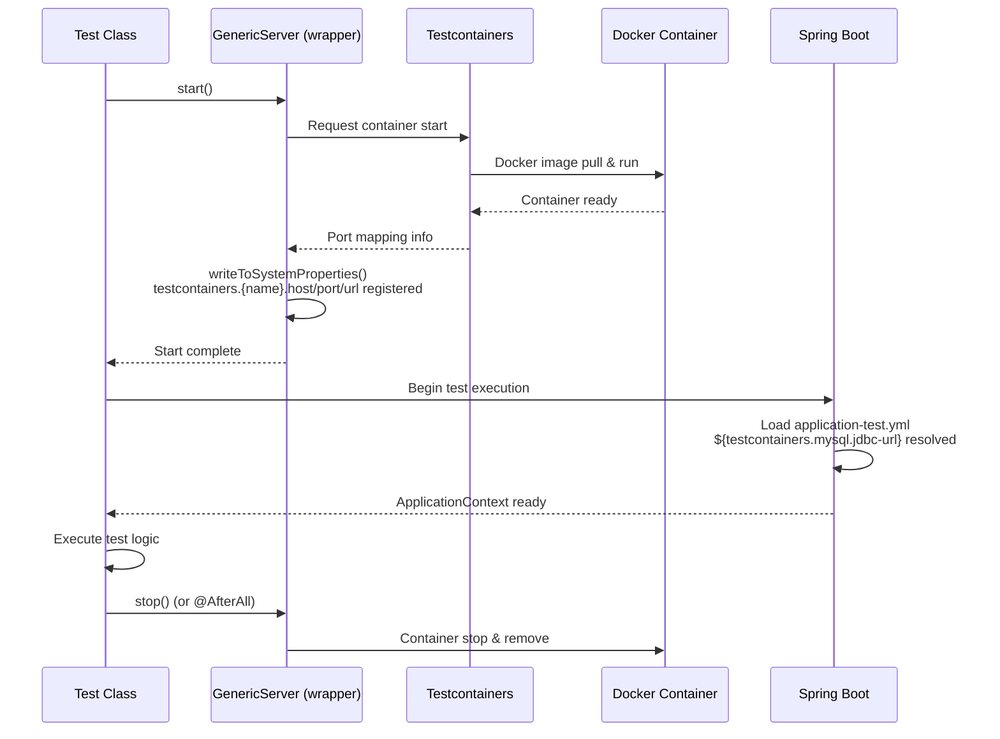
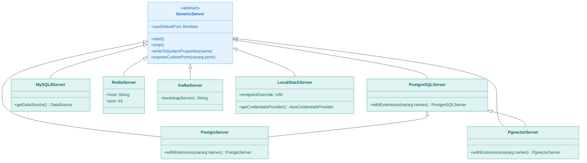
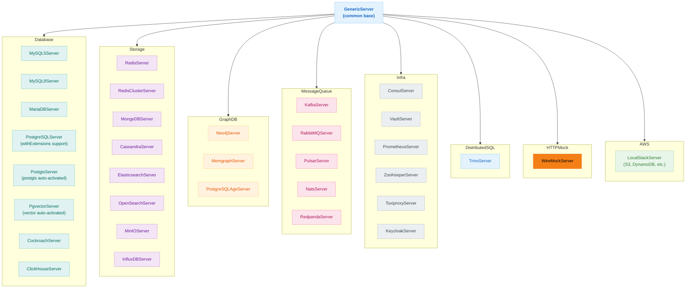
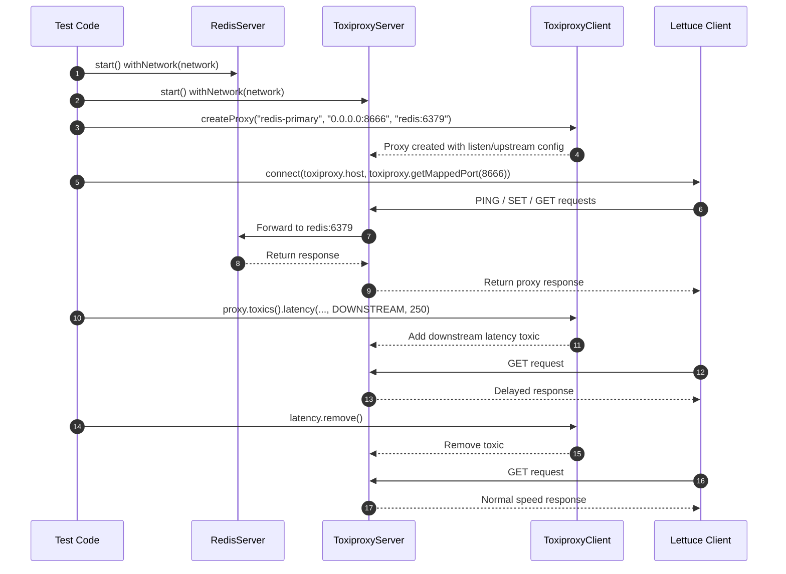

# Module bluetape4k-testcontainers

English | [한국어](./README.ko.md)

A server wrapper and utility library for building integration tests quickly on top of Testcontainers `2.0.3`.

## Architecture

### Container Lifecycle



### Supported Container Class Diagram



### Supported Container Structure



## Key Features

- Wrappers for database, graph DB, storage, messaging, infrastructure, and distributed SQL services
- HTTP mocking through WireMock
- AWS LocalStack support
- Shared `GenericServer` / `GenericContainer` utilities
- Automatic PostgreSQL extension activation for PostGIS and pgvector
- Declarative activation of extra PostgreSQL extensions through `withExtensions()`
- Optional fixed-port mapping with `useDefaultPort=true`
- Automatic export of connection details as system properties at `start()` time
- Simplified Spring Boot wiring through `${testcontainers...}` placeholders

## System Property Export (`PropertyExportingServer`)

Every server implements
`PropertyExportingServer`, which automatically registers connection details as system properties at `start()` time.

- Property keys use lowercase kebab-case
- Format: `testcontainers.{namespace}.{kebab-case-key}`
- Examples: `testcontainers.postgresql.jdbc-url`, `testcontainers.kafka.bootstrap-servers`

### Exported Keys by Server

| Server              | namespace       | Key properties                                                                      |
|---------------------|-----------------|-------------------------------------------------------------------------------------|
| PostgreSQLServer    | `postgresql`    | `jdbc-url`, `driver-class-name`, `username`, `password`, `database-name`            |
| PostgisServer       | `postgis`       | `jdbc-url`, `driver-class-name`, `username`, `password`, `database-name`            |
| PgvectorServer      | `pgvector`      | `jdbc-url`, `driver-class-name`, `username`, `password`, `database-name`            |
| MySQL8Server        | `mysql`         | `jdbc-url`, `driver-class-name`, `username`, `password`, `database-name`            |
| MariaDBServer       | `mariadb`       | `jdbc-url`, `driver-class-name`, `username`, `password`, `database-name`            |
| CockroachServer     | `cockroach`     | `jdbc-url`, `driver-class-name`, `username`, `password`, `database-name`            |
| ClickHouseServer    | `clickhouse`    | `jdbc-url`, `driver-class-name`, `username`, `password`, `database-name`            |
| TrinoServer         | `trino`         | `jdbc-url`, `username`                                                              |
| RedisServer         | `redis`         | `host`, `port`, `url`                                                               |
| MongoDBServer       | `mongo`         | `host`, `port`, `url`                                                               |
| ElasticsearchServer | `elasticsearch` | `host`, `port`, `url`                                                               |
| KafkaServer         | `kafka`         | `host`, `port`, `url`, `bootstrap-servers`, `bound-port-numbers`                    |
| RedpandaServer      | `redpanda`      | `host`, `port`, `url`, `admin-port`, `schema-registry-port`, `rest-proxy-port`      |
| NatsServer          | `nats`          | `host`, `port`, `url`, `cluster-port`, `monitor-port`                               |
| PulsarServer        | `pulsar`        | `host`, `port`, `url`, `broker-url`, `broker-port`, `broker-http-port`              |
| RabbitMQServer      | `rabbitmq`      | `host`, `port`, `url`, `amqp-url`, `amqp-port`, `amqps-port`, `management-url`      |
| LocalStackServer    | `localstack`    | `host`, `port`, `url`                                                               |
| PrometheusServer    | `prometheus`    | `host`, `port`, `url`, `server-port`, `pushgateway-port`, `graphite-exporter-port`  |
| ConsulServer        | `consul`        | `host`, `port`, `url`, `dns-port`, `http-port`, `rpc-port`                          |
| JaegerServer        | `jaeger`        | `host`, `port`, `url`, `frontend-port`, `zipkin-port`, `config-port`, `thrift-port` |

## Usage Examples

### Database

```kotlin
val mysql = MySQL8Server(useDefaultPort = true).apply { start() }
val ds = mysql.getDataSource()
```

### PostgreSQL Extensions

```kotlin
// PostGIS — auto-activates postgis extension
val server = PostgisServer.Launcher.postgis

// pgvector — auto-activates vector extension
val server = PgvectorServer.Launcher.pgvector

// Extra extensions via withExtensions()
PostgisServer()
    .withExtensions("postgis_topology")
    .apply { start() }

PostgreSQLServer()
    .withExtensions("uuid-ossp", "hstore", "pg_trgm")
    .apply { start() }

// Singleton with extensions
val server = PostgreSQLServer.Launcher.withExtensions("uuid-ossp", "hstore")
```

### Graph DB

```kotlin
// Neo4j
val neo4j = Neo4jServer.Launcher.neo4j
val driver = GraphDatabase.driver(neo4j.boltUrl, AuthTokens.basic(neo4j.username, neo4j.password))

// Memgraph
val memgraph = MemgraphServer.Launcher.memgraph
val driver = GraphDatabase.driver(memgraph.boltUrl, AuthTokens.none())

// PostgreSQL with Apache AGE
val age = PostgreSQLAgeServer.Launcher.postgresqlAge
val conn = DriverManager.getConnection(age.jdbcUrl, age.username, age.password)
```

### HTTP Mock Server

```kotlin
val wireMock = WireMockServer.Launcher.wireMock

wireMock.stubFor(
    get("/hello")
        .willReturn(ok("Hello!"))
)

verify(getRequestedFor(urlEqualTo("/hello")))
```

### Keycloak (Auth Server)

```kotlin
val keycloak = KeycloakServer.Launcher.keycloak
println("Auth Server URL: ${keycloak.getAuthServerUrl()}")
println("Admin Username: ${keycloak.getAdminUsername()}")
println("Admin Password: ${keycloak.getAdminPassword()}")
```

### InfluxDB (Time-series)

```kotlin
val influxDB = InfluxDBServer.Launcher.influxDB
println("URL: ${influxDB.url}")
println("Admin Token: ${influxDB.adminToken}")
println("Bucket: ${influxDB.bucket}")
println("Organization: ${influxDB.organization}")
```

### Toxiproxy (Chaos Testing)



### Distributed SQL

```kotlin
val trino = TrinoServer.Launcher.trino
val conn = DriverManager.getConnection(
    "jdbc:trino://${trino.host}:${trino.port}/memory",
    "test",
    null
)
val stmt = conn.createStatement()
val rs = stmt.executeQuery("SELECT 1 as num")
```

### System Property Access

```kotlin
// After start() — read system properties directly
val postgresUrl = System.getProperty("testcontainers.postgresql.jdbc-url")
val kafkaServers = System.getProperty("testcontainers.kafka.bootstrap-servers")

// Register with auto-restore after test
@BeforeEach
fun setup() {
    registration = PostgreSQLServer.Launcher.postgres.registerSystemProperties()
}

@AfterEach
fun cleanup() {
    registration.close()
}
```

## Spring Boot Configuration

Start containers in `@BeforeAll`, then reference properties in `application-test.yml`:

```kotlin
class MyRepositoryTest {
    companion object {
        private val mysql = MySQL8Server(useDefaultPort = true)

        @JvmStatic
        @BeforeAll
        fun beforeAll() {
            mysql.start()  // registers testcontainers.mysql.* system properties
        }
    }
}
```

```yaml
spring:
  datasource:
    driver-class-name: ${testcontainers.mysql.driver-class-name}
    url: ${testcontainers.mysql.jdbc-url}
    username: ${testcontainers.mysql.username}
    password: ${testcontainers.mysql.password}

  data:
    redis:
      host: ${testcontainers.redis.host}
      port: ${testcontainers.redis.port}

  kafka:
    bootstrap-servers: ${testcontainers.kafka.bootstrap-servers}
```

## Recent Stability Improvements

- `GenericContainer.exposeCustomPorts(...)` now creates port bindings even when `hostConfig` starts empty.
-

`GenericServer.writeToSystemProperties(...)` registers default and additional properties in a stable, consistent order.
- `KafkaServer.Launcher` creates fresh serializer/deserializer instances per use to avoid reuse after `close()`.
- `TiDBServer` is deprecated because Testcontainers 2.x does not support it reliably. Use `MySQL8Server` instead.

## Adding the Dependency

```kotlin
dependencies {
    testImplementation("io.github.bluetape4k:bluetape4k-testcontainers:${version}")
}
```

## References

- [Testcontainers](https://www.testcontainers.org/)
- [LocalStack](https://www.localstack.cloud/)

## Colima + LocalStack Troubleshooting

When running under Colima, set:

```bash
export DOCKER_HOST="unix://${HOME}/.colima/default/docker.sock"
export TESTCONTAINERS_DOCKER_SOCKET_OVERRIDE="/var/run/docker.sock"
```

If issues persist, restart Colima:

```bash
brew services stop colima
colima stop
rm -f ~/.colima/docker.sock
brew services start colima
```

If Ryuk causes problems (temporary workaround only):

```bash
export TESTCONTAINERS_RYUK_DISABLED=true
```

> **Note**:
`TESTCONTAINERS_RYUK_DISABLED=true` affects automatic resource cleanup. Use with caution in CI/shared environments.
