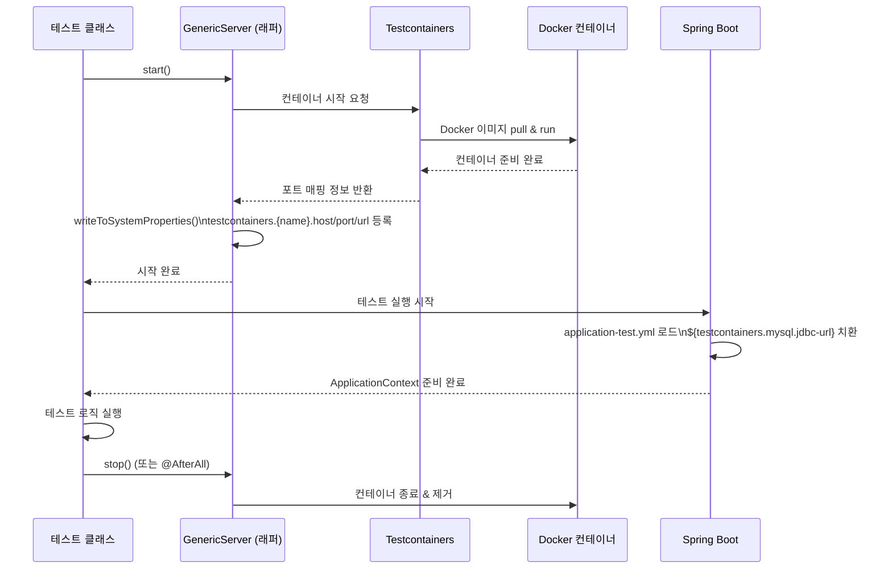
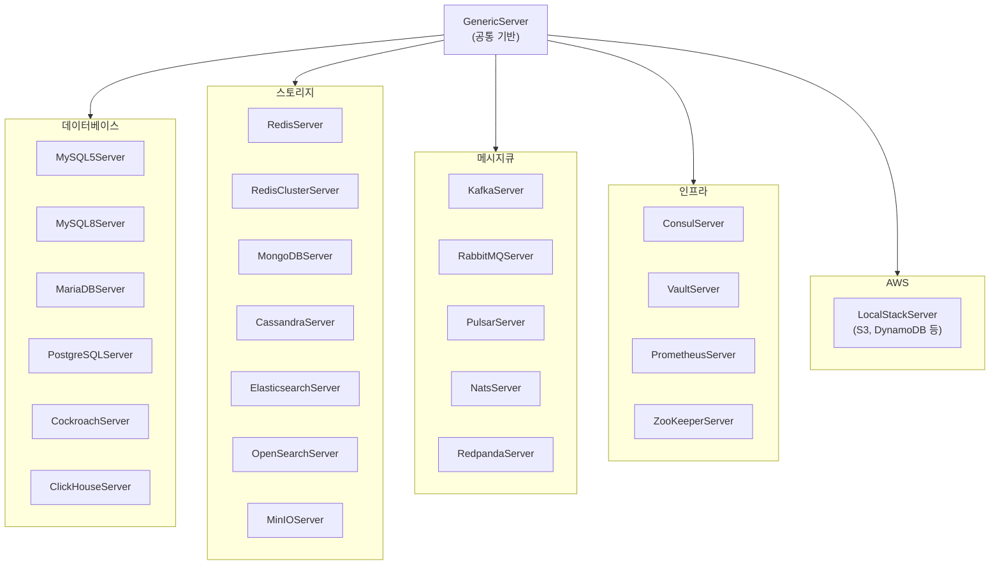

# Module bluetape4k-testcontainers

Testcontainers `2.0.3` 기반 통합 테스트를 빠르게 구성하기 위한 서버 래퍼/유틸 라이브러리입니다.

## 주요 기능

- **DB 서버 지원**: MySQL, MariaDB, PostgreSQL, Cockroach, ClickHouse, TiDB(Deprecated)
- **Storage 서버 지원**: Redis/Redis Cluster, MongoDB, Cassandra, Elastic/OpenSearch, MinIO
- **MQ 서버 지원**: Kafka, RabbitMQ, Pulsar, Nats, Redpanda
- **Infra 서버 지원**: Consul, Vault, Prometheus, Jaeger, Zipkin, ZooKeeper
- **AWS LocalStack 지원**: S3, DynamoDB 등 로컬 테스트 환경 구성
- **Container 유틸**: 공통 GenericServer/GenericContainer 확장

## 최근 안정성 개선

- `GenericContainer.exposeCustomPorts(...)`가 `hostConfig`가 비어 있는 경우에도 포트 바인딩을 생성하도록 보강되었습니다.
- `GenericServer.writeToSystemProperties(...)`는 기본/추가 속성을 일관된 순서로 구성하여 일괄 등록합니다.
- `KafkaServer.Launcher`의 문자열 producer/consumer 생성 시 serializer/deserializer 인스턴스를 호출마다 새로 생성해 `close()` 이후 재사용 이슈를 방지합니다.
- `TiDBServer`는 Testcontainers 2.x 미지원으로 deprecated 처리되었으며, 신규 테스트에서는 `GenericContainer` 또는 `MySQL8Server` 사용을 권장합니다.

## 직접 Testcontainers 사용 대비 추가 기능

bluetape4k-testcontainers 는 Testcontainers 를 감싼 thin wrapper 이지만, 테스트 코드와 Spring 설정을 단순화하는 기능을 추가 제공합니다.

- **고정 포트 매핑 옵션**: `useDefaultPort=true` 설정 시 랜덤 포트 대신 기본 포트(예: MySQL `3306`, Redis `6379`)로 바인딩할 수 있습니다.
- **시스템 프로퍼티 자동 등록**: 컨테이너 시작 시 `testcontainers.<name>.host|port|url` 및 JDBC 관련 속성이 자동 등록됩니다.
- **Spring Boot 설정 단순화**: `application-test.yml`에서 `${testcontainers...}` placeholder 만으로 연결 정보를 주입할 수 있습니다.
- **공통 유틸 제공**: `getDataSource()` 같은 헬퍼로 JDBC 초기 설정 보일러플레이트를 줄일 수 있습니다.

## 의존성 추가

```kotlin
dependencies {
    testImplementation("io.github.bluetape4k:bluetape4k-testcontainers:${version}")
}
```

## 주요 기능 상세

### 1. 데이터베이스 컨테이너

- `database/MySQL5Server.kt`
- `database/MySQL8Server.kt`
- `database/MariaDBServer.kt`
- `database/PostgreSQLServer.kt`
- `database/CockroachServer.kt`

### 2. 스토리지/검색 컨테이너

- `storage/RedisServer.kt`, `storage/RedisClusterServer.kt`
- `storage/MongoDBServer.kt`, `storage/CassandraServer.kt`
- `storage/ElasticsearchServer.kt`, `storage/OpenSearchServer.kt`
- `storage/MinIOServer.kt`

### 3. 메시지/인프라/AWS 컨테이너

- `mq/KafkaServer.kt`, `mq/RabbitMQServer.kt`, `mq/PulsarServer.kt`
- `infra/ConsulServer.kt`, `infra/VaultServer.kt`, `infra/PrometheusServer.kt`
- `aws/LocalStackServer.kt`

## 사용 예

```kotlin
val mysql = MySQL8Server(useDefaultPort = true).apply { start() }
val ds = mysql.getDataSource()
```

## Spring Boot 환경설정

### 1) 테스트 시작 시 컨테이너 구동

```kotlin
class MyRepositoryTest {
    companion object {
        private val mysql = MySQL8Server(useDefaultPort = true)

        @JvmStatic
        @BeforeAll
        fun beforeAll() {
            mysql.start() // 내부에서 testcontainers.mysql.* 시스템 프로퍼티 등록
        }
    }
}
```

### 2) `application-test.yml` 에서 placeholder 사용

```yaml
spring:
  datasource:
    driver-class-name: ${testcontainers.mysql.driver-class-name}
    url: ${testcontainers.mysql.jdbc-url}
    username: ${testcontainers.mysql.username}
    password: ${testcontainers.mysql.password}

  data:
    redis:
      host: ${testcontainers.redis.host}
      port: ${testcontainers.redis.port}
```

직접 Testcontainers 를 사용할 때 자주 필요한 `@DynamicPropertySource` 등록 코드를, 이 모듈에서는 시스템 프로퍼티 자동 등록으로 단순화할 수 있습니다.

## 컨테이너 생명주기 다이어그램



## 지원 컨테이너 구조



## 참고

- [Testcontainers](https://www.testcontainers.org/)
- [LocalStack](https://www.localstack.cloud/)

## Colima + LocalStack 문제해결

Colima 환경에서 `LocalStackContainer` 실행 시 Docker 소켓 관련 오류가 나는 경우가 있습니다.
대표적으로 다음과 같은 증상이 발생합니다.

- LocalStack 컨테이너가 시작 직후 종료됨
- `docker.sock` 권한/마운트 오류
- Testcontainers가 Docker 데몬에 연결하지 못함

권장 설정:

```bash
export DOCKER_HOST="unix://${HOME}/.colima/default/docker.sock"
export TESTCONTAINERS_DOCKER_SOCKET_OVERRIDE="/var/run/docker.sock"
```

문제가 계속되면 Colima 소켓을 정리 후 재시작:

```bash
brew services stop colima
colima stop
rm -f ~/.colima/docker.sock
brew services start colima
```

추가로 환경에 따라 Ryuk 컨테이너가 문제를 일으키면 아래 설정을 임시로 사용할 수 있습니다.

```bash
export TESTCONTAINERS_RYUK_DISABLED=true
```

주의: `TESTCONTAINERS_RYUK_DISABLED=true`는 리소스 자동 정리에 영향을 줄 수 있으므로 CI/공용 환경에서는 신중히 사용하세요.
