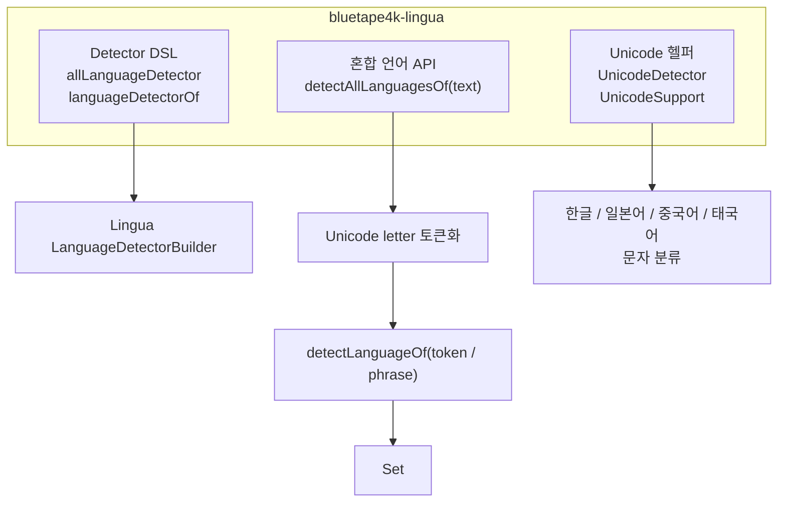
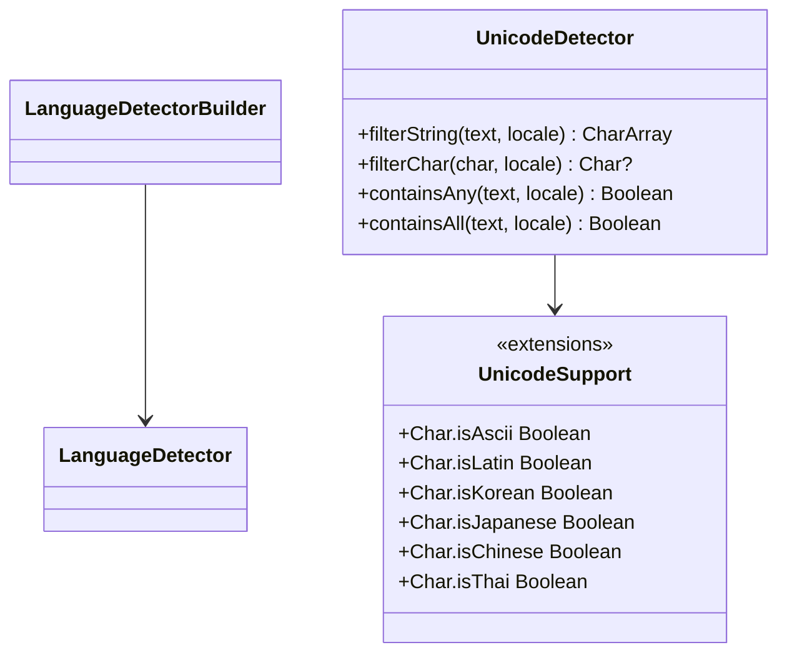

# Module bluetape4k-lingua

[English](./README.md) | 한국어

`com.github.pemistahl:lingua`를 감싸는 얇은 Kotlin DSL 래퍼이며, 혼합 언어 텍스트에서 검출된 모든 언어를 `Set<Language>`로 반환하는 편의 API를 제공합니다.

## Architecture

### 모듈 개요



### 클래스 다이어그램



## Key Features

- Lingua `LanguageDetector` 생성을 위한 Kotlin DSL
- `Language`, `IsoCode639_1`, `IsoCode639_3` 기반 builder 지원
- 혼합 언어 텍스트용 `detectAllLanguagesOf(text): Set<Language>`
- `Hello -> SOTHO` 같은 짧은 Latin 토큰 오탐에 대한 제한적 보정
- `UnicodeDetector`가 재사용하는 Unicode script helper 제공

## Usage Examples

### Kotlin DSL로 detector 생성

```kotlin
import io.bluetape4k.lingua.allLanguageDetector

val detector = allLanguageDetector {
    withPreloadedLanguageModels()
    withMinimumRelativeDistance(0.0)
}

val language = detector.detectLanguageOf("Hello, world")
println(language) // ENGLISH
```

### 혼합 언어 텍스트에서 모든 언어 검출

```kotlin
import com.github.pemistahl.lingua.api.Language
import io.bluetape4k.lingua.allLanguageDetector
import io.bluetape4k.lingua.detectAllLanguagesOf

val detector = allLanguageDetector {
    withMinimumRelativeDistance(0.0)
}

val languages = detector.detectAllLanguagesOf("Hello 안녕 こんにちは")
check(languages == setOf(Language.ENGLISH, Language.KOREAN, Language.JAPANESE))
```

### 언어 집합으로 detector 생성

```kotlin
import com.github.pemistahl.lingua.api.Language
import io.bluetape4k.lingua.languageDetectorOf

val detector = languageDetectorOf(setOf(Language.ENGLISH, Language.KOREAN)) {
    withMinimumRelativeDistance(0.0)
}
```

## Installation

```kotlin
dependencies {
    implementation("io.github.bluetape4k:bluetape4k-lingua:${bluetape4kVersion}")
}
```

`bluetape4k-lingua`는 upstream Lingua 의존성을 transitively 포함합니다.

## Notes

- detector는 호출마다 새로 만들지 말고 재사용하는 것이 좋습니다.
- 공백 입력은 `emptySet()`을 반환합니다.
- 토큰 단위에서 usable result가 없으면 전체 문자열 감지로 fallback 합니다.
