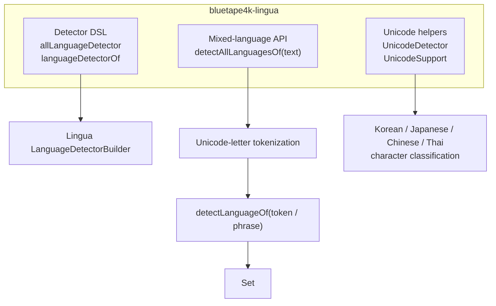
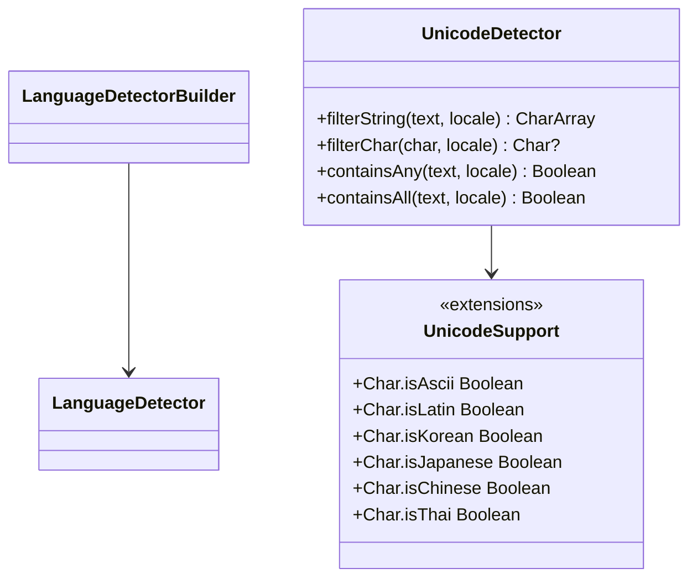

# Module bluetape4k-lingua

English | [한국어](./README.ko.md)

A thin Kotlin DSL wrapper around `com.github.pemistahl:lingua` for language detection, plus a convenience API that returns all detected languages as a `Set<Language>` for mixed-language text.

## Architecture

### Module Overview



### Class Diagram



## Key Features

- Kotlin DSL for creating Lingua `LanguageDetector` instances
- Builders from `Language`, `IsoCode639_1`, and `IsoCode639_3`
- `detectAllLanguagesOf(text): Set<Language>` for mixed-language text
- Narrow short-Latin ambiguity correction for cases like `Hello -> SOTHO`
- Unicode-based script helpers reused by `UnicodeDetector`

## Usage Examples

### Create a detector with the Kotlin DSL

```kotlin
import com.github.pemistahl.lingua.api.Language
import io.bluetape4k.lingua.allLanguageDetector

val detector = allLanguageDetector {
    withPreloadedLanguageModels()
    withMinimumRelativeDistance(0.0)
}

val language = detector.detectLanguageOf("Hello, world")
println(language) // ENGLISH
```

### Detect all languages from mixed text

```kotlin
import com.github.pemistahl.lingua.api.Language
import io.bluetape4k.lingua.allLanguageDetector
import io.bluetape4k.lingua.detectAllLanguagesOf

val detector = allLanguageDetector {
    withMinimumRelativeDistance(0.0)
}

val languages = detector.detectAllLanguagesOf("Hello 안녕 こんにちは")
check(languages == setOf(Language.ENGLISH, Language.KOREAN, Language.JAPANESE))
```

### Build from a language subset

```kotlin
import com.github.pemistahl.lingua.api.Language
import io.bluetape4k.lingua.languageDetectorOf

val detector = languageDetectorOf(setOf(Language.ENGLISH, Language.KOREAN)) {
    withMinimumRelativeDistance(0.0)
}
```

## Installation

```kotlin
dependencies {
    implementation("io.github.bluetape4k:bluetape4k-lingua:${bluetape4kVersion}")
}
```

`bluetape4k-lingua` already brings the upstream Lingua dependency transitively.

## Notes

- Reuse detector instances instead of rebuilding them per call.
- Blank input returns `emptySet()`.
- If no usable token result is found, the wrapper falls back to whole-text detection.
