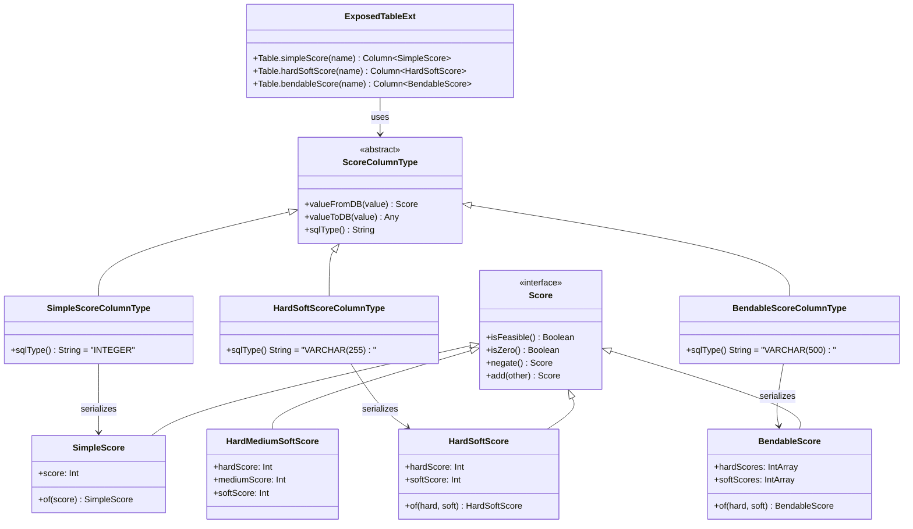
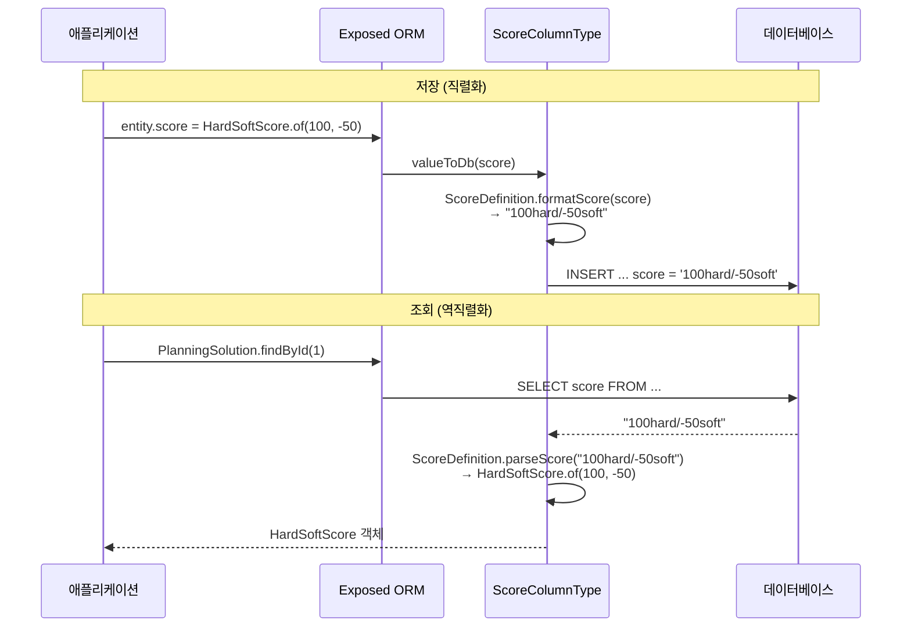

# Module bluetape4k-timefold-solver-persistence-exposed

[English](./README.md) | 한국어

[Timefold Solver](https://github.com/timefold/timefold-solver)의 Score 정보를 [Exposed](https://github.com/JetBrains/Exposed)를 이용하여 RDB에 저장/로드하기 위한 라이브러리입니다.

## 개요

이 모듈은 Timefold Solver의 다양한 Score 유형을 JetBrains Exposed ORM을 통해 관계형 데이터베이스에 투명하게 저장하고 조회할 수 있게 해주는 Kotlin 라이브러리입니다.

### 주요 특징

- **모든 Timefold Score 유형 지원**: SimpleScore, HardSoftScore, BendableScore 등 12가지 Score 유형
- **Exposed 통합**: Exposed의 `ColumnType`과 `ColumnTransformer`를 활용한 자연스러운 통합
- **타입 안전성**: 컴파일 타임에 Score 타입 검증
- **데이터베이스 독립성**: H2, MySQL, MariaDB, PostgreSQL 등 다양한 데이터베이스 지원

## 지원 Score 유형

| Score 유형                        | 설명                      | DB 저장 형식                  |
|---------------------------------|-------------------------|---------------------------|
| `SimpleScore`                   | 단일 점수 값                 | Integer                   |
| `SimpleLongScore`               | Long 타입 단일 점수           | BigInt                    |
| `SimpleBigDecimalScore`         | BigDecimal 단일 점수        | VarChar                   |
| `HardSoftScore`                 | Hard/Soft 2단계 점수        | VarChar (예: "100/-50")    |
| `HardSoftLongScore`             | Long 타입 Hard/Soft 점수    | VarChar                   |
| `HardSoftBigDecimalScore`       | BigDecimal Hard/Soft 점수 | VarChar                   |
| `HardMediumSoftScore`           | Hard/Medium/Soft 3단계 점수 | VarChar (예: "100/50/-30") |
| `HardMediumSoftLongScore`       | Long 타입 3단계 점수          | VarChar                   |
| `HardMediumSoftBigDecimalScore` | BigDecimal 3단계 점수       | VarChar                   |
| `BendableScore`                 | 가변적 Hard/Soft 레벨 점수     | VarChar                   |
| `BendableLongScore`             | Long 타입 Bendable 점수     | VarChar                   |
| `BendableBigDecimalScore`       | BigDecimal Bendable 점수  | VarChar                   |

## 설치

### Gradle

```kotlin
dependencies {
    implementation("io.github.bluetape4k:bluetape4k-timefold-solver-persistence-exposed:${bluetape4kVersion}")
}
```

### Maven

```xml
<dependency>
    <groupId>io.github.bluetape4k</groupId>
    <artifactId>bluetape4k-timefold-solver-persistence-exposed</artifactId>
    <version>${bluetape4kVersion}</version>
</dependency>
```

## 사용법

### 1. 테이블 정의

```kotlin
import io.bluetape4k.timefold.solver.exposed.api.score.buildin.*
import org.jetbrains.exposed.v1.core.dao.id.IntIdTable

// HardSoftScore를 사용하는 테이블
object PlanningSolutions : IntIdTable("planning_solution") {
    val name = varchar("name", 255)
    val score = hardSoftScore("score")
    val createdAt = datetime("created_at")
}

// BendableScore를 사용하는 테이블
object BendablePlanningSolutions : IntIdTable("bendable_solution") {
    val name = varchar("name", 255)
    val score = bendableScore("score", length = 500)
    val createdAt = datetime("created_at")
}
```

### 2. Entity 클래스 정의

```kotlin
import ai.timefold.solver.core.api.score.buildin.hardsoft.HardSoftScore
import org.jetbrains.exposed.v1.dao.IntEntity
import org.jetbrains.exposed.v1.dao.IntEntityClass

class PlanningSolution(id: EntityID<Int>) : IntEntity(id) {
    companion object : IntEntityClass<PlanningSolution>(PlanningSolutions)
    
    var name by PlanningSolutions.name
    var score by PlanningSolutions.score
    var createdAt by PlanningSolutions.createdAt
}
```

### 3. 데이터 삽입

```kotlin
import ai.timefold.solver.core.api.score.buildin.hardsoft.HardSoftScore

transaction {
    // DSL 방식
    PlanningSolutions.insert {
        it[name] = "Vehicle Routing Solution"
        it[score] = HardSoftScore.of(100, -50)
        it[createdAt] = DateTime.now()
    }
    
    // DAO 방식
    PlanningSolution.new {
        name = "Employee Scheduling Solution"
        score = HardSoftScore.of(200, -20)
        createdAt = DateTime.now()
    }
}
```

### 4. 데이터 조회

```kotlin
transaction {
    // 단일 조회
    val solution = PlanningSolution.findById(1)
    println("Score: ${solution?.score}")  // 출력: Score: 100hard/-50soft
    
    // 조건 조회
    val highScoreSolutions = PlanningSolution
        .find { PlanningSolutions.score greater HardSoftScore.of(50, 0) }
        .toList()
}
```

### 5. SimpleScore 사용 예시

```kotlin
import io.bluetape4k.timefold.solver.exposed.api.score.buildin.simpleScore
import ai.timefold.solver.core.api.score.buildin.simple.SimpleScore

object SimpleScoreTable : IntIdTable() {
    val name = varchar("name", 255)
    val score = simpleScore("score")  // Integer 컬럼으로 저장
}

transaction {
    SimpleScoreTable.insert {
        it[name] = "Simple Solution"
        it[score] = SimpleScore.of(100)
    }
}
```

### 6. BendableScore 사용 예시

```kotlin
import io.bluetape4k.timefold.solver.exposed.api.score.buildin.bendableScore
import ai.timefold.solver.core.api.score.buildin.bendable.BendableScore

object BendableScoreTable : IntIdTable() {
    val name = varchar("name", 255)
    val score = bendableScore("score")
}

transaction {
    // 2개의 Hard 레벨과 3개의 Soft 레벨을 가진 BendableScore
    val bendableScore = BendableScore.of(
        intArrayOf(100, 50),      // hard levels
        intArrayOf(-30, -20, -10) // soft levels
    )
    
    BendableScoreTable.insert {
        it[name] = "Bendable Solution"
        it[score] = bendableScore
    }
}
```

## 데이터베이스 스키마

각 Score 유형별로 권장하는 데이터베이스 컬럼 타입:

```sql
-- SimpleScore: INTEGER
CREATE TABLE planning_solution (
    id BIGINT GENERATED ALWAYS AS IDENTITY PRIMARY KEY,
    name VARCHAR(255),
    score INTEGER
);

-- HardSoftScore: VARCHAR(255)
CREATE TABLE planning_solution (
    id BIGINT GENERATED ALWAYS AS IDENTITY PRIMARY KEY,
    name VARCHAR(255),
    score VARCHAR(255)  -- 예: "100/-50"
);

-- BendableScore: VARCHAR(500) 이상 권장
CREATE TABLE planning_solution (
    id BIGINT GENERATED ALWAYS AS IDENTITY PRIMARY KEY,
    name VARCHAR(255),
    score VARCHAR(500)  -- 예: "[100/50]hard/[-30/-20/-10]soft"
);
```

## Score 직렬화 형식

### SimpleScore

```
100
```

### HardSoftScore

```
100hard/-50soft
```

### HardMediumSoftScore

```
100hard/50medium/-30soft
```

### BendableScore

```
[100/50]hard/[-30/-20]soft
```

## 의존성

### 필수 의존성

- `timefold-solver-core`: Timefold Solver 핵심 라이브러리
- `exposed-core`: JetBrains Exposed ORM

### 테스트 의존성

- `timefold-solver-test`: Timefold Solver 테스트 유틸리티
- `bluetape4k-exposed-tests`: Exposed 테스트 지원
- Testcontainers (H2, MariaDB, MySQL, PostgreSQL)

## 테스트

```bash
# 모든 테스트 실행
./gradlew :bluetape4k-timefold-solver-persistence-exposed:test

# 특정 테스트 클래스 실행
./gradlew :bluetape4k-timefold-solver-persistence-exposed:test --tests "HardSoftScoreTest"
```

## 클래스 다이어그램



## 아키텍처 다이어그램

```mermaid
flowchart LR
    subgraph Timefold["Timefold Solver"]
        SS["SimpleScore"]
        HSS["HardSoftScore"]
        HMSS["HardMediumSoftScore"]
        BS["BendableScore"]
    end

    subgraph Module["bluetape4k-timefold-solver-persistence-exposed"]
        CT["ColumnType 구현체<br/>(simpleScore, hardSoftScore, ...)"]
        EXT["Exposed 확장 함수<br/>(Table.hardSoftScore() 등)"]
    end

    subgraph Exposed["JetBrains Exposed ORM"]
        TABLE["IdTable 정의<br/>(val score = hardSoftScore(...))"]
        DAO["Entity (DAO)<br/>(var score by Table.score)"]
        DSL["DSL insert/update/select"]
    end

    subgraph DB["RDB (H2/MySQL/PostgreSQL 등)"]
        INT["INTEGER<br/>(SimpleScore)"]
        VC["VARCHAR<br/>(HardSoftScore → '100/-50')"]
        VC2["VARCHAR<br/>(BendableScore → '[100]hard/[-30]soft')"]
    end

    Timefold --> Module
    Module --> Exposed
    Exposed --> DB
```



## Score 직렬화 흐름



## 참고

- [Timefold Solver 공식 문서](https://timefold.ai/docs)
- [Exposed 공식 문서](https://github.com/JetBrains/Exposed/wiki)

## 라이선스

Apache License 2.0
