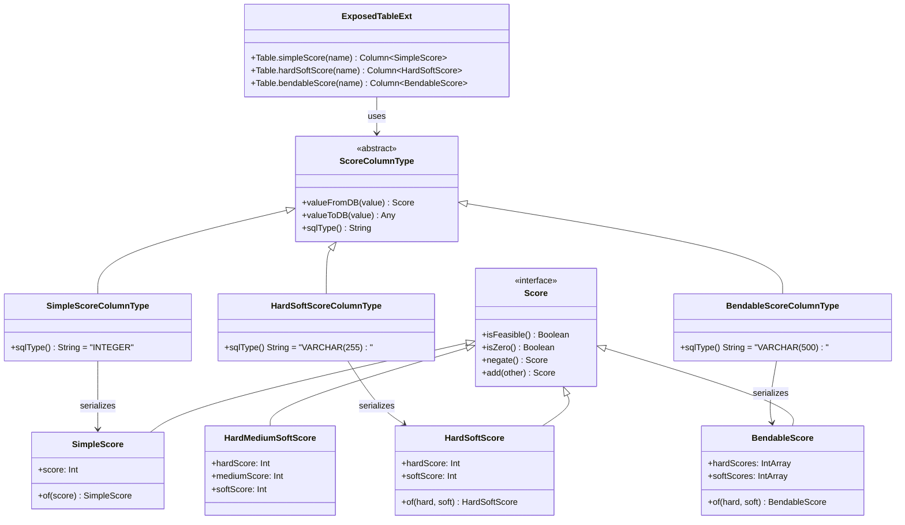
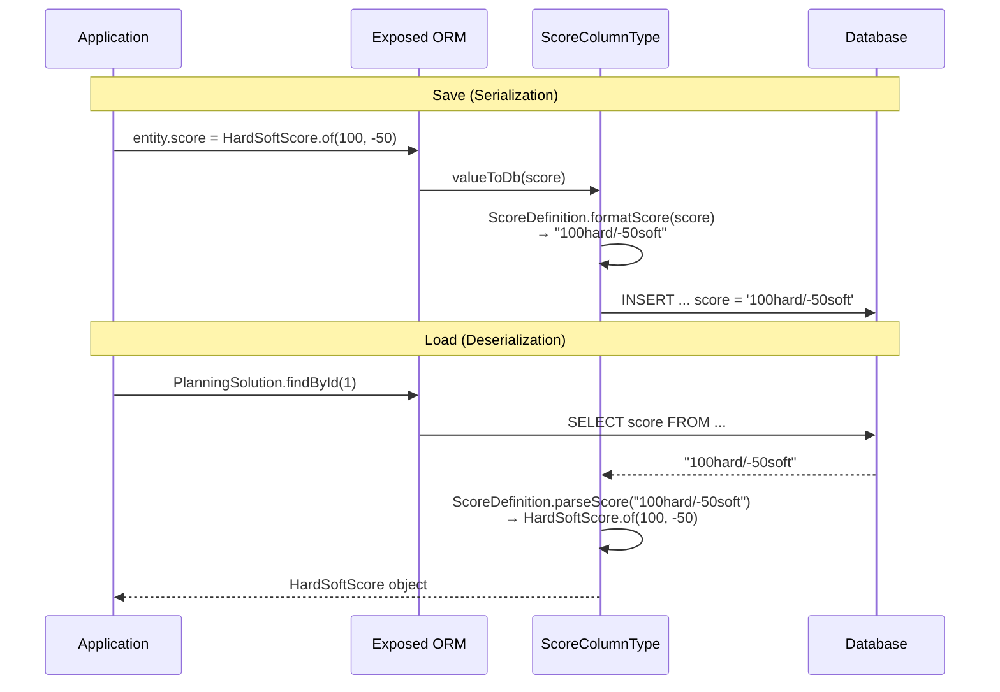

# Module bluetape4k-timefold-solver-persistence-exposed

English | [한국어](./README.ko.md)

A Kotlin library for persisting and loading [Timefold Solver](https://github.com/timefold/timefold-solver) Score data to and from relational databases using [Exposed](https://github.com/JetBrains/Exposed).

## Overview

This module provides seamless integration between Timefold Solver's scoring system and JetBrains Exposed ORM, enabling transparent persistence and retrieval of various Score types in relational databases.

### Key Features

- **All Timefold Score types supported**: 12 score types including SimpleScore, HardSoftScore, and BendableScore
- **Exposed integration**: Natural integration using Exposed's `ColumnType` and `ColumnTransformer`
- **Type safety**: Score type validation at compile time
- **Database independence**: Supports H2, MySQL, MariaDB, PostgreSQL, and more

## Supported Score Types

| Score Type                        | Description                         | DB Storage Format             |
|---------------------------------|-------------------------------------|-------------------------------|
| `SimpleScore`                   | Single score value                  | Integer                       |
| `SimpleLongScore`               | Single score as Long                | BigInt                        |
| `SimpleBigDecimalScore`         | Single score as BigDecimal          | VarChar                       |
| `HardSoftScore`                 | Two-level Hard/Soft score           | VarChar (e.g., "100/-50")     |
| `HardSoftLongScore`             | Hard/Soft score as Long             | VarChar                       |
| `HardSoftBigDecimalScore`       | Hard/Soft score as BigDecimal       | VarChar                       |
| `HardMediumSoftScore`           | Three-level Hard/Medium/Soft score  | VarChar (e.g., "100/50/-30")  |
| `HardMediumSoftLongScore`       | Three-level score as Long           | VarChar                       |
| `HardMediumSoftBigDecimalScore` | Three-level score as BigDecimal     | VarChar                       |
| `BendableScore`                 | Flexible Hard/Soft level score      | VarChar                       |
| `BendableLongScore`             | Bendable score as Long              | VarChar                       |
| `BendableBigDecimalScore`       | Bendable score as BigDecimal        | VarChar                       |

## Installation

### Gradle

```kotlin
dependencies {
    implementation("io.github.bluetape4k:bluetape4k-timefold-solver-persistence-exposed:${bluetape4kVersion}")
}
```

### Maven

```xml
<dependency>
    <groupId>io.github.bluetape4k</groupId>
    <artifactId>bluetape4k-timefold-solver-persistence-exposed</artifactId>
    <version>${bluetape4kVersion}</version>
</dependency>
```

## Usage

### 1. Define Tables

```kotlin
import io.bluetape4k.timefold.solver.exposed.api.score.buildin.*
import org.jetbrains.exposed.v1.core.dao.id.IntIdTable

// Table using HardSoftScore
object PlanningSolutions : IntIdTable("planning_solution") {
    val name = varchar("name", 255)
    val score = hardSoftScore("score")
    val createdAt = datetime("created_at")
}

// Table using BendableScore
object BendablePlanningSolutions : IntIdTable("bendable_solution") {
    val name = varchar("name", 255)
    val score = bendableScore("score", length = 500)
    val createdAt = datetime("created_at")
}
```

### 2. Define Entity Classes

```kotlin
import ai.timefold.solver.core.api.score.buildin.hardsoft.HardSoftScore
import org.jetbrains.exposed.v1.dao.IntEntity
import org.jetbrains.exposed.v1.dao.IntEntityClass

class PlanningSolution(id: EntityID<Int>) : IntEntity(id) {
    companion object : IntEntityClass<PlanningSolution>(PlanningSolutions)
    
    var name by PlanningSolutions.name
    var score by PlanningSolutions.score
    var createdAt by PlanningSolutions.createdAt
}
```

### 3. Insert Data

```kotlin
import ai.timefold.solver.core.api.score.buildin.hardsoft.HardSoftScore

transaction {
    // DSL style
    PlanningSolutions.insert {
        it[name] = "Vehicle Routing Solution"
        it[score] = HardSoftScore.of(100, -50)
        it[createdAt] = DateTime.now()
    }
    
    // DAO style
    PlanningSolution.new {
        name = "Employee Scheduling Solution"
        score = HardSoftScore.of(200, -20)
        createdAt = DateTime.now()
    }
}
```

### 4. Query Data

```kotlin
transaction {
    // Single record
    val solution = PlanningSolution.findById(1)
    println("Score: ${solution?.score}")  // Output: Score: 100hard/-50soft
    
    // Conditional query
    val highScoreSolutions = PlanningSolution
        .find { PlanningSolutions.score greater HardSoftScore.of(50, 0) }
        .toList()
}
```

### 5. SimpleScore Example

```kotlin
import io.bluetape4k.timefold.solver.exposed.api.score.buildin.simpleScore
import ai.timefold.solver.core.api.score.buildin.simple.SimpleScore

object SimpleScoreTable : IntIdTable() {
    val name = varchar("name", 255)
    val score = simpleScore("score")  // Stored as an Integer column
}

transaction {
    SimpleScoreTable.insert {
        it[name] = "Simple Solution"
        it[score] = SimpleScore.of(100)
    }
}
```

### 6. BendableScore Example

```kotlin
import io.bluetape4k.timefold.solver.exposed.api.score.buildin.bendableScore
import ai.timefold.solver.core.api.score.buildin.bendable.BendableScore

object BendableScoreTable : IntIdTable() {
    val name = varchar("name", 255)
    val score = bendableScore("score")
}

transaction {
    // BendableScore with 2 hard levels and 3 soft levels
    val bendableScore = BendableScore.of(
        intArrayOf(100, 50),      // hard levels
        intArrayOf(-30, -20, -10) // soft levels
    )
    
    BendableScoreTable.insert {
        it[name] = "Bendable Solution"
        it[score] = bendableScore
    }
}
```

## Database Schema

Recommended column types for each Score type:

```sql
-- SimpleScore: INTEGER
CREATE TABLE planning_solution (
    id BIGINT GENERATED ALWAYS AS IDENTITY PRIMARY KEY,
    name VARCHAR(255),
    score INTEGER
);

-- HardSoftScore: VARCHAR(255)
CREATE TABLE planning_solution (
    id BIGINT GENERATED ALWAYS AS IDENTITY PRIMARY KEY,
    name VARCHAR(255),
    score VARCHAR(255)  -- e.g., "100/-50"
);

-- BendableScore: VARCHAR(500) or larger recommended
CREATE TABLE planning_solution (
    id BIGINT GENERATED ALWAYS AS IDENTITY PRIMARY KEY,
    name VARCHAR(255),
    score VARCHAR(500)  -- e.g., "[100/50]hard/[-30/-20/-10]soft"
);
```

## Score Serialization Format

### SimpleScore

```
100
```

### HardSoftScore

```
100hard/-50soft
```

### HardMediumSoftScore

```
100hard/50medium/-30soft
```

### BendableScore

```
[100/50]hard/[-30/-20]soft
```

## Dependencies

### Required

- `timefold-solver-core`: Timefold Solver core library
- `exposed-core`: JetBrains Exposed ORM

### Test

- `timefold-solver-test`: Timefold Solver test utilities
- `bluetape4k-exposed-tests`: Exposed test support
- Testcontainers (H2, MariaDB, MySQL, PostgreSQL)

## Running Tests

```bash
# Run all tests
./gradlew :bluetape4k-timefold-solver-persistence-exposed:test

# Run a specific test class
./gradlew :bluetape4k-timefold-solver-persistence-exposed:test --tests "HardSoftScoreTest"
```

## Class Diagram



## Architecture Diagram

```mermaid
flowchart LR
    subgraph Timefold["Timefold Solver"]
        SS["SimpleScore"]
        HSS["HardSoftScore"]
        HMSS["HardMediumSoftScore"]
        BS["BendableScore"]
    end

    subgraph Module["bluetape4k-timefold-solver-persistence-exposed"]
        CT["ColumnType implementations<br/>(simpleScore, hardSoftScore, ...)"]
        EXT["Exposed extension functions<br/>(Table.hardSoftScore(), etc.)"]
    end

    subgraph Exposed["JetBrains Exposed ORM"]
        TABLE["IdTable definition<br/>(val score = hardSoftScore(...))"]
        DAO["Entity (DAO)<br/>(var score by Table.score)"]
        DSL["DSL insert/update/select"]
    end

    subgraph DB["RDB (H2/MySQL/PostgreSQL, etc.)"]
        INT["INTEGER<br/>(SimpleScore)"]
        VC["VARCHAR<br/>(HardSoftScore → '100/-50')"]
        VC2["VARCHAR<br/>(BendableScore → '[100]hard/[-30]soft')"]
    end

    Timefold --> Module
    Module --> Exposed
    Exposed --> DB
```



## Score Serialization Flow



## References

- [Timefold Solver Official Docs](https://timefold.ai/docs)
- [Exposed Official Docs](https://github.com/JetBrains/Exposed/wiki)

## License

Apache License 2.0
