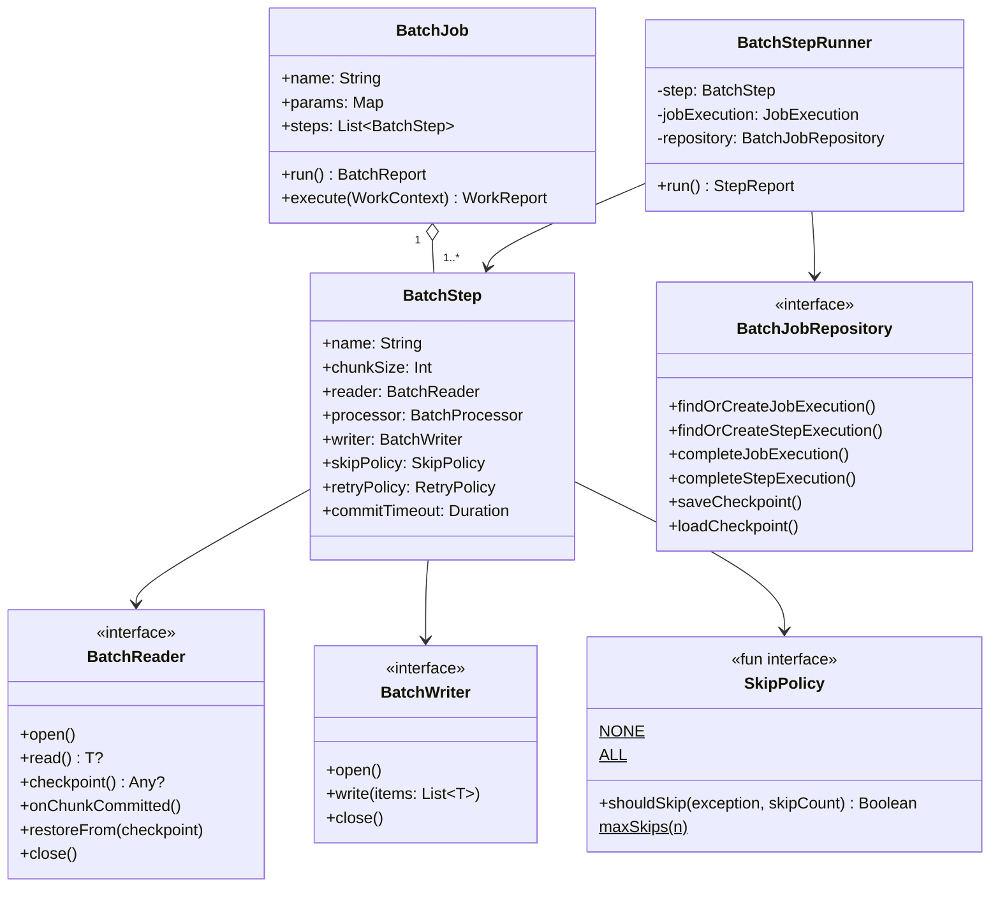
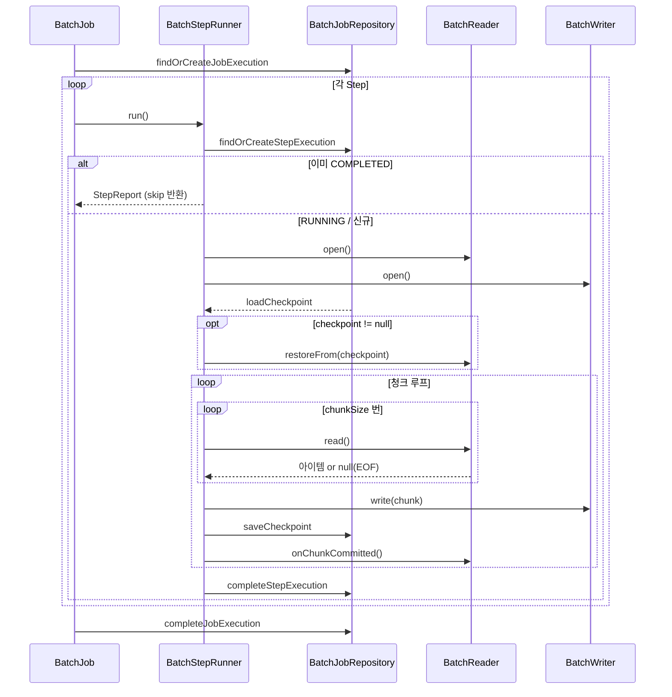

# bluetape4k-batch

한국어 | [English](./README.md)

Kotlin 코루틴 네이티브 배치 처리 프레임워크. Spring Batch 없이 경량화된 체크포인트 기반 청크 처리 파이프라인을 구현한다.

## 아키텍처





## 주요 기능

- **코루틴 우선**: 모든 인터페이스가 `suspend`; `runBlocking` 및 스레드 블로킹 없음
- **체크포인트 재시작**: keyset 기반 체크포인트가 JVM 재시작 후에도 유지됨; 이미 완료된 Step은 자동 skip
- **청크 기반 파이프라인**: `BatchReader → BatchProcessor → BatchWriter` 파이프라인, 청크 크기 설정 가능
- **Skip 정책**: Processor/Writer 실패 시 per-item skip (`NONE` / `ALL` / `maxSkips(n)` / 커스텀 람다)
- **지수 백오프 재시도**: 청크 단위 재시도, 지연 시간 및 지수 백오프 설정 가능
- **커밋 타임아웃**: `WriteTimeoutException` 래퍼로 무한 대기 방지; 일반 오류처럼 재시도/skip
- **취소 안전**: `CancellationException`은 절대 삼키지 않음; `STOPPED` 상태 영속화 후 재던짐
- **Workflow 통합**: `BatchJob`이 `SuspendWork`를 구현하여 `bluetape4k-workflow` 파이프라인에 임베딩 가능
- **JDBC + R2DBC Reader/Writer**: Exposed 기반의 blocking/reactive 데이터베이스 구현체 제공

## 빠른 시작

### DSL로 Job 구성

```kotlin
val job = batchJob("importUsers") {
    repository(myJdbcRepository)
    params("date" to "2026-04-10")
    step<UserCsv, UserEntity>("loadStep") {
        reader(csvReader)
        processor { csv -> UserEntity(csv.name, csv.email) }
        writer(jdbcWriter)
        chunkSize(500)
        skipPolicy(SkipPolicy.maxSkips(100))
        retryPolicy(RetryPolicy(maxAttempts = 3, delay = 1.seconds))
        commitTimeout(30.seconds)
    }
}

val report = job.run()
when (report) {
    is BatchReport.Success           -> println("완료: ${report.stepReports[0].writeCount} rows")
    is BatchReport.PartiallyCompleted -> println("부분완료: skip=${report.stepReports.sumOf { it.skipCount }}")
    is BatchReport.Failure           -> println("실패: ${report.error.message}")
}
```

### 재시작 시나리오

```kotlin
// 1차 실행 — step2에서 실패
val report1 = job.run()  // BatchReport.Failure

// 2차 실행 — step1은 COMPLETED이므로 자동 skip, step2만 재실행
val report2 = job.run()
```

### Workflow에 임베딩

```kotlin
val pipeline = sequentialWorkflow {
    work(validationJob)  // BatchJob이 SuspendWork를 구현함
    work(importJob)
    work(reportJob)
}
val workReport = pipeline.run(WorkContext())
```

## 컴포넌트 설명

### 핵심 클래스

| 클래스 | 설명 |
|--------|------|
| `BatchJob` | Step들을 순차적으로 실행; 재시작 지원; `SuspendWork` 구현 |
| `BatchStep` | Reader → Processor → Writer 파이프라인 설정 |
| `BatchStepRunner` | 단일 Step의 청크 루프 실행 (skip/retry/checkpoint 포함) |

### API 인터페이스

| 인터페이스 | 설명 |
|-----------|------|
| `BatchReader<T>` | 아이템을 하나씩 읽음; 체크포인트 제공 |
| `BatchProcessor<I, O>` | 아이템 변환 (null 반환 = 필터링) |
| `BatchWriter<T>` | 청크 단위 아이템 저장 |
| `BatchJobRepository` | Job/Step 실행 상태 영속화 |
| `SkipPolicy` | 예외 발생 시 skip 여부 결정 |

### 구현체

| 클래스 | 설명 |
|--------|------|
| `InMemoryBatchJobRepository` | 메모리 기반 저장소 (테스트/단순 사용) |
| `ExposedJdbcBatchJobRepository` | Exposed + Virtual Threads JDBC 기반 저장소 |
| `ExposedR2dbcBatchJobRepository` | Exposed suspend 트랜잭션 R2DBC 기반 저장소 |
| `ExposedJdbcBatchReader<K, E>` | keyset 페이징 JDBC Reader |
| `ExposedR2dbcBatchReader<K, E>` | keyset 페이징 R2DBC Reader |
| `ExposedJdbcBatchWriter` | 벌크 JDBC insert/update Writer |
| `ExposedR2dbcBatchWriter` | 벌크 R2DBC insert Writer |

### Skip 정책

```kotlin
SkipPolicy.NONE                      // skip 없음 (기본값)
SkipPolicy.ALL                       // 모든 예외 skip
SkipPolicy.maxSkips(100L)            // 최대 100개 skip
SkipPolicy { e, count -> e is DataException && count < 50 }  // 커스텀
```

## 체크포인트 프로토콜

1. Reader가 `onChunkCommitted()` 호출 후 `checkpoint()`로 체크포인트 값을 반환
2. `BatchStepRunner`가 write 성공 후 Repository에 체크포인트 저장
3. 재시작 시 청크 루프 시작 전 `reader.restoreFrom(checkpoint)` 호출로 상태 복원
4. `TypedCheckpoint` 봉투(Jackson 3)로 모든 직렬화 가능 타입의 타입 안전 round-trip 보장

## BatchStatus 상태 전이

```
STARTING → RUNNING → COMPLETED
                   → COMPLETED_WITH_SKIPS
                   → FAILED
                   → STOPPED (취소)
```

**중요**: `COMPLETED` / `COMPLETED_WITH_SKIPS` 상태의 StepExecution은 재시작 시 자동으로 skip된다.

## 벤치마크

> **환경**: Apple M4 Pro · Testcontainers (PostgreSQL 16, MySQL 8) · chunkSize=500 · pageSize=500
> **커넥션 풀**: JDBC=HikariCP(max=10) · R2DBC=r2dbc-pool(max=10) — 동일 풀 크기로 공정 비교
> **데이터 크기**: 소=100건, 중=10,000건, 대=100,000건
> **병렬 모드**: 키 범위 분할 기반 코루틴 4개 동시 실행

### 순차 처리: JDBC vs R2DBC 처리량 (건/s)

#### H2 (인메모리)

| 크기 | JDBC | R2DBC | 비율 |
|------|-----:|------:|-----:|
| 소 (100건) | 1,333 | 3,448 | R2DBC 2.6× |
| 중 (10,000건) | 66,225 | 41,841 | JDBC 1.6× |
| 대 (100,000건) | 188,679 | 106,269 | JDBC 1.8× |

#### PostgreSQL 16

| 크기 | JDBC | R2DBC | 비율 |
|------|-----:|------:|-----:|
| 소 (100건) | 5,555 | 740 | JDBC 7.5× |
| 중 (10,000건) | 65,359 | 3,247 | JDBC 20.1× |
| 대 (100,000건) | 78,064 | 3,130 | JDBC 24.9× |

#### MySQL 8

| 크기 | JDBC | R2DBC | 비율 |
|------|-----:|------:|-----:|
| 소 (100건) | 1,754 | 1,388 | JDBC 1.3× |
| 중 (10,000건) | 34,364 | 3,671 | JDBC 9.4× |
| 대 (100,000건) | 54,229 | 3,914 | JDBC 13.9× |

### 병렬 처리 (4 파티션): JDBC vs R2DBC 처리량 (건/s)

> 각 파티션은 독립된 코루틴 + 키 범위 Reader로 동시 실행된다.
> 병렬 풀 크기: JDBC=HikariCP(max=12), R2DBC=r2dbc-pool(max=12)

#### H2 (인메모리)

| 크기 | JDBC | R2DBC | 비율 |
|------|-----:|------:|-----:|
| 대 (100,000건) | 173,010 | 202,020 | **R2DBC 1.2×** |

#### PostgreSQL 16

| 크기 | JDBC | R2DBC | 비율 |
|------|-----:|------:|-----:|
| 중 (10,000건) | 113,636 | 10,152 | JDBC 11.2× |
| 대 (100,000건) | 123,456 | 11,049 | JDBC 11.2× |

#### MySQL 8

| 크기 | JDBC | R2DBC | 비율 |
|------|-----:|------:|-----:|
| 중 (10,000건) | 75,187 | 9,345 | JDBC 8.0× |
| 대 (100,000건) | 131,578 | 11,012 | JDBC 12.0× |

### 순차 vs 병렬 처리량 향상 비교

| DB | 크기 | JDBC 순차 | JDBC 4× | 향상 | R2DBC 순차 | R2DBC 4× | 향상 |
|----|------|--------:|--------:|-----:|----------:|---------:|-----:|
| H2 | 대 | 188,679 | 173,010 | 0.9× | 106,269 | 202,020 | **1.9×** |
| PostgreSQL | 중 | 65,359 | 113,636 | **1.7×** | 3,247 | 10,152 | **3.1×** |
| PostgreSQL | 대 | 78,064 | 123,456 | **1.6×** | 3,130 | 11,049 | **3.5×** |
| MySQL | 중 | 34,364 | 75,187 | **2.2×** | 3,671 | 9,345 | **2.5×** |
| MySQL | 대 | 54,229 | 131,578 | **2.4×** | 3,914 | 11,012 | **2.8×** |

### 결론

- **순차 처리 — 네트워크 DB**: JDBC(VirtualThread)가 드라이버 왕복 비용으로 R2DBC 대비 10–25배 앞섬
- **순차 처리 — H2 인메모리**: 중·대규모는 JDBC 우세; 소규모(100건)만 R2DBC가 빠름
- **병렬 처리 (4 코루틴)**: 네트워크 DB에서 JDBC·R2DBC 모두 유의미한 향상
  - PostgreSQL JDBC: **1.6×** · R2DBC: **3.5×** (격차 축소, JDBC 여전히 11× 앞섬)
  - MySQL JDBC: **2.4×** · R2DBC: **2.8×**
- **H2 + R2DBC 병렬**: R2DBC 승리(202,020 vs 173,010건/s) — 네트워크 없이 비동기 이벤트 루프의 강점이 발휘됨

### 배치에서 JDBC가 유리한 이유

청크 기반 배치 파이프라인은 청크 내부에서 `read → process → write → checkpoint` 가 본질적으로 직렬이다.
이 구조가 R2DBC의 논블로킹 장점을 무력화한다:

- **R2DBC 드라이버 왕복 비용** (PostgreSQL 기준 ~300 µs/req)이 수천 건의 청크에 걸쳐 누적되어 병목이 된다
- **Virtual Thread는 JDBC 블로킹을 공짜로 숨겨준다** — 각 청크는 OS 스레드 오버헤드 없이 가상 스레드에서 실행되므로, R2DBC가 제공하려 했던 동시성 이득을 JDBC가 대신 확보한다
- 청크 루프는 다음 체크포인트로 넘어가기 전에 매 write를 `await`하므로, 비동기 파이프라이닝이 실제로 발동되지 않는다

요약하면: R2DBC의 강점(논블로킹 I/O, 백프레셔, 리액티브 스트림)은 다수의 동시 요청이 겹칠 때 효과를 발휘한다. 순차 청크 루프에서는 JDBC + VirtualThread가 구조적으로 더 적합하다.

### 권장 사항

**네트워크 DB 대용량 배치의 최적 조합:**

> **JDBC + Virtual Threads + 병렬 파티셔닝**

Spring Batch든 bluetape4k-batch든 프레임워크와 무관하게 이 조합이 최고 처리량을 낸다.

| 사용 사례 | 권장 스택 |
|----------|---------|
| 네트워크 DB(PostgreSQL/MySQL) 대용량 배치 | **Exposed JDBC + VirtualThread + 병렬 파티션** (Spring Batch 또는 bluetape4k-batch) |
| 완전 비동기 WebFlux 파이프라인 (스레드 블로킹 불가) | `ExposedR2dbcBatchReader/Writer` + 병렬 파티셔닝 |
| 경량 임베딩 (Spring 없음, CLI/서버리스) | `bluetape4k-batch` + `InMemoryBatchJobRepository` |
| H2 (테스트/임베디드 DB) | 양쪽 모두 가능; 병렬 시 R2DBC 소폭 우세 |

## 모듈 의존성

```kotlin
dependencies {
    implementation(project(":bluetape4k-batch"))
    // JDBC repository / reader / writer 사용 시:
    implementation(project(":bluetape4k-exposed-jdbc"))
    // R2DBC repository / reader / writer 사용 시:
    implementation(project(":bluetape4k-exposed-r2dbc"))
    // Workflow 임베딩 사용 시:
    implementation(project(":bluetape4k-workflow"))
}
```
