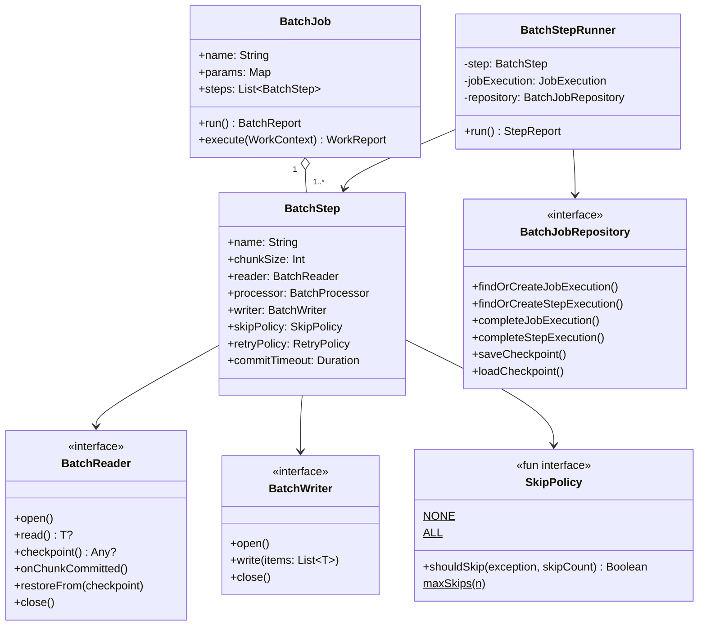
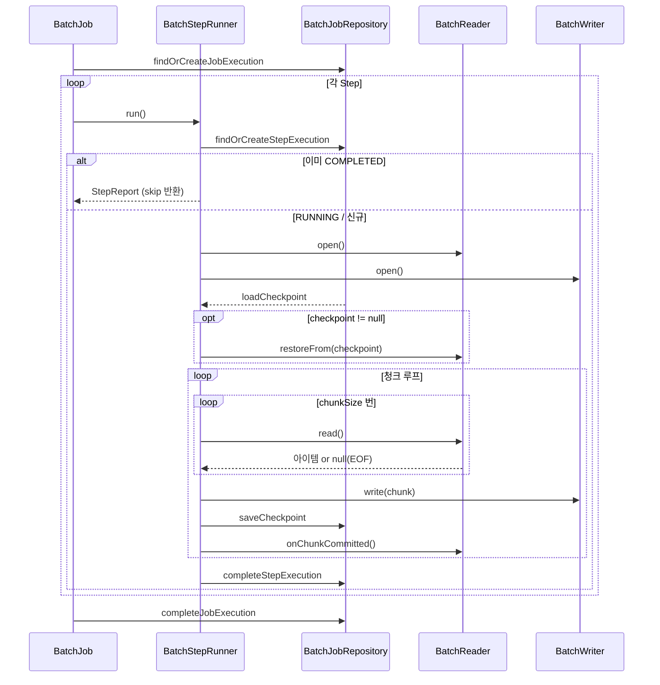

# bluetape4k-batch

Kotlin 코루틴 네이티브 배치 처리 프레임워크. Spring Batch 없이 경량화된 체크포인트 기반 청크 처리 파이프라인을 구현한다.

## 아키텍처





## 주요 기능

- **코루틴 우선**: 모든 인터페이스가 `suspend`; `runBlocking` 및 스레드 블로킹 없음
- **체크포인트 재시작**: keyset 기반 체크포인트가 JVM 재시작 후에도 유지됨; 이미 완료된 Step은 자동 skip
- **청크 기반 파이프라인**: `BatchReader → BatchProcessor → BatchWriter` 파이프라인, 청크 크기 설정 가능
- **Skip 정책**: Processor/Writer 실패 시 per-item skip (`NONE` / `ALL` / `maxSkips(n)` / 커스텀 람다)
- **지수 백오프 재시도**: 청크 단위 재시도, 지연 시간 및 지수 백오프 설정 가능
- **커밋 타임아웃**: `WriteTimeoutException` 래퍼로 무한 대기 방지; 일반 오류처럼 재시도/skip
- **취소 안전**: `CancellationException`은 절대 삼키지 않음; `STOPPED` 상태 영속화 후 재던짐
- **Workflow 통합**: `BatchJob`이 `SuspendWork`를 구현하여 `bluetape4k-workflow` 파이프라인에 임베딩 가능
- **JDBC + R2DBC Reader/Writer**: Exposed 기반의 blocking/reactive 데이터베이스 구현체 제공

## 빠른 시작

### DSL로 Job 구성

```kotlin
val job = batchJob("importUsers") {
    repository(myJdbcRepository)
    params("date" to "2026-04-10")
    step<UserCsv, UserEntity>("loadStep") {
        reader(csvReader)
        processor { csv -> UserEntity(csv.name, csv.email) }
        writer(jdbcWriter)
        chunkSize(500)
        skipPolicy(SkipPolicy.maxSkips(100))
        retryPolicy(RetryPolicy(maxAttempts = 3, delay = 1.seconds))
        commitTimeout(30.seconds)
    }
}

val report = job.run()
when (report) {
    is BatchReport.Success           -> println("완료: ${report.stepReports[0].writeCount} rows")
    is BatchReport.PartiallyCompleted -> println("부분완료: skip=${report.stepReports.sumOf { it.skipCount }}")
    is BatchReport.Failure           -> println("실패: ${report.error.message}")
}
```

### 재시작 시나리오

```kotlin
// 1차 실행 — step2에서 실패
val report1 = job.run()  // BatchReport.Failure

// 2차 실행 — step1은 COMPLETED이므로 자동 skip, step2만 재실행
val report2 = job.run()
```

### Workflow에 임베딩

```kotlin
val pipeline = sequentialWorkflow {
    work(validationJob)  // BatchJob이 SuspendWork를 구현함
    work(importJob)
    work(reportJob)
}
val workReport = pipeline.run(WorkContext())
```

## 컴포넌트 설명

### 핵심 클래스

| 클래스 | 설명 |
|--------|------|
| `BatchJob` | Step들을 순차적으로 실행; 재시작 지원; `SuspendWork` 구현 |
| `BatchStep` | Reader → Processor → Writer 파이프라인 설정 |
| `BatchStepRunner` | 단일 Step의 청크 루프 실행 (skip/retry/checkpoint 포함) |

### API 인터페이스

| 인터페이스 | 설명 |
|-----------|------|
| `BatchReader<T>` | 아이템을 하나씩 읽음; 체크포인트 제공 |
| `BatchProcessor<I, O>` | 아이템 변환 (null 반환 = 필터링) |
| `BatchWriter<T>` | 청크 단위 아이템 저장 |
| `BatchJobRepository` | Job/Step 실행 상태 영속화 |
| `SkipPolicy` | 예외 발생 시 skip 여부 결정 |

### 구현체

| 클래스 | 설명 |
|--------|------|
| `InMemoryBatchJobRepository` | 메모리 기반 저장소 (테스트/단순 사용) |
| `ExposedJdbcBatchJobRepository` | Exposed + Virtual Threads JDBC 기반 저장소 |
| `ExposedR2dbcBatchJobRepository` | Exposed suspend 트랜잭션 R2DBC 기반 저장소 |
| `ExposedJdbcBatchReader<K, E>` | keyset 페이징 JDBC Reader |
| `ExposedR2dbcBatchReader<K, E>` | keyset 페이징 R2DBC Reader |
| `ExposedJdbcBatchWriter` | 벌크 JDBC insert/update Writer |
| `ExposedR2dbcBatchWriter` | 벌크 R2DBC insert Writer |

### Skip 정책

```kotlin
SkipPolicy.NONE                      // skip 없음 (기본값)
SkipPolicy.ALL                       // 모든 예외 skip
SkipPolicy.maxSkips(100L)            // 최대 100개 skip
SkipPolicy { e, count -> e is DataException && count < 50 }  // 커스텀
```

## 체크포인트 프로토콜

1. Reader가 `onChunkCommitted()` 호출 후 `checkpoint()`로 체크포인트 값을 반환
2. `BatchStepRunner`가 write 성공 후 Repository에 체크포인트 저장
3. 재시작 시 청크 루프 시작 전 `reader.restoreFrom(checkpoint)` 호출로 상태 복원
4. `TypedCheckpoint` 봉투(Jackson 3)로 모든 직렬화 가능 타입의 타입 안전 round-trip 보장

## BatchStatus 상태 전이

```
STARTING → RUNNING → COMPLETED
                   → COMPLETED_WITH_SKIPS
                   → FAILED
                   → STOPPED (취소)
```

**중요**: `COMPLETED` / `COMPLETED_WITH_SKIPS` 상태의 StepExecution은 재시작 시 자동으로 skip된다.

## 벤치마크

> **환경**: Apple M4 Pro · Testcontainers (PostgreSQL 16, MySQL 8) · chunkSize=500 · pageSize=500
> **데이터 크기**: 소=100건, 중=10,000건, 대=100,000건

### JDBC vs R2DBC 처리량 비교 (건/s)

#### H2 (인메모리)

| 크기 | JDBC | R2DBC | 비율 |
|------|-----:|------:|-----:|
| 소 (100건) | 1,250 | 4,000 | R2DBC 3.2× |
| 중 (10,000건) | 62,111 | 35,087 | JDBC 1.8× |
| 대 (100,000건) | 126,742 | 90,579 | JDBC 1.4× |

#### PostgreSQL 16

| 크기 | JDBC | R2DBC | 비율 |
|------|-----:|------:|-----:|
| 소 (100건) | 877 | 1,010 | R2DBC 1.2× |
| 중 (10,000건) | 17,921 | 3,581 | JDBC 5.0× |
| 대 (100,000건) | 23,228 | 3,792 | JDBC 6.1× |

#### MySQL 8

| 크기 | JDBC | R2DBC | 비율 |
|------|-----:|------:|-----:|
| 소 (100건) | 1,538 | 781 | JDBC 2.0× |
| 중 (10,000건) | 22,624 | 1,053 | JDBC 21.5× |
| 대 (100,000건) | 32,541 | 1,035 | JDBC 31.5× |

### 소요 시간 (ms)

| DB | 방식 | 소 (100건) | 중 (10,000건) | 대 (100,000건) |
|----|------|----------:|-------------:|-------------:|
| H2 | JDBC | 80 | 161 | 789 |
| H2 | R2DBC | 25 | 285 | 1,104 |
| PostgreSQL | JDBC | 114 | 558 | 4,305 |
| PostgreSQL | R2DBC | 99 | 2,792 | 26,367 |
| MySQL 8 | JDBC | 65 | 442 | 3,073 |
| MySQL 8 | R2DBC | 128 | 9,492 | 96,547 |

### 결론

- **소규모 (100건)**: H2·PostgreSQL은 R2DBC가 빠르나 MySQL은 JDBC가 유리 — 드라이버 연결 오버헤드 차이
- **중·대규모 (10,000건+)**: JDBC(VirtualThread)가 일관되게 빠름
  - PostgreSQL: JDBC가 R2DBC 대비 **5–6배** 빠름
  - MySQL: JDBC가 R2DBC 대비 **21–32배** 빠름 (MySQL R2DBC 드라이버 왕복 비용)
- **H2 인메모리**: 소규모는 R2DBC가 빠르고, 중·대규모는 JDBC가 앞섬 (네트워크 없이 순수 처리 오버헤드 차이)
- **권장**: 네트워크 DB(PostgreSQL/MySQL) 대용량 처리에는 `ExposedJdbcBatchReader/Writer` 사용; WebFlux 환경의 완전 비동기 파이프라인에는 `ExposedR2dbcBatchReader/Writer` 사용

## 모듈 의존성

```kotlin
dependencies {
    implementation(project(":bluetape4k-batch"))
    // JDBC repository / reader / writer 사용 시:
    implementation(project(":bluetape4k-exposed-jdbc"))
    // R2DBC repository / reader / writer 사용 시:
    implementation(project(":bluetape4k-exposed-r2dbc"))
    // Workflow 임베딩 사용 시:
    implementation(project(":bluetape4k-workflow"))
}
```
