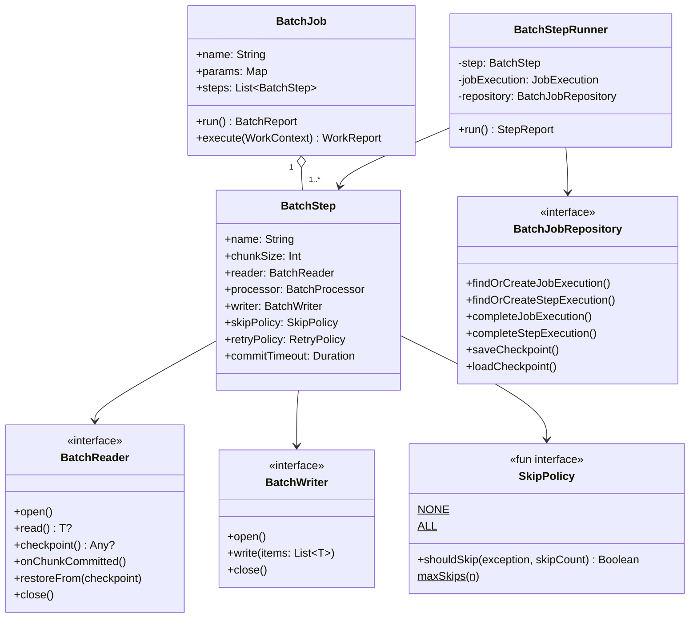
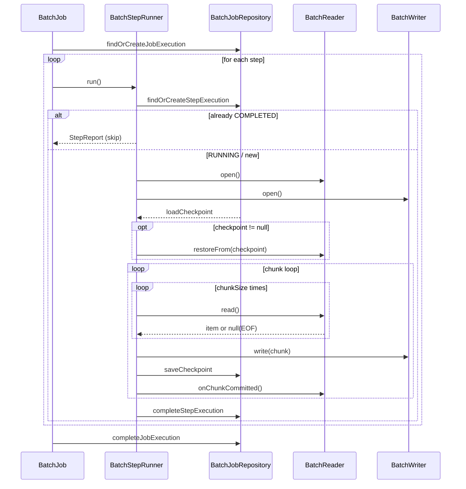

# bluetape4k-batch

A coroutine-native batch processing framework for Kotlin. Implements a lightweight, checkpointable chunk-oriented pipeline — no Spring Batch required.

## Architecture





## Features

- **Coroutine-first**: all interfaces are `suspend`; no `runBlocking` or thread blocking
- **Checkpointable restart**: keyset-based checkpoint survives JVM crash; already-completed steps are skipped on restart
- **Chunk-oriented pipeline**: `BatchReader → BatchProcessor → BatchWriter` with configurable chunk size
- **Skip policy**: per-item skip on processor/writer failure (`NONE` / `ALL` / `maxSkips(n)` / custom lambda)
- **Retry with backoff**: chunk-level retry with configurable delay and exponential backoff
- **Commit timeout**: `WriteTimeoutException` wrapper prevents indefinite hangs; retried/skipped like any other error
- **Cancellation safe**: `CancellationException` is never swallowed; `STOPPED` status is persisted before re-throwing
- **Workflow integration**: `BatchJob` implements `SuspendWork` for embedding in `bluetape4k-workflow` pipelines
- **JDBC + R2DBC readers/writers**: Exposed-based implementations for both blocking and reactive databases

## Quick Start

### DSL

```kotlin
val job = batchJob("importUsers") {
    repository(myJdbcRepository)
    params("date" to "2026-04-10")
    step<UserCsv, UserEntity>("loadStep") {
        reader(csvReader)
        processor { csv -> UserEntity(csv.name, csv.email) }
        writer(jdbcWriter)
        chunkSize(500)
        skipPolicy(SkipPolicy.maxSkips(100))
        retryPolicy(RetryPolicy(maxAttempts = 3, delay = 1.seconds))
        commitTimeout(30.seconds)
    }
}

val report = job.run()
when (report) {
    is BatchReport.Success           -> println("완료: ${report.stepReports[0].writeCount} rows")
    is BatchReport.PartiallyCompleted -> println("부분완료: skip=${report.stepReports.sumOf { it.skipCount }}")
    is BatchReport.Failure           -> println("실패: ${report.error.message}")
}
```

### Restart

```kotlin
// First run — fails at step 2
val report1 = job.run()  // BatchReport.Failure

// Second run — step 1 is COMPLETED, so it's skipped automatically
val report2 = job.run()  // only step 2 runs again
```

### Workflow Embedding

```kotlin
val pipeline = sequentialWorkflow {
    work(validationJob)  // BatchJob implements SuspendWork
    work(importJob)
    work(reportJob)
}
val workReport = pipeline.run(WorkContext())
```

## Components

### Core

| Class | Description |
|-------|-------------|
| `BatchJob` | Orchestrates steps sequentially; supports restart; implements `SuspendWork` |
| `BatchStep` | Defines reader → processor → writer pipeline configuration |
| `BatchStepRunner` | Executes a single step's chunk loop with skip/retry/checkpoint |

### API Interfaces

| Interface | Description |
|-----------|-------------|
| `BatchReader<T>` | Reads items one at a time; provides checkpoint |
| `BatchProcessor<I, O>` | Transforms items (null return = filter) |
| `BatchWriter<T>` | Writes a chunk of items |
| `BatchJobRepository` | Persists job/step execution state |
| `SkipPolicy` | Decides whether to skip on exception |

### Implementations

| Class | Description |
|-------|-------------|
| `InMemoryBatchJobRepository` | In-memory repository for testing and simple use cases |
| `ExposedJdbcBatchJobRepository` | JDBC-based repository using Exposed + Virtual Threads |
| `ExposedR2dbcBatchJobRepository` | R2DBC-based repository using Exposed suspend transactions |
| `ExposedJdbcBatchReader<K, E>` | Keyset-paginated JDBC reader |
| `ExposedR2dbcBatchReader<K, E>` | Keyset-paginated R2DBC reader |
| `ExposedJdbcBatchWriter` | Bulk JDBC insert/update writer |
| `ExposedR2dbcBatchWriter` | Bulk R2DBC insert writer |

### Skip Policies

```kotlin
SkipPolicy.NONE                      // never skip (default)
SkipPolicy.ALL                       // always skip
SkipPolicy.maxSkips(100L)            // skip up to 100 items
SkipPolicy { e, count -> e is DataException && count < 50 }  // custom
```

## Checkpoint Protocol

1. Reader returns a checkpoint value via `checkpoint()` after each `onChunkCommitted()` call
2. `BatchStepRunner` persists the checkpoint to the repository after each successful write
3. On restart, the checkpoint is restored via `reader.restoreFrom(checkpoint)` before the chunk loop begins
4. `TypedCheckpoint` envelope (Jackson 3) ensures type-safe round-trip for all serializable types

## Benchmarks

> **Environment**: Apple M4 Pro · Testcontainers (PostgreSQL 16, MySQL 8) · chunkSize=500 · pageSize=500
> **Connection pools**: JDBC=HikariCP(max=10) · R2DBC=r2dbc-pool(max=10) — equal pool size for fair comparison
> **Data sizes**: Small=100 rows, Medium=10,000 rows, Large=100,000 rows
> **Parallel mode**: 4 coroutine partitions running concurrently (key-range split)

### Sequential: JDBC vs R2DBC Throughput (rows/s)

#### H2 (in-memory)

| Size | JDBC | R2DBC | Ratio |
|------|-----:|------:|------:|
| Small (100) | 1,333 | 3,448 | R2DBC 2.6× |
| Medium (10,000) | 66,225 | 41,841 | JDBC 1.6× |
| Large (100,000) | 188,679 | 106,269 | JDBC 1.8× |

#### PostgreSQL 16

| Size | JDBC | R2DBC | Ratio |
|------|-----:|------:|------:|
| Small (100) | 5,555 | 740 | JDBC 7.5× |
| Medium (10,000) | 65,359 | 3,247 | JDBC 20.1× |
| Large (100,000) | 78,064 | 3,130 | JDBC 24.9× |

#### MySQL 8

| Size | JDBC | R2DBC | Ratio |
|------|-----:|------:|------:|
| Small (100) | 1,754 | 1,388 | JDBC 1.3× |
| Medium (10,000) | 34,364 | 3,671 | JDBC 9.4× |
| Large (100,000) | 54,229 | 3,914 | JDBC 13.9× |

### Parallel (4 Partitions): JDBC vs R2DBC Throughput (rows/s)

> Each partition runs as an independent coroutine with its own key-range reader.
> Parallel pool sizes: JDBC=HikariCP(max=12), R2DBC=r2dbc-pool(max=12).

#### H2 (in-memory)

| Size | JDBC | R2DBC | Ratio |
|------|-----:|------:|------:|
| Large (100,000) | 173,010 | 202,020 | **R2DBC 1.2×** |

#### PostgreSQL 16

| Size | JDBC | R2DBC | Ratio |
|------|-----:|------:|------:|
| Medium (10,000) | 113,636 | 10,152 | JDBC 11.2× |
| Large (100,000) | 123,456 | 11,049 | JDBC 11.2× |

#### MySQL 8

| Size | JDBC | R2DBC | Ratio |
|------|-----:|------:|------:|
| Medium (10,000) | 75,187 | 9,345 | JDBC 8.0× |
| Large (100,000) | 131,578 | 11,012 | JDBC 12.0× |

### Sequential vs Parallel Speedup

| DB | Size | JDBC seq | JDBC 4× | Speedup | R2DBC seq | R2DBC 4× | Speedup |
|----|------|--------:|--------:|--------:|----------:|---------:|--------:|
| H2 | Large | 188,679 | 173,010 | 0.9× | 106,269 | 202,020 | **1.9×** |
| PostgreSQL | Medium | 65,359 | 113,636 | **1.7×** | 3,247 | 10,152 | **3.1×** |
| PostgreSQL | Large | 78,064 | 123,456 | **1.6×** | 3,130 | 11,049 | **3.5×** |
| MySQL | Medium | 34,364 | 75,187 | **2.2×** | 3,671 | 9,345 | **2.5×** |
| MySQL | Large | 54,229 | 131,578 | **2.4×** | 3,914 | 11,012 | **2.8×** |

### Summary

- **Sequential — network DBs**: JDBC (VirtualThread) outperforms R2DBC by 10–25× for PostgreSQL/MySQL due to driver round-trip overhead
- **Sequential — H2 in-memory**: JDBC leads for medium/large; R2DBC edges ahead only for tiny (100-row) batches
- **Parallel (4 coroutines)**: Both JDBC and R2DBC benefit significantly from partitioned parallelism on network DBs
  - PostgreSQL JDBC: **1.6× speedup** · R2DBC: **3.5× speedup** (gap narrows but JDBC still 11× ahead)
  - MySQL JDBC: **2.4× speedup** · R2DBC: **2.8× speedup**
- **H2 + R2DBC parallel**: R2DBC wins (202,020 vs 173,010 rows/s) — async event loop shines without network latency

### Why JDBC Wins in Batch Workloads

Chunk-oriented batch pipelines are inherently sequential within each chunk: `read → process → write → checkpoint`.
This structure eliminates R2DBC's non-blocking advantage:

- **R2DBC driver round-trip cost** (~300 µs/req for PostgreSQL) accumulates across thousands of chunks and becomes the dominant bottleneck
- **Virtual Threads hide JDBC blocking for free** — each chunk runs in its own virtual thread with no OS thread overhead, giving JDBC the concurrency benefit R2DBC was supposed to provide
- The chunk loop `await`s each write before moving to the next checkpoint, so async pipelining never kicks in

In short: R2DBC's strengths (non-blocking I/O, backpressure, reactive streams) only pay off when many concurrent requests overlap. In a sequential chunk loop, JDBC + VirtualThread is a strictly better fit.

### Recommendation

**The winning formula for high-throughput batch on network DBs is:**

> **JDBC + Virtual Threads + Parallel Partitioning**

This holds regardless of the batch framework — Spring Batch or bluetape4k-batch both benefit from the same combination.

| Use Case | Stack |
|----------|-------|
| Network DB (PostgreSQL/MySQL) high-throughput batch | **Exposed JDBC + VirtualThread + parallel partitions** (Spring Batch or bluetape4k-batch) |
| Fully async WebFlux pipeline (thread blocking not allowed) | `ExposedR2dbcBatchReader/Writer` + parallel partitioning |
| Lightweight embedding (no Spring, CLI/serverless) | `bluetape4k-batch` with `InMemoryBatchJobRepository` |
| H2 (testing / embedded DB) | Either; R2DBC has a slight parallel edge |

## Module Dependencies

```kotlin
dependencies {
    implementation(project(":bluetape4k-batch"))
    // for JDBC repository / reader / writer:
    implementation(project(":bluetape4k-exposed-jdbc"))
    // for R2DBC repository / reader / writer:
    implementation(project(":bluetape4k-exposed-r2dbc"))
    // for workflow embedding:
    implementation(project(":bluetape4k-workflow"))
}
```
