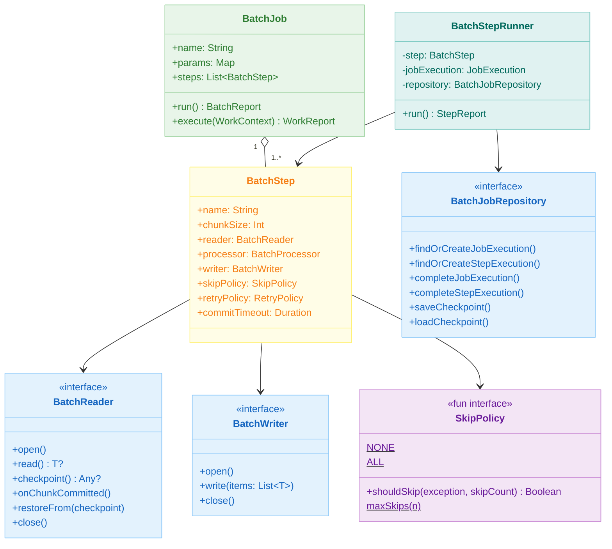
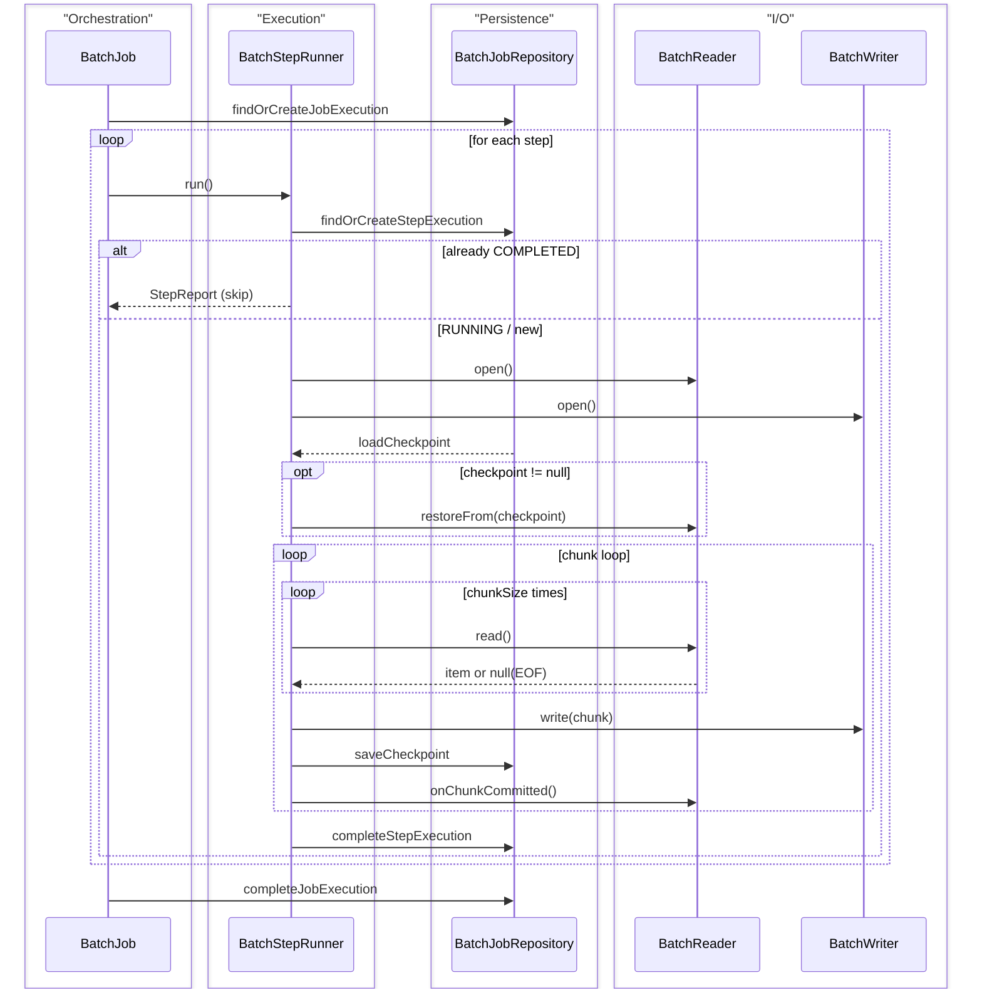

# bluetape4k-batch

[한국어](./README.ko.md) | English

A coroutine-native batch processing framework for Kotlin. Implements a lightweight, checkpointable chunk-oriented pipeline — no Spring Batch required.

## Architecture





## Features

- **Coroutine-first**: all interfaces are `suspend`; no `runBlocking` or thread blocking
- **Checkpointable restart**: keyset-based checkpoint survives JVM crash; already-completed steps are skipped on restart
- **Chunk-oriented pipeline**: `BatchReader → BatchProcessor → BatchWriter` with configurable chunk size
- **Skip policy**: per-item skip on processor/writer failure (`NONE` / `ALL` / `maxSkips(n)` / custom lambda)
- **Retry with backoff**: chunk-level retry with configurable delay and exponential backoff
- **Commit timeout**: `WriteTimeoutException` wrapper prevents indefinite hangs; retried/skipped like any other error
- **Cancellation safe**: `CancellationException` is never swallowed; `STOPPED` status is persisted before re-throwing
- **Workflow integration**: `BatchJob` implements `SuspendWork` for embedding in `bluetape4k-workflow` pipelines
- **JDBC + R2DBC readers/writers**: Exposed-based implementations for both blocking and reactive databases

## Quick Start

### DSL

```kotlin
val job = batchJob("importUsers") {
    repository(myJdbcRepository)
    params("date" to "2026-04-10")
    step<UserCsv, UserEntity>("loadStep") {
        reader(csvReader)
        processor { csv -> UserEntity(csv.name, csv.email) }
        writer(jdbcWriter)
        chunkSize(500)
        skipPolicy(SkipPolicy.maxSkips(100))
        retryPolicy(RetryPolicy(maxAttempts = 3, delay = 1.seconds))
        commitTimeout(30.seconds)
    }
}

val report = job.run()
when (report) {
    is BatchReport.Success           -> println("완료: ${report.stepReports[0].writeCount} rows")
    is BatchReport.PartiallyCompleted -> println("부분완료: skip=${report.stepReports.sumOf { it.skipCount }}")
    is BatchReport.Failure           -> println("실패: ${report.error.message}")
}
```

### Restart

```kotlin
// First run — fails at step 2
val report1 = job.run()  // BatchReport.Failure

// Second run — step 1 is COMPLETED, so it's skipped automatically
val report2 = job.run()  // only step 2 runs again
```

### Workflow Embedding

```kotlin
val pipeline = sequentialWorkflow {
    work(validationJob)  // BatchJob implements SuspendWork
    work(importJob)
    work(reportJob)
}
val workReport = pipeline.run(WorkContext())
```

## Components

### Core

| Class | Description |
|-------|-------------|
| `BatchJob` | Orchestrates steps sequentially; supports restart; implements `SuspendWork` |
| `BatchStep` | Defines reader → processor → writer pipeline configuration |
| `BatchStepRunner` | Executes a single step's chunk loop with skip/retry/checkpoint |

### API Interfaces

| Interface | Description |
|-----------|-------------|
| `BatchReader<T>` | Reads items one at a time; provides checkpoint |
| `BatchProcessor<I, O>` | Transforms items (null return = filter) |
| `BatchWriter<T>` | Writes a chunk of items |
| `BatchJobRepository` | Persists job/step execution state |
| `SkipPolicy` | Decides whether to skip on exception |

### Implementations

| Class | Description |
|-------|-------------|
| `InMemoryBatchJobRepository` | In-memory repository for testing and simple use cases |
| `ExposedJdbcBatchJobRepository` | JDBC-based repository using Exposed + Virtual Threads |
| `ExposedR2dbcBatchJobRepository` | R2DBC-based repository using Exposed suspend transactions |
| `ExposedJdbcBatchReader<K, E>` | Keyset-paginated JDBC reader |
| `ExposedR2dbcBatchReader<K, E>` | Keyset-paginated R2DBC reader |
| `ExposedJdbcBatchWriter` | Bulk JDBC insert/update writer |
| `ExposedR2dbcBatchWriter` | Bulk R2DBC insert writer |

### Skip Policies

```kotlin
SkipPolicy.NONE                      // never skip (default)
SkipPolicy.ALL                       // always skip
SkipPolicy.maxSkips(100L)            // skip up to 100 items
SkipPolicy { e, count -> e is DataException && count < 50 }  // custom
```

## Checkpoint Protocol

1. Reader returns a checkpoint value via `checkpoint()` after each `onChunkCommitted()` call
2. `BatchStepRunner` persists the checkpoint to the repository after each successful write
3. On restart, the checkpoint is restored via `reader.restoreFrom(checkpoint)` before the chunk loop begins
4. `TypedCheckpoint` envelope (Jackson 3) ensures type-safe round-trip for all serializable types

## Benchmarks

The benchmark setup has been migrated to `kotlinx-benchmark` with DB-specific profiles for JDBC + Virtual Threads and R2DBC.

| DB | Summary | Details |
|----|---------|---------|
| H2 | Compare JDBC vs R2DBC for `seedBenchmark` and `endToEndBatchJobBenchmark` | [H2 benchmark details](docs/benchmark/h2.md) |
| PostgreSQL | Compare JDBC vs R2DBC for the same scenarios with Testcontainers-backed execution | [PostgreSQL benchmark details](docs/benchmark/postgresql.md) |
| MySQL | Compare JDBC vs R2DBC across seed and end-to-end batch job runs | [MySQL benchmark details](docs/benchmark/mysql.md) |

- [Benchmark hub](docs/benchmark/README.md)
- Example tasks: `./gradlew :bluetape4k-batch:h2JdbcBenchmark`, `./gradlew :bluetape4k-batch:postgresR2dbcBenchmark`, `./gradlew :bluetape4k-batch:generateBenchmarkDocs`

### Comparison Focus

- Primary axis: **JDBC vs R2DBC**
- Scenarios: `seedBenchmark`, `endToEndBatchJobBenchmark`
- Parameters: `dataSize = 1000/10000/100000`, `poolSize = 10/30/60`, `parallelism = 1/4/8`
- Detailed tables and graphs live under `docs/benchmark/*.md`

```mermaid
xychart-beta
    title "Benchmark documentation structure"
    x-axis [H2, PostgreSQL, MySQL]
    y-axis "Docs coverage" 0 --> 100
    bar [100, 100, 100]
    bar [100, 100, 100]
```



## Module Dependencies

```kotlin
dependencies {
    implementation(project(":bluetape4k-batch"))
    // for JDBC repository / reader / writer:
    implementation(project(":bluetape4k-exposed-jdbc"))
    // for R2DBC repository / reader / writer:
    implementation(project(":bluetape4k-exposed-r2dbc"))
    // for workflow embedding:
    implementation(project(":bluetape4k-workflow"))
}
```
