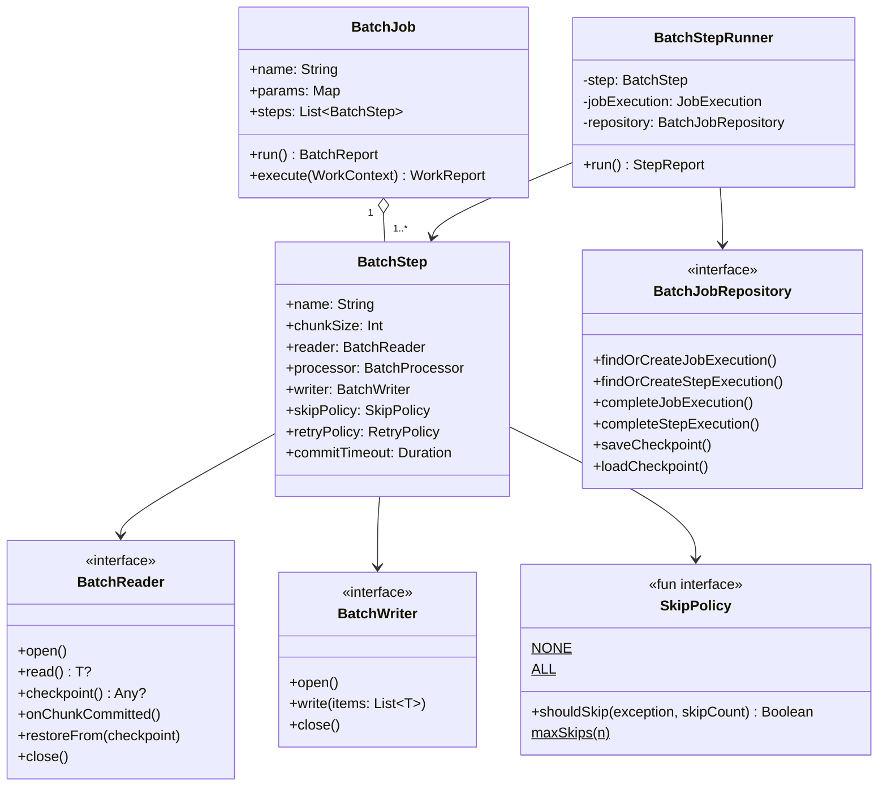
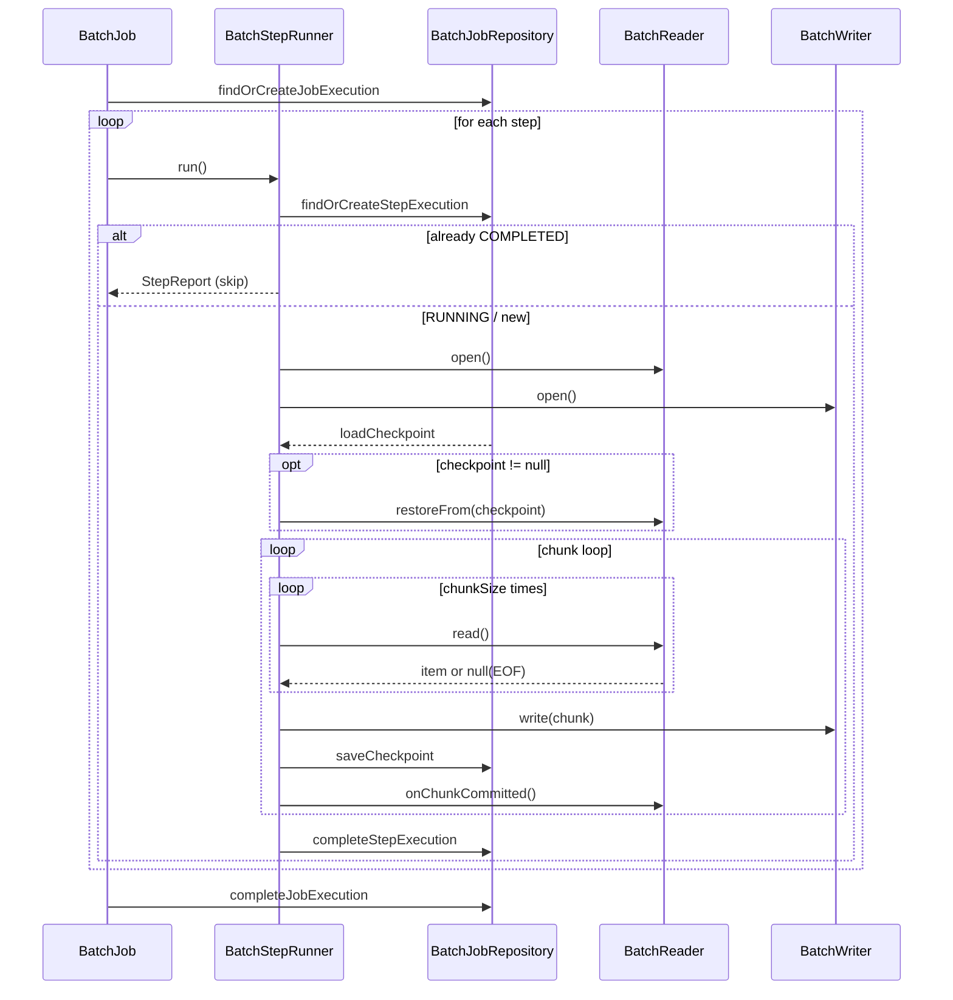

# bluetape4k-batch

A coroutine-native batch processing framework for Kotlin. Implements a lightweight, checkpointable chunk-oriented pipeline — no Spring Batch required.

## Architecture





## Features

- **Coroutine-first**: all interfaces are `suspend`; no `runBlocking` or thread blocking
- **Checkpointable restart**: keyset-based checkpoint survives JVM crash; already-completed steps are skipped on restart
- **Chunk-oriented pipeline**: `BatchReader → BatchProcessor → BatchWriter` with configurable chunk size
- **Skip policy**: per-item skip on processor/writer failure (`NONE` / `ALL` / `maxSkips(n)` / custom lambda)
- **Retry with backoff**: chunk-level retry with configurable delay and exponential backoff
- **Commit timeout**: `WriteTimeoutException` wrapper prevents indefinite hangs; retried/skipped like any other error
- **Cancellation safe**: `CancellationException` is never swallowed; `STOPPED` status is persisted before re-throwing
- **Workflow integration**: `BatchJob` implements `SuspendWork` for embedding in `bluetape4k-workflow` pipelines
- **JDBC + R2DBC readers/writers**: Exposed-based implementations for both blocking and reactive databases

## Quick Start

### DSL

```kotlin
val job = batchJob("importUsers") {
    repository(myJdbcRepository)
    params("date" to "2026-04-10")
    step<UserCsv, UserEntity>("loadStep") {
        reader(csvReader)
        processor { csv -> UserEntity(csv.name, csv.email) }
        writer(jdbcWriter)
        chunkSize(500)
        skipPolicy(SkipPolicy.maxSkips(100))
        retryPolicy(RetryPolicy(maxAttempts = 3, delay = 1.seconds))
        commitTimeout(30.seconds)
    }
}

val report = job.run()
when (report) {
    is BatchReport.Success           -> println("완료: ${report.stepReports[0].writeCount} rows")
    is BatchReport.PartiallyCompleted -> println("부분완료: skip=${report.stepReports.sumOf { it.skipCount }}")
    is BatchReport.Failure           -> println("실패: ${report.error.message}")
}
```

### Restart

```kotlin
// First run — fails at step 2
val report1 = job.run()  // BatchReport.Failure

// Second run — step 1 is COMPLETED, so it's skipped automatically
val report2 = job.run()  // only step 2 runs again
```

### Workflow Embedding

```kotlin
val pipeline = sequentialWorkflow {
    work(validationJob)  // BatchJob implements SuspendWork
    work(importJob)
    work(reportJob)
}
val workReport = pipeline.run(WorkContext())
```

## Components

### Core

| Class | Description |
|-------|-------------|
| `BatchJob` | Orchestrates steps sequentially; supports restart; implements `SuspendWork` |
| `BatchStep` | Defines reader → processor → writer pipeline configuration |
| `BatchStepRunner` | Executes a single step's chunk loop with skip/retry/checkpoint |

### API Interfaces

| Interface | Description |
|-----------|-------------|
| `BatchReader<T>` | Reads items one at a time; provides checkpoint |
| `BatchProcessor<I, O>` | Transforms items (null return = filter) |
| `BatchWriter<T>` | Writes a chunk of items |
| `BatchJobRepository` | Persists job/step execution state |
| `SkipPolicy` | Decides whether to skip on exception |

### Implementations

| Class | Description |
|-------|-------------|
| `InMemoryBatchJobRepository` | In-memory repository for testing and simple use cases |
| `ExposedJdbcBatchJobRepository` | JDBC-based repository using Exposed + Virtual Threads |
| `ExposedR2dbcBatchJobRepository` | R2DBC-based repository using Exposed suspend transactions |
| `ExposedJdbcBatchReader<K, E>` | Keyset-paginated JDBC reader |
| `ExposedR2dbcBatchReader<K, E>` | Keyset-paginated R2DBC reader |
| `ExposedJdbcBatchWriter` | Bulk JDBC insert/update writer |
| `ExposedR2dbcBatchWriter` | Bulk R2DBC insert writer |

### Skip Policies

```kotlin
SkipPolicy.NONE                      // never skip (default)
SkipPolicy.ALL                       // always skip
SkipPolicy.maxSkips(100L)            // skip up to 100 items
SkipPolicy { e, count -> e is DataException && count < 50 }  // custom
```

## Checkpoint Protocol

1. Reader returns a checkpoint value via `checkpoint()` after each `onChunkCommitted()` call
2. `BatchStepRunner` persists the checkpoint to the repository after each successful write
3. On restart, the checkpoint is restored via `reader.restoreFrom(checkpoint)` before the chunk loop begins
4. `TypedCheckpoint` envelope (Jackson 3) ensures type-safe round-trip for all serializable types

## Benchmarks

> **Environment**: Apple M4 Pro · Testcontainers (PostgreSQL 16, MySQL 8) · chunkSize=500 · pageSize=500
> **Connection pools**: JDBC=HikariCP(max=10) · R2DBC=r2dbc-pool(max=10) — equal pool size for fair comparison
> **Data sizes**: Small=100 rows, Medium=10,000 rows, Large=100,000 rows

### JDBC vs R2DBC Throughput Comparison (rows/s)

#### H2 (in-memory)

| Size | JDBC | R2DBC | Ratio |
|------|-----:|------:|------:|
| Small (100) | 1,333 | 3,448 | R2DBC 2.6× |
| Medium (10,000) | 66,225 | 41,841 | JDBC 1.6× |
| Large (100,000) | 136,798 | 96,993 | JDBC 1.4× |

#### PostgreSQL 16

| Size | JDBC | R2DBC | Ratio |
|------|-----:|------:|------:|
| Small (100) | 5,555 | 740 | JDBC 7.5× |
| Medium (10,000) | 61,349 | 3,669 | JDBC 16.7× |
| Large (100,000) | 72,046 | 3,185 | JDBC 22.6× |

#### MySQL 8

| Size | JDBC | R2DBC | Ratio |
|------|-----:|------:|------:|
| Small (100) | 1,754 | 1,388 | JDBC 1.3× |
| Medium (10,000) | 35,587 | 4,269 | JDBC 8.3× |
| Large (100,000) | 48,053 | 4,061 | JDBC 11.8× |

### Elapsed Time (ms)

| DB | Mode | Small (100) | Medium (10,000) | Large (100,000) |
|----|------|------------:|----------------:|----------------:|
| H2 | JDBC | 75 | 151 | 731 |
| H2 | R2DBC | 29 | 239 | 1,031 |
| PostgreSQL | JDBC | 18 | 163 | 1,388 |
| PostgreSQL | R2DBC | 135 | 2,725 | 31,394 |
| MySQL 8 | JDBC | 57 | 281 | 2,081 |
| MySQL 8 | R2DBC | 72 | 2,342 | 24,624 |

### Summary

- **Small workloads (100 rows)**: R2DBC wins only on H2 (2.6×); JDBC wins on PostgreSQL and MySQL
- **Medium/Large workloads (10,000+ rows)**: JDBC (HikariCP + VirtualThread) consistently outperforms R2DBC
  - PostgreSQL: JDBC is **16–22×** faster than R2DBC
  - MySQL: JDBC is **8–12×** faster than R2DBC (MySQL R2DBC driver round-trip overhead)
- **H2 in-memory**: R2DBC is faster for small; JDBC is faster for medium/large (pure processing overhead, no network)
- **Recommendation**: Use `ExposedJdbcBatchReader/Writer` for network databases (PostgreSQL/MySQL) with high throughput requirements; use `ExposedR2dbcBatchReader/Writer` for fully async WebFlux pipelines where thread blocking is not acceptable

## Module Dependencies

```kotlin
dependencies {
    implementation(project(":bluetape4k-batch"))
    // for JDBC repository / reader / writer:
    implementation(project(":bluetape4k-exposed-jdbc"))
    // for R2DBC repository / reader / writer:
    implementation(project(":bluetape4k-exposed-r2dbc"))
    // for workflow embedding:
    implementation(project(":bluetape4k-workflow"))
}
```
