# bluetape4k-batch 벤치마크 허브

한국어 | [English](./README.md)

이 디렉토리는 `kotlinx-benchmark` 기반으로 재구성한 batch benchmark의 DB별 상세 문서를 모읍니다.

## 범위

- 데이터베이스: H2, PostgreSQL, MySQL
- 드라이버: JDBC with Virtual Threads, R2DBC
- 시나리오: `seedBenchmark`, `endToEndBatchJobBenchmark`
- 파라미터: `dataSize = 1000/10000/100000`, `poolSize = 10/30/60`, `parallelism = 1/4/8`

## Benchmark 프로파일

| DB | JDBC | R2DBC | 상세 문서 |
|----|------|-------|-----------|
| H2 | `h2JdbcBenchmark` | `h2R2dbcBenchmark` | [H2](./h2.md) |
| PostgreSQL | `postgresJdbcBenchmark` | `postgresR2dbcBenchmark` | [PostgreSQL](./postgresql.md) |
| MySQL | `mysqlJdbcBenchmark` | `mysqlR2dbcBenchmark` | [MySQL](./mysql.md) |

## 비교 초점

가장 중요한 비교 축은 **JDBC vs R2DBC**이며, 각 DB에서 다음 두 측정값을 분리해 봅니다.

1. `seedBenchmark` — source row 적재 비용
2. `endToEndBatchJobBenchmark` — 전체 batch job 실행 비용

## 그래프

```mermaid
xychart-beta
    title "Benchmark 비교 초점"
    x-axis [H2, PostgreSQL, MySQL]
    y-axis "비교 강조도" 0 --> 100
    bar [70, 100, 95]
    bar [70, 100, 95]
```

## 참고

- 상세 수치 표는 DB별 문서에 둡니다.
- `generateBenchmarkDocs` 는 현재 benchmark 허브와 DB별 상세 문서 골격을 생성합니다.
- Report directory: `/Users/debop/work/bluetape4k/bluetape4k-projects/.claude/worktrees/utils-batch-kotlinx-benchmark/build/bluetape4k-batch/reports/benchmarks`
- PostgreSQL/MySQL full run 결과는 나중에 추가해도 링크 구조는 그대로 유지됩니다.
