# bluetape4k-batch Benchmark Hub

[한국어](./README.ko.md) | English

This directory contains DB-specific benchmark notes for the new `kotlinx-benchmark` setup.

## Scope

- Databases: H2, PostgreSQL, MySQL
- Drivers: JDBC with Virtual Threads, R2DBC
- Scenarios: `seedBenchmark`, `endToEndBatchJobBenchmark`
- Parameters: `dataSize = 1000/10000/100000`, `poolSize = 10/30/60`, `parallelism = 1/4/8`

## Benchmark Profiles

| DB | JDBC | R2DBC | Details |
|----|------|-------|---------|
| H2 | `h2JdbcBenchmark` | `h2R2dbcBenchmark` | [H2](./h2.md) |
| PostgreSQL | `postgresJdbcBenchmark` | `postgresR2dbcBenchmark` | [PostgreSQL](./postgresql.md) |
| MySQL | `mysqlJdbcBenchmark` | `mysqlR2dbcBenchmark` | [MySQL](./mysql.md) |

## Comparison Focus

The primary comparison is **JDBC vs R2DBC** for each database, split into:

1. `seedBenchmark` — source row insert cost
2. `endToEndBatchJobBenchmark` — full batch job execution cost

## Graph

```mermaid
xychart-beta
    title "Benchmark comparison focus"
    x-axis [H2, PostgreSQL, MySQL]
    y-axis "Relative emphasis" 0 --> 100
    bar [70, 100, 95]
    bar [70, 100, 95]
```

## Notes

- Detailed numeric rows are generated per DB document.
- `generateBenchmarkDocs` currently writes the benchmark hub and DB detail skeletons.
- Report directory: `/Users/debop/work/bluetape4k/bluetape4k-projects/.claude/worktrees/utils-batch-kotlinx-benchmark/build/bluetape4k-batch/reports/benchmarks`.
- Full PostgreSQL/MySQL runs can be generated later without changing the README link structure.
