# H2 Benchmark Details

[Benchmark Hub](./README.md) · [벤치마크 허브](./README.ko.md)

## Profiles

| Driver | Gradle Task | Benchmark Class |
|--------|-------------|-----------------|
| JDBC | `./gradlew :bluetape4k-batch:h2JdbcBenchmark` | `H2JdbcBatchBenchmark` |
| R2DBC | `./gradlew :bluetape4k-batch:h2R2dbcBenchmark` | `H2R2dbcBatchBenchmark` |

## Comparison Dimensions

| Scenario | JDBC vs R2DBC 비교 축 | 고정/가변 파라미터 |
|----------|-----------------------|-------------------|
| Seed | source row insert throughput / time | dataSize = 1000, 10000, 100000 · poolSize = 10, 30, 60 |
| End-to-End | full batch job throughput / time | dataSize = 1000, 10000, 100000 · poolSize = 10, 30, 60 · parallelism = 1, 4, 8 |

## Result Tables

### Seed Benchmark — JDBC vs R2DBC by dataSize / poolSize

| Driver | dataSize | poolSize | ops/sec | avg ms |
|--------|----------|----------|--------:|-------:|
| JDBC | 1000 | 10 | 600.650 | 1.665 |
| JDBC | 1000 | 30 | 583.955 | 1.712 |
| JDBC | 1000 | 60 | 583.774 | 1.713 |
| JDBC | 10000 | 10 | 58.248 | 17.168 |
| JDBC | 10000 | 30 | 59.972 | 16.675 |
| JDBC | 10000 | 60 | 54.951 | 18.198 |
| JDBC | 100000 | 10 | 5.921 | 168.903 |
| JDBC | 100000 | 30 | 6.008 | 166.444 |
| JDBC | 100000 | 60 | 6.046 | 165.410 |
| R2DBC | 1000 | 10 | 177.344 | 5.639 |
| R2DBC | 1000 | 30 | 184.878 | 5.409 |
| R2DBC | 1000 | 60 | 180.520 | 5.540 |
| R2DBC | 10000 | 10 | 18.671 | 53.558 |
| R2DBC | 10000 | 30 | 19.196 | 52.093 |
| R2DBC | 10000 | 60 | 18.576 | 53.833 |
| R2DBC | 100000 | 10 | 1.885 | 530.379 |
| R2DBC | 100000 | 30 | 1.982 | 504.607 |
| R2DBC | 100000 | 60 | 1.946 | 513.758 |

### End-to-End Benchmark — JDBC vs R2DBC by dataSize / poolSize / parallelism

| Driver | dataSize | poolSize | parallelism | ops/sec | avg ms |
|--------|----------|----------|-------------|--------:|-------:|
| JDBC | 1000 | 10 | 1 | 1867.498 | 0.535 |
| JDBC | 1000 | 10 | 4 | 975.714 | 1.025 |
| JDBC | 1000 | 10 | 8 | 816.478 | 1.225 |
| JDBC | 1000 | 30 | 1 | 2116.971 | 0.472 |
| JDBC | 1000 | 30 | 4 | 1024.480 | 0.976 |
| JDBC | 1000 | 30 | 8 | 862.454 | 1.159 |
| JDBC | 1000 | 60 | 1 | 1938.954 | 0.516 |
| JDBC | 1000 | 60 | 4 | 1046.843 | 0.955 |
| JDBC | 1000 | 60 | 8 | 846.367 | 1.182 |
| JDBC | 10000 | 10 | 1 | 2112.715 | 0.473 |
| JDBC | 10000 | 10 | 4 | 863.975 | 1.157 |
| JDBC | 10000 | 10 | 8 | 654.262 | 1.528 |
| JDBC | 10000 | 30 | 1 | 2154.789 | 0.464 |
| JDBC | 10000 | 30 | 4 | 976.904 | 1.024 |
| JDBC | 10000 | 30 | 8 | 621.909 | 1.608 |
| JDBC | 10000 | 60 | 1 | 2076.459 | 0.482 |
| JDBC | 10000 | 60 | 4 | 913.729 | 1.094 |
| JDBC | 10000 | 60 | 8 | 647.608 | 1.544 |
| JDBC | 100000 | 10 | 1 | 2033.771 | 0.492 |
| JDBC | 100000 | 10 | 4 | 942.296 | 1.061 |
| JDBC | 100000 | 10 | 8 | 639.187 | 1.564 |
| JDBC | 100000 | 30 | 1 | 2084.249 | 0.480 |
| JDBC | 100000 | 30 | 4 | 712.526 | 1.403 |
| JDBC | 100000 | 30 | 8 | 583.362 | 1.714 |
| JDBC | 100000 | 60 | 1 | 2196.571 | 0.455 |
| JDBC | 100000 | 60 | 4 | 986.630 | 1.014 |
| JDBC | 100000 | 60 | 8 | 665.604 | 1.502 |
| R2DBC | 1000 | 10 | 1 | 185.490 | 5.391 |
| R2DBC | 1000 | 10 | 4 | 84.674 | 11.810 |
| R2DBC | 1000 | 10 | 8 | 62.093 | 16.105 |
| R2DBC | 1000 | 30 | 1 | 207.208 | 4.826 |
| R2DBC | 1000 | 30 | 4 | 86.070 | 11.618 |
| R2DBC | 1000 | 30 | 8 | 59.190 | 16.895 |
| R2DBC | 1000 | 60 | 1 | 209.104 | 4.782 |
| R2DBC | 1000 | 60 | 4 | 84.950 | 11.772 |
| R2DBC | 1000 | 60 | 8 | 63.403 | 15.772 |
| R2DBC | 10000 | 10 | 1 | 176.495 | 5.666 |
| R2DBC | 10000 | 10 | 4 | 43.285 | 23.103 |
| R2DBC | 10000 | 10 | 8 | 22.575 | 44.296 |
| R2DBC | 10000 | 30 | 1 | 171.761 | 5.822 |
| R2DBC | 10000 | 30 | 4 | 40.550 | 24.661 |
| R2DBC | 10000 | 30 | 8 | 22.442 | 44.560 |
| R2DBC | 10000 | 60 | 1 | 178.137 | 5.614 |
| R2DBC | 10000 | 60 | 4 | 42.820 | 23.353 |
| R2DBC | 10000 | 60 | 8 | 22.177 | 45.092 |
| R2DBC | 100000 | 10 | 1 | 9.905 | 100.954 |
| R2DBC | 100000 | 10 | 4 | 2.936 | 340.605 |
| R2DBC | 100000 | 10 | 8 | 2.643 | 378.350 |
| R2DBC | 100000 | 30 | 1 | 8.533 | 117.186 |
| R2DBC | 100000 | 30 | 4 | 2.924 | 341.977 |
| R2DBC | 100000 | 30 | 8 | 2.085 | 479.636 |
| R2DBC | 100000 | 60 | 1 | 8.314 | 120.279 |
| R2DBC | 100000 | 60 | 4 | 2.740 | 364.925 |
| R2DBC | 100000 | 60 | 8 | 2.499 | 400.219 |

## Comparison Graph Templates

> 아래 그래프는 최신 JSON benchmark report의 실측값(ops/sec)을 사용합니다. avg ms는 표에서 함께 확인할 수 있습니다.

### Graph Legend

| Color | Series | Meaning |
|-------|--------|---------|
| 🟦 | 첫 번째 bar (`JDBC`) | JDBC with Virtual Threads |
| 🟧 | 두 번째 bar (`R2DBC`) | R2DBC |

Mermaid `xychart-beta` 렌더러가 범례를 자동 표시하지 않는 경우를 대비해 색상 swatch(🟦/🟧)와 bar 순서를 함께 표기합니다.

### Seed — dataSize 비교 (poolSize=30 예시)

```mermaid
---
config:
  themeVariables:
    xyChart:
      plotColorPalette: "#4F81BD, #F79646"
---
xychart-beta
    title "H2 Seed: JDBC vs R2DBC by dataSize (poolSize=30)"
    x-axis [1000, 10000, 100000]
    y-axis "ops/sec" 0 --> 701
    bar "JDBC" [584.0, 60.0, 6.0]
    bar "R2DBC" [184.9, 19.2, 2.0]
```

### Seed — poolSize 비교 (dataSize=10000 예시)

```mermaid
---
config:
  themeVariables:
    xyChart:
      plotColorPalette: "#4F81BD, #F79646"
---
xychart-beta
    title "H2 Seed: JDBC vs R2DBC by poolSize (dataSize=10000)"
    x-axis [10, 30, 60]
    y-axis "ops/sec" 0 --> 72
    bar "JDBC" [58.2, 60.0, 55.0]
    bar "R2DBC" [18.7, 19.2, 18.6]
```

### End-to-End — parallelism 비교 (dataSize=10000, poolSize=30 예시)

```mermaid
---
config:
  themeVariables:
    xyChart:
      plotColorPalette: "#4F81BD, #F79646"
---
xychart-beta
    title "H2 End-to-End: JDBC vs R2DBC by parallelism (dataSize=10000, poolSize=30)"
    x-axis [1, 4, 8]
    y-axis "ops/sec" 0 --> 2586
    bar "JDBC" [2154.8, 976.9, 621.9]
    bar "R2DBC" [171.8, 40.6, 22.4]
```

## Notes

- H2는 인메모리 DB이므로 네트워크 왕복 비용 없이 JDBC/R2DBC 차이를 비교할 수 있습니다.
- H2 profile은 로컬 실행과 빠른 검증에 적합한 기준선 역할을 합니다.

## Generated Result Rows

> Latest JSON benchmark reports were found and rendered into the tables/graphs above. Re-run the corresponding benchmark tasks and `generateBenchmarkDocs` to refresh the numbers.
