# MySQL Benchmark Details

[Benchmark Hub](./README.md) · [벤치마크 허브](./README.ko.md)

## Profiles

| Driver | Gradle Task | Benchmark Class |
|--------|-------------|-----------------|
| JDBC | `./gradlew :bluetape4k-batch:mysqlJdbcBenchmark` | `MySqlJdbcBatchBenchmark` |
| R2DBC | `./gradlew :bluetape4k-batch:mysqlR2dbcBenchmark` | `MySqlR2dbcBatchBenchmark` |

## Comparison Dimensions

| Scenario | JDBC vs R2DBC 비교 축 | 고정/가변 파라미터 |
|----------|-----------------------|-------------------|
| Seed | source row insert throughput / time | dataSize = 1000, 10000, 100000 · poolSize = 10, 30, 60 |
| End-to-End | full batch job throughput / time | dataSize = 1000, 10000, 100000 · poolSize = 10, 30, 60 · parallelism = 1, 4, 8 |

## Result Tables

### Seed Benchmark — JDBC vs R2DBC by dataSize / poolSize

| Driver | dataSize | poolSize | ops/sec | avg ms |
|--------|----------|----------|--------:|-------:|
| JDBC | 1000 | 10 | 141.603 | 7.062 |
| JDBC | 1000 | 30 | 142.923 | 6.997 |
| JDBC | 1000 | 60 | 141.235 | 7.080 |
| JDBC | 10000 | 10 | 13.419 | 74.521 |
| JDBC | 10000 | 30 | 14.411 | 69.394 |
| JDBC | 10000 | 60 | 12.671 | 78.923 |
| JDBC | 100000 | 10 | 1.455 | 687.288 |
| JDBC | 100000 | 30 | 1.237 | 808.632 |
| JDBC | 100000 | 60 | 1.346 | 743.108 |
| R2DBC | 1000 | 10 | 5.047 | 198.127 |
| R2DBC | 1000 | 30 | 4.994 | 200.242 |
| R2DBC | 1000 | 60 | 4.865 | 205.560 |
| R2DBC | 10000 | 10 | 0.521 | 1920.571 |
| R2DBC | 10000 | 30 | 0.501 | 1997.759 |
| R2DBC | 10000 | 60 | 0.515 | 1940.281 |
| R2DBC | 100000 | 10 | 0.050 | 19837.415 |
| R2DBC | 100000 | 30 | 0.049 | 20600.950 |
| R2DBC | 100000 | 60 | 0.055 | 18270.431 |

### End-to-End Benchmark — JDBC vs R2DBC by dataSize / poolSize / parallelism

| Driver | dataSize | poolSize | parallelism | ops/sec | avg ms |
|--------|----------|----------|-------------|--------:|-------:|
| JDBC | 1000 | 10 | 1 | 33.457 | 29.889 |
| JDBC | 1000 | 10 | 4 | 30.578 | 32.703 |
| JDBC | 1000 | 10 | 8 | 23.575 | 42.419 |
| JDBC | 1000 | 30 | 1 | 32.671 | 30.608 |
| JDBC | 1000 | 30 | 4 | 30.518 | 32.767 |
| JDBC | 1000 | 30 | 8 | 24.223 | 41.283 |
| JDBC | 1000 | 60 | 1 | 34.767 | 28.763 |
| JDBC | 1000 | 60 | 4 | 30.182 | 33.132 |
| JDBC | 1000 | 60 | 8 | 24.464 | 40.877 |
| JDBC | 10000 | 10 | 1 | 4.339 | 230.459 |
| JDBC | 10000 | 10 | 4 | 7.910 | 126.419 |
| JDBC | 10000 | 10 | 8 | 6.512 | 153.556 |
| JDBC | 10000 | 30 | 1 | 4.403 | 227.110 |
| JDBC | 10000 | 30 | 4 | 8.643 | 115.701 |
| JDBC | 10000 | 30 | 8 | 8.516 | 117.424 |
| JDBC | 10000 | 60 | 1 | 4.331 | 230.920 |
| JDBC | 10000 | 60 | 4 | 8.055 | 124.140 |
| JDBC | 10000 | 60 | 8 | 8.266 | 120.976 |
| JDBC | 100000 | 10 | 1 | 0.550 | 1818.547 |
| JDBC | 100000 | 10 | 4 | 1.281 | 780.934 |
| JDBC | 100000 | 10 | 8 | 1.596 | 626.407 |
| JDBC | 100000 | 30 | 1 | 0.551 | 1815.750 |
| JDBC | 100000 | 30 | 4 | 1.238 | 807.925 |
| JDBC | 100000 | 30 | 8 | 1.561 | 640.695 |
| JDBC | 100000 | 60 | 1 | 0.562 | 1779.542 |
| JDBC | 100000 | 60 | 4 | 1.237 | 808.389 |
| JDBC | 100000 | 60 | 8 | 1.525 | 655.610 |
| R2DBC | 1000 | 10 | 1 | 5.387 | 185.615 |
| R2DBC | 1000 | 10 | 4 | 20.926 | 47.788 |
| R2DBC | 1000 | 10 | 8 | 18.024 | 55.482 |
| R2DBC | 1000 | 30 | 1 | 9.517 | 105.078 |
| R2DBC | 1000 | 30 | 4 | 20.878 | 47.898 |
| R2DBC | 1000 | 30 | 8 | 17.876 | 55.941 |
| R2DBC | 1000 | 60 | 1 | 28.144 | 35.531 |
| R2DBC | 1000 | 60 | 4 | 21.098 | 47.398 |
| R2DBC | 1000 | 60 | 8 | 17.998 | 55.561 |
| R2DBC | 10000 | 10 | 1 | 0.469 | 2131.103 |
| R2DBC | 10000 | 10 | 4 | 2.724 | 367.142 |
| R2DBC | 10000 | 10 | 8 | 5.857 | 170.743 |
| R2DBC | 10000 | 30 | 1 | 0.474 | 2111.684 |
| R2DBC | 10000 | 30 | 4 | 2.918 | 342.701 |
| R2DBC | 10000 | 30 | 8 | 5.222 | 191.501 |
| R2DBC | 10000 | 60 | 1 | 0.480 | 2082.058 |
| R2DBC | 10000 | 60 | 4 | 3.094 | 323.195 |
| R2DBC | 10000 | 60 | 8 | 4.568 | 218.890 |
| R2DBC | 100000 | 10 | 1 | 0.046 | 21663.460 |
| R2DBC | 100000 | 10 | 4 | 0.125 | 7997.727 |
| R2DBC | 100000 | 10 | 8 | 0.181 | 5534.204 |
| R2DBC | 100000 | 30 | 1 | 0.043 | 23370.209 |
| R2DBC | 100000 | 30 | 4 | 0.127 | 7898.233 |
| R2DBC | 100000 | 30 | 8 | 0.182 | 5505.989 |
| R2DBC | 100000 | 60 | 1 | 0.050 | 19824.730 |
| R2DBC | 100000 | 60 | 4 | 0.126 | 7931.421 |
| R2DBC | 100000 | 60 | 8 | 0.182 | 5490.831 |

## Comparison Graph Templates

> 아래 그래프는 최신 JSON benchmark report의 실측값(ops/sec)을 사용합니다. avg ms는 표에서 함께 확인할 수 있습니다.

### Graph Legend

| Color | Series | Meaning |
|-------|--------|---------|
| 🟦 | 첫 번째 bar (`JDBC`) | JDBC with Virtual Threads |
| 🟧 | 두 번째 bar (`R2DBC`) | R2DBC |

Mermaid `xychart-beta` 렌더러가 범례를 자동 표시하지 않는 경우를 대비해 색상 swatch(🟦/🟧)와 bar 순서를 함께 표기합니다.

### Seed — dataSize 비교 (poolSize=30 예시)

```mermaid
---
config:
  themeVariables:
    xyChart:
      plotColorPalette: "#4F81BD, #F79646"
---
xychart-beta
    title "MySQL Seed: JDBC vs R2DBC by dataSize (poolSize=30)"
    x-axis [1000, 10000, 100000]
    y-axis "ops/sec" 0 --> 172
    bar "JDBC" [142.9, 14.4, 1.2]
    bar "R2DBC" [5.0, 0.5, 0.0]
```

### Seed — poolSize 비교 (dataSize=10000 예시)

```mermaid
---
config:
  themeVariables:
    xyChart:
      plotColorPalette: "#4F81BD, #F79646"
---
xychart-beta
    title "MySQL Seed: JDBC vs R2DBC by poolSize (dataSize=10000)"
    x-axis [10, 30, 60]
    y-axis "ops/sec" 0 --> 18
    bar "JDBC" [13.4, 14.4, 12.7]
    bar "R2DBC" [0.5, 0.5, 0.5]
```

### End-to-End — parallelism 비교 (dataSize=10000, poolSize=30 예시)

```mermaid
---
config:
  themeVariables:
    xyChart:
      plotColorPalette: "#4F81BD, #F79646"
---
xychart-beta
    title "MySQL End-to-End: JDBC vs R2DBC by parallelism (dataSize=10000, poolSize=30)"
    x-axis [1, 4, 8]
    y-axis "ops/sec" 0 --> 11
    bar "JDBC" [4.4, 8.6, 8.5]
    bar "R2DBC" [0.5, 2.9, 5.2]
```

## Notes

- MySQL benchmark도 Testcontainers 자동 기동을 전제로 합니다.
- 대규모 batch에서 JDBC + Virtual Threads의 이점이 드러나는 비교 대상입니다.

## Generated Result Rows

> Latest JSON benchmark reports were found and rendered into the tables/graphs above. Re-run the corresponding benchmark tasks and `generateBenchmarkDocs` to refresh the numbers.
