# PostgreSQL Benchmark Details

[Benchmark Hub](./README.md) · [벤치마크 허브](./README.ko.md)

## Profiles

| Driver | Gradle Task | Benchmark Class |
|--------|-------------|-----------------|
| JDBC | `./gradlew :bluetape4k-batch:postgresJdbcBenchmark` | `PostgreSqlJdbcBatchBenchmark` |
| R2DBC | `./gradlew :bluetape4k-batch:postgresR2dbcBenchmark` | `PostgreSqlR2dbcBatchBenchmark` |

## Comparison Dimensions

| Scenario | JDBC vs R2DBC 비교 축 | 고정/가변 파라미터 |
|----------|-----------------------|-------------------|
| Seed | source row insert throughput / time | dataSize = 1000, 10000, 100000 · poolSize = 10, 30, 60 |
| End-to-End | full batch job throughput / time | dataSize = 1000, 10000, 100000 · poolSize = 10, 30, 60 · parallelism = 1, 4, 8 |

## Result Tables

### Seed Benchmark — JDBC vs R2DBC by dataSize / poolSize

| Driver | dataSize | poolSize | ops/sec | avg ms |
|--------|----------|----------|--------:|-------:|
| JDBC | 1000 | 10 | 138.105 | 7.241 |
| JDBC | 1000 | 30 | 147.629 | 6.774 |
| JDBC | 1000 | 60 | 143.002 | 6.993 |
| JDBC | 10000 | 10 | 14.396 | 69.464 |
| JDBC | 10000 | 30 | 14.402 | 69.435 |
| JDBC | 10000 | 60 | 14.852 | 67.332 |
| JDBC | 100000 | 10 | 1.393 | 717.880 |
| JDBC | 100000 | 30 | 1.438 | 695.259 |
| JDBC | 100000 | 60 | 1.455 | 687.215 |
| R2DBC | 1000 | 10 | 4.059 | 246.363 |
| R2DBC | 1000 | 30 | 4.084 | 244.886 |
| R2DBC | 1000 | 60 | 4.084 | 244.883 |
| R2DBC | 10000 | 10 | 0.418 | 2391.395 |
| R2DBC | 10000 | 30 | 0.407 | 2459.498 |
| R2DBC | 10000 | 60 | 0.403 | 2483.720 |
| R2DBC | 100000 | 10 | 0.034 | 29162.279 |
| R2DBC | 100000 | 30 | 0.035 | 28902.297 |
| R2DBC | 100000 | 60 | 0.034 | 29561.776 |

### End-to-End Benchmark — JDBC vs R2DBC by dataSize / poolSize / parallelism

| Driver | dataSize | poolSize | parallelism | ops/sec | avg ms |
|--------|----------|----------|-------------|--------:|-------:|
| JDBC | 1000 | 10 | 1 | 38.641 | 25.879 |
| JDBC | 1000 | 10 | 4 | 55.259 | 18.097 |
| JDBC | 1000 | 10 | 8 | 46.617 | 21.451 |
| JDBC | 1000 | 30 | 1 | 43.090 | 23.207 |
| JDBC | 1000 | 30 | 4 | 54.894 | 18.217 |
| JDBC | 1000 | 30 | 8 | 46.571 | 21.472 |
| JDBC | 1000 | 60 | 1 | 43.416 | 23.033 |
| JDBC | 1000 | 60 | 4 | 55.060 | 18.162 |
| JDBC | 1000 | 60 | 8 | 46.724 | 21.402 |
| JDBC | 10000 | 10 | 1 | 5.056 | 197.782 |
| JDBC | 10000 | 10 | 4 | 10.379 | 96.351 |
| JDBC | 10000 | 10 | 8 | 10.480 | 95.420 |
| JDBC | 10000 | 30 | 1 | 5.080 | 196.867 |
| JDBC | 10000 | 30 | 4 | 10.458 | 95.618 |
| JDBC | 10000 | 30 | 8 | 10.387 | 96.273 |
| JDBC | 10000 | 60 | 1 | 5.019 | 199.225 |
| JDBC | 10000 | 60 | 4 | 10.544 | 94.840 |
| JDBC | 10000 | 60 | 8 | 10.344 | 96.675 |
| JDBC | 100000 | 10 | 1 | 0.480 | 2084.281 |
| JDBC | 100000 | 10 | 4 | 0.939 | 1064.556 |
| JDBC | 100000 | 10 | 8 | 0.972 | 1028.907 |
| JDBC | 100000 | 30 | 1 | 0.485 | 2063.379 |
| JDBC | 100000 | 30 | 4 | 0.944 | 1059.461 |
| JDBC | 100000 | 30 | 8 | 0.990 | 1010.557 |
| JDBC | 100000 | 60 | 1 | 0.481 | 2077.840 |
| JDBC | 100000 | 60 | 4 | 0.961 | 1040.383 |
| JDBC | 100000 | 60 | 8 | 0.951 | 1051.080 |
| R2DBC | 1000 | 10 | 1 | 39.759 | 25.152 |
| R2DBC | 1000 | 10 | 4 | 37.564 | 26.621 |
| R2DBC | 1000 | 10 | 8 | 33.728 | 29.649 |
| R2DBC | 1000 | 30 | 1 | 45.437 | 22.009 |
| R2DBC | 1000 | 30 | 4 | 37.095 | 26.958 |
| R2DBC | 1000 | 30 | 8 | 32.617 | 30.659 |
| R2DBC | 1000 | 60 | 1 | 44.031 | 22.711 |
| R2DBC | 1000 | 60 | 4 | 37.126 | 26.936 |
| R2DBC | 1000 | 60 | 8 | 33.759 | 29.622 |
| R2DBC | 10000 | 10 | 1 | 0.411 | 2435.077 |
| R2DBC | 10000 | 10 | 4 | 5.085 | 196.663 |
| R2DBC | 10000 | 10 | 8 | 9.717 | 102.913 |
| R2DBC | 10000 | 30 | 1 | 0.394 | 2538.188 |
| R2DBC | 10000 | 30 | 4 | 4.697 | 212.885 |
| R2DBC | 10000 | 30 | 8 | 9.738 | 102.687 |
| R2DBC | 10000 | 60 | 1 | 0.403 | 2483.999 |
| R2DBC | 10000 | 60 | 4 | 4.908 | 203.740 |
| R2DBC | 10000 | 60 | 8 | 8.295 | 120.560 |
| R2DBC | 100000 | 10 | 1 | 0.032 | 31057.702 |
| R2DBC | 100000 | 10 | 4 | 0.121 | 8293.422 |
| R2DBC | 100000 | 10 | 8 | 0.192 | 5219.974 |
| R2DBC | 100000 | 30 | 1 | 0.034 | 29815.798 |
| R2DBC | 100000 | 30 | 4 | 0.123 | 8098.460 |
| R2DBC | 100000 | 30 | 8 | 0.192 | 5201.966 |
| R2DBC | 100000 | 60 | 1 | 0.034 | 29806.703 |
| R2DBC | 100000 | 60 | 4 | 0.119 | 8425.800 |
| R2DBC | 100000 | 60 | 8 | 0.193 | 5187.407 |

## Comparison Graph Templates

> 아래 그래프는 최신 JSON benchmark report의 실측값(ops/sec)을 사용합니다. avg ms는 표에서 함께 확인할 수 있습니다.

### Graph Legend

| Color | Series | Meaning |
|-------|--------|---------|
| 🟦 | 첫 번째 bar (`JDBC`) | JDBC with Virtual Threads |
| 🟧 | 두 번째 bar (`R2DBC`) | R2DBC |

Mermaid `xychart-beta` 렌더러가 범례를 자동 표시하지 않는 경우를 대비해 색상 swatch(🟦/🟧)와 bar 순서를 함께 표기합니다.

### Seed — dataSize 비교 (poolSize=30 예시)

```mermaid
---
config:
  themeVariables:
    xyChart:
      plotColorPalette: "#4F81BD, #F79646"
---
xychart-beta
    title "PostgreSQL Seed: JDBC vs R2DBC by dataSize (poolSize=30)"
    x-axis [1000, 10000, 100000]
    y-axis "ops/sec" 0 --> 178
    bar "JDBC" [147.6, 14.4, 1.4]
    bar "R2DBC" [4.1, 0.4, 0.0]
```

### Seed — poolSize 비교 (dataSize=10000 예시)

```mermaid
---
config:
  themeVariables:
    xyChart:
      plotColorPalette: "#4F81BD, #F79646"
---
xychart-beta
    title "PostgreSQL Seed: JDBC vs R2DBC by poolSize (dataSize=10000)"
    x-axis [10, 30, 60]
    y-axis "ops/sec" 0 --> 18
    bar "JDBC" [14.4, 14.4, 14.9]
    bar "R2DBC" [0.4, 0.4, 0.4]
```

### End-to-End — parallelism 비교 (dataSize=10000, poolSize=30 예시)

```mermaid
---
config:
  themeVariables:
    xyChart:
      plotColorPalette: "#4F81BD, #F79646"
---
xychart-beta
    title "PostgreSQL End-to-End: JDBC vs R2DBC by parallelism (dataSize=10000, poolSize=30)"
    x-axis [1, 4, 8]
    y-axis "ops/sec" 0 --> 13
    bar "JDBC" [5.1, 10.5, 10.4]
    bar "R2DBC" [0.4, 4.7, 9.7]
```

## Notes

- PostgreSQL benchmark는 Testcontainers를 자동 기동하도록 설계되어 있습니다.
- JDBC vs R2DBC 격차를 가장 명확하게 보여주는 대표 DB입니다.

## Generated Result Rows

> Latest JSON benchmark reports were found and rendered into the tables/graphs above. Re-run the corresponding benchmark tasks and `generateBenchmarkDocs` to refresh the numbers.
