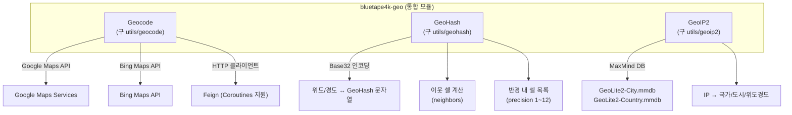
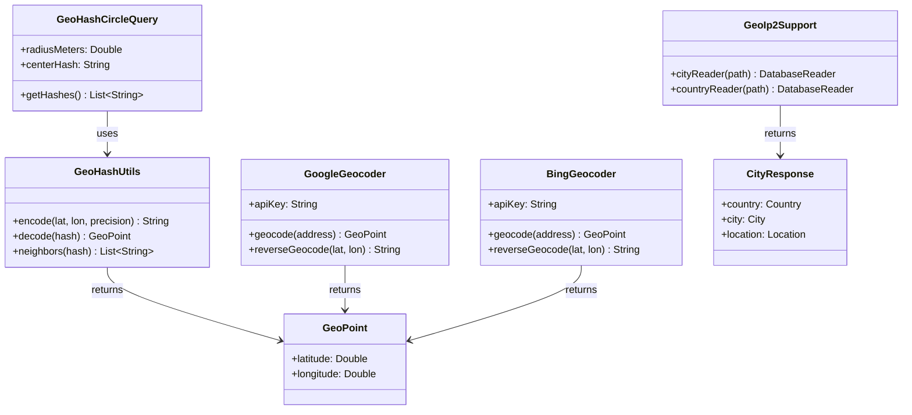

# Module bluetape4k-geo

지리 정보 처리를 위한 단일 통합 모듈입니다. Geocode, GeoHash, GeoIP2 기능을 제공합니다.

> 구 `utils/geocode`, `utils/geohash`, `utils/geoip2` 모듈이 이 모듈로 통합되었습니다.

## 제공 기능

### Geocode (구 `utils/geocode`)
- Google Maps Services 기반 주소 ↔ 좌표 변환
- Bing Maps API 연동 지원
- Feign HTTP 클라이언트 기반 비동기 요청
- Coroutines 확장 (선택적)

### GeoHash
- 위도/경도 좌표를 Base32 문자열로 인코딩
- GeoHash 디코딩 및 이웃 셀 계산
- 반경 내 GeoHash 목록 생성
- 정밀도 제어 (1~12자리)

### GeoIP2 (구 `utils/geoip2`)
- MaxMind GeoIP2 데이터베이스 기반 IP → 지리 정보 변환
- City, Country, ASN 조회 지원
- Coroutines 확장 (선택적)

## 아키텍처 다이어그램



## 설치

각 기능은 `compileOnly`로 선언되어 있으므로, 사용할 라이브러리를 런타임 의존성으로 추가해야 합니다.

```kotlin
dependencies {
    implementation("io.github.bluetape4k:bluetape4k-geo:${bluetape4kVersion}")

    // Geocode (Google Maps) 사용 시
    implementation("com.google.maps:google-maps-services:2.2.0")
    implementation(Libs.feign_core)
    implementation(Libs.feign_kotlin)
    implementation(Libs.feign_jackson)

    // GeoIP2 사용 시
    implementation("com.maxmind.geoip2:geoip2:5.0.2")
}
```

## 사용 예시

### GeoHash 인코딩/디코딩

```kotlin
import io.bluetape4k.geo.geohash.GeoHash

// 좌표 → GeoHash (12자리 최대 정밀도)
val hash = GeoHash.encode(latitude = 37.5665, longitude = 126.9780, precision = 9)
// 예: "wydm9mufd"

// GeoHash → 좌표
val point = GeoHash.decode("wydm9mufd")
println("lat=${point.latitude}, lon=${point.longitude}")

// 이웃 GeoHash
val neighbors = GeoHash.neighbors("wydm9mufd")
```

`GeoHashCircleQuery` 제약:
- 반경(`radius`)은 meter 단위이며 0 이상이어야 합니다.
- 음수 반경은 `IllegalArgumentException`으로 즉시 거부됩니다.

### Geocode (Google Maps)

```kotlin
import io.bluetape4k.geo.geocode.google.GoogleGeocoder

val geocoder = GoogleGeocoder(apiKey = "YOUR_API_KEY")

// 주소 → 좌표
val result = geocoder.geocode("서울특별시 중구 세종대로 110")
println("lat=${result.latitude}, lon=${result.longitude}")

// 좌표 → 주소 (역지오코딩)
val address = geocoder.reverseGeocode(latitude = 37.5665, longitude = 126.9780)
```

### GeoIP2

```kotlin
import io.bluetape4k.geo.geoip2.GeoIp2Support
import java.net.InetAddress

// MaxMind GeoIP2 데이터베이스 경로 지정
val reader = GeoIp2Support.cityReader("/path/to/GeoLite2-City.mmdb")

val cityResponse = reader.city(InetAddress.getByName("8.8.8.8"))
println("국가: ${cityResponse.country.name}")
println("도시: ${cityResponse.city.name}")
println("위도: ${cityResponse.location.latitude}")
println("경도: ${cityResponse.location.longitude}")
```

## 클래스 다이어그램


