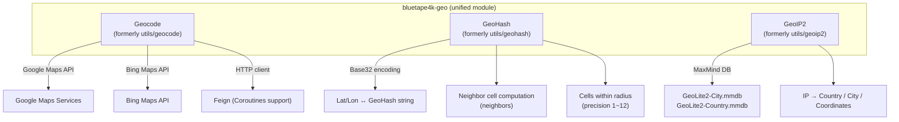
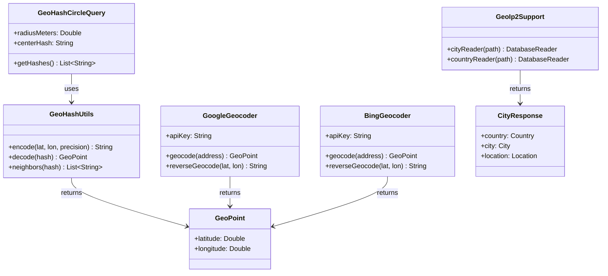
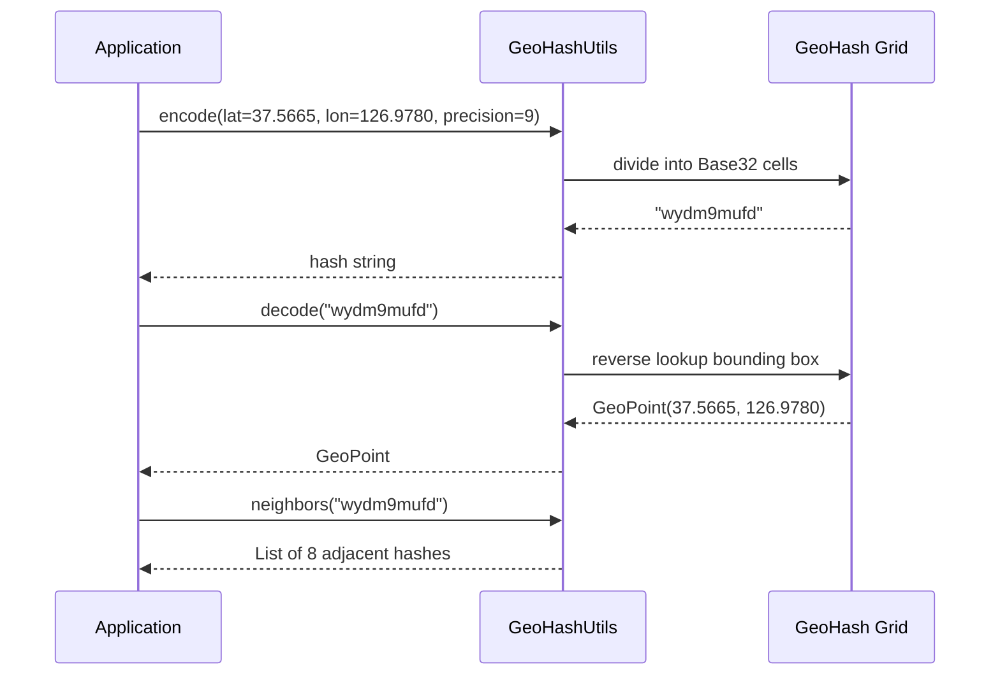

# Module bluetape4k-geo

English | [한국어](./README.ko.md)

A unified module for geographic information processing. Provides Geocode, GeoHash, and GeoIP2 functionality.

> The former `utils/geocode`, `utils/geohash`, and `utils/geoip2` modules have been consolidated into this single module.

## Architecture

### Module Overview



### Class Diagram



### GeoHash Encoding/Decoding Flow



## Key Features

### Geocode (formerly `utils/geocode`)

- Address ↔ coordinate conversion via Google Maps Services
- Bing Maps API integration support
- Asynchronous requests via Feign HTTP client
- Coroutines extension (optional)

### GeoHash

- Encode latitude/longitude coordinates as Base32 strings
- GeoHash decoding and neighbor cell computation
- Generate a list of GeoHashes within a given radius
- Precision control (1–12 characters)

### GeoIP2 (formerly `utils/geoip2`)

- IP → geographic information lookup using the MaxMind GeoIP2 database
- City, Country, and ASN queries
- Coroutines extension (optional)

## Usage Examples

### GeoHash Encoding/Decoding

```kotlin
import io.bluetape4k.geo.geohash.GeoHash

// Coordinates → GeoHash (precision 9)
val hash = GeoHash.encode(latitude = 37.5665, longitude = 126.9780, precision = 9)
// e.g. "wydm9mufd"

// GeoHash → coordinates
val point = GeoHash.decode("wydm9mufd")
println("lat=${point.latitude}, lon=${point.longitude}")

// Neighbor GeoHashes
val neighbors = GeoHash.neighbors("wydm9mufd")
```

`GeoHashCircleQuery` constraints:
- `radius` is in meters and must be non-negative.
- A negative radius is immediately rejected with `IllegalArgumentException`.

### Geocode (Google Maps)

```kotlin
import io.bluetape4k.geo.geocode.google.GoogleGeocoder

val geocoder = GoogleGeocoder(apiKey = "YOUR_API_KEY")

// Address → coordinates
val result = geocoder.geocode("Seoul City Hall, Jung-gu, Seoul")
println("lat=${result.latitude}, lon=${result.longitude}")

// Coordinates → address (reverse geocoding)
val address = geocoder.reverseGeocode(latitude = 37.5665, longitude = 126.9780)
```

### GeoIP2

```kotlin
import io.bluetape4k.geo.geoip2.GeoIp2Support
import java.net.InetAddress

// Specify the path to the MaxMind GeoIP2 database
val reader = GeoIp2Support.cityReader("/path/to/GeoLite2-City.mmdb")

val cityResponse = reader.city(InetAddress.getByName("8.8.8.8"))
println("Country: ${cityResponse.country.name}")
println("City: ${cityResponse.city.name}")
println("Latitude: ${cityResponse.location.latitude}")
println("Longitude: ${cityResponse.location.longitude}")
```

## Installation

Each feature is declared as `compileOnly`, so you need to add the relevant libraries as runtime dependencies.

```kotlin
dependencies {
    implementation("io.github.bluetape4k:bluetape4k-geo:${bluetape4kVersion}")

    // For Geocode (Google Maps)
    implementation("com.google.maps:google-maps-services:2.2.0")
    implementation(Libs.feign_core)
    implementation(Libs.feign_kotlin)
    implementation(Libs.feign_jackson)

    // For GeoIP2
    implementation("com.maxmind.geoip2:geoip2:5.0.2")
}
```
