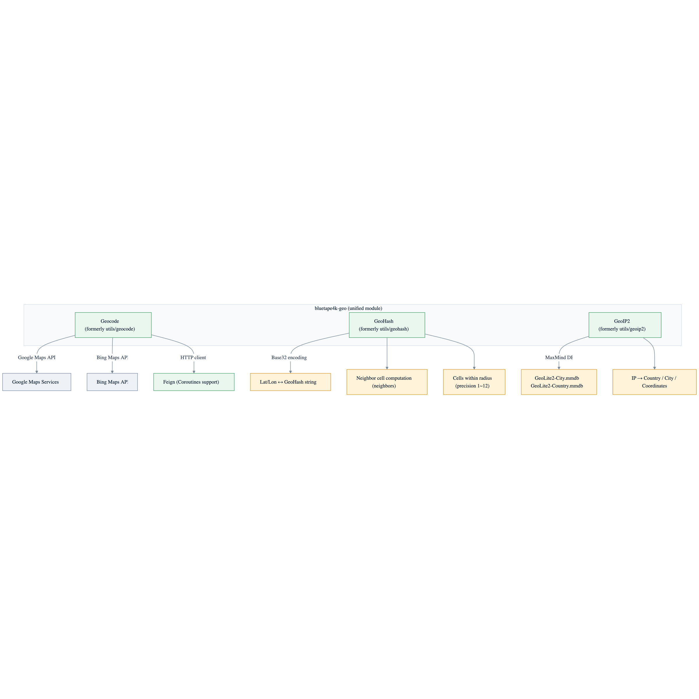
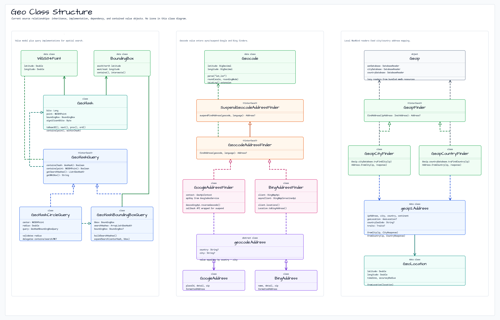
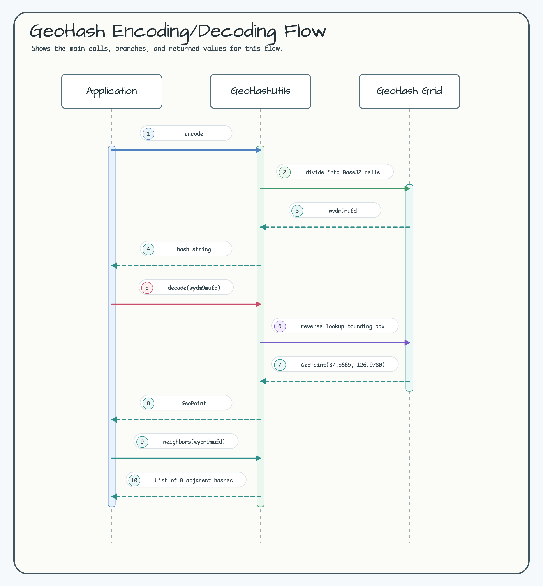

# Module bluetape4k-geo

English | [한국어](./README.ko.md)

A unified module for geographic information processing. Provides Geocode, GeoHash, and GeoIP2 functionality.

> The former `utils/geocode`, `utils/geohash`, and
`utils/geoip2` modules have been consolidated into this single module.

## Architecture

### Module Overview



### Class Diagram



### GeoHash Encoding/Decoding Flow



## Key Features

### Geocode (formerly `utils/geocode`)

- Address ↔ coordinate conversion via Google Maps Services
- Bing Maps API integration support
- Asynchronous requests via Feign HTTP client
- Coroutines extension (optional)

### GeoHash

- Encode latitude/longitude coordinates as Base32 strings
- GeoHash decoding and neighbor cell computation
- Generate a list of GeoHashes within a given radius
- Precision control (1–12 characters)

### GeoIP2 (formerly `utils/geoip2`)

- IP → geographic information lookup using the MaxMind GeoIP2 database
- City, Country, and ASN queries
- Coroutines extension (optional)

## Usage Examples

### GeoHash Encoding/Decoding

```kotlin
import io.bluetape4k.geohash.geoHashOfString
import io.bluetape4k.geohash.geoHashWithCharacters
import io.bluetape4k.geohash.getAdjacent

// Coordinates → GeoHash (precision 9)
val hash = geoHashWithCharacters(latitude = 37.5665, longitude = 126.9780, numberOfChars = 9)
val base32 = hash.toBase32()
// e.g. "wydm9mufd"

// GeoHash → coordinates
val point = geoHashOfString(base32).originatingPoint
println("lat=${point.latitude}, lon=${point.longitude}")

// Neighbor GeoHashes
val neighbors = hash.getAdjacent().map { it.toBase32() }
```

`GeoHashCircleQuery` constraints:

- `radius` is in meters and must be non-negative.
- A negative radius is immediately rejected with `IllegalArgumentException`.

### Geocode (Google Maps)

Provide Google/Bing Geocode API keys through environment variables instead of resource files.

```bash
export GOOGLE_GEOCODE_API_KEY="YOUR_GOOGLE_API_KEY"
export BING_GEOCODE_API_KEY="YOUR_BING_API_KEY"
```

```kotlin
import io.bluetape4k.geocode.Geocode
import io.bluetape4k.geocode.google.GoogleAddressFinder

val finder = GoogleAddressFinder(apiKey = System.getenv("GOOGLE_GEOCODE_API_KEY"))

// Coordinates → address (reverse geocoding)
val address = finder.findAddress(Geocode(37.5665, 126.9780), language = "en")
println("country=${address?.country}, city=${address?.city}")
```

### GeoIP2

```kotlin
import io.bluetape4k.geoip2.Geoip
import io.bluetape4k.geoip2.tryFindCity
import java.net.InetAddress

// Place GeoLite2-City.mmdb on the application classpath.
val ipAddress = InetAddress.getByName("8.8.8.8")
val cityResponse = Geoip.cityDatabase.tryFindCity(ipAddress).getOrNull()

println("Country: ${cityResponse?.country()?.name()}")
println("City: ${cityResponse?.city()?.name()}")
println("Latitude: ${cityResponse?.location()?.latitude()}")
println("Longitude: ${cityResponse?.location()?.longitude()}")
```

## Installation

Each feature is declared as `compileOnly`, so you need to add the relevant libraries as runtime dependencies.

```kotlin
dependencies {
    implementation("io.github.bluetape4k:bluetape4k-geo:${bluetape4kVersion}")

    // For Geocode (Google Maps)
    implementation("io.github.bluetape4k:bluetape4k-feign:${bluetape4kVersion}")
    implementation("io.github.bluetape4k:bluetape4k-jackson3:${bluetape4kVersion}")
    implementation("io.github.bluetape4k:bluetape4k-resilience4j:${bluetape4kVersion}")
    implementation("com.google.maps:google-maps-services:2.2.0")
    implementation("io.github.openfeign:feign-core:13.13")
    implementation("io.github.openfeign:feign-kotlin:13.13")
    implementation("io.github.openfeign:feign-slf4j:13.13")
    implementation("io.github.openfeign:feign-jackson:13.13")
    implementation("org.apache.httpcomponents.client5:httpclient5:5.6.3")
    implementation("org.apache.httpcomponents.client5:httpclient5-cache:5.6.3")

    // For GeoIP2
    implementation("com.maxmind.geoip2:geoip2:5.0.2")
}
```
