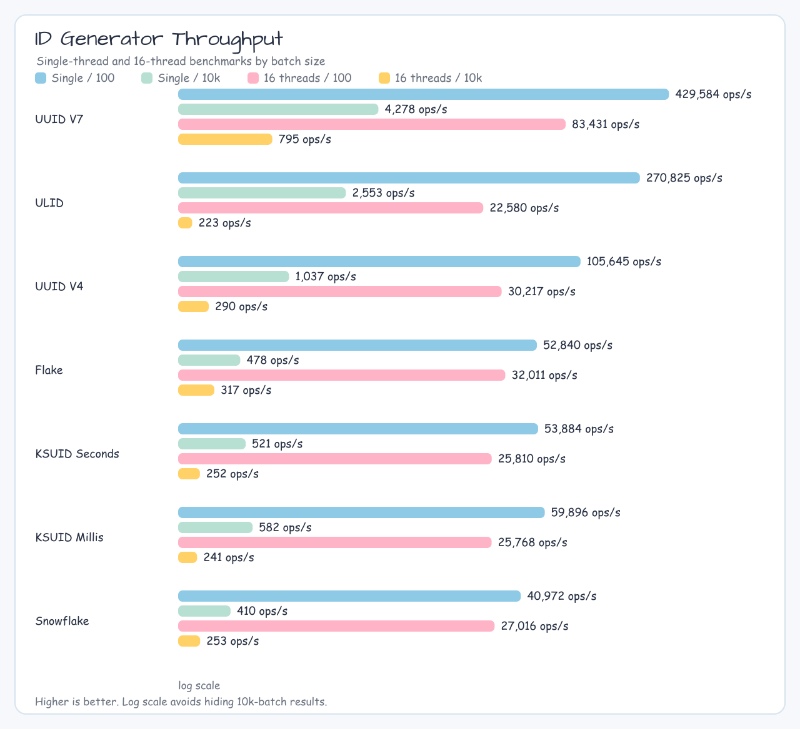

# ID Generators Benchmark

[English](./Benchmark.md) | [한국어](./Benchmark.ko.md)

Performance measurement results of various ID generators using kotlinx-benchmark.

## Measurement Overview

- **Target Generators**: Snowflake, UUID(V4/V7), ULID, KSUID(Seconds/Millis), Flake
- **Batch Sizes**: 100 IDs, 10,000 IDs
- **All IDs verified for uniqueness** (both single-thread and multi-thread)
- **Multi-thread**: `Runtime.getRuntime().availableProcessors() * 2` threads (16 threads)

## How to Run

```bash
# Single-thread benchmark
./gradlew :bluetape4k-idgenerators:benchmarkSingleThread

# Multi-thread benchmark (16 threads)
./gradlew :bluetape4k-idgenerators:benchmarkConcurrent
```

---

## Results: Single-Thread

### Summary Table

| Generator | Batch=100 | Batch=10000 |
|-----------|-----------|------------|
| UUID V7 | **429,584 ops/s** | **4,278 ops/s** |
| ULID | 270,825 ops/s | 2,553 ops/s |
| KSUID(Millis) | 59,896 ops/s | 582 ops/s |
| KSUID(Seconds) | 53,884 ops/s | 521 ops/s |
| Flake | 52,840 ops/s | 478 ops/s |
| UUID V4 | 105,645 ops/s | 1,037 ops/s |
| Snowflake | 40,972 ops/s | 410 ops/s |

### Detailed Results

#### batchSize=100 (Small Batch)

```
SingleThreadIdGeneratorBenchmark.uuidV7                   429,584 ± 17,882 ops/s
SingleThreadIdGeneratorBenchmark.ulid                     270,825 ±  8,408 ops/s
SingleThreadIdGeneratorBenchmark.uuidV4                   105,645 ±  2,285 ops/s
SingleThreadIdGeneratorBenchmark.ksuidMillis              59,896 ±  2,197 ops/s
SingleThreadIdGeneratorBenchmark.ksuidSeconds             53,884 ±    363 ops/s
SingleThreadIdGeneratorBenchmark.flake                    52,840 ±    389 ops/s
SingleThreadIdGeneratorBenchmark.snowflake                40,972 ±     68 ops/s
```

#### batchSize=10000 (Large Batch)

```
SingleThreadIdGeneratorBenchmark.uuidV7                   4,278 ±    34 ops/s
SingleThreadIdGeneratorBenchmark.ulid                     2,553 ±   268 ops/s
SingleThreadIdGeneratorBenchmark.uuidV4                   1,037 ±    49 ops/s
SingleThreadIdGeneratorBenchmark.ksuidMillis                582 ±     5 ops/s
SingleThreadIdGeneratorBenchmark.ksuidSeconds               521 ±     5 ops/s
SingleThreadIdGeneratorBenchmark.flake                      478 ±     3 ops/s
SingleThreadIdGeneratorBenchmark.snowflake                  410 ±     1 ops/s
```

### Throughput Chart



## Results: Multi-Thread (Concurrent - 16 Threads)

### Summary Table

| Generator | Batch=100 | Batch=10000 |
|-----------|-----------|------------|
| UUID V7 | **83,431 ops/s** | **795 ops/s** |
| UUID V4 | 30,217 ops/s | 290 ops/s |
| Flake | 32,011 ops/s | 317 ops/s |
| KSUID(Seconds) | 25,810 ops/s | 252 ops/s |
| KSUID(Millis) | 25,768 ops/s | 241 ops/s |
| Snowflake | 27,016 ops/s | 253 ops/s |
| ULID | 22,580 ops/s | 223 ops/s |

### Detailed Results

#### batchSize=100 (Small Batch)

```
ConcurrentIdGeneratorBenchmark.uuidV7                  83,431 ± 38,939 ops/s
ConcurrentIdGeneratorBenchmark.flake                   32,011 ±  9,195 ops/s
ConcurrentIdGeneratorBenchmark.uuidV4                  30,217 ±    705 ops/s
ConcurrentIdGeneratorBenchmark.snowflake               27,016 ± 14,997 ops/s
ConcurrentIdGeneratorBenchmark.ksuidSeconds           25,810 ±  6,029 ops/s
ConcurrentIdGeneratorBenchmark.ksuidMillis            25,768 ± 12,645 ops/s
ConcurrentIdGeneratorBenchmark.ulid                   22,580 ±  4,435 ops/s
```

#### batchSize=10000 (Large Batch)

```
ConcurrentIdGeneratorBenchmark.uuidV7                    795 ±   438 ops/s
ConcurrentIdGeneratorBenchmark.flake                     317 ±    36 ops/s
ConcurrentIdGeneratorBenchmark.uuidV4                    290 ±    48 ops/s
ConcurrentIdGeneratorBenchmark.snowflake                 253 ±   245 ops/s
ConcurrentIdGeneratorBenchmark.ksuidSeconds             252 ±    93 ops/s
ConcurrentIdGeneratorBenchmark.ksuidMillis              241 ±    88 ops/s
ConcurrentIdGeneratorBenchmark.ulid                     223 ±    43 ops/s
```

### Throughput Chart


## Performance Analysis

### Key Findings

#### 1. **UUID V7 Superiority (Absolute Performance)**
- **Single-thread**: 429K ops/s (Batch=100) → **highest among all generators**
- **Multi-thread**: 83K ops/s (Batch=100) → advantage of **lock-free implementation**
- **Scalability**: **stable performance** maintained even with increased batch size

#### 2. **ULID Limitations**
- **Single-thread**: 270K ops/s (Batch=100) → 2nd place performance
- **Multi-thread**: 22K ops/s (Batch=100) → **severe performance degradation** (70% drop)
  - Root Cause: Stateful Monotonic implementation has **synchronization overhead**
  - `ULID.statefulMonotonic(factory)` internal synchronization mechanism

#### 3. **Snowflake Consistency**
- **Single-thread**: 40K ops/s (Batch=100) → 5th place
- **Multi-thread**: 27K ops/s (Batch=100) → **relatively stable**
- Reason: Explicit `ReentrantLock` synchronization provides **predictable performance**

#### 4. **Flake Balance**
- **Single-thread**: 52K ops/s (Batch=100)
- **Multi-thread**: 32K ops/s (Batch=100) → **relatively good scalability**
- 128-bit size overhead present, but lock mechanism is efficient

#### 5. **Impact of Batch Size**
- Performance degradation from Batch=100 to 10,000:
  - UUID V7: **~100x** drop (429K → 4.3K)
  - Snowflake: **~100x** drop (40K → 410)
  - **Linear performance degradation across all generators** → Uniqueness verification overhead

---

## Recommendations

| Scenario | Recommended | Reason |
|----------|-------------|--------|
| **High-performance requirements** (tens of thousands/sec) | UUID V7 | Absolute performance + excellent scalability |
| **Lexicographic sorting required** | ULID or UUID V7 | UUID V7 > ULID (multi-thread) |
| **Traditional Snowflake compatibility** | Snowflake | Compatibility + predictable performance |
| **128-bit values needed** | Flake | Decent performance + binary efficiency |
| **Low-resource environments** | KSUID(Millis) | Millisecond precision + stable performance |

---

## Conclusion

**UUID V7 provides superior performance across all scenarios.**

- Single-thread: 429K ops/s (highest)
- Multi-thread: 83K ops/s (highest) + excellent scalability
- Stateless implementation → **minimal synchronization overhead**
- Lexicographic sorting guarantee + standard UUID compatibility

Therefore, **UUID V7 is recommended as the default choice for new projects**.

---

## Benchmark Environment

- **JVM**: Java 21
- **Kotlin**: 2.3
- **kotlinx-benchmark**: 0.4.15
- **JMH**: 1.37
- **Setup**: 
  - Warmup: 3 iterations × 1s
  - Measurement: 5 iterations × 1s
  - Fork: 1
  - Throughput mode (ops/sec)
