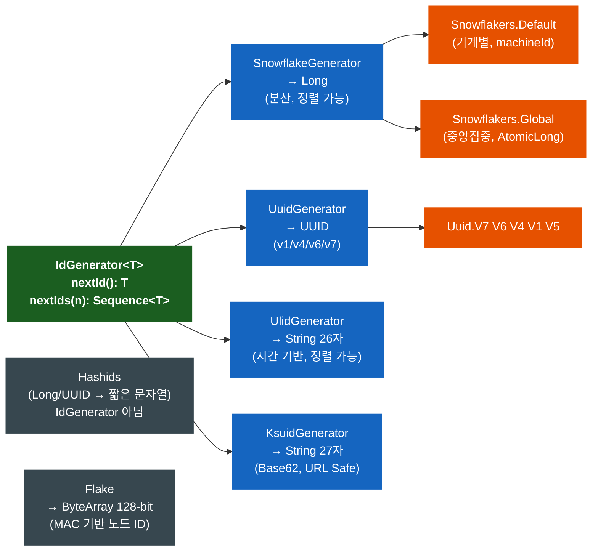
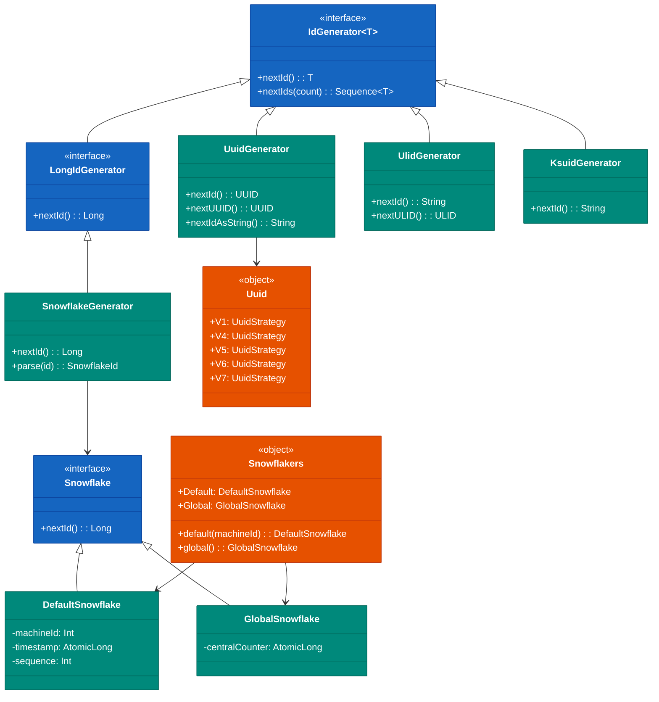
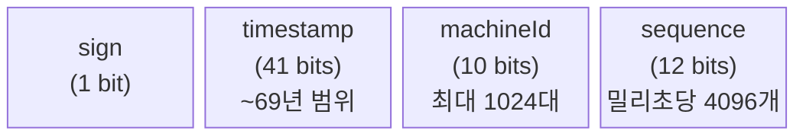
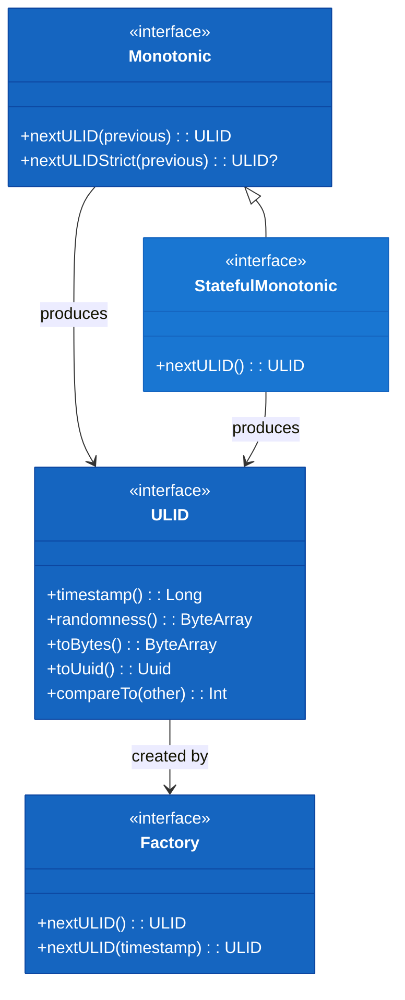
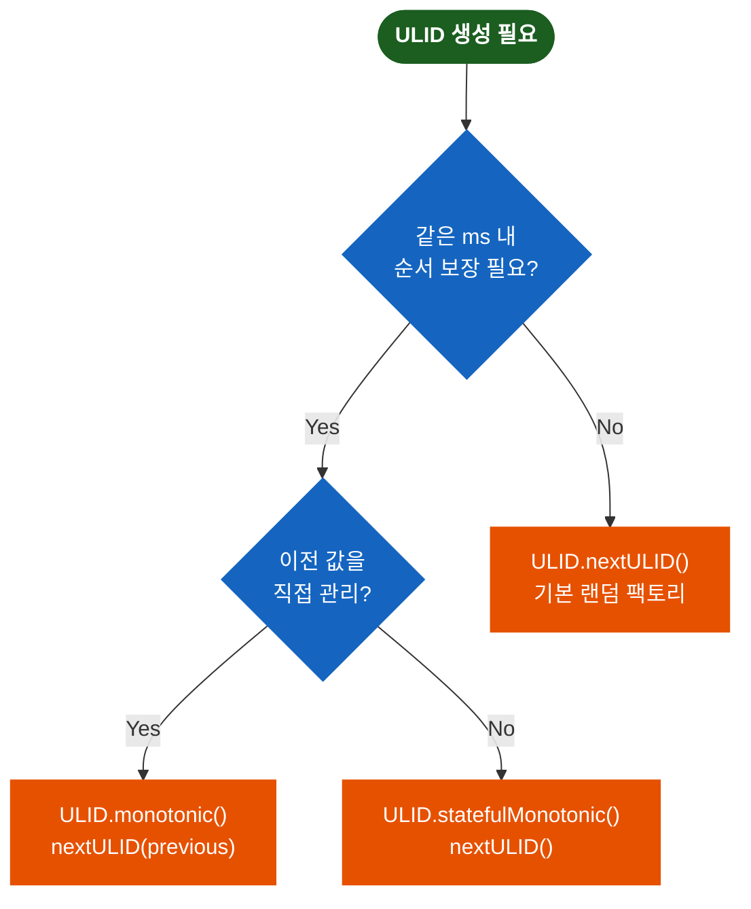

# bluetape4k-idgenerators

[English](./README.md) | 한국어

분산 환경에서 Unique ID를 다양한 알고리즘으로 생성합니다. UUID(V1~V7), ULID, KSUID, Snowflake, Flake, Hashids를 통일된
`IdGenerator<T>` 인터페이스로 제공합니다.

## 알고리즘 선택 가이드

요구사항에 맞는 알고리즘을 선택하세요:

| 요구사항              | 추천 알고리즘                                |
|-------------------|----------------------------------------|
| 분산 환경, 기계별 구분     | Snowflake (`Snowflakers.Default`)      |
| 중앙집중식 ID 서비스      | GlobalSnowflake (`Snowflakers.Global`) |
| DB 기본키, 정렬 필요     | UUID v7 (`Uuid.V7`)                    |
| 완전 랜덤, 보안         | UUID v4 (`Uuid.V4`)                    |
| 단조 증가, 문자열 ID     | ULID (`UlidGenerator`)                 |
| URL Safe, 초 정밀도   | KSUID Seconds (`Ksuid.Seconds`)        |
| URL Safe, 밀리초 정밀도 | KSUID Millis (`Ksuid.Millis`)          |
| 128bit, 높은 유일성    | Flake                                  |
| Short URL, 난독화    | Hashids                                |

## 아키텍처

### 전체 알고리즘 구조



### 클래스 다이어그램



### Snowflake 비트 구조



- **timestamp**: 41 bits, epoch 이후 약 69년간 유일성 보장
- **machineId**: 10 bits, 최대 1,024개 기계 지원 (0–1023)
- **sequence**: 12 bits, 밀리초당 최대 4,096개 ID 생성

### 알고리즘 비교

| 알고리즘                | 타입        | 길이     | 정렬 가능 | 특징                        |
|---------------------|-----------|--------|-------|---------------------------|
| **Snowflake**       | Long      | 19자리   | O     | Twitter 스타일, 분산 환경        |
| **GlobalSnowflake** | Long      | 19자리   | O     | 중앙집중식, 높은 처리량             |
| **UUID v7**         | UUID      | 36자리   | O     | Unix epoch + random (권장)  |
| **UUID v6**         | UUID      | 36자리   | O     | 재정렬 timestamp, DB PK 최적화  |
| **UUID v1**         | UUID      | 36자리   | O     | MAC + Gregorian timestamp |
| **UUID v4**         | UUID      | 36자리   | X     | 완전 랜덤 (SecureRandom)      |
| **ULID**            | String    | 26자리   | O     | Crockford Base32, 단조 증가   |
| **KSUID Seconds**   | String    | 27자리   | O     | 초 기반, Base62              |
| **KSUID Millis**    | String    | 27자리   | O     | 밀리초 기반, Base62            |
| **Flake**           | ByteArray | 128bit | O     | Boundary 스타일              |
| **Hashids**         | String    | 가변     | X     | Long/UUID → 짧은 문자열        |

## 사용 예시

### Snowflake (Twitter 스타일)

```kotlin
// Snowflakers 싱글턴 직접 사용
val id1: Long = Snowflakers.Default.nextId()
val id2: Long = Snowflakers.Global.nextId()

// 팩토리 함수로 새 인스턴스 생성
val snowflake = Snowflakers.default(machineId = 5)

// SnowflakeGenerator 어댑터 (IdGenerator<Long>)
val gen = SnowflakeGenerator()
val id3: Long = gen.nextId()
val parsed = gen.parse(id3)
```

### UUID (통합 API)

```kotlin
// UUID v7 (권장 — Unix epoch + random, DB PK 최적)
val id: UUID = Uuid.V7.nextId()
val base62: String = Uuid.V7.nextBase62()   // 22자리 URL-safe Base62

// UUID v6 (재정렬 timestamp, DB 정렬 최적화)
val id6: UUID = Uuid.V6.nextId()

// UUID v4 (완전 랜덤)
val id4: UUID = Uuid.V4.nextId()

// UUID v5 (SHA-1 name 기반)
val id5: UUID = Uuid.V5.nextId()

// 복수 생성
val ids: Sequence<UUID> = Uuid.V7.nextUUIDs(10)

// 결정론적 UUID (동일 name → 항상 동일 UUID)
val gen = Uuid.namebased("my-service-namespace")
val id = gen.nextId()

// UuidGenerator 어댑터
val uuidGen = UuidGenerator()  // 기본: V7
val idString: String = uuidGen.nextIdAsString()  // Base62
```

### ULID (Universally Unique Lexicographically Sortable Identifier)

```
 01ARZ3NDEKTSV4RRFFQ69G5FAV
 |------------|------------|
  Timestamp    Randomness
   48bits       80bits
```



```kotlin
// 랜덤 ULID 생성
val ulidString: String = ULID.randomULID()
val ulid: ULID = ULID.nextULID()

// 단조 증가 (같은 밀리초 내 순서 보장)
val monotonic = ULID.monotonic()
var previous = ULID.nextULID()
repeat(1000) {
    val next = monotonic.nextULID(previous)
    check(next > previous)
    previous = next
}

// 상태 보존 단조 증가 (이전 값을 내부 관리)
val stateful = ULID.statefulMonotonic()
val a = stateful.nextULID()
val b = stateful.nextULID()
check(a < b)
```

**생성기 선택 가이드:**



### KSUID (K-Sortable Unique ID)

```kotlin
// 초 기반 (27자리, Base62)
val id: String = Ksuid.Seconds.generate()   // 예: "0ujtsYcgvSTl8PAuAdqWYSMnLOv"
val ids: Sequence<String> = Ksuid.Seconds.nextIds(10)

// 밀리초 기반
val idMs: String = Ksuid.Millis.generate()

// Generator 어댑터
val gen = KsuidGenerator()
val id2: String = gen.nextId()
```

### Flake (Boundary 스타일 128bit)

```kotlin
val flake = Flake()
val id: ByteArray = flake.nextId()
val idString: String = flake.nextIdAsString()    // Base62
val hexString = Flake.asHexString(id)            // Hex 문자열
val components = Flake.asComponentString(id)     // "timestamp-nodeId-sequence"
```

### Hashids (Short URL 인코딩)

```kotlin
val hashids = Hashids(salt = "my secret salt")

// Long 인코딩/디코딩
val encoded = hashids.encode(123456789L)
val decoded = hashids.decode(encoded)  // longArrayOf(123456789)

// UUID 인코딩/디코딩
val uuid = UUID.randomUUID()
val encodedUuid = hashids.encodeUUID(uuid)
val decodedUuid = hashids.decodeUUID(encodedUuid)

// 커스텀 설정
val hashids2 = Hashids(salt = "my salt", minHashLength = 10, customAlphabet = "0123456789abcdef")
```

### Base62 UUID 인코딩

```kotlin
val uuid = UUID.randomUUID()
val encoded = uuid.toBase62String()   // 36자리 → 22자리
val decoded = encoded.toBase62Uuid()
```

## 성능 벤치마크

모든 ID 생성기의 상세한 성능 측정 결과는 [Benchmark.ko.md](./Benchmark.ko.md)를 참고하세요. 단일 스레드 vs 멀티 스레드 비교 및 사용 사례별 추천사항이 포함되어 있습니다.

## 참고 자료

- [Twitter Snowflake](https://developer.twitter.com/en/docs/basics/twitter-ids)
- [A brief history of the UUID](https://segment.com/blog/a-brief-history-of-the-uuid/)
- [ULID](https://github.com/ulid/spec)
- [KSUID](https://github.com/ksuid/ksuid)
- [Boundary Flake](https://github.com/boundary/flake)
- [Hashids](https://hashids.org)
- [Java UUID Generator](https://github.com/cowtowncoder/java-uuid-generator)

## 의존성

```kotlin
dependencies {
    implementation("io.github.bluetape4k:bluetape4k-idgenerators:${version}")
}
```
