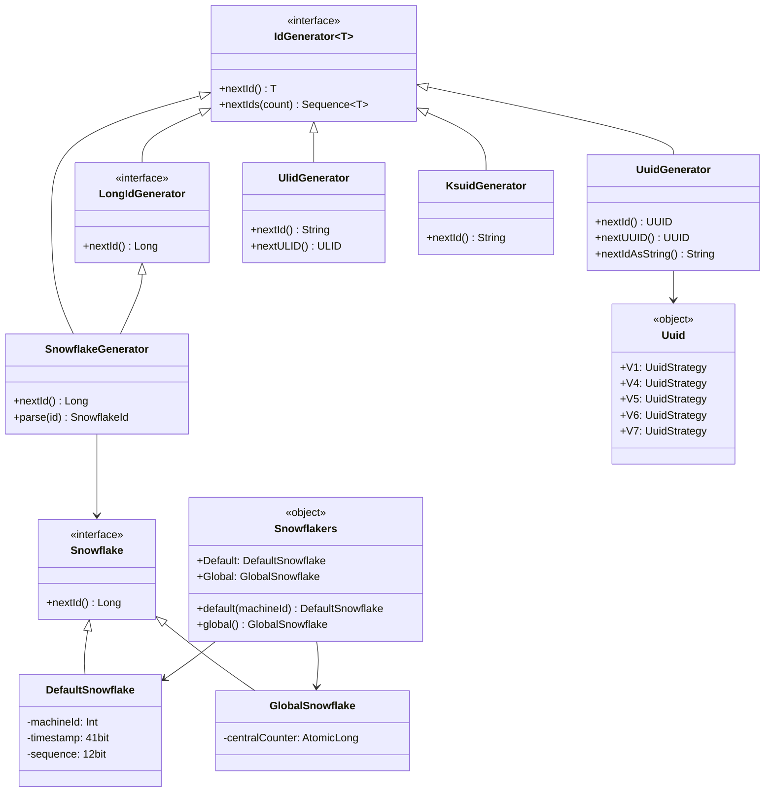
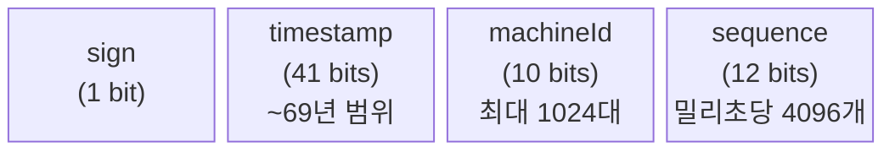

# Module bluetape4k-idgenerators

## 개요

분산 환경에서 Unique한 ID 값을 다양한 방식으로 생성하는 라이브러리입니다. UUID(V1~V7), ULID, KSUID, Snowflake, Flake, Hashids 등 다양한 ID 생성 알고리즘을 통일된 API(`Uuid`, `ULID`, `Ksuid`, `Snowflakers`)로 제공합니다.

## 의존성 추가

```kotlin
dependencies {
    implementation("io.github.bluetape4k:bluetape4k-idgenerators:${version}")
}
```

## 주요 기능

| 알고리즘                | 타입        | 길이     | 정렬 가능 | 특징                 |
|---------------------|-----------|--------|-------|--------------------|
| **Snowflake**       | Long      | 19자리   | O     | Twitter 스타일, 분산 환경 |
| **GlobalSnowflake** | Long      | 19자리   | O     | 중앙집중식, 높은 처리량      |
| **UUID v7**         | UUID      | 36자리   | O     | Unix epoch timestamp + random (권장) |
| **UUID v6**         | UUID      | 36자리   | O     | 재정렬 timestamp, DB PK 최적화        |
| **UUID v1**         | UUID      | 36자리   | O     | MAC + Gregorian timestamp           |
| **UUID v4**         | UUID      | 36자리   | X     | 완전 랜덤 (SecureRandom)             |
| **ULID**            | String    | 26자리   | O     | Crockford Base32, 단조 증가 보장      |
| **KSUID Seconds**   | String    | 27자리   | O     | 초 기반, Base62                      |
| **KSUID Millis**    | String    | 27자리   | O     | 밀리초 기반, Base62                   |
| **Flake**           | ByteArray | 128bit | O     | Boundary 스타일       |
| **Hashids**         | String    | 가변     | X     | Long/UUID → 문자열    |

## 사용 예시

### Snowflake (Twitter 스타일)

분산 환경에서 기계별로 고유한 ID 생성

```kotlin
import io.bluetape4k.idgenerators.snowflake.*

// Snowflakers 싱글턴 직접 사용
val id1: Long = Snowflakers.Default.nextId()
val id2: Long = Snowflakers.Global.nextId()

// 팩토리 함수로 새 인스턴스 생성
val snowflake = Snowflakers.default(machineId = 5)
val globalSnowflake = Snowflakers.global()

// SnowflakeGenerator 어댑터 (IdGenerator<Long> 인터페이스)
val gen = SnowflakeGenerator()                     // 기본: DefaultSnowflake
val genGlobal = SnowflakeGenerator(Snowflakers.Global) // GlobalSnowflake 사용
val id3: Long = gen.nextId()
val parsed = gen.parse(id3)
```

### UUID (통합 API)

UUID v1~v7을 `Uuid` object의 통일된 인터페이스로 제공합니다.

#### 기본 사용 (권장)

```kotlin
import io.bluetape4k.idgenerators.uuid.Uuid

// UUID v7 (권장 — Unix epoch + random, DB PK 최적)
val id: UUID = Uuid.V7.nextId()
val base62: String = Uuid.V7.nextBase62()   // 22자리 URL-safe Base62

// UUID v6 (재정렬 timestamp, DB 정렬 최적화)
val id6: UUID = Uuid.V6.nextId()

// UUID v1 (MAC + Gregorian timestamp)
val id1: UUID = Uuid.V1.nextId()

// UUID v4 (완전 랜덤)
val id4: UUID = Uuid.V4.nextId()

// UUID v5 (name-based SHA-1, 비결정론적)
val id5: UUID = Uuid.V5.nextId()
```

#### 복수 생성

```kotlin
val ids: Sequence<UUID> = Uuid.V7.nextUUIDs(10)
val base62s: Sequence<String> = Uuid.V7.nextBase62s(10)
```

#### 커스텀 Random

```kotlin
import java.security.SecureRandom

val gen = Uuid.random(SecureRandom())        // V4 with custom Random
val gen2 = Uuid.epochRandom(SecureRandom())  // V7 with custom Random
val id: UUID = gen.nextId()
```

#### 결정론적 UUID (name-based)

```kotlin
val gen = Uuid.namebased("my-service-namespace")
val id1: UUID = gen.nextId()
val id2: UUID = gen.nextId()
// id1 == id2 (동일 name → 항상 동일 UUID)
```

#### UuidGenerator 어댑터 (IdGenerator<UUID> 인터페이스)

```kotlin
val gen = UuidGenerator()              // 기본: V7
val gen2 = UuidGenerator(Uuid.V1)     // V1 전략 교체
val id: UUID = gen.nextUUID()
val idString: String = gen.nextIdAsString()  // Base62
```

### ULID (Universally Unique Lexicographically Sortable Identifier)

26자리 Crockford Base32, 단조 증가(monotonic) 보장

```kotlin
import io.bluetape4k.idgenerators.ulid.ULID
import io.bluetape4k.idgenerators.ulid.UlidGenerator

// 직접 생성
val ulid: ULID = ULID.nextULID()
val ulidStr: String = ULID.randomULID()  // 26자리 Crockford Base32

// UlidGenerator 어댑터 (IdGenerator<String>)
val gen = UlidGenerator()
val id: String = gen.nextId()          // 26자리 문자열
val ulsid: ULID = gen.nextULID()       // ULID 값 타입

// 단조 증가 보장 (같은 밀리초에도 오름차순)
val ids: List<String> = List(100) { gen.nextId() }
assert(ids == ids.sorted())

// 여러 개 생성
val strs: Sequence<String> = gen.nextIds(10)
```

### KSUID (K-Sortable Unique ID)

시간 기반 정렬 가능, URL Safe, Base62 인코딩 (27자리)

#### 초(seconds) 기반 — Ksuid.Seconds

```kotlin
import io.bluetape4k.idgenerators.ksuid.Ksuid

// KSUID 생성 (27자리)
val id: String = Ksuid.Seconds.generate()   // 예: "0ujtsYcgvSTl8PAuAdqWYSMnLOv"

// 특정 시각으로 생성
val atTime = Ksuid.Seconds.generate(Instant.now())
val atDate = Ksuid.Seconds.generate(Date())
val atDateTime = Ksuid.Seconds.generate(LocalDateTime.now())

// 여러 개 생성
val ids: Sequence<String> = Ksuid.Seconds.nextIds(10)

// 파싱
val pretty = Ksuid.Seconds.prettyString(id)
// Time = 2024-01-15T10:30:45Z[UTC]
// Timestamp = 1705315845
// Payload = a1b2c3d4e5f6...
```

#### 밀리초(milliseconds) 기반 — Ksuid.Millis

```kotlin
// 밀리초 정밀도의 타임스탬프 사용
val id: String = Ksuid.Millis.generate()
val atTime = Ksuid.Millis.generate(Instant.now())
```

#### KsuidGenerator 어댑터 (IdGenerator<String> 인터페이스)

```kotlin
val gen = KsuidGenerator()                   // 기본: Ksuid.Seconds
val genMillis = KsuidGenerator(Ksuid.Millis) // 밀리초 전략 교체
val id: String = gen.nextId()
val ids: Sequence<String> = gen.nextIds(10)
```

### Flake (Boundary 스타일)

128bit ID, MAC 주소 기반 노드 식별

```kotlin
import io.bluetape4k.idgenerators.flake.Flake

val flake = Flake()

// ByteArray로 생성 (16 bytes = 128 bits)
val id: ByteArray = flake.nextId()

// Base62 문자열로 생성
val idString: String = flake.nextIdAsString()  // 예: "AmknwjEj6DWnSOpkRM"

// Hex 문자열로 변환
val hexString = Flake.asHexString(id)  // 예: "0000019265902e57beab72881e400000"

// 컴포넌트 분해
val components = Flake.asComponentString(id)  // "timestamp-nodeId-sequence"
```

### Hashids (YouTube 스타일 Short URL)

숫자/UUID를 짧은 문자열로 인코딩

```kotlin
import io.bluetape4k.idgenerators.hashids.Hashids
import io.bluetape4k.idgenerators.hashids.encodeUUID
import io.bluetape4k.idgenerators.hashids.decodeUUID

// 기본 설정
val hashids = Hashids(salt = "my secret salt")

// Long 인코딩
val encoded = hashids.encode(123456789L)  // "abc123XYZ"

// 여러 Long 인코딩
val encoded2 = hashids.encode(1L, 2L, 3L)  // "xyz789"

// 음수 지원
val encoded3 = hashids.encode(1L, -1L)

// 큰 수 지원 (Long.MAX_VALUE)
val encoded4 = hashids.encode(Long.MAX_VALUE)

// 디코딩
val decoded = hashids.decode(encoded)  // longArrayOf(123456789)

// UUID 인코딩/디코딩
val uuid = UUID.randomUUID()
val encodedUuid = hashids.encodeUUID(uuid)
val decodedUuid = hashids.decodeUUID(encodedUuid)
// decodedUuid == uuid
```

### Hashids 커스텀 설정

```kotlin
import io.bluetape4k.idgenerators.hashids.Hashids

// 최소 길이 지정
val hashids = Hashids(
    salt = "my salt",
    minHashLength = 10,  // 최소 10자리
    customAlphabet = "0123456789abcdef"  // 16진수 알파벳
)

val encoded = hashids.encode(1234567L)  // "b332db5" (최소 10자리가 되도록 패딩)
```

### Base62 UUID 인코딩

```kotlin
import java.util.UUID

// UUID를 Base62로 인코딩 (36자리 → 22자리)
val uuid = UUID.randomUUID()
val encoded = uuid.toBase62String()  // "QLfDyyhZrm9uVtDzQcs4R"

// Base62를 UUID로 디코딩
val decoded = encoded.toBase62Uuid()  // 원본 UUID
```

## ID 생성기 선택 가이드

| 요구사항           | 추천 알고리즘         |
|----------------|-----------------|
| 분산 환경, 기계별 구분  | Snowflake (`Snowflakers.Default`) |
| 중앙집중식 ID 서비스   | GlobalSnowflake (`Snowflakers.Global`) |
| DB 기본키, 정렬 필요     | UUID v7 (`Uuid.V7`)     |
| 완전 랜덤, 보안         | UUID v4 (`Uuid.V4`)     |
| 단조 증가, 문자열 ID     | ULID (`UlidGenerator`)  |
| URL Safe, 초 정밀도    | KSUID Seconds (`Ksuid.Seconds`) |
| URL Safe, 밀리초 정밀도 | KSUID Millis (`Ksuid.Millis`)   |
| 128bit, 높은 유일성 | Flake           |
| Short URL, 난독화 | Hashids         |

## Snowflake 구조

```
| 1 bit |     41 bits      |   10 bits   |   12 bits   |
| sign  |    timestamp     |  machineId  |  sequence   |
|  0    | milliseconds since epoch |  0-1023   |   0-4095   |
```

- **timestamp**: 41 bits, 약 69년간 유일성 보장
- **machineId**: 10 bits, 최대 1024개 기계
- **sequence**: 12 bits, millisecond당 최대 4096개 ID

## 주요 기능 상세

| 파일                               | 설명                    |
|----------------------------------|-----------------------|
| `IdGenerator.kt`                 | ID 생성기 인터페이스          |
| `LongIdGenerator.kt`             | Long 타입 ID 생성기        |
| `snowflake/Snowflake.kt`         | Snowflake 인터페이스       |
| `snowflake/DefaultSnowflake.kt`  | Twitter 스타일 Snowflake |
| `snowflake/GlobalSnowflake.kt`   | 중앙집중식 Snowflake       |
| `snowflake/Snowflakers.kt`       | Snowflake 싱글턴 및 팩토리  |
| `snowflake/SnowflakeGenerator.kt`| Snowflake 어댑터 클래스    |
| `snowflake/SnowflakeSupport.kt`  | Snowflake 유틸리티        |
| `snowflake/SnowflakeId.kt`       | Snowflake ID 파싱 결과    |
| `uuid/Uuid.kt`                   | UUID 통합 생성기 (V1/V4/V5/V6/V7)    |
| `uuid/UuidGenerator.kt`          | UUID 어댑터 클래스                    |
| `uuid/TimebasedUuidGenerator.kt` | (deprecated) 시간 기반 UUID 생성기    |
| `uuid/RandomUuidGenerator.kt`    | (deprecated) 랜덤 UUID 생성기        |
| `uuid/NamebasedUuidGenerator.kt` | (deprecated) 이름 기반 UUID 생성기    |
| `ulid/ULID.kt`                   | ULID 인터페이스 및 싱글턴    |
| `ulid/UlidGenerator.kt`          | ULID 어댑터 클래스         |
| `ksuid/Ksuid.kt`                 | KSUID 통합 생성기 (Seconds/Millis)   |
| `ksuid/KsuidGenerator.kt`        | KSUID 어댑터 클래스                  |
| `ksuid/KsuidMillis.kt`           | (deprecated) 밀리초 KSUID — `Ksuid.Millis` 사용 권장 |
| `flake/Flake.kt`                 | Flake ID 생성기          |
| `hashids/Hashids.kt`             | Hashids 알고리즘          |
| `hashids/HashidsSupport.kt`      | Hashids 확장 함수         |
| `utils/node/NodeIdentifier.kt`   | 노드 식별자 인터페이스          |
| `MachineIdSupport.kt`            | 기계 ID 생성 유틸리티         |

## 클래스 다이어그램



## Snowflake ID 비트 구조



## 참고 자료

- [Twitter Snowflake](https://developer.twitter.com/en/docs/basics/twitter-ids)
- [A brief history of the UUID](https://segment.com/blog/a-brief-history-of-the-uuid/)
- [ULID](https://github.com/ulid/spec)
- [KSUID](https://github.com/ksuid/ksuid)
- [Boundary Flake](https://github.com/boundary/flake)
- [Hashids](https://hashids.org)
- [Java UUID Generator](https://github.com/cowtowncoder/java-uuid-generator)
