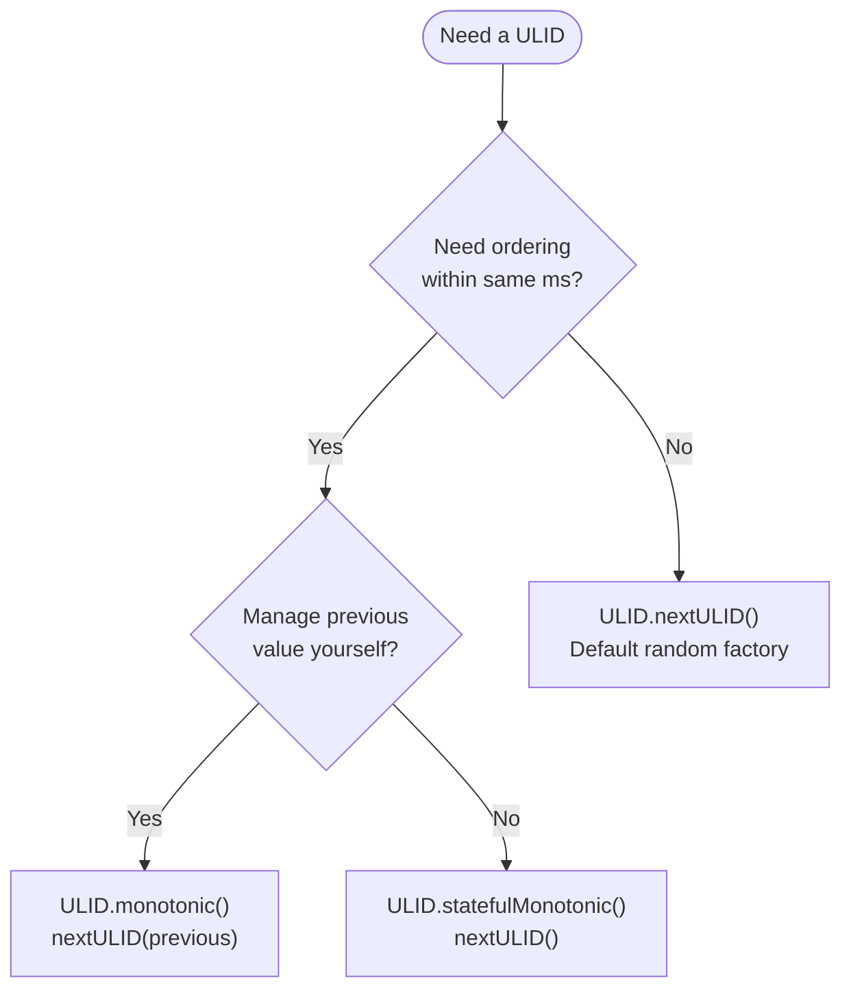
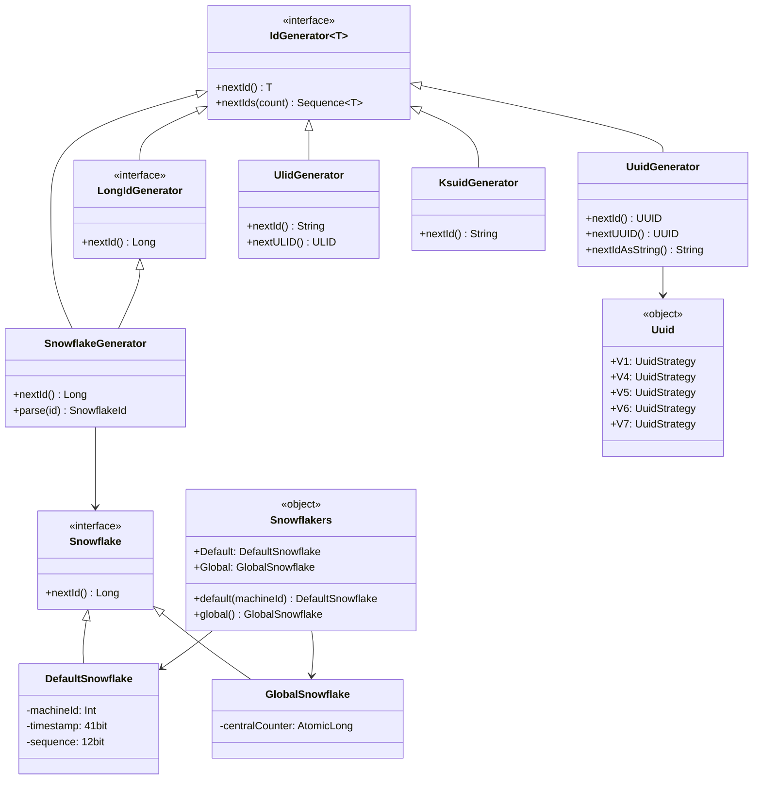

# Module bluetape4k-idgenerators

English | [한국어](./README.ko.md)

## Overview

A library for generating unique IDs in distributed environments using a variety of algorithms. It provides UUID (V1–V7), ULID, KSUID, Snowflake, Flake, and Hashids through a unified API (`Uuid`, `ULID`, `Ksuid`, `Snowflakers`).

## Dependency

```kotlin
dependencies {
    implementation("io.github.bluetape4k:bluetape4k-idgenerators:${version}")
}
```

## Supported Algorithms

| Algorithm           | Type      | Length  | Sortable | Notes                              |
|---------------------|-----------|---------|----------|------------------------------------|
| **Snowflake**       | Long      | 19 digits | Yes    | Twitter-style, distributed         |
| **GlobalSnowflake** | Long      | 19 digits | Yes    | Centralized, high throughput       |
| **UUID v7**         | UUID      | 36 chars  | Yes    | Unix epoch + random (recommended)  |
| **UUID v6**         | UUID      | 36 chars  | Yes    | Reordered timestamp, optimized for DB PKs |
| **UUID v1**         | UUID      | 36 chars  | Yes    | MAC + Gregorian timestamp          |
| **UUID v4**         | UUID      | 36 chars  | No     | Fully random (SecureRandom)        |
| **ULID**            | String    | 26 chars  | Yes    | Crockford Base32, monotonic        |
| **KSUID Seconds**   | String    | 27 chars  | Yes    | Second-based, Base62               |
| **KSUID Millis**    | String    | 27 chars  | Yes    | Millisecond-based, Base62          |
| **Flake**           | ByteArray | 128 bit   | Yes    | Boundary-style                     |
| **Hashids**         | String    | Variable  | No     | Encode Long/UUID to short string   |

## Usage Examples

### Snowflake (Twitter-style)

Generate unique IDs per machine in a distributed environment.

```kotlin
import io.bluetape4k.idgenerators.snowflake.*

// Use Snowflakers singletons directly
val id1: Long = Snowflakers.Default.nextId()
val id2: Long = Snowflakers.Global.nextId()

// Create a new instance via factory
val snowflake = Snowflakers.default(machineId = 5)
val globalSnowflake = Snowflakers.global()

// SnowflakeGenerator adapter (IdGenerator<Long> interface)
val gen = SnowflakeGenerator()                         // default: DefaultSnowflake
val genGlobal = SnowflakeGenerator(Snowflakers.Global) // using GlobalSnowflake
val id3: Long = gen.nextId()
val parsed = gen.parse(id3)
```

### UUID (Unified API)

UUID v1 through v7 are exposed through a single unified interface via the `Uuid` object.

#### Basic Usage (Recommended)

```kotlin
import io.bluetape4k.idgenerators.uuid.Uuid

// UUID v7 (recommended — Unix epoch + random, optimal for DB PKs)
val id: UUID = Uuid.V7.nextId()
val base62: String = Uuid.V7.nextBase62()   // 22-char URL-safe Base62

// UUID v6 (reordered timestamp, optimized for DB sorting)
val id6: UUID = Uuid.V6.nextId()

// UUID v1 (MAC + Gregorian timestamp)
val id1: UUID = Uuid.V1.nextId()

// UUID v4 (fully random)
val id4: UUID = Uuid.V4.nextId()

// UUID v5 (SHA-1 name-based)
val id5: UUID = Uuid.V5.nextId()
```

#### Bulk Generation

```kotlin
val ids: Sequence<UUID> = Uuid.V7.nextUUIDs(10)
val base62s: Sequence<String> = Uuid.V7.nextBase62s(10)
```

#### Custom Random

```kotlin
import java.security.SecureRandom

val gen = Uuid.random(SecureRandom())        // V4 with custom Random
val gen2 = Uuid.epochRandom(SecureRandom())  // V7 with custom Random
val id: UUID = gen.nextId()
```

#### Deterministic UUID (name-based)

```kotlin
val gen = Uuid.namebased("my-service-namespace")
val id1: UUID = gen.nextId()
val id2: UUID = gen.nextId()
// id1 == id2 (same name always produces the same UUID)
```

#### UuidGenerator Adapter (IdGenerator<UUID> interface)

```kotlin
val gen = UuidGenerator()              // default: V7
val gen2 = UuidGenerator(Uuid.V1)     // swap to V1 strategy
val id: UUID = gen.nextUUID()
val idString: String = gen.nextIdAsString()  // Base62
```

### ULID (Universally Unique Lexicographically Sortable Identifier)

A Kotlin implementation of **ULID**. Unlike UUID, it is a time-based, lexicographically sortable 128-bit identifier represented as a 26-character Crockford Base32 string.

#### ULID Structure

```
 01ARZ3NDEKTSV4RRFFQ69G5FAV

 |------------|------------|
  Timestamp    Randomness
   48 bits      80 bits
```

- **Timestamp (48 bits)**: Unix timestamp in milliseconds — guarantees lexicographic ordering
- **Randomness (80 bits)**: Cryptographically secure random — collision-resistant
- **Encoding**: Crockford Base32 (26 chars, case-insensitive)


#### API Reference

##### `ULID` Interface

| Component                | Description                             |
|--------------------------|-----------------------------------------|
| `ULID`                   | ULID value interface (Comparable)       |
| `ULID.Factory`           | ULID generation factory                 |
| `ULID.Monotonic`         | Monotonically increasing generator      |
| `ULID.StatefulMonotonic` | Stateful monotonically increasing generator |

##### Companion Methods (Default Factory)

```kotlin
// Generate a random ULID string
val ulidString: String = ULID.randomULID()

// Generate a ULID value object
val ulid: ULID = ULID.nextULID()

// Parse from string
val parsed: ULID = ULID.parseULID("01ARZ3NDEKTSV4RRFFQ69G5FAV")

// Restore from ByteArray
val fromBytes: ULID = ULID.fromByteArray(bytes)
```

##### Custom Random Factory

```kotlin
val factory: ULID.Factory = ULID.factory(random = SecureRandom())
val ulid = factory.nextULID()
```

##### Monotonic Mode

Guarantees ordering within the same millisecond by incrementing the least significant random bit.

```kotlin
val monotonic: ULID.Monotonic = ULID.monotonic()

var previous = ULID.nextULID()
repeat(1000) {
    val next = monotonic.nextULID(previous)
    check(next > previous)
    previous = next
}
```

###### Strict Mode (Overflow Detection)

```kotlin
val next: ULID? = monotonic.nextULIDStrict(previous)
// Returns null if the random bits overflow within the same millisecond
```

##### Stateful Monotonic

Maintains the previous value internally so you don't need to pass it on every call.

```kotlin
val stateful: ULID.StatefulMonotonic = ULID.statefulMonotonic()

val a = stateful.nextULID()
val b = stateful.nextULID()
val c = stateful.nextULID()

check(a < b && b < c)
```

#### UUID Conversion

Interconversion with both Kotlin `kotlin.uuid.Uuid` and Java `java.util.UUID` is supported.

```kotlin
// ULID → Kotlin Uuid
val uuid: Uuid = ulid.toUuid()

// Kotlin Uuid → ULID
val backToUlid: ULID = ULID.fromUuid(uuid)

// ULID → Java UUID
val javaUuid: java.util.UUID = ulid.toJavaUUID()

// Java UUID → ULID
val fromJava: ULID = ULID.fromJavaUUID(javaUuid)
```

#### Generator Selection Guide



#### ULID vs UUID Comparison

| Property      | ULID                         | UUID v4       |
|---------------|------------------------------|---------------|
| Sortable      | Yes (time-based lexicographic) | No          |
| String length | 26 chars (Crockford Base32)  | 36 chars (UUID format) |
| Monotonic     | Yes (Monotonic support)      | No            |
| Collision probability | 1.21e+24 within same ms | 5.3e+36  |
| Binary size   | 16 bytes                     | 16 bytes      |

### KSUID (K-Sortable Unique ID)

Time-based sortable, URL-safe, Base62 encoded (27 characters).

#### Second-based — Ksuid.Seconds

```kotlin
import io.bluetape4k.idgenerators.ksuid.Ksuid

// Generate a KSUID (27 chars)
val id: String = Ksuid.Seconds.generate()   // e.g. "0ujtsYcgvSTl8PAuAdqWYSMnLOv"

// Generate at a specific time
val atTime = Ksuid.Seconds.generate(Instant.now())
val atDate = Ksuid.Seconds.generate(Date())
val atDateTime = Ksuid.Seconds.generate(LocalDateTime.now())

// Generate multiple
val ids: Sequence<String> = Ksuid.Seconds.nextIds(10)

// Parse
val pretty = Ksuid.Seconds.prettyString(id)
```

#### Millisecond-based — Ksuid.Millis

```kotlin
// Uses millisecond-precision timestamp
val id: String = Ksuid.Millis.generate()
val atTime = Ksuid.Millis.generate(Instant.now())
```

#### KsuidGenerator Adapter (IdGenerator<String> interface)

```kotlin
val gen = KsuidGenerator()                   // default: Ksuid.Seconds
val genMillis = KsuidGenerator(Ksuid.Millis) // switch to millis strategy
val id: String = gen.nextId()
val ids: Sequence<String> = gen.nextIds(10)
```

### Flake (Boundary-style)

128-bit ID with MAC-address-based node identification.

```kotlin
import io.bluetape4k.idgenerators.flake.Flake

val flake = Flake()

// Generate as ByteArray (16 bytes = 128 bits)
val id: ByteArray = flake.nextId()

// Generate as Base62 string
val idString: String = flake.nextIdAsString()  // e.g. "AmknwjEj6DWnSOpkRM"

// Convert to hex string
val hexString = Flake.asHexString(id)  // e.g. "0000019265902e57beab72881e400000"

// Decompose components
val components = Flake.asComponentString(id)  // "timestamp-nodeId-sequence"
```

### Hashids (YouTube-style Short URLs)

Encode numbers or UUIDs as short strings.

```kotlin
import io.bluetape4k.idgenerators.hashids.Hashids
import io.bluetape4k.idgenerators.hashids.encodeUUID
import io.bluetape4k.idgenerators.hashids.decodeUUID

// Default configuration
val hashids = Hashids(salt = "my secret salt")

// Encode a Long
val encoded = hashids.encode(123456789L)  // "abc123XYZ"

// Encode multiple Longs
val encoded2 = hashids.encode(1L, 2L, 3L)

// Negative numbers supported
val encoded3 = hashids.encode(1L, -1L)

// Large numbers supported (Long.MAX_VALUE)
val encoded4 = hashids.encode(Long.MAX_VALUE)

// Decode
val decoded = hashids.decode(encoded)  // longArrayOf(123456789)

// UUID encoding/decoding
val uuid = UUID.randomUUID()
val encodedUuid = hashids.encodeUUID(uuid)
val decodedUuid = hashids.decodeUUID(encodedUuid)
// decodedUuid == uuid
```

### Custom Hashids Configuration

```kotlin
import io.bluetape4k.idgenerators.hashids.Hashids

// Specify minimum length and custom alphabet
val hashids = Hashids(
    salt = "my salt",
    minHashLength = 10,
    customAlphabet = "0123456789abcdef"
)

val encoded = hashids.encode(1234567L)
```

### Base62 UUID Encoding

```kotlin
import java.util.UUID

// Encode UUID as Base62 (36 chars → 22 chars)
val uuid = UUID.randomUUID()
val encoded = uuid.toBase62String()  // "QLfDyyhZrm9uVtDzQcs4R"

// Decode Base62 back to UUID
val decoded = encoded.toBase62Uuid()
```

## Generator Selection Guide

| Requirement                        | Recommended Algorithm                     |
|------------------------------------|-------------------------------------------|
| Distributed env, per-machine IDs   | Snowflake (`Snowflakers.Default`)         |
| Centralized ID service             | GlobalSnowflake (`Snowflakers.Global`)    |
| DB primary key, needs sorting      | UUID v7 (`Uuid.V7`)                       |
| Fully random, security-focused     | UUID v4 (`Uuid.V4`)                       |
| Monotonic, string ID               | ULID (`UlidGenerator`)                    |
| URL-safe, second precision         | KSUID Seconds (`Ksuid.Seconds`)           |
| URL-safe, millisecond precision    | KSUID Millis (`Ksuid.Millis`)             |
| 128-bit, high uniqueness           | Flake                                     |
| Short URL, obfuscation             | Hashids                                   |

## Snowflake Bit Layout

```
| 1 bit |     41 bits      |   10 bits   |   12 bits   |
| sign  |    timestamp     |  machineId  |  sequence   |
|  0    | milliseconds since epoch |  0-1023   |   0-4095   |
```

- **timestamp**: 41 bits, unique for approximately 69 years
- **machineId**: 10 bits, supports up to 1,024 machines
- **sequence**: 12 bits, up to 4,096 IDs per millisecond

## Class Diagram



## References

- [Twitter Snowflake](https://developer.twitter.com/en/docs/basics/twitter-ids)
- [A brief history of the UUID](https://segment.com/blog/a-brief-history-of-the-uuid/)
- [ULID Spec](https://github.com/ulid/spec)
- [KSUID](https://github.com/ksuid/ksuid)
- [Boundary Flake](https://github.com/boundary/flake)
- [Hashids](https://hashids.org)
- [Java UUID Generator](https://github.com/cowtowncoder/java-uuid-generator)
