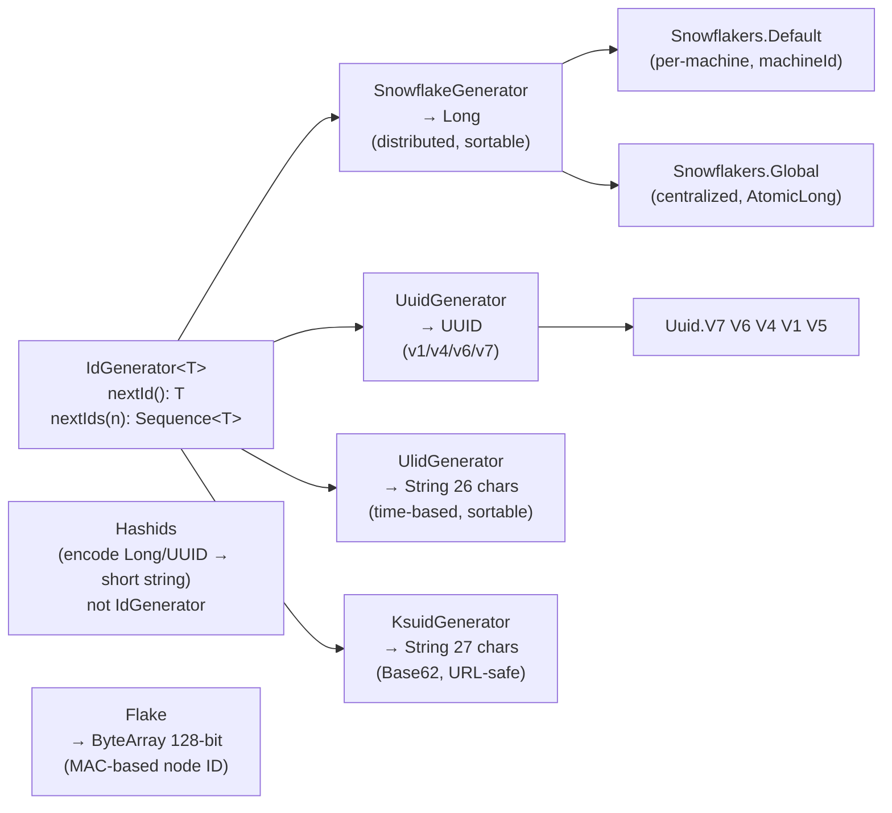
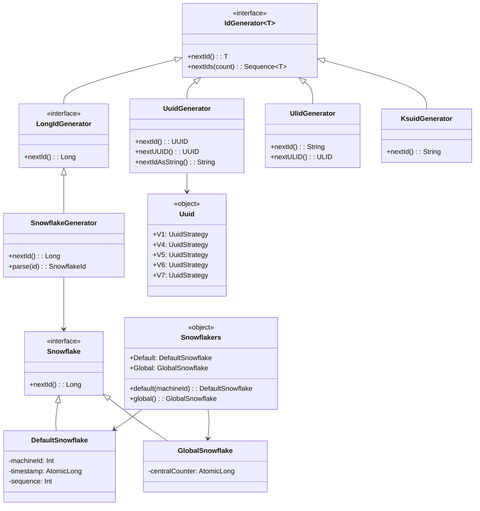
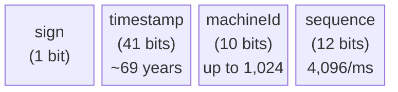
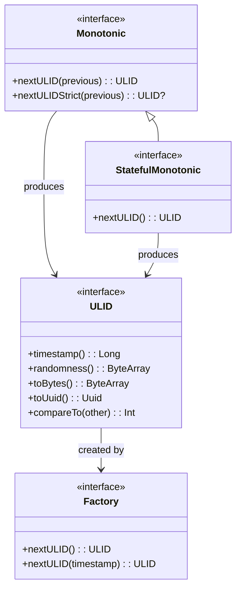
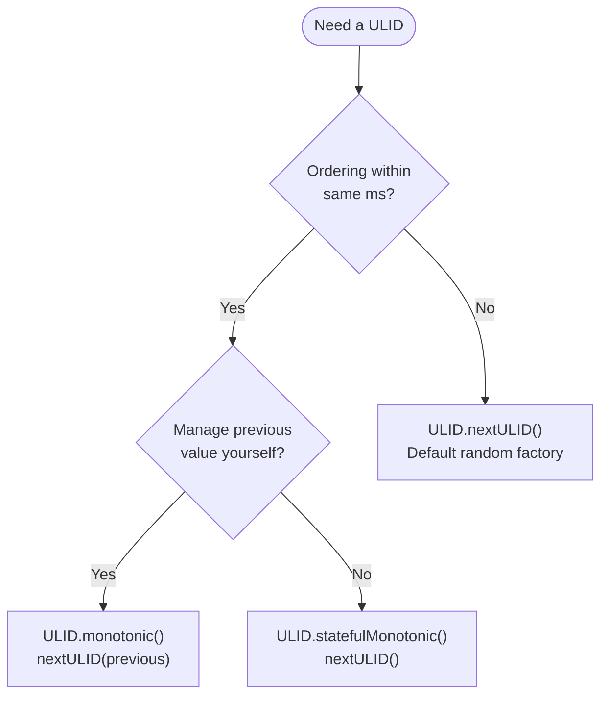

# bluetape4k-idgenerators

English | [한국어](./README.ko.md)

Generates unique IDs in distributed environments using a variety of algorithms. UUID (V1–V7), ULID, KSUID, Snowflake, Flake, and Hashids are exposed through a unified
`IdGenerator<T>` interface.

## Algorithm Selection Guide

Pick the right algorithm for your use case:

| Requirement                      | Recommended                            |
|----------------------------------|----------------------------------------|
| Distributed env, per-machine IDs | Snowflake (`Snowflakers.Default`)      |
| Centralized ID service           | GlobalSnowflake (`Snowflakers.Global`) |
| DB primary key, needs sorting    | UUID v7 (`Uuid.V7`)                    |
| Fully random, security-focused   | UUID v4 (`Uuid.V4`)                    |
| Monotonic, string ID             | ULID (`UlidGenerator`)                 |
| URL-safe, second precision       | KSUID Seconds (`Ksuid.Seconds`)        |
| URL-safe, millisecond precision  | KSUID Millis (`Ksuid.Millis`)          |
| 128-bit, high uniqueness         | Flake                                  |
| Short URL, obfuscation           | Hashids                                |

## Architecture

### All Algorithms at a Glance



### Class Diagram



### Snowflake Bit Layout



- **timestamp**: milliseconds since epoch, unique for ~69 years
- **machineId**: supports up to 1,024 machines (0–1023)
- **sequence**: up to 4,096 IDs per millisecond per machine

### Supported Algorithms

| Algorithm           | Type      | Length    | Sortable | Notes                                |
|---------------------|-----------|-----------|----------|--------------------------------------|
| **Snowflake**       | Long      | 19 digits | Yes      | Twitter-style, distributed           |
| **GlobalSnowflake** | Long      | 19 digits | Yes      | Centralized, high throughput         |
| **UUID v7**         | UUID      | 36 chars  | Yes      | Unix epoch + random (recommended)    |
| **UUID v6**         | UUID      | 36 chars  | Yes      | Reordered timestamp, DB PK optimized |
| **UUID v1**         | UUID      | 36 chars  | Yes      | MAC + Gregorian timestamp            |
| **UUID v4**         | UUID      | 36 chars  | No       | Fully random (SecureRandom)          |
| **ULID**            | String    | 26 chars  | Yes      | Crockford Base32, monotonic          |
| **KSUID Seconds**   | String    | 27 chars  | Yes      | Second-based, Base62                 |
| **KSUID Millis**    | String    | 27 chars  | Yes      | Millisecond-based, Base62            |
| **Flake**           | ByteArray | 128 bit   | Yes      | Boundary-style                       |
| **Hashids**         | String    | Variable  | No       | Encode Long/UUID to short string     |

## Usage Examples

### Snowflake (Twitter-style)

```kotlin
// Use Snowflakers singletons directly
val id1: Long = Snowflakers.Default.nextId()
val id2: Long = Snowflakers.Global.nextId()

// Create a new instance via factory
val snowflake = Snowflakers.default(machineId = 5)

// SnowflakeGenerator adapter (IdGenerator<Long> interface)
val gen = SnowflakeGenerator()
val id3: Long = gen.nextId()
val parsed = gen.parse(id3)
```

### UUID (Unified API)

```kotlin
// UUID v7 (recommended — Unix epoch + random, optimal for DB PKs)
val id: UUID = Uuid.V7.nextId()
val base62: String = Uuid.V7.nextBase62()   // 22-char URL-safe Base62

// UUID v6 (reordered timestamp, optimized for DB sorting)
val id6: UUID = Uuid.V6.nextId()

// UUID v4 (fully random)
val id4: UUID = Uuid.V4.nextId()

// UUID v5 (SHA-1 name-based)
val id5: UUID = Uuid.V5.nextId()

// Bulk generation
val ids: Sequence<UUID> = Uuid.V7.nextUUIDs(10)

// Deterministic UUID (same name always produces the same UUID)
val gen = Uuid.namebased("my-service-namespace")
val id = gen.nextId()

// UuidGenerator adapter
val uuidGen = UuidGenerator()           // default: V7
val idString: String = uuidGen.nextIdAsString()  // Base62
```

### ULID (Universally Unique Lexicographically Sortable Identifier)

```
 01ARZ3NDEKTSV4RRFFQ69G5FAV
 |------------|------------|
  Timestamp    Randomness
   48 bits      80 bits
```



```kotlin
// Random ULID
val ulidString: String = ULID.randomULID()
val ulid: ULID = ULID.nextULID()

// Monotonic (ordering guaranteed within same ms)
val monotonic = ULID.monotonic()
var previous = ULID.nextULID()
repeat(1000) {
    val next = monotonic.nextULID(previous)
    check(next > previous)
    previous = next
}

// Stateful monotonic (manages previous internally)
val stateful = ULID.statefulMonotonic()
val a = stateful.nextULID()
val b = stateful.nextULID()
check(a < b)
```

**Generator selection:**



### KSUID (K-Sortable Unique ID)

```kotlin
// Second-based (27 chars, Base62)
val id: String = Ksuid.Seconds.generate()   // e.g. "0ujtsYcgvSTl8PAuAdqWYSMnLOv"
val ids: Sequence<String> = Ksuid.Seconds.nextIds(10)

// Millisecond-based
val idMs: String = Ksuid.Millis.generate()

// Generator adapter
val gen = KsuidGenerator()
val id2: String = gen.nextId()
```

### Flake (Boundary-style 128-bit)

```kotlin
val flake = Flake()
val id: ByteArray = flake.nextId()
val idString: String = flake.nextIdAsString()     // Base62
val hexString = Flake.asHexString(id)             // hex
val components = Flake.asComponentString(id)      // "timestamp-nodeId-sequence"
```

### Hashids (Short URL encoding)

```kotlin
val hashids = Hashids(salt = "my secret salt")

// Encode / decode Long
val encoded = hashids.encode(123456789L)
val decoded = hashids.decode(encoded)  // longArrayOf(123456789)

// UUID encoding
val uuid = UUID.randomUUID()
val encodedUuid = hashids.encodeUUID(uuid)
val decodedUuid = hashids.decodeUUID(encodedUuid)

// Custom configuration
val hashids2 = Hashids(salt = "my salt", minHashLength = 10, customAlphabet = "0123456789abcdef")
```

### Base62 UUID Encoding

```kotlin
val uuid = UUID.randomUUID()
val encoded = uuid.toBase62String()   // 36 chars → 22 chars
val decoded = encoded.toBase62Uuid()
```

## Performance Benchmark

See [Benchmark.md](./Benchmark.md) for detailed performance measurements of all ID generators, including single-thread vs. multi-thread comparisons and recommendations based on your use case.

## References

- [Twitter Snowflake](https://developer.twitter.com/en/docs/basics/twitter-ids)
- [A brief history of the UUID](https://segment.com/blog/a-brief-history-of-the-uuid/)
- [ULID Spec](https://github.com/ulid/spec)
- [KSUID](https://github.com/ksuid/ksuid)
- [Boundary Flake](https://github.com/boundary/flake)
- [Hashids](https://hashids.org)
- [Java UUID Generator](https://github.com/cowtowncoder/java-uuid-generator)

## Dependency

```kotlin
dependencies {
    implementation("io.github.bluetape4k:bluetape4k-idgenerators:${version}")
}
```
