# Module bluetape4k-images

[English](./README.md) | 한국어

JPG, PNG, GIF, WebP 등의 이미지를 로드, 변환, 크기 조절, 분할, 필터 적용 등의 조작을 지원하는 라이브러리입니다.
[Scrimage](https://github.com/sksamuel/scrimage) 라이브러리를 기반으로 하며, Coroutines를 활용한 비동기 이미지 처리를 제공합니다.

## 아키텍처

### 처리 파이프라인

```mermaid
flowchart LR
    subgraph 입력["입력 소스"]
        BA[ByteArray]
        IS[InputStream]
        FILE[File / Path]
    end

    subgraph 이미지처리["이미지 처리 (Scrimage 기반)"]
        II["ImmutableImage<br/>(immutableImageOf)"]
        BI["BufferedImage<br/>(bufferedImageOf)"]
    end

    subgraph 조작["이미지 조작"]
        SC["크기 조절<br/>(ImageScaler)"]
        SP["이미지 분할<br/>(ImageSplitter)"]
        WM["워터마크<br/>(WatermarkFilter)"]
        CP["캡션<br/>(CaptionFilter)"]
        PD["패딩<br/>(PaddingSupport)"]
    end

    subgraph 출력["비동기 저장 (Coroutines)"]
        JPG["SuspendJpegWriter<br/>(손실 압축)"]
        PNG["SuspendPngWriter<br/>(무손실)"]
        WEBP["SuspendWebpWriter<br/>(최고 압축)"]
        GIF["SuspendGifWriter<br/>(애니메이션)"]
        ANIM["SuspendGif2WebpWriter<br/>(GIF→WebP 변환)"]
    end

    입력 --> 이미지처리
    이미지처리 --> 조작
    조작 --> 출력

    classDef coreStyle fill:#E8F5E9,stroke:#A5D6A7,color:#2E7D32,font-weight:bold
    classDef serviceStyle fill:#E3F2FD,stroke:#90CAF9,color:#1565C0
    classDef utilStyle fill:#FFF3E0,stroke:#FFCC80,color:#E65100
    classDef asyncStyle fill:#F3E5F5,stroke:#CE93D8,color:#6A1B9A
    classDef extStyle fill:#ECEFF1,stroke:#B0BEC5,color:#37474F
    classDef dataStyle fill:#F57F17,stroke:#F57F17,color:#000000

    class BA,IS,FILE dataStyle
    class II,BI coreStyle
    class SC,SP,WM,CP,PD utilStyle
    class JPG,PNG,WEBP,GIF,ANIM asyncStyle
```



### 클래스 다이어그램

```mermaid
classDiagram
    class ImmutableImage {
        +width: Int
        +height: Int
        +scale(width, height) ImmutableImage
        +output(writer) ByteArray
    }
    class ImageScaler {
        +scale(image, width, height) ImmutableImage
    }
    class ImageSplitter {
        +split(image, rows, cols) List~ImmutableImage~
    }
    class WatermarkFilter {
        +apply(image) ImmutableImage
    }
    class ImageFilterChain {
        +brightness(factor)
        +contrast(factor)
        +saturation(factor)
        +hue(deltaDegrees)
        +colorTemperature(kelvin)
        +gaussianBlur(radius)
        +medianBlur(radius, boundary)
        +sepia()
        +vignette()
        +roundedCorners(radius)
        +raw(filter)
        +pixel(block)
    }
    class ColorSpaceConverter {
        +rgbToHsv(r, g, b) FloatArray
        +hsvToRgb(h, s, v) IntArray
        +kelvinToRgb(kelvin) IntArray
    }
    class SaturationAdjustFilter {
        +factor: Float
        +apply(image) ImmutableImage
    }
    class HueAdjustFilter {
        +deltaDegrees: Float
        +apply(image) ImmutableImage
    }
    class ColorTemperatureFilter {
        +kelvin: Int
        +apply(image) ImmutableImage
    }
    class MedianBlurFilter {
        +radius: Int
        +boundary: MedianBoundaryMode
        +apply(image) ImmutableImage
    }
    class RoundedCornerFilter {
        +radius: Int
        +apply(image) ImmutableImage
    }
    class SuspendJpegWriter {
        +writeImage(image) ByteArray
    }
    class SuspendPngWriter {
        +writeImage(image) ByteArray
    }
    class SuspendWebpWriter {
        +writeImage(image) ByteArray
    }
    class SuspendGif2WebpWriter {
        +writeImage(image) ByteArray
    }

    ImmutableImage --> ImageScaler : uses
    ImmutableImage --> ImageSplitter : uses
    ImmutableImage --> WatermarkFilter : uses
    ImmutableImage --> ImageFilterChain : applyFilters
    ImmutableImage --> SuspendJpegWriter : output
    ImmutableImage --> SuspendPngWriter : output
    ImmutableImage --> SuspendWebpWriter : output
    ImmutableImage --> SuspendGif2WebpWriter : output
    ImageFilterChain --> SaturationAdjustFilter
    ImageFilterChain --> HueAdjustFilter
    ImageFilterChain --> ColorTemperatureFilter
    ImageFilterChain --> MedianBlurFilter
    ImageFilterChain --> RoundedCornerFilter
    ColorSpaceConverter <-- SaturationAdjustFilter : uses
    ColorSpaceConverter <-- HueAdjustFilter : uses
    ColorSpaceConverter <-- ColorTemperatureFilter : uses

    style ImmutableImage fill:#E3F2FD,stroke:#90CAF9,color:#1565C0
    style ImageScaler fill:#FFF3E0,stroke:#FFCC80,color:#E65100
    style ImageSplitter fill:#FFF3E0,stroke:#FFCC80,color:#E65100
    style WatermarkFilter fill:#FFF3E0,stroke:#FFCC80,color:#E65100
    style ImageFilterChain fill:#E8F5E9,stroke:#A5D6A7,color:#2E7D32
    style ColorSpaceConverter fill:#E8F5E9,stroke:#A5D6A7,color:#2E7D32
    style SaturationAdjustFilter fill:#FFF8E1,stroke:#FFD54F,color:#E65100
    style HueAdjustFilter fill:#FFF8E1,stroke:#FFD54F,color:#E65100
    style ColorTemperatureFilter fill:#FFF8E1,stroke:#FFD54F,color:#E65100
    style MedianBlurFilter fill:#FFF8E1,stroke:#FFD54F,color:#E65100
    style RoundedCornerFilter fill:#FFF8E1,stroke:#FFD54F,color:#E65100
    style SuspendJpegWriter fill:#F3E5F5,stroke:#CE93D8,color:#6A1B9A
    style SuspendPngWriter fill:#F3E5F5,stroke:#CE93D8,color:#6A1B9A
    style SuspendWebpWriter fill:#F3E5F5,stroke:#CE93D8,color:#6A1B9A
    style SuspendGif2WebpWriter fill:#F3E5F5,stroke:#CE93D8,color:#6A1B9A
```



## 주요 기능

### 이미지 포맷 지원

| 포맷   | 파일 사이즈 (예시) | 처리 시간 (예시) | 특징            |
|------|-------------|------------|---------------|
| PNG  | 6.45 MB     | 569 ms     | 무손실, 투명도 지원   |
| GIF  | 1.21 MB     | 2,888 ms   | 애니메이션 지원      |
| JPG  | 417 kB      | 157 ms     | 빠른 처리, 손실 압축  |
| WEBP | 181 kB      | 913 ms     | 최고 압축률, 최신 포맷 |

- **동적 생성**: JPG가 가장 빠름 (실시간 처리용)
- **정적 파일**: WebP가 가장 효율적 (저장 공간 절약)

### 주요 파일

| 파일                                                   | 설명                            |
|------------------------------------------------------|-------------------------------|
| `ImmutableImageSupport.kt`                           | ImmutableImage 생성, 저장, 그래픽 작업 |
| `BufferedImageSupport.kt`                            | BufferedImage 생성, 저장, 그래픽 작업  |
| `ImageFormat.kt`                                     | 지원 이미지 포맷 열거형                 |
| `WriteContextExtensions.kt`                          | 쓰기 컨텍스트 확장 함수                 |
| `IIORegistryUtils.kt`                                | ImageIO 레지스트리 유틸리티            |
| `scaler/ImageScaler.kt`                              | 이미지 크기 조절                     |
| `splitter/ImageSplitter.kt`                          | 이미지 분할                        |
| `filters/WatermarkFilterSupport.kt`                  | 워터마크 필터                       |
| `filters/CaptionFilterSupport.kt`                    | 캡션 필터                         |
| `filters/PaddingSupport.kt`                          | 패딩 필터                         |
| `filters/WatermarkFilterType.kt`                     | 워터마크 타입 (COVER/STAMP)         |
| `similarity/ImageSimilarity.kt`                      | 핵심 유사도: 픽셀 Δ, MSE, PSNR, 전역 SSIM, pHash |
| `similarity/MssimSimilarity.kt`                      | MSSIM — 슬라이딩 윈도우 Gaussian SSIM            |
| `similarity/HashSimilarity.kt`                       | aHash/dHash/wHash/phashOf (64/256/1024bit), HashDistance |
| `similarity/HistogramSimilarity.kt`                  | 색상 히스토그램: ChiSquare, Bhattacharyya, EarthMover |
| `similarity/KeypointSimilarity.kt`                   | Block-Mean descriptor, bestRotationSimilarityTo  |
| `similarity/SimilarityScaleUtils.kt`                 | prepareForSimilarity — MSSIM 전 다운스케일 유틸리티  |
| `fonts/FontSupport.kt`                               | 폰트 유틸리티                       |
| `filters/dsl/ImageFilterChain.kt`                    | 필터/색보정 DSL (`applyFilters`, `suspendApplyFilters`) |
| `filters/dsl/ImageFilterChainDsl.kt`                 | DSL 멤버 함수 (40+ 필터)            |
| `filters/SaturationAdjustFilter.kt`                  | HSV 채도 조절 필터                  |
| `filters/HueAdjustFilter.kt`                         | HSV 색조 회전 필터                  |
| `filters/ColorTemperatureFilter.kt`                  | 켈빈 색온도 조절 필터                 |
| `filters/MedianBlurFilter.kt`                        | 미디언 블러 노이즈 제거 필터             |
| `filters/RoundedCornerFilter.kt`                     | 모서리 둥글게 알파 마스크 필터            |
| `filters/ColorSpaceConverter.kt`                     | RGB/HSV/YCbCr/켈빈 색 공간 변환     |
| `io/ImageInputStreamSupport.kt`                      | 이미지 입력 스트림                    |
| `io/ImageOuptputStreamSupport.kt`                    | 이미지 출력 스트림                    |
| `coroutines/SuspendImageWriter.kt`                   | 비동기 이미지 Writer 인터페이스          |
| `coroutines/SuspendJpegWriter.kt`                    | 비동기 JPEG Writer               |
| `coroutines/SuspendPngWriter.kt`                     | 비동기 PNG Writer                |
| `coroutines/SuspendGifWriter.kt`                     | 비동기 GIF Writer                |
| `coroutines/SuspendWebpWriter.kt`                    | 비동기 WebP Writer               |
| `coroutines/SuspendWriteContext.kt`                  | 비동기 쓰기 컨텍스트                   |
| `coroutines/animated/SuspendAnimatedImageWriter.kt`  | 비동기 애니메이션 Writer              |
| `coroutines/animated/SuspendGif2WebpWriter.kt`       | GIF → WebP 변환 Writer          |
| `coroutines/animated/AnimatedGifExtensions.kt`       | AnimatedGif 확장 함수             |
| `coroutines/animated/SuspendAnimatedWriteContext.kt` | 애니메이션 쓰기 컨텍스트                 |

## 사용 예시

### ImmutableImage 로드

```kotlin
import io.bluetape4k.images.*

// ByteArray에서 로드
val image = immutableImageOf(byteArray)

// InputStream에서 로드
val image = immutableImageOf(inputStream)

// 파일에서 로드
val image = immutableImageOf(File("image.jpg"))

// Path에서 로드
val image = immutableImageOf(Paths.get("image.jpg"))

// Coroutines 환경에서 비동기 로드
val image = suspendImmutableImageOf(File("image.jpg"))
val image = suspendLoadImage(Paths.get("image.jpg"))
```

### BufferedImage 로드/저장

```kotlin
import io.bluetape4k.images.*

// 다양한 소스에서 로드
val image = bufferedImageOf(inputStream)
val image = bufferedImageOf(File("image.jpg"))
val image = bufferedImageOf(byteArray)

// 새 이미지 생성
val image = bufferedImageOf(200, 100)

// 저장
image.write(ImageFormat.JPG, File("output.jpg"))
image.write(ImageFormat.PNG, outputStream)

// ByteArray 변환
val bytes = image.toByteArray("png")
```

### 이미지 저장 (Coroutines)

```kotlin
import io.bluetape4k.images.*
import io.bluetape4k.images.coroutines.*

val image = immutableImageOf(File("input.png"))

// JPEG로 저장 (80% 품질)
image.suspendWrite(SuspendJpegWriter(compression = 80), Paths.get("output.jpg"))

// PNG로 저장 (최대 압축)
image.suspendWrite(SuspendPngWriter.MaxCompression, Paths.get("output.png"))

// WebP로 저장
image.suspendWrite(SuspendWebpWriter.Default, Paths.get("output.webp"))

// ByteArray로 변환
val jpegBytes = image.suspendBytes(SuspendJpegWriter.Default)
val webpBytes = image.suspendBytes(SuspendWebpWriter.Default)
```

### 이미지 크기 조절

```kotlin
import io.bluetape4k.images.scaler.*
import java.awt.image.BufferedImage

// 비율로 조절
val scaled = bufferedImage.scale(0.5)  // 50% 크기

// 절대 크기로 조절 (비율 유지)
val scaled = bufferedImage.scale(width = 200, height = 200, proportional = true)

// 절대 크기로 조절 (비율 무시)
val scaled = bufferedImage.scale(width = 200, height = 200, proportional = false)

// X, Y 축 비율로 조절
val scaled = bufferedImage.scale(xScale = 0.5, yScale = 0.5)
```

### 이미지 분할

높이가 큰 이미지(예: 상품 상세 이미지)를 지정된 높이로 분할합니다.

```kotlin
import io.bluetape4k.images.splitter.ImageSplitter
import io.bluetape4k.images.ImageFormat

val splitter = ImageSplitter(maxHeight = 2048)

// 기본 분할
val splitImages: Flow<ByteArray> = splitter.split(
    input = inputStream,
    format = ImageFormat.JPG,
    splitHeight = 1024
)

// 분할 + 압축
val compressedImages: Flow<ByteArray> = splitter.splitAndCompress(
    input = inputStream,
    format = ImageFormat.JPG,
    splitHeight = 1024,
    writer = SuspendJpegWriter(compression = 80)
)

// 결과 처리
splitImages.collect { bytes ->
    // 분할된 이미지 처리
}
```

### 워터마크 추가

```kotlin
import io.bluetape4k.images.filters.*
import com.sksamuel.scrimage.ImmutableImage

val image = ImmutableImage.loader().fromFile(File("photo.jpg"))

// 커버 워터마크 (전체 덮기)
val watermarked = image.filter(
    watermarkFilterOf(
        text = "© bluetape4k",
        type = WatermarkFilterType.COVER,
        alpha = 0.2,
        color = Color.WHITE
    )
)

// 스탬프 워터마크
val stamped = image.filter(
    watermarkFilterOf(
        text = "© bluetape4k",
        type = WatermarkFilterType.STAMP,
        alpha = 0.3
    )
)

// 특정 위치에 워터마크
val positioned = image.filter(
    watermarkFilterOf(
        text = "© bluetape4k",
        x = 100,
        y = 100,
        alpha = 0.5
    )
)
```

### 캡션 추가

```kotlin
import io.bluetape4k.images.filters.*
import com.sksamuel.scrimage.Position

val image = ImmutableImage.loader().fromFile(File("photo.jpg"))

val captioned = image.filter(
    captionFilterOf(
        text = "Powered by bluetape4k",
        position = Position.BottomLeft,
        textAlpha = 0.8,
        color = Color.WHITE
    )
)
```

### 패딩 추가

```kotlin
import io.bluetape4k.images.filters.*

// 상하좌우 동일 패딩
val padding = paddingOf(20)

// 개별 패딩 지정
val padding = paddingOf(top = 10, right = 20, bottom = 10, left = 20)
```

### 그래픽 작업

```kotlin
import io.bluetape4k.images.*
import java.awt.Color

// 새 이미지 생성
val image = bufferedImageOf(200, 100)

// 그래픽 작업
image.useGraphics { graphics ->
    graphics.color = Color.RED
    graphics.fillRect(0, 0, 100, 100)
    graphics.color = Color.BLACK
    graphics.drawString("Hello, World!", 10, 50)
}

// ImmutableImage로 그래픽 작업
val immutableImage = immutableImageOf(File("input.jpg"))
immutableImage.useGraphics { graphics ->
    graphics.color = Color.BLUE
    graphics.drawRect(10, 10, 100, 100)
}
```

### 이미지 유사도 비교

환경 독립적인 이미지 회귀 테스트, 중복 탐지, 압축 품질 평가용 지표 모음입니다.

```kotlin
import io.bluetape4k.images.*
import io.bluetape4k.images.similarity.*

val a = immutableImageOf(File("a.jpg"))
val b = immutableImageOf(File("b.jpg"))

// 픽셀 단위 비교
a.pixelAvgDeltaTo(b)   // 채널당 평균 RGB 차이 (0.0 ~ 255.0, 0이 동일)
a.pixelMaxDeltaTo(b)   // 채널당 최대 RGB 차이 (0 ~ 255)

// 통계 기반 지표
a.mseTo(b)             // Mean Squared Error
a.psnrTo(b)            // Peak SNR dB (≥ 30 양호, ≥ 40 거의 동일, 동일시 +∞)
a.ssimTo(b)            // 전역 SSIM (-1.0 ~ 1.0, ≥ 0.95 거의 구분 불가)

// 지각 해시 — 레거시 64bit API (크기 변화·JPEG 재압축에 견고)
a.phash()                      // 64bit Long
a.phashDistanceTo(b)           // Hamming distance 0 ~ 64 (≤ 5 거의 동일, ≤ 10 유사)
```

| 지표                  | 용도                            | 완전 동일 |
|---------------------|-------------------------------|-------|
| `pixelAvgDeltaTo`   | 바이트 단위 회귀 테스트 (허용 오차 비교)      | 0.0   |
| `pixelMaxDeltaTo`   | 단일 픽셀 이상치 탐지                  | 0     |
| `psnrTo`            | JPEG/WebP 압축 품질 평가            | +∞    |
| `ssimTo`            | 전역 인지적 유사도                    | 1.0   |
| `phashDistanceTo`   | 중복 이미지·크롭·리사이즈 탐지             | 0     |

### MSSIM (슬라이딩 윈도우 SSIM)

11×11 Gaussian 윈도우 기반 SSIM으로, 전역 SSIM보다 공간 구조 변화에 민감합니다.

```kotlin
import io.bluetape4k.images.similarity.*

val a = immutableImageOf(File("a.jpg"))
val b = immutableImageOf(File("b.jpg"))

// 11×11 Gaussian 윈도우 (기본), 전체 유효 위치 평균
val mssim = a.mssimTo(b)                    // 0.0 ~ 1.0
val mssim = a.mssimTo(b, windowSize = 7)    // 더 작은 윈도우
val mssim = a.mssimTo(b, sigma = 2.0)       // 더 넓은 가우시안

// 대형 이미지는 먼저 다운스케일해서 속도 향상
val prepared = a.prepareForSimilarity(maxSide = 512)
val score = prepared.mssimTo(b.prepareForSimilarity(512))
```

> 두 이미지의 크기가 동일해야 합니다. 일관된 처리를 위해 `prepareForSimilarity` 사용 권장.

### 확장 지각 해시 (aHash / dHash / wHash / pHash)

가변 비트폭(64 / 256 / 1024bit) 지각 해시.

```kotlin
import io.bluetape4k.images.similarity.*

val a = immutableImageOf(File("a.jpg"))
val b = immutableImageOf(File("b.jpg"))

// 64bit 편의 단축형
val da = HashDistance.hamming(a.ahash(), b.ahash())   // 평균 해시
val dd = HashDistance.hamming(a.dhash(), b.dhash())   // 차이 해시
val dw = HashDistance.hamming(a.whash(), b.whash())   // 웨이블릿 해시
// 참고: a.phash() == a.phashOf(PHashSize.BITS_64)[0]

// 가변 비트폭 — LongArray
val p256 = a.phashOf(PHashSize.BITS_256)              // LongArray(4)
val p1024 = b.phashOf(PHashSize.BITS_1024)            // LongArray(16)
val dist = HashDistance.hamming(a.phashOf(PHashSize.BITS_256), b.phashOf(PHashSize.BITS_256))
```

| 해시  | 알고리즘                | 특징                         |
|-------|---------------------|------------------------------|
| aHash | 평균 밝기              | 빠르고 단순                    |
| dHash | 인접 픽셀 그래디언트     | 약한 밝기 변화에 견고             |
| wHash | Haar DWT LL subband | pHash보다 빠르고 정확도 유사       |
| pHash | DCT 저주파 성분        | JPEG·리사이즈에 가장 견고           |

### 색상 히스토그램 유사도

채널별 색상 분포로 이미지를 비교합니다.

```kotlin
import io.bluetape4k.images.similarity.*

val a = immutableImageOf(File("a.jpg"))
val b = immutableImageOf(File("b.jpg"))

// ChiSquare (가장 변별력 높음, [0, 1])
val sim = a.histogramSimilarityTo(b)                                   // ChiSquare, RGB, 32 bins
val sim = a.histogramSimilarityTo(b, HistogramSimilarity.chiSquare())

// Bhattacharyya 계수 ([0, 1])
val sim = a.histogramSimilarityTo(b, HistogramSimilarity.bhattacharyya())

// Earth Mover's Distance 정규화 ([0, 1])
val sim = a.histogramSimilarityTo(b, HistogramSimilarity.earthMover())

// HSV 색공간, 채널당 64 bins
val measure = HistogramSimilarity.ChiSquare(colorSpace = ColorSpace.HSV, binsPerChannel = 64)
val sim = a.histogramSimilarityTo(b, measure)
```

### Block-Mean Descriptor (키포인트 없는 매칭)

그리드 기반 휘도 descriptor로 회전 대응 유사도를 계산합니다.

```kotlin
import io.bluetape4k.images.similarity.*

val a = immutableImageOf(File("a.jpg"))
val b = immutableImageOf(File("b.jpg"))

// 그리드 유사도 (L2 정규화, [0, 1])
val sim = a.blockMeanSimilarityTo(b)                        // 8×8 그리드
val sim = a.blockMeanSimilarityTo(b, gridRows = 16, gridCols = 16)

// 회전 대응: 0°/90°/180°/270° 중 최대 유사도 반환
val sim = a.bestRotationSimilarityTo(b)

// Raw descriptor
val desc = a.blockMeanDescriptor()   // DoubleArray(64) 정규화된 셀별 휘도
```

### 애니메이션 GIF → WebP 변환

```kotlin
import io.bluetape4k.images.coroutines.animated.*
import com.sksamuel.scrimage.nio.AnimatedGif

val gif = AnimatedGif.fromFile(File("animation.gif"))

// WebP로 변환
gif.suspendWrite(SuspendGif2WebpWriter.Default, Paths.get("animation.webp"))

// ByteArray로 변환
val webpBytes = gif.suspendBytes(SuspendGif2WebpWriter.Default)
```

## 이미지 Writer 옵션

### SuspendJpegWriter

```kotlin
// 기본 (80% 품질)
SuspendJpegWriter.Default

// 커스텀 품질
SuspendJpegWriter(compression = 90)

// 프로그레시브 JPEG
SuspendJpegWriter(compression = 80, progressive = true)

// 메타데이터에서 압축 정보 사용
SuspendJpegWriter.CompressionFromMetaData
```

### SuspendPngWriter

```kotlin
// 최대 압축 (느림)
SuspendPngWriter.MaxCompression  // level 9

// 최소 압축 (빠름)
SuspendPngWriter.MinCompression  // level 1

// 압축 없음 (가장 빠름)
SuspendPngWriter.NoCompression  // level 0
```

### SuspendWebpWriter

```kotlin
// 기본
SuspendWebpWriter.Default

// 최대 무손실 압축 (배치 작업용)
SuspendWebpWriter.MaxLosslessCompression

// 커스텀 옵션
SuspendWebpWriter(
    z = 9,           // 압축 레벨 (0-9)
    q = 75,          // 품질 (0-100)
    m = 4,           // 압축 방법 (0-6)
    lossless = false,
    noAlpha = false
)
```

## 필터 / 색보정 DSL (Issue #131)

패키지: `io.bluetape4k.images.filters.dsl`

### `ImageFilterChain` DSL

`applyFilters { ... }` 및 `suspendApplyFilters { ... }` 확장 함수는 이미지 필터를 체이닝하는 플루언트 DSL을 제공합니다. 주요 설계 특징:

- `source.copy()` 방어 복사로 원본 이미지 보호
- 인접한 scrimage 네이티브 필터는 자동으로 `PipelineFilter`로 묶어 성능 최적화
- 색상/톤, 스타일, 블러, 효과, 텍스트를 포함한 40+ DSL 멤버 함수 제공

```kotlin
import io.bluetape4k.images.filters.dsl.*

// 동기 필터 체인
val result = image.applyFilters {
    brightness(1.2f)
    contrast(1.1)
    saturation(1.15f)
    sepia()
}

// 비동기(코루틴) 필터 체인
val result2 = image.suspendApplyFilters {
    gaussianBlur(3)
    colorTemperature(3000)
    vignette()
}

// 이스케이프 해치: 커스텀 필터 직접 주입
val result3 = image.applyFilters {
    raw(MyCustomFilter())
    pixel { img -> img.flipX() }
}
```

### 신규 필터 5종

| 필터 | DSL 함수 | 설명 |
|------|----------|------|
| `SaturationAdjustFilter` | `saturation(factor)` | HSV 채도 배수 조정 (1.0=원본, 0=흑백) |
| `HueAdjustFilter` | `hue(deltaDegrees)` | HSV 색조 회전 (도 단위) |
| `ColorTemperatureFilter` | `colorTemperature(kelvin)` | 켈빈 색온도 조정 (1000–40000 K) |
| `RoundedCornerFilter` | `roundedCorners(radius)` | 모서리 둥글게 (알파 마스크) |
| `MedianBlurFilter` | `medianBlur(radius, boundary)` | 미디언 블러 노이즈 제거 (`MedianBoundaryMode`: REPLICATE/REFLECT) |

### `ColorSpaceConverter`

신규 필터들이 내부적으로 사용하는 색 공간 변환 유틸리티 객체입니다.

```kotlin
import io.bluetape4k.images.filters.ColorSpaceConverter

// RGB ↔ HSV
val (h, s, v) = ColorSpaceConverter.rgbToHsv(255, 128, 0)
val (r, g, b) = ColorSpaceConverter.hsvToRgb(30f, 1f, 1f)

// 켈빈 → RGB
val (r, g, b) = ColorSpaceConverter.kelvinToRgb(6500)

// 픽셀 배열 일괄 변환
val hsvArray = image.toHsvArray()     // FloatArray [h0,s0,v0, h1,s1,v1, ...]
val ycbcrArray = image.toYCbCrArray() // FloatArray [y0,cb0,cr0, ...]
```

## 의존성 추가

```kotlin
dependencies {
    implementation("io.github.bluetape4k:bluetape4k-images:${version}")
}
```
