# Module bluetape4k-images

English | [한국어](./README.ko.md)

A library for loading, converting, resizing, splitting, and applying filters to images in formats such as JPG, PNG, GIF, and WebP. Built on the [Scrimage](https://github.com/sksamuel/scrimage) library with asynchronous image processing via Coroutines.

## Architecture

### Processing Pipeline

```mermaid
flowchart LR
    subgraph Input["Input Sources"]
        BA[ByteArray]
        IS[InputStream]
        FILE[File / Path]
    end

    subgraph Processing["Image Processing (Scrimage-based)"]
        II["ImmutableImage<br/>(immutableImageOf)"]
        BI["BufferedImage<br/>(bufferedImageOf)"]
    end

    subgraph Operations["Image Operations"]
        SC["Resize<br/>(ImageScaler)"]
        SP["Split<br/>(ImageSplitter)"]
        WM["Watermark<br/>(WatermarkFilter)"]
        CP["Caption<br/>(CaptionFilter)"]
        PD["Padding<br/>(PaddingSupport)"]
    end

    subgraph Output["Async Output (Coroutines)"]
        JPG["SuspendJpegWriter<br/>(lossy)"]
        PNG["SuspendPngWriter<br/>(lossless)"]
        WEBP["SuspendWebpWriter<br/>(best compression)"]
        GIF["SuspendGifWriter<br/>(animated)"]
        ANIM["SuspendGif2WebpWriter<br/>(GIF→WebP)"]
    end

    Input --> Processing
    Processing --> Operations
    Operations --> Output

    classDef coreStyle fill:#1B5E20,stroke:#1B5E20,color:#FFFFFF,font-weight:bold
    classDef serviceStyle fill:#1565C0,stroke:#1565C0,color:#FFFFFF
    classDef utilStyle fill:#E65100,stroke:#E65100,color:#FFFFFF
    classDef asyncStyle fill:#6A1B9A,stroke:#6A1B9A,color:#FFFFFF
    classDef extStyle fill:#37474F,stroke:#37474F,color:#FFFFFF
    classDef dataStyle fill:#F57F17,stroke:#F57F17,color:#000000

    class BA,IS,FILE dataStyle
    class II,BI coreStyle
    class SC,SP,WM,CP,PD utilStyle
    class JPG,PNG,WEBP,GIF,ANIM asyncStyle
```



### Class Diagram

```mermaid
classDiagram
    class ImmutableImage {
        +width: Int
        +height: Int
        +scale(width, height) ImmutableImage
        +output(writer) ByteArray
    }
    class ImageScaler {
        +scale(image, width, height) ImmutableImage
    }
    class ImageSplitter {
        +split(image, rows, cols) List~ImmutableImage~
    }
    class WatermarkFilter {
        +apply(image) ImmutableImage
    }
    class SuspendJpegWriter {
        +writeImage(image) ByteArray
    }
    class SuspendPngWriter {
        +writeImage(image) ByteArray
    }
    class SuspendWebpWriter {
        +writeImage(image) ByteArray
    }
    class SuspendGif2WebpWriter {
        +writeImage(image) ByteArray
    }

    ImmutableImage --> ImageScaler : uses
    ImmutableImage --> ImageSplitter : uses
    ImmutableImage --> WatermarkFilter : uses
    ImmutableImage --> SuspendJpegWriter : output
    ImmutableImage --> SuspendPngWriter : output
    ImmutableImage --> SuspendWebpWriter : output
    ImmutableImage --> SuspendGif2WebpWriter : output

    style ImmutableImage fill:#1565C0,stroke:#0D47A1,color:#FFFFFF
    style ImageScaler fill:#E65100,stroke:#BF360C,color:#FFFFFF
    style ImageSplitter fill:#E65100,stroke:#BF360C,color:#FFFFFF
    style WatermarkFilter fill:#E65100,stroke:#BF360C,color:#FFFFFF
    style SuspendJpegWriter fill:#6A1B9A,stroke:#4A148C,color:#FFFFFF
    style SuspendPngWriter fill:#6A1B9A,stroke:#4A148C,color:#FFFFFF
    style SuspendWebpWriter fill:#6A1B9A,stroke:#4A148C,color:#FFFFFF
    style SuspendGif2WebpWriter fill:#6A1B9A,stroke:#4A148C,color:#FFFFFF
```



## Key Features

### Supported Image Formats

| Format | File Size (example) | Processing Time (example) | Notes                    |
|--------|---------------------|---------------------------|--------------------------|
| PNG    | 6.45 MB             | 569 ms                    | Lossless, transparency   |
| GIF    | 1.21 MB             | 2,888 ms                  | Animation support        |
| JPG    | 417 kB              | 157 ms                    | Fast, lossy              |
| WEBP   | 181 kB              | 913 ms                    | Best compression, modern |

- **Dynamic generation**: JPG is fastest (for real-time processing)
- **Static files**: WebP is most efficient (saves storage)

### Key Files

| File                                           | Description                              |
|------------------------------------------------|------------------------------------------|
| `ImmutableImageSupport.kt`                     | Create, save, and draw on ImmutableImage |
| `BufferedImageSupport.kt`                      | Create, save, and draw on BufferedImage  |
| `ImageFormat.kt`                               | Supported image format enum              |
| `WriteContextExtensions.kt`                    | Write context extensions                 |
| `IIORegistryUtils.kt`                          | ImageIO registry utilities               |
| `scaler/ImageScaler.kt`                        | Image resizing                           |
| `splitter/ImageSplitter.kt`                    | Image splitting                          |
| `filters/WatermarkFilterSupport.kt`            | Watermark filter                         |
| `filters/CaptionFilterSupport.kt`              | Caption filter                           |
| `filters/PaddingSupport.kt`                    | Padding filter                           |
| `filters/WatermarkFilterType.kt`               | Watermark type (COVER/STAMP)             |
| `fonts/FontSupport.kt`                         | Font utilities                           |
| `coroutines/SuspendImageWriter.kt`             | Async image writer interface             |
| `coroutines/SuspendJpegWriter.kt`              | Async JPEG writer                        |
| `coroutines/SuspendPngWriter.kt`               | Async PNG writer                         |
| `coroutines/SuspendGifWriter.kt`               | Async GIF writer                         |
| `coroutines/SuspendWebpWriter.kt`              | Async WebP writer                        |
| `coroutines/animated/SuspendGif2WebpWriter.kt` | GIF → WebP conversion writer             |
| `coroutines/animated/AnimatedGifExtensions.kt` | AnimatedGif extensions                   |

## Usage Examples

### Loading ImmutableImage

```kotlin
import io.bluetape4k.images.*

// Load from ByteArray
val image = immutableImageOf(byteArray)

// Load from InputStream
val image = immutableImageOf(inputStream)

// Load from File
val image = immutableImageOf(File("image.jpg"))

// Load from Path
val image = immutableImageOf(Paths.get("image.jpg"))

// Async load in a coroutine context
val image = suspendImmutableImageOf(File("image.jpg"))
val image = suspendLoadImage(Paths.get("image.jpg"))
```

### Loading and Saving BufferedImage

```kotlin
import io.bluetape4k.images.*

// Load from various sources
val image = bufferedImageOf(inputStream)
val image = bufferedImageOf(File("image.jpg"))
val image = bufferedImageOf(byteArray)

// Create a new blank image
val image = bufferedImageOf(200, 100)

// Save
image.write(ImageFormat.JPG, File("output.jpg"))
image.write(ImageFormat.PNG, outputStream)

// Convert to ByteArray
val bytes = image.toByteArray("png")
```

### Saving Images (Coroutines)

```kotlin
import io.bluetape4k.images.*
import io.bluetape4k.images.coroutines.*

val image = immutableImageOf(File("input.png"))

// Save as JPEG (80% quality)
image.suspendWrite(SuspendJpegWriter(compression = 80), Paths.get("output.jpg"))

// Save as PNG (maximum compression)
image.suspendWrite(SuspendPngWriter.MaxCompression, Paths.get("output.png"))

// Save as WebP
image.suspendWrite(SuspendWebpWriter.Default, Paths.get("output.webp"))

// Convert to ByteArray
val jpegBytes = image.suspendBytes(SuspendJpegWriter.Default)
val webpBytes = image.suspendBytes(SuspendWebpWriter.Default)
```

### Resizing Images

```kotlin
import io.bluetape4k.images.scaler.*
import java.awt.image.BufferedImage

// Scale by ratio
val scaled = bufferedImage.scale(0.5)  // 50%

// Scale to absolute dimensions (maintain aspect ratio)
val scaled = bufferedImage.scale(width = 200, height = 200, proportional = true)

// Scale to absolute dimensions (ignore aspect ratio)
val scaled = bufferedImage.scale(width = 200, height = 200, proportional = false)

// Scale by X/Y ratio
val scaled = bufferedImage.scale(xScale = 0.5, yScale = 0.5)
```

### Splitting Images

Splits a tall image (e.g., product detail pages) into chunks of the specified height.

```kotlin
import io.bluetape4k.images.splitter.ImageSplitter
import io.bluetape4k.images.ImageFormat

val splitter = ImageSplitter(maxHeight = 2048)

// Basic split
val splitImages: Flow<ByteArray> = splitter.split(
    input = inputStream,
    format = ImageFormat.JPG,
    splitHeight = 1024
)

// Split and compress
val compressedImages: Flow<ByteArray> = splitter.splitAndCompress(
    input = inputStream,
    format = ImageFormat.JPG,
    splitHeight = 1024,
    writer = SuspendJpegWriter(compression = 80)
)

splitImages.collect { bytes ->
    // handle each chunk
}
```

### Adding a Watermark

```kotlin
import io.bluetape4k.images.filters.*
import com.sksamuel.scrimage.ImmutableImage

val image = ImmutableImage.loader().fromFile(File("photo.jpg"))

// Full-cover watermark
val watermarked = image.filter(
    watermarkFilterOf(
        text = "© bluetape4k",
        type = WatermarkFilterType.COVER,
        alpha = 0.2,
        color = Color.WHITE
    )
)

// Stamp watermark
val stamped = image.filter(
    watermarkFilterOf(
        text = "© bluetape4k",
        type = WatermarkFilterType.STAMP,
        alpha = 0.3
    )
)

// Watermark at a specific position
val positioned = image.filter(
    watermarkFilterOf(
        text = "© bluetape4k",
        x = 100,
        y = 100,
        alpha = 0.5
    )
)
```

### Adding a Caption

```kotlin
import io.bluetape4k.images.filters.*
import com.sksamuel.scrimage.Position

val image = ImmutableImage.loader().fromFile(File("photo.jpg"))

val captioned = image.filter(
    captionFilterOf(
        text = "Powered by bluetape4k",
        position = Position.BottomLeft,
        textAlpha = 0.8,
        color = Color.WHITE
    )
)
```

### Adding Padding

```kotlin
import io.bluetape4k.images.filters.*

// Uniform padding on all sides
val padding = paddingOf(20)

// Individual padding per side
val padding = paddingOf(top = 10, right = 20, bottom = 10, left = 20)
```

### Graphics Operations

```kotlin
import io.bluetape4k.images.*
import java.awt.Color

val image = bufferedImageOf(200, 100)

image.useGraphics { graphics ->
    graphics.color = Color.RED
    graphics.fillRect(0, 0, 100, 100)
    graphics.color = Color.BLACK
    graphics.drawString("Hello, World!", 10, 50)
}

val immutableImage = immutableImageOf(File("input.jpg"))
immutableImage.useGraphics { graphics ->
    graphics.color = Color.BLUE
    graphics.drawRect(10, 10, 100, 100)
}
```

### Converting Animated GIF to WebP

```kotlin
import io.bluetape4k.images.coroutines.animated.*
import com.sksamuel.scrimage.nio.AnimatedGif

val gif = AnimatedGif.fromFile(File("animation.gif"))

// Convert to WebP
gif.suspendWrite(SuspendGif2WebpWriter.Default, Paths.get("animation.webp"))

// Convert to ByteArray
val webpBytes = gif.suspendBytes(SuspendGif2WebpWriter.Default)
```

## Image Writer Options

### SuspendJpegWriter

```kotlin
SuspendJpegWriter.Default                              // 80% quality
SuspendJpegWriter(compression = 90)                    // Custom quality
SuspendJpegWriter(compression = 80, progressive = true) // Progressive JPEG
SuspendJpegWriter.CompressionFromMetaData              // Use compression from metadata
```

### SuspendPngWriter

```kotlin
SuspendPngWriter.MaxCompression  // level 9 (slowest)
SuspendPngWriter.MinCompression  // level 1 (fastest)
SuspendPngWriter.NoCompression   // level 0 (no compression)
```

### SuspendWebpWriter

```kotlin
SuspendWebpWriter.Default
SuspendWebpWriter.MaxLosslessCompression

SuspendWebpWriter(
    z = 9,           // compression level (0-9)
    q = 75,          // quality (0-100)
    m = 4,           // compression method (0-6)
    lossless = false,
    noAlpha = false
)
```

## Dependency

```kotlin
dependencies {
    implementation("io.github.bluetape4k:bluetape4k-images:${version}")
}
```
