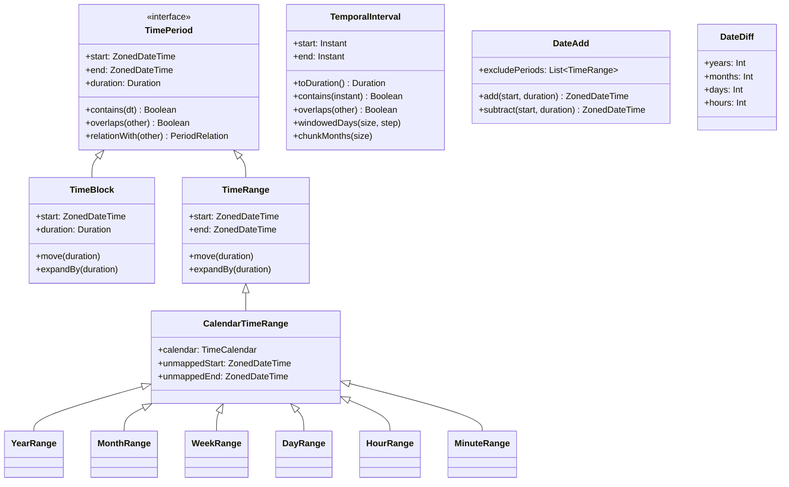

# Module bluetape4k-javatimes

[English](./README.md) | 한국어

Java Time API (java.time)를 위한 고급 시간 연산 라이브러리입니다. Temporal Interval, Period Framework, Temporal Range 등 복잡한 시간 관련 작업을 지원합니다.

## 개요

`bluetape4k-javatimes`는 `bluetape4k-core`의 기초 시간 DSL(
`io.bluetape4k.javatimes` 패키지)을 기반으로, Joda-Time 스타일의 Interval, 영업일 계산, 캘린더 범위, Flow 기반 시계열 처리 등 고급 시간 연산 기능을 제공합니다.

> **참고**: Duration/Period DSL, Instant/LocalDateTime/ZonedDateTime 생성, Quarter 등 기초 확장 함수는
> `bluetape4k-core` 모듈의 `io.bluetape4k.javatimes` 패키지에 포함되어 있어 core만 의존해도 사용 가능합니다.

## 의존성

```kotlin
dependencies {
    implementation("io.github.bluetape4k:bluetape4k-javatimes:${bluetape4kVersion}")

    // 필요한 경우 coroutines 지원
    implementation("org.jetbrains.kotlinx:kotlinx-coroutines-core:${coroutinesVersion}")
}
```

## 기초 기능 (bluetape4k-core 제공)

아래 기능들은 `bluetape4k-core` 모듈의
`io.bluetape4k.javatimes` 패키지에 포함되어 있습니다. core만 의존해도 사용 가능하며, javatimes 모듈은 core에 의존하므로 함께 제공됩니다.

- **Duration/Period DSL**: `5.days()`, `3.hours()`, `2.yearPeriod()` 등
- **Duration 유틸리티**: `durationOfDay()`, `formatHMS()`, `formatISO()` 등
- **Temporal 공통 확장**: `startOfYear()`, `startOfMonth()`, `firstOfMonth`, `toEpochMillis()` 등
- **Instant/LocalDateTime/ZonedDateTime 생성**: `nowInstant()`, `localDateOf()`, `zonedDateTimeOf()` 등
- **TemporalAccessor 포맷팅**: `toIsoInstantString()`, `toIsoDateString()` 등
- **Quarter (분기) 지원**: `Quarter.Q1`, `YearQuarter(2024, Quarter.Q1)` 등

자세한 사용법은 `bluetape4k-core` 모듈 README를 참조하세요.

## 주요 기능 (이 모듈 제공)

### Temporal Interval (interval/)

Joda-Time 스타일의 시간 구간(Interval)을 지원합니다.

```kotlin
// Interval 생성
val start = nowInstant()
val end = start + 1.days()
val interval = temporalIntervalOf(start, end)

// Duration으로 생성
val interval2 = temporalIntervalOf(start, 2.hours())

// 포함 여부 확인
val someInstant = start + 30.minutes()
interval.contains(someInstant)  // true

// 겹침 여부 확인
val otherInterval = temporalIntervalOf(start + 12.hours(), end + 12.hours())
interval.overlaps(otherInterval)  // true

// Duration 변환
val duration = interval.toDuration()

// Windowed 연산 (이동 윈도우)
interval.windowedYears(3, 1)    // 3년 단위, 1년씩 이동
interval.windowedMonths(6, 1)   // 6개월 단위, 1개월씩 이동
interval.windowedDays(7, 1)     // 7일 단위, 1일씩 이동

// Chunked 연산 (구간 분할)
interval.chunkYears(1)          // 1년 단위로 분할
interval.chunkMonths(3)         // 3개월(분기) 단위로 분할
interval.chunkDays(1)           // 1일 단위로 분할
```

### Period Framework (period/)

복잡한 기간 연산과 관계를 처리하는 프레임워크를 제공합니다.

#### TimePeriod, TimeBlock, TimeRange

```kotlin
// TimeBlock: 시작 시각과 기간으로 정의
val block = TimeBlock(start, 2.hours())

// TimeRange: 시작 시각과 종료 시각으로 정의
val range = TimeRange(start, end)

// 기간 조작
block.move(1.hours())       // 1시간 이동
range.expandBy(30.minutes()) // 30분 확장

// 관계 확인
val relation = block.relationWith(otherBlock)
// PeriodRelation: Before, After, StartTouching, EndTouching,
//                 ExactMatch, Inside, Covers, Overlap, etc.
```

#### DateAdd - 영업일 계산

주말이나 공휴일을 제외한 영업일 계산을 지원합니다.

```kotlin
val dateAdd = DateAdd().apply {
    excludePeriods += TimeRange(start.startOfDay(), (start + 2.days()).startOfDay())
    excludePeriods += TimeRange(holiday.startOfDay(), (holiday + 1.days()).startOfDay())
}

// 제외 기간을 고려해 영업일 기준 계산
dateAdd.add(start, 5.days())
dateAdd.subtract(start, 3.days())
```

#### DateDiff - 기간 차이 계산

```kotlin
val dateDiff = DateDiff(start, end)

dateDiff.years         // 년 차이
dateDiff.months        // 월 차이
dateDiff.days          // 일 차이
dateDiff.hours         // 시간 차이
dateDiff.minutes       // 분 차이
dateDiff.seconds       // 초 차이
```

#### TimeCalendar / TimeCalendarConfig

`TimeCalendar`은 기간의 시작/종료 매핑과 주 시작 요일 같은 "달력 규칙"을 캡슐화합니다.
현재 `TimeCalendarConfig`가 직접 제공하는 값은 다음 세 가지입니다.

- `startOffset`: 기간 시작 시각을 매핑할 때 적용할 오프셋
- `endOffset`: 기간 종료 시각을 매핑할 때 적용할 오프셋
- `firstDayOfWeek`: 주간 계산 시 사용할 시작 요일

기본 설정은 시작 시각에 `0ns`, 종료 시각에 `-1ns`를 적용해 `[start, end)` 형태를 표현합니다.
양 끝을 모두 포함해야 하면 `TimeCalendarConfig.EmptyOffset` 또는 `TimeCalendar.EmptyOffset`을 사용할 수 있습니다.

```kotlin
import java.time.DayOfWeek
import java.time.Duration

val calendar = TimeCalendar(
    TimeCalendarConfig(
        startOffset = Duration.ofHours(1),
        endOffset = Duration.ofHours(-1),
        firstDayOfWeek = DayOfWeek.SUNDAY,
    )
)

val range = CalendarTimeRange(
    TimeRange(
        zonedDateTimeOf(2024, 4, 1, 9, 0),
        zonedDateTimeOf(2024, 4, 1, 18, 0),
    ),
    calendar,
)

range.start         // 2024-04-01T10:00...
range.end           // 2024-04-01T17:59:59.999999999...
range.unmappedStart // 2024-04-01T09:00...
range.unmappedEnd   // 2024-04-01T18:00...
```

회계연도처럼 helper 성 연도 판정(`yearOf(...)`, `ZonedDateTime.yearOf(calendar)`, `YearCalendarTimeRange.baseYear`)에
기준 월을 반영하고 싶다면 `baseMonth`를 재정의한 custom calendar를 사용하면 됩니다.

```kotlin
val fiscalCalendar = object : TimeCalendar(TimeCalendarConfig()) {
    override val baseMonth: Int = 4
}

yearOf(2024, 3, fiscalCalendar)  // 2023
yearOf(2024, 4, fiscalCalendar)  // 2024
zonedDateTimeOf(2024, 3, 1).yearOf(fiscalCalendar)  // 2023
```

실무에서는 `TimeCalendarConfig`로 start/end offset, `firstDayOfWeek`를 설정하고, 필요할 때만
`baseMonth`를 custom calendar에서 재정의해 helper 성 계산에 쓰는 방식이 가장 안전합니다.

### Calendar Ranges (period/ranges/)

캘린더 단위의 범위 객체를 제공합니다.

```kotlin
val now = nowZonedDateTime()

// 캘린더 범위 생성
val yearRange = YearRange(now)           // 해당 연도 전체
val monthRange = MonthRange(now)         // 해당 월 전체
val weekRange = WeekRange(now)           // 해당 주 전체 (월~일)
val dayRange = DayRange(now)             // 해당 일 전체 (00:00~23:59)
val hourRange = HourRange(now)           // 해당 시간 (정각~59분)
val minuteRange = MinuteRange(now)       // 해당 분 (00초~59초)

// 범위 정보
yearRange.year              // 연도
monthRange.monthOfYear      // 월
weekRange.weekOfYear        // 주차

// Collection - 연속된 범위 생성
val months = MonthRangeCollection(now, 6)    // 현재부터 6개월
val days = DayRangeCollection(now, 30)       // 현재부터 30일

months.forEach { monthRange ->
    println("${monthRange.year}-${monthRange.monthOfYear}")
}
```

#### Coroutines 지원 (period/ranges/coroutines/)

Flow 기반의 캘린더 범위 연산을 지원합니다.

```kotlin
import kotlinx.coroutines.flow.*

// Flow 생성
flowOfYearRange(startTime, 5)      // 5년치 연도 범위
    .collect { yearRange ->
        println(yearRange.year)
    }

flowOfMonthRange(startTime, 12)    // 12개월치 월 범위
    .collect { monthRange ->
        println("${monthRange.year}-${monthRange.monthOfYear}")
    }

flowOfDayRange(startTime, 30)      // 30일치 일 범위
    .collect { dayRange ->
        println(dayRange.start)
    }

flowOfHourRange(startTime, 24)     // 24시간치 시간 범위
flowOfMinuteRange(startTime, 60)   // 60분치 분 범위
```

### Temporal Range (range/)

Kotlin Range 스타일의 Temporal 범위를 제공합니다.

> 참고: 현재 generic temporal range 계열은 `Instant`, `ZonedDateTime`, `LocalDateTime`, `OffsetDateTime`, `Date`, `Timestamp`
> 처럼 epoch-millis 기반 순회가 가능한 타입을 중심으로 지원합니다. `LocalDate`, `LocalTime`, `OffsetTime`은 지원하지 않습니다.

```kotlin
// 범위 생성
val start = zonedDateTimeOf(2024, 1, 1)
val end = zonedDateTimeOf(2024, 12, 31)
val range = start..end

// Step으로 순회
range.step(1.monthPeriod()).forEach { time ->
    println(time)  // 매월 1일 출력
}

range.step(1.weekPeriod()).forEach { time ->
    println(time)  // 매주 출력
}

// Windowed - 이동 윈도우
range.windowedYears(3, 1)      // 3년 윈도우, 1년씩 이동
range.windowedMonths(6, 2)     // 6개월 윈도우, 2개월씩 이동
range.windowedDays(7, 1)       // 7일 윈도우, 1일씩 이동

// Chunked - 균등 분할
range.chunkedYears(1)          // 1년 단위로 분할
range.chunkedMonths(3)         // 3개월(분기) 단위로 분할
range.chunkedDays(7)           // 7일(주) 단위로 분할

// ZipWithNext - 인접 쌍
range.zipWithNextYear()        // (2024, 2025), (2025, 2026), ...
range.zipWithNextMonth()       // 월 단위 인접 쌍
range.zipWithNextDay()         // 일 단위 인접 쌍
```

#### Coroutines 지원 (range/coroutines/)

Flow 기반의 범위 연산을 제공합니다.

```kotlin
val range = zonedDateTimeOf(2024, 1, 1)..zonedDateTimeOf(2024, 12, 31)

// Flow로 변환
range.asFlow()
    .collect { time ->
        println(time)
    }

// Windowed Flow
range.windowedFlowMonths(3)
    .collect { (start, end) ->
        println("$start ~ $end")
    }

// Chunked Flow
range.chunkedFlowDays(7)
    .collect { weekRange ->
        println("Week: ${weekRange.first} ~ ${weekRange.last}")
    }

// ZipWithNext Flow
range.zipWithNextFlowDays()
    .collect { (day1, day2) ->
        println("$day1 -> $day2")
    }
```

## 패키지 구조

```
io.bluetape4k.javatimes/
├── (root)                         - bluetape4k-core 모듈에 포함
│   └── (Duration DSL, Temporal 확장, Quarter 등 → core README 참조)
│
├── interval/                      - Temporal Interval (Joda-Time 스타일)
│   ├── TemporalInterval.kt       - 불변 Interval
│   ├── MutableTemporalInterval.kt - 가변 Interval
│   ├── ReadableTemporalInterval.kt - Interval 인터페이스
│   └── TemporalIntervalWindowed.kt - Windowed/Chunked 연산
│
├── period/                        - 시간 기간 프레임워크
│   ├── TimePeriod.kt             - 기간 인터페이스
│   ├── TimeBlock.kt              - 시작+Duration 기간
│   ├── TimeRange.kt              - 시작+종료 기간
│   ├── PeriodRelation.kt         - 기간 간 관계 (Before, After, Overlap 등)
│   │
│   ├── calendars/                 - 캘린더 기반 연산
│   │   ├── DateAdd.kt            - 영업일 계산 (주말/공휴일 제외)
│   │   ├── DateDiff.kt           - 기간 차이 계산
│   │   └── seekers/               - 날짜 탐색 (특정 요일 찾기 등)
│   │
│   ├── ranges/                    - 캘린더 범위 (Year~Minute)
│   │   ├── YearRange.kt          - 연도 범위
│   │   ├── MonthRange.kt         - 월 범위
│   │   ├── WeekRange.kt          - 주 범위
│   │   ├── DayRange.kt           - 일 범위
│   │   ├── HourRange.kt          - 시간 범위
│   │   ├── MinuteRange.kt        - 분 범위
│   │   ├── *RangeCollection.kt   - 연속 범위 컬렉션
│   │   └── coroutines/            - Flow 기반 범위 연산
│   │
│   └── timelines/                 - 타임라인 및 Gap 계산
│       ├── Timeline.kt           - 시간순 기간 관리
│       └── TimeGap.kt            - 기간 간 간격 계산
│
└── range/                         - Generic Temporal 범위
    ├── TemporalClosedRange.kt    - Temporal 범위 인터페이스
    ├── TemporalProgression.kt    - Step 기반 순회
    ├── TemporalRangeWindowed.kt  - Windowed/Chunked 연산
    └── coroutines/                - Flow 기반 범위 연산
        ├── TemporalRangeFlow.kt  - Flow 변환
        └── TemporalRangeWindowedFlow.kt - Flow Windowed/Chunked
```

## 사용 예제

### 영업일 계산

```kotlin
val today = todayZonedDateTime()
val dateAdd = DateAdd()

// 공휴일 제외
val holidays = listOf(
    zonedDateTimeOf(2024, 1, 1),   // 신정
    zonedDateTimeOf(2024, 2, 10),  // 설날
    zonedDateTimeOf(2024, 3, 1),   // 삼일절
)
holidays.forEach { holiday ->
    dateAdd.excludePeriods += TimeRange(holiday.startOfDay(), (holiday + 1.days()).startOfDay())
}

// 영업일 기준 10일 후
val after10BusinessDays = dateAdd.add(today, 10.days())
```

### 월별 통계 집계

```kotlin
val startDate = zonedDateTimeOf(2024, 1, 1)
val endDate = zonedDateTimeOf(2024, 12, 31)

val monthlyStats = MonthRangeCollection(startDate, 12)
    .map { monthRange ->
        val start = monthRange.start
        val end = monthRange.end

        // 해당 월의 통계 계산
        MonthlyReport(
            year = monthRange.year,
            month = monthRange.monthOfYear,
            data = calculateStats(start, end)
        )
    }
```

### Flow를 이용한 시계열 데이터 처리

```kotlin
val range = zonedDateTimeOf(2024, 1, 1)..zonedDateTimeOf(2024, 12, 31)

// 주 단위로 데이터 처리
range.chunkedFlowDays(7)
    .map { weekDays ->
        val weekStart = weekDays.first()
        val weekEnd = weekDays.last()
        processWeeklyData(weekStart, weekEnd)
    }
    .collect { weeklyResult ->
        println(weeklyResult)
    }

// 3개월 이동 평균
range.windowedFlowMonths(3)
    .map { (start, end) ->
        calculateMovingAverage(start, end)
    }
    .collect { movingAvg ->
        println(movingAvg)
    }
```

### 기간 겹침 감지

```kotlin
val meeting1 = TimeBlock(
    zonedDateTimeOf(2024, 10, 14, 10, 0),
    2.hours()
)

val meeting2 = TimeBlock(
    zonedDateTimeOf(2024, 10, 14, 11, 0),
    1.hours()
)

val relation = meeting1.relationWith(meeting2)

when (relation) {
    PeriodRelation.Overlap -> println("회의 시간이 겹칩니다")
    PeriodRelation.Before  -> println("meeting1이 먼저입니다")
    PeriodRelation.After   -> println("meeting1이 나중입니다")
    else                   -> println("기타 관계: $relation")
}
```

## 테스트

이 모듈은 JUnit 5와 Kluent를 사용하여 철저히 테스트되었습니다.

```bash
# 전체 테스트 실행
./gradlew :bluetape4k-javatimes:test

# 특정 테스트만 실행
./gradlew test --tests "io.bluetape4k.javatimes.DurationSupportTest"
```

## 클래스 다이어그램



## 참고

- [Java Time API Documentation](https://docs.oracle.com/en/java/javase/21/docs/api/java.base/java/time/package-summary.html)
- [Joda-Time](https://www.joda.org/joda-time/) - 설계 참고
- [kotlinx-datetime](https://github.com/Kotlin/kotlinx-datetime) - Kotlin 멀티플랫폼 시간 라이브러리
