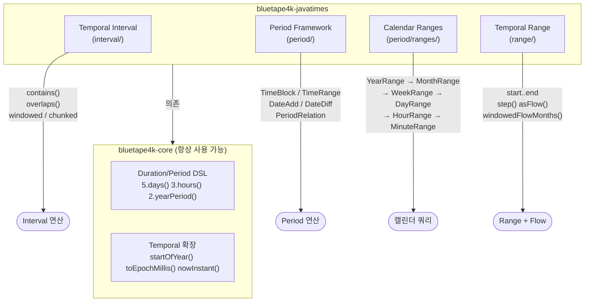
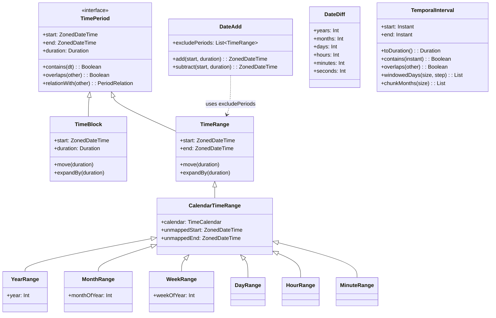
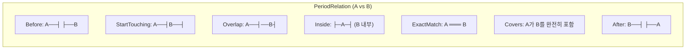

# bluetape4k-javatimes

[English](./README.md) | 한국어

Java Time API (java.time)를 위한 고급 시간 연산 라이브러리입니다. Joda-Time 스타일의 Temporal Interval, Period Framework(TimeBlock/TimeRange/DateAdd/DateDiff), Calendar Range, Kotlin 범위 스타일의 Temporal Range를 지원합니다.

> **참고**: 기초 DSL(`5.days()`, `3.hours()` 등)과 Temporal 확장 함수는 `bluetape4k-core` (
`io.bluetape4k.javatimes`)에 포함됩니다. 이 모듈은 core를 기반으로 구축됩니다.

## 아키텍처

### 기능 구조 개요



### 클래스 계층 — Period Framework



### PeriodRelation — 두 기간의 관계



## 기초 기능 (bluetape4k-core 제공)

아래 기능들은 `bluetape4k-core`의 `io.bluetape4k.javatimes` 패키지에 포함되어 있으며, `javatimes`가 `core`에 의존하므로 항상 사용 가능합니다.

- **Duration/Period DSL**: `5.days()`, `3.hours()`, `2.yearPeriod()` 등
- **Duration 유틸리티**: `durationOfDay()`, `formatHMS()`, `formatISO()` 등
- **Temporal 공통 확장**: `startOfYear()`, `startOfMonth()`, `firstOfMonth`, `toEpochMillis()` 등
- **Instant/LocalDateTime/ZonedDateTime 생성**: `nowInstant()`, `localDateOf()`, `zonedDateTimeOf()` 등
- **TemporalAccessor 포맷팅**: `toIsoInstantString()`, `toIsoDateString()` 등
- **Quarter(분기) 지원**: `Quarter.Q1`, `YearQuarter(2024, Quarter.Q1)` 등

## 주요 기능

### Temporal Interval (`interval/`)

Joda-Time 스타일의 시간 구간(Interval)을 지원합니다.

```kotlin
val start = nowInstant()
val end = start + 1.days()
val interval = temporalIntervalOf(start, end)

interval.contains(start + 30.minutes())  // true
interval.overlaps(temporalIntervalOf(start + 12.hours(), end + 12.hours()))  // true
val duration = interval.toDuration()

// 이동 윈도우
interval.windowedYears(3, 1)    // 3년 단위, 1년씩 이동
interval.windowedMonths(6, 1)   // 6개월 단위, 1개월씩 이동
interval.windowedDays(7, 1)     // 7일 단위, 1일씩 이동

// 구간 분할
interval.chunkYears(1)          // 1년 단위로 분할
interval.chunkMonths(3)         // 분기 단위로 분할
interval.chunkDays(1)           // 일 단위로 분할
```

### Period Framework (`period/`)

#### TimeBlock, TimeRange

```kotlin
// TimeBlock: 시작 시각 + 기간으로 정의
val block = TimeBlock(start, 2.hours())

// TimeRange: 시작 시각 + 종료 시각으로 정의
val range = TimeRange(start, end)

block.move(1.hours())         // 1시간 이동
range.expandBy(30.minutes())  // 30분 확장

val relation = block.relationWith(otherBlock)
// PeriodRelation: Before, After, StartTouching, EndTouching,
//                 ExactMatch, Inside, Covers, Overlap, ...
```

#### DateAdd — 영업일 계산

```kotlin
val dateAdd = DateAdd().apply {
    excludePeriods += TimeRange(holiday.startOfDay(), (holiday + 1.days()).startOfDay())
}

dateAdd.add(today, 10.days())       // 오늘부터 영업일 기준 10일 후
dateAdd.subtract(today, 3.days())   // 오늘부터 영업일 기준 3일 전
```

#### DateDiff — 기간 차이 계산

```kotlin
val dateDiff = DateDiff(start, end)
dateDiff.years    // 년 차이
dateDiff.months   // 월 차이
dateDiff.days     // 일 차이
dateDiff.hours    // 시간 차이
```

#### TimeCalendar / TimeCalendarConfig

`TimeCalendar`는 기간의 시작/종료 매핑과 주 시작 요일 같은 달력 규칙을 캡슐화합니다.  
기본값: 시작 `0ns`, 종료 `-1ns` → `[start, end)` 반열린 구간.

```kotlin
val calendar = TimeCalendar(
    TimeCalendarConfig(
        startOffset = Duration.ofHours(1),
        endOffset = Duration.ofHours(-1),
        firstDayOfWeek = DayOfWeek.SUNDAY,
    )
)

val range = CalendarTimeRange(
    TimeRange(zonedDateTimeOf(2024, 4, 1, 9, 0), zonedDateTimeOf(2024, 4, 1, 18, 0)),
    calendar,
)
range.start         // 2024-04-01T10:00...
range.end           // 2024-04-01T17:59:59.999999999...
range.unmappedStart // 2024-04-01T09:00...
```

회계연도처럼 기준 월이 다를 경우 `baseMonth` 재정의:

```kotlin
val fiscalCalendar = object : TimeCalendar(TimeCalendarConfig()) {
    override val baseMonth: Int = 4
}
yearOf(2024, 3, fiscalCalendar)  // 2023
yearOf(2024, 4, fiscalCalendar)  // 2024
```

### Calendar Ranges (`period/ranges/`)

캘린더 단위에 정렬된 범위 객체를 제공합니다.

```kotlin
val now = nowZonedDateTime()
val yearRange = YearRange(now)       // 해당 연도 전체
val monthRange = MonthRange(now)      // 해당 월 전체
val weekRange = WeekRange(now)       // 월~일 전체
val dayRange = DayRange(now)        // 00:00~23:59
val hourRange = HourRange(now)       // :00~:59
val minuteRange = MinuteRange(now)     // :00~:59

// 연속 범위 컬렉션
val months = MonthRangeCollection(now, 6)  // 현재부터 6개월
val days = DayRangeCollection(now, 30)   // 현재부터 30일
```

Flow 기반 캘린더 범위 (`period/ranges/coroutines/`):

```kotlin
flowOfYearRange(startTime, 5)       // 5년치 연도 범위를 Flow로
    .collect { println(it.year) }

flowOfMonthRange(startTime, 12)     // 12개월치 월 범위를 Flow로
flowOfDayRange(startTime, 30)       // 30일치 일 범위를 Flow로
flowOfHourRange(startTime, 24)
flowOfMinuteRange(startTime, 60)
```

### Temporal Range (`range/`)

Kotlin `..` 범위 구문으로 시간 타입을 다룹니다 (`Instant`, `ZonedDateTime`, `LocalDateTime`, `OffsetDateTime`, `Date`, `Timestamp`).

```kotlin
val range = zonedDateTimeOf(2024, 1, 1)..zonedDateTimeOf(2024, 12, 31)

// Step 순회
range.step(1.monthPeriod()).forEach { println(it) }

// 이동 윈도우
range.windowedMonths(6, 2)   // 6개월 윈도우, 2개월씩 이동
range.windowedDays(7, 1)     // 7일 윈도우, 1일씩 이동

// 균등 분할
range.chunkedMonths(3)        // 분기 단위로 분할
range.chunkedDays(7)          // 주 단위로 분할

// 인접 쌍
range.zipWithNextMonth()      // 월 단위 인접 쌍
range.zipWithNextDay()        // 일 단위 인접 쌍
```

Flow 기반 범위 (`range/coroutines/`):

```kotlin
range.asFlow().collect { println(it) }

range.windowedFlowMonths(3)
    .collect { (start, end) -> println("$start ~ $end") }

range.chunkedFlowDays(7)
    .collect { week -> println("Week: ${week.first()} ~ ${week.last()}") }

range.zipWithNextFlowDays()
    .collect { (d1, d2) -> println("$d1 -> $d2") }
```

## 사용 예제

### 영업일 계산

```kotlin
val dateAdd = DateAdd()
val holidays = listOf(
    zonedDateTimeOf(2024, 1, 1),   // 신정
    zonedDateTimeOf(2024, 2, 10),  // 설날
    zonedDateTimeOf(2024, 3, 1),   // 삼일절
)
holidays.forEach { holiday ->
    dateAdd.excludePeriods += TimeRange(holiday.startOfDay(), (holiday + 1.days()).startOfDay())
}

val after10BusinessDays = dateAdd.add(todayZonedDateTime(), 10.days())
```

### 월별 통계 집계

```kotlin
val monthlyStats = MonthRangeCollection(zonedDateTimeOf(2024, 1, 1), 12)
    .map { monthRange ->
        MonthlyReport(
            year = monthRange.year,
            month = monthRange.monthOfYear,
            data = calculateStats(monthRange.start, monthRange.end)
        )
    }
```

### Flow를 이용한 시계열 데이터 처리

```kotlin
val range = zonedDateTimeOf(2024, 1, 1)..zonedDateTimeOf(2024, 12, 31)

// 주 단위로 처리
range.chunkedFlowDays(7)
    .map { week -> processWeeklyData(week.first(), week.last()) }
    .collect { println(it) }

// 3개월 이동 평균
range.windowedFlowMonths(3)
    .map { (start, end) -> calculateMovingAverage(start, end) }
    .collect { println(it) }
```

### 기간 겹침 감지

```kotlin
val meeting1 = TimeBlock(zonedDateTimeOf(2024, 10, 14, 10, 0), 2.hours())
val meeting2 = TimeBlock(zonedDateTimeOf(2024, 10, 14, 11, 0), 1.hours())

when (meeting1.relationWith(meeting2)) {
    PeriodRelation.Overlap -> println("회의 시간이 겹칩니다")
    PeriodRelation.Before  -> println("meeting1이 먼저입니다")
    PeriodRelation.After   -> println("meeting1이 나중입니다")
    else -> println("기타 관계: ${meeting1.relationWith(meeting2)}")
}
```

## 테스트

```bash
./gradlew :bluetape4k-javatimes:test
./gradlew test --tests "io.bluetape4k.javatimes.DurationSupportTest"
```

## 참고

- [Java Time API Documentation](https://docs.oracle.com/en/java/javase/21/docs/api/java.base/java/time/package-summary.html)
- [Joda-Time](https://www.joda.org/joda-time/) — 설계 참고
- [kotlinx-datetime](https://github.com/Kotlin/kotlinx-datetime) — Kotlin 멀티플랫폼 시간 라이브러리

## 의존성

```kotlin
dependencies {
    implementation("io.github.bluetape4k:bluetape4k-javatimes:${bluetape4kVersion}")

    // 코루틴 지원 (선택)
    implementation("org.jetbrains.kotlinx:kotlinx-coroutines-core:${coroutinesVersion}")
}
```
