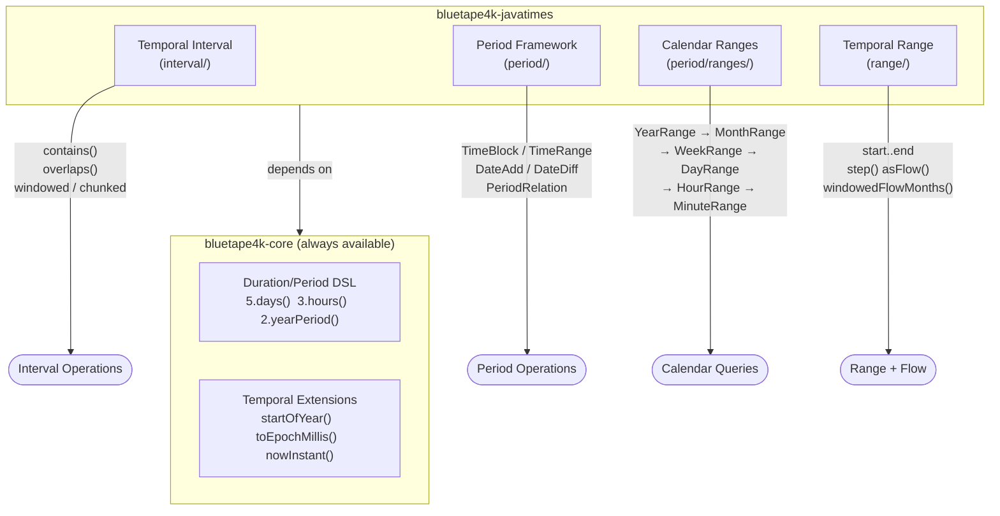
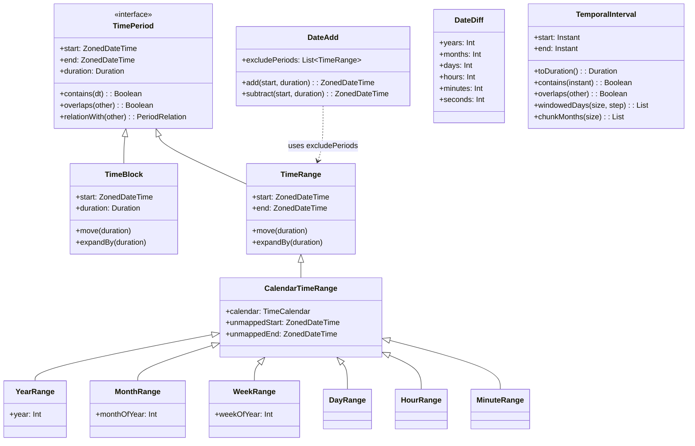
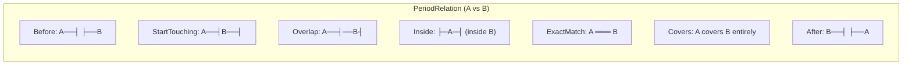

# bluetape4k-javatimes

English | [한국어](./README.ko.md)

An advanced time-operations library for the Java Time API (java.time). Supports Joda-Time-style Temporal Intervals, a Period Framework (TimeBlock/TimeRange/DateAdd/DateDiff), Calendar Ranges, and Kotlin-range-style Temporal Ranges.

> **Note**: Basic DSL (`5.days()`, `3.hours()`, etc.) and Temporal extension functions are in `bluetape4k-core` (
`io.bluetape4k.javatimes`). This module builds on top of core.

## Architecture

### Feature Overview



### Class Hierarchy — Period Framework



### PeriodRelation — How Two Periods Relate



## Core Features (from `bluetape4k-core`)

The following are in `bluetape4k-core`'s `io.bluetape4k.javatimes` package and always available since
`javatimes` depends on `core`.

- **Duration/Period DSL**: `5.days()`, `3.hours()`, `2.yearPeriod()`, etc.
- **Duration utilities**: `durationOfDay()`, `formatHMS()`, `formatISO()`, etc.
- **Common temporal extensions**: `startOfYear()`, `startOfMonth()`, `firstOfMonth`, `toEpochMillis()`, etc.
- **Instant/LocalDateTime/ZonedDateTime creation**: `nowInstant()`, `localDateOf()`, `zonedDateTimeOf()`, etc.
- **TemporalAccessor formatting**: `toIsoInstantString()`, `toIsoDateString()`, etc.
- **Quarter support**: `Quarter.Q1`, `YearQuarter(2024, Quarter.Q1)`, etc.

## Features

### Temporal Interval (`interval/`)

Joda-Time-style time interval support.

```kotlin
val start = nowInstant()
val end = start + 1.days()
val interval = temporalIntervalOf(start, end)

interval.contains(start + 30.minutes())          // true
interval.overlaps(temporalIntervalOf(start + 12.hours(), end + 12.hours()))  // true
val duration = interval.toDuration()

// Sliding window
interval.windowedYears(3, 1)    // 3-year window, step 1 year
interval.windowedMonths(6, 1)   // 6-month window, step 1 month
interval.windowedDays(7, 1)     // 7-day window, step 1 day

// Fixed chunks
interval.chunkYears(1)          // 1-year chunks
interval.chunkMonths(3)         // quarterly chunks
interval.chunkDays(1)           // daily chunks
```

### Period Framework (`period/`)

#### TimeBlock and TimeRange

```kotlin
// TimeBlock: defined by start + duration
val block = TimeBlock(start, 2.hours())

// TimeRange: defined by start + end
val range = TimeRange(start, end)

block.move(1.hours())         // shift forward 1 hour
range.expandBy(30.minutes())  // expand by 30 minutes

val relation = block.relationWith(otherBlock)
// PeriodRelation: Before, After, StartTouching, EndTouching,
//                 ExactMatch, Inside, Covers, Overlap, ...
```

#### DateAdd — Business Day Calculations

```kotlin
val dateAdd = DateAdd().apply {
    excludePeriods += TimeRange(holiday.startOfDay(), (holiday + 1.days()).startOfDay())
}

dateAdd.add(today, 10.days())       // 10 business days from today
dateAdd.subtract(today, 3.days())   // 3 business days before today
```

#### DateDiff — Period Difference

```kotlin
val dateDiff = DateDiff(start, end)
dateDiff.years    // difference in years
dateDiff.months   // difference in months
dateDiff.days     // difference in days
dateDiff.hours    // difference in hours
```

#### TimeCalendar / TimeCalendarConfig

`TimeCalendar` encapsulates calendar rules: start/end offset and the first day of the week.  
Default: `0ns` start offset, `-1ns` end offset → `[start, end)` half-open interval.

```kotlin
val calendar = TimeCalendar(
    TimeCalendarConfig(
        startOffset = Duration.ofHours(1),
        endOffset = Duration.ofHours(-1),
        firstDayOfWeek = DayOfWeek.SUNDAY,
    )
)

val range =
    CalendarTimeRange(TimeRange(zonedDateTimeOf(2024, 4, 1, 9, 0), zonedDateTimeOf(2024, 4, 1, 18, 0)), calendar)
range.start         // 2024-04-01T10:00...
range.end           // 2024-04-01T17:59:59.999999999...
range.unmappedStart // 2024-04-01T09:00...
```

Custom fiscal year (override `baseMonth`):

```kotlin
val fiscalCalendar = object : TimeCalendar(TimeCalendarConfig()) {
    override val baseMonth: Int = 4
}
yearOf(2024, 3, fiscalCalendar)  // 2023
yearOf(2024, 4, fiscalCalendar)  // 2024
```

### Calendar Ranges (`period/ranges/`)

Ranges aligned to calendar units.

```kotlin
val now = nowZonedDateTime()
val yearRange = YearRange(now)       // entire year
val monthRange = MonthRange(now)      // entire month
val weekRange = WeekRange(now)       // Mon–Sun
val dayRange = DayRange(now)        // 00:00–23:59
val hourRange = HourRange(now)       // :00–:59
val minuteRange = MinuteRange(now)     // :00–:59

// Consecutive range collections
val months = MonthRangeCollection(now, 6)  // 6 months from now
val days = DayRangeCollection(now, 30)   // 30 days from now
```

Flow-based calendar ranges (`period/ranges/coroutines/`):

```kotlin
flowOfYearRange(startTime, 5)       // 5 yearly ranges as Flow
    .collect { println(it.year) }

flowOfMonthRange(startTime, 12)     // 12 monthly ranges as Flow
flowOfDayRange(startTime, 30)       // 30 daily ranges as Flow
flowOfHourRange(startTime, 24)
flowOfMinuteRange(startTime, 60)
```

### Temporal Range (`range/`)

Kotlin `..` range syntax for temporal types (`Instant`, `ZonedDateTime`, `LocalDateTime`, `OffsetDateTime`, `Date`,
`Timestamp`).

```kotlin
val range = zonedDateTimeOf(2024, 1, 1)..zonedDateTimeOf(2024, 12, 31)

// Step-based iteration
range.step(1.monthPeriod()).forEach { println(it) }

// Windowed
range.windowedMonths(6, 2)   // 6-month window, step 2 months
range.windowedDays(7, 1)     // 7-day window, step 1 day

// Chunked
range.chunkedMonths(3)        // quarterly chunks
range.chunkedDays(7)          // weekly chunks

// Zip with next
range.zipWithNextMonth()      // adjacent month pairs
range.zipWithNextDay()        // adjacent day pairs
```

Flow-based temporal range (`range/coroutines/`):

```kotlin
range.asFlow().collect { println(it) }

range.windowedFlowMonths(3)
    .collect { (start, end) -> println("$start ~ $end") }

range.chunkedFlowDays(7)
    .collect { week -> println("Week: ${week.first()} ~ ${week.last()}") }

range.zipWithNextFlowDays()
    .collect { (d1, d2) -> println("$d1 -> $d2") }
```

## Usage Examples

### Business Day Calculation

```kotlin
val dateAdd = DateAdd()
val holidays = listOf(
    zonedDateTimeOf(2024, 1, 1),
    zonedDateTimeOf(2024, 2, 10),
    zonedDateTimeOf(2024, 3, 1),
)
holidays.forEach { holiday ->
    dateAdd.excludePeriods += TimeRange(holiday.startOfDay(), (holiday + 1.days()).startOfDay())
}

val after10BusinessDays = dateAdd.add(todayZonedDateTime(), 10.days())
```

### Monthly Statistics Aggregation

```kotlin
val monthlyStats = MonthRangeCollection(zonedDateTimeOf(2024, 1, 1), 12)
    .map { monthRange ->
        MonthlyReport(
            year = monthRange.year,
            month = monthRange.monthOfYear,
            data = calculateStats(monthRange.start, monthRange.end)
        )
    }
```

### Time-Series Data Processing with Flow

```kotlin
val range = zonedDateTimeOf(2024, 1, 1)..zonedDateTimeOf(2024, 12, 31)

// Weekly chunks
range.chunkedFlowDays(7)
    .map { week -> processWeeklyData(week.first(), week.last()) }
    .collect { println(it) }

// 3-month moving average
range.windowedFlowMonths(3)
    .map { (start, end) -> calculateMovingAverage(start, end) }
    .collect { println(it) }
```

### Overlap Detection

```kotlin
val meeting1 = TimeBlock(zonedDateTimeOf(2024, 10, 14, 10, 0), 2.hours())
val meeting2 = TimeBlock(zonedDateTimeOf(2024, 10, 14, 11, 0), 1.hours())

when (meeting1.relationWith(meeting2)) {
    PeriodRelation.Overlap -> println("Meetings overlap")
    PeriodRelation.Before  -> println("meeting1 comes first")
    PeriodRelation.After   -> println("meeting1 comes later")
    else -> println("Other relation: ${meeting1.relationWith(meeting2)}")
}
```

## Testing

```bash
./gradlew :bluetape4k-javatimes:test
./gradlew test --tests "io.bluetape4k.javatimes.DurationSupportTest"
```

## References

- [Java Time API Documentation](https://docs.oracle.com/en/java/javase/21/docs/api/java.base/java/time/package-summary.html)
- [Joda-Time](https://www.joda.org/joda-time/) — design inspiration
- [kotlinx-datetime](https://github.com/Kotlin/kotlinx-datetime) — Kotlin multiplatform time library

## Dependency

```kotlin
dependencies {
    implementation("io.github.bluetape4k:bluetape4k-javatimes:${bluetape4kVersion}")

    // Optional coroutines support
    implementation("org.jetbrains.kotlinx:kotlinx-coroutines-core:${coroutinesVersion}")
}
```
