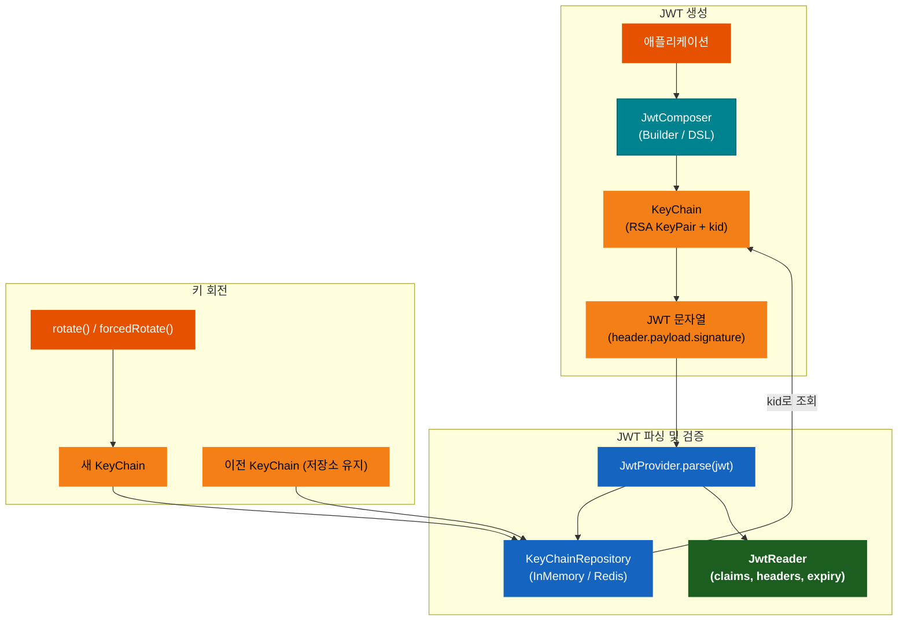
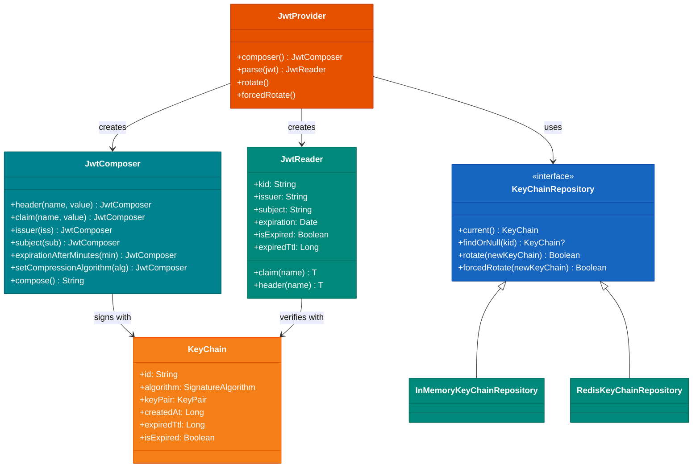

# Module bluetape4k-jwt

[English](./README.md) | 한국어

[JSON Web Token (JWT)](https://jwt.io/)을 생성하고 파싱하는 라이브러리입니다.
[jjwt 0.13.x](https://github.com/jwtk/jjwt) 라이브러리를 기반으로 Kotlin 친화적인 API와 KeyChain 관리 기능을 제공합니다.

## 아키텍처

### JWT 생성 및 검증 흐름



### 클래스 다이어그램



### JWT 토큰 구조

```
header.            payload.                 signature
{                  {                        HMACSHA256(
  "alg": "RS256",    "sub": "user-auth",      base64UrlEncode(header) + "." +
  "typ": "JWT",      "iss": "bluetape4k",     base64UrlEncode(payload),
  "kid": "abc123"    "exp": 1234567890,       privateKey
}                    "iat": 1234567800      )
                   }
```

## 주요 기능

- **JWT 생성**: Builder 패턴 및 Kotlin DSL 지원
- **JWT 파싱**: 검증된 토큰에서 클레임 추출
- **KeyChain 관리**: RSA 키 페어 자동 생성 및 회전(Rotation)
- **분산 환경 지원**: Redis/MongoDB를 통한 KeyChain 공유
- **압축 지원**: jjwt 내장 DEF(Deflate), GZIP 압축 알고리즘

## 사용 예시

### 기본 JWT 생성 및 파싱

```kotlin
import io.bluetape4k.jwt.provider.JwtProviderFactory

val jwtProvider = JwtProviderFactory.default()

// JWT 생성
val jwt: String = jwtProvider.composer()
    .header("x-service", "bluetape4k")
    .claim("author", "debop")
    .claim("role", "admin")
    .issuer("bluetape4k")
    .subject("user-auth")
    .expirationAfterMinutes(60L)
    .compose()

// JWT 파싱
val reader = jwtProvider.parse(jwt)

reader.header<String>("x-service")  // "bluetape4k"
reader.claim<String>("author")      // "debop"
reader.claim<String>("role")        // "admin"
reader.issuer                       // "bluetape4k"
reader.subject                      // "user-auth"
reader.expiration                   // 만료 시간
reader.isExpired                    // 만료 여부
```

### Kotlin DSL로 JWT 생성

```kotlin
import io.bluetape4k.jwt.composer.composeJwt
import io.bluetape4k.jwt.keychain.KeyChain

val keyChain = KeyChain()

val jwt: String = composeJwt(keyChain) {
    header("x-author", "debop")
    header("x-version", "1.0")

    claim("service", "bluetape4k")
    claim("userId", 12345L)
    claim("roles", listOf("admin", "user"))

    issuer = "bluetape4k"
    subject = "access-token"
    audience = "api-server"
    expirationAfterMinutes = 60L
}
```

### JWT Reader 사용

```kotlin
import io.bluetape4k.jwt.provider.JwtProviderFactory

val jwtProvider = JwtProviderFactory.default()
val jwt = jwtProvider.composer()
    .claim("userId", 12345L)
    .claim("email", "user@example.com")
    .claim("roles", listOf("admin", "user"))
    .compose()

val reader = jwtProvider.parse(jwt)

// Key ID (kid) 확인
val kid = reader.kid

// 만료 여부 확인
if (reader.isExpired) {
    throw SecurityException("Token expired")
}

// 만료까지 남은 시간 (TTL)
val ttl = reader.expiredTtl

// 클레임 조회 (타입 안전)
val userId: Long? = reader.claim("userId")
val email: String? = reader.claim("email")

// 헤더 조회
val header = reader.header<String>("x-custom")
```

### KeyChain 회전 (Rotation)

보안을 위해 주기적으로 키를 회전시켜야 합니다.

```kotlin
import io.bluetape4k.jwt.provider.JwtProviderFactory

val jwtProvider = JwtProviderFactory.default()

// 새 JWT 생성 (현재 KeyChain 사용)
val jwt1 = jwtProvider.composer().claim("user", "user1").compose()

// 강제 회전
jwtProvider.forcedRotate()

// 새 JWT 생성 (새로운 KeyChain 사용)
val jwt2 = jwtProvider.composer().claim("user", "user2").compose()

// 이전 JWT도 저장소에 KeyChain이 남아있으면 검증 가능
val reader1 = jwtProvider.parse(jwt1)  // OK (저장소에 이전 KeyChain이 있는 경우)
```

### 압축 사용

큰 클레임 데이터가 있는 경우 jjwt 내장 압축 알고리즘을 사용할 수 있습니다.

```kotlin
import io.bluetape4k.jwt.codec.JwtCodecs
import io.bluetape4k.jwt.provider.JwtProviderFactory

val jwtProvider = JwtProviderFactory.default()

// Deflate 압축 (jjwt 내장)
val jwtDeflate = jwtProvider.composer()
    .claim("largeData", largeJsonObject)
    .setCompressionAlgorithm(JwtCodecs.Deflate)
    .compose()

// GZIP 압축 (jjwt 내장)
val jwtGzip = jwtProvider.composer()
    .claim("largeData", largeJsonObject)
    .setCompressionAlgorithm(JwtCodecs.Gzip)
    .compose()

// 압축된 JWT도 일반 파싱으로 처리
val reader = jwtProvider.parse(jwtDeflate)
```

### DSL에서 압축 사용

```kotlin
import io.bluetape4k.jwt.codec.JwtCodecs
import io.bluetape4k.jwt.composer.composeJwt

val jwt = composeJwt(keyChain) {
    claim("largeData", largeJsonObject)
    compressionAlgorithm = JwtCodecs.Deflate
    expirationAfterMinutes = 60L
}
```

## 분산 환경에서의 사용

멀티 서버 환경에서는 KeyChain을 공유해야 합니다.

### Redis 기반 KeyChain 공유

```kotlin
import io.bluetape4k.jwt.keychain.repository.redis.RedisKeyChainRepository
import io.bluetape4k.jwt.provider.JwtProviderFactory
import org.redisson.api.RedissonClient

// Redis 저장소 생성
val repository = RedisKeyChainRepository(redissonClient)

// Provider 생성 (자동으로 Redis에서 KeyChain 로드)
val jwtProvider = JwtProviderFactory.default(keyChainRepository = repository)

// 특정 서버에서 KeyChain 회전
// 다른 서버들은 1분마다 자동으로 새 KeyChain을 로드
jwtProvider.rotate()
```

### In-Memory KeyChain 저장소

```kotlin
import io.bluetape4k.jwt.keychain.repository.inmemory.InMemoryKeyChainRepository
import io.bluetape4k.jwt.provider.JwtProviderFactory

// 단일 서버용 In-Memory 저장소
val repository = InMemoryKeyChainRepository()
val jwtProvider = JwtProviderFactory.default(keyChainRepository = repository)
```

### 커스텀 KeyChain 저장소 구현

```kotlin
import io.bluetape4k.jwt.keychain.repository.KeyChainRepository
import io.bluetape4k.jwt.keychain.KeyChain

class CustomKeyChainRepository: KeyChainRepository {

    override fun current(): KeyChain {
        // 현재 KeyChain 반환
    }

    override fun findOrNull(kid: String): KeyChain? {
        // kid로 KeyChain 조회
    }

    override fun rotate(newKeyChain: KeyChain): Boolean {
        // 새 KeyChain으로 회전 (다른 서버가 이미 회전한 경우 false)
    }

    override fun forcedRotate(newKeyChain: KeyChain): Boolean {
        // 강제 회전
    }
}
```

## JwtProvider 설정

```kotlin
import io.bluetape4k.jwt.provider.JwtProviderFactory
import io.bluetape4k.jwt.JwtConsts
import io.jsonwebtoken.Jwts

val jwtProvider = JwtProviderFactory.default(
    signatureAlgorithm = Jwts.SIG.RS256,  // RSA 256 (기본값)
)
```

### 지원 서명 알고리즘

| 알고리즘  | 설명                      |
|-------|-------------------------|
| RS256 | RSA with SHA-256 (권장)   |
| RS384 | RSA with SHA-384        |
| RS512 | RSA with SHA-512        |
| PS256 | RSASSA-PSS with SHA-256 |
| PS384 | RSASSA-PSS with SHA-384 |
| PS512 | RSASSA-PSS with SHA-512 |

### 지원 압축 알고리즘

| 알고리즘                | 설명                          |
|---------------------|-----------------------------|
| `JwtCodecs.Deflate` | Deflate 압축 (`Jwts.ZIP.DEF`) |
| `JwtCodecs.Gzip`    | GZIP 압축 (`Jwts.ZIP.GZIP`)   |

## KeyChain 구조

```kotlin
class KeyChain(
    val algorithm: SignatureAlgorithm,  // 서명 알고리즘 (jjwt 0.13.x SignatureAlgorithm)
    val keyPair: KeyPair,               // RSA 키 페어
    val id: String,                     // KeyChain 고유 ID (kid)
    val createdAt: Long,                // 생성 시각 (epoch millis)
    val expiredTtl: Long,              // 만료 TTL (millis)
) {
    val isExpired: Boolean              // 만료 여부
    val expiredAt: Long                 // 만료 시각 (epoch millis)
}
```

## 보안 권장사항

1. **주기적 키 회전**: 최소 30분~1시간마다 KeyChain 회전
2. **짧은 만료 시간**: Access Token은 15~60분, Refresh Token은 7~30일
3. **HTTPS 필수**: JWT는 네트워크에서 암호화되어야 함
4. **민감 정보 제외**: JWT에 비밀번호, 신용카드 등 민감 정보 포함 금지
5. **분산 환경**: Redis/MongoDB로 KeyChain 공유

## 의존성 추가

```kotlin
dependencies {
    implementation("io.github.bluetape4k:bluetape4k-jwt:${version}")
}
```

## 참고 자료

- [JWT.io](https://jwt.io/)
- [jjwt GitHub](https://github.com/jwtk/jjwt)
- [RFC 7519 - JSON Web Token](https://tools.ietf.org/html/rfc7519)
