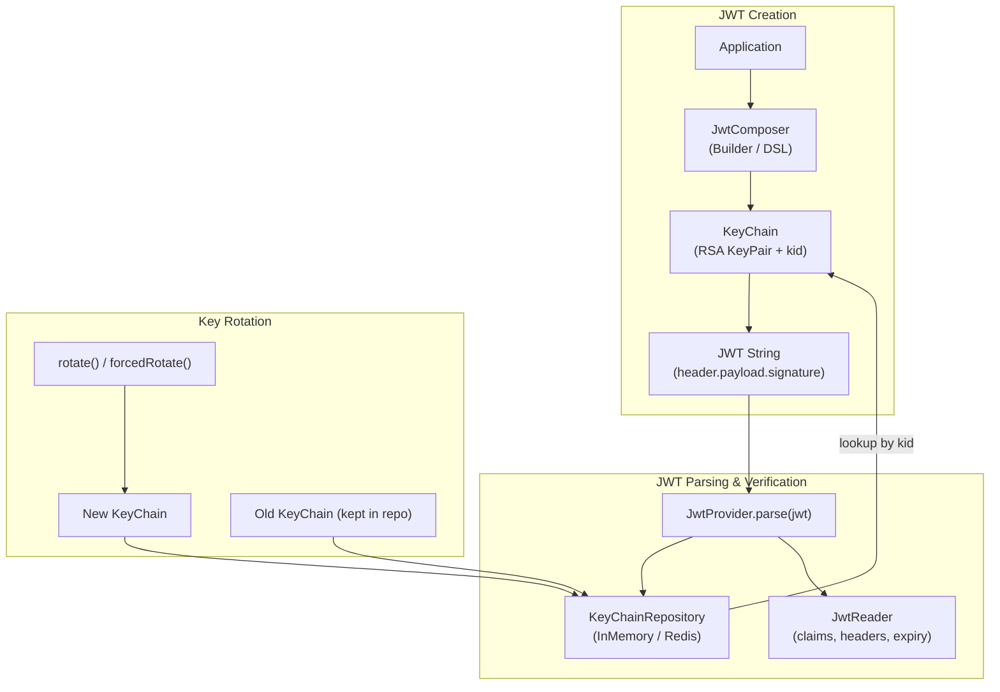
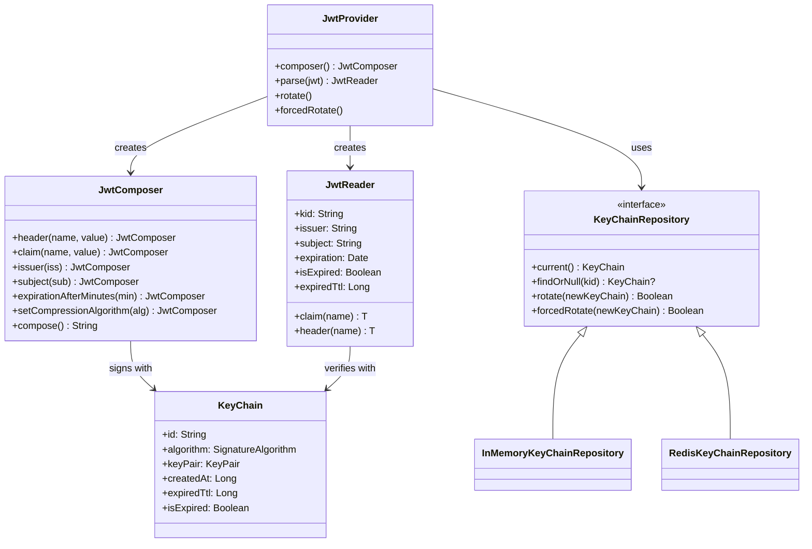

# Module bluetape4k-jwt

English | [한국어](./README.ko.md)

A library for creating and parsing [JSON Web Tokens (JWT)](https://jwt.io/). Built on [jjwt 0.13.x](https://github.com/jwtk/jjwt), it provides a Kotlin-friendly API and KeyChain management.

## Architecture

### JWT Create and Verify Flow



### Class Diagram



### JWT Token Structure

```
header.            payload.                 signature
{                  {                        HMACSHA256(
  "alg": "RS256",    "sub": "user-auth",      base64UrlEncode(header) + "." +
  "typ": "JWT",      "iss": "bluetape4k",     base64UrlEncode(payload),
  "kid": "abc123"    "exp": 1234567890,       privateKey
}                    "iat": 1234567800      )
                   }
```

## Key Features

- **JWT creation**: Builder pattern and Kotlin DSL support
- **JWT parsing**: Extract claims from verified tokens
- **KeyChain management**: Automatic RSA key pair generation and rotation
- **Distributed environment support**: Share KeyChains via Redis/MongoDB
- **Compression**: Built-in jjwt DEF (Deflate) and GZIP compression

## Usage Examples

### Basic JWT Creation and Parsing

```kotlin
import io.bluetape4k.jwt.provider.JwtProviderFactory

val jwtProvider = JwtProviderFactory.default()

// Create a JWT
val jwt: String = jwtProvider.composer()
    .header("x-service", "bluetape4k")
    .claim("author", "debop")
    .claim("role", "admin")
    .issuer("bluetape4k")
    .subject("user-auth")
    .expirationAfterMinutes(60L)
    .compose()

// Parse the JWT
val reader = jwtProvider.parse(jwt)

reader.header<String>("x-service")  // "bluetape4k"
reader.claim<String>("author")      // "debop"
reader.claim<String>("role")        // "admin"
reader.issuer                       // "bluetape4k"
reader.subject                      // "user-auth"
reader.expiration                   // expiration time
reader.isExpired                    // whether expired
```

### Creating JWTs with Kotlin DSL

```kotlin
import io.bluetape4k.jwt.composer.composeJwt
import io.bluetape4k.jwt.keychain.KeyChain

val keyChain = KeyChain()

val jwt: String = composeJwt(keyChain) {
    header("x-author", "debop")
    header("x-version", "1.0")

    claim("service", "bluetape4k")
    claim("userId", 12345L)
    claim("roles", listOf("admin", "user"))

    issuer = "bluetape4k"
    subject = "access-token"
    audience = "api-server"
    expirationAfterMinutes = 60L
}
```

### Using JwtReader

```kotlin
import io.bluetape4k.jwt.provider.JwtProviderFactory

val jwtProvider = JwtProviderFactory.default()
val jwt = jwtProvider.composer()
    .claim("userId", 12345L)
    .claim("email", "user@example.com")
    .claim("roles", listOf("admin", "user"))
    .compose()

val reader = jwtProvider.parse(jwt)

val kid = reader.kid

if (reader.isExpired) {
    throw SecurityException("Token expired")
}

val ttl = reader.expiredTtl

val userId: Long? = reader.claim("userId")
val email: String? = reader.claim("email")

val header = reader.header<String>("x-custom")
```

### KeyChain Rotation

Keys should be rotated periodically for security.

```kotlin
import io.bluetape4k.jwt.provider.JwtProviderFactory

val jwtProvider = JwtProviderFactory.default()

val jwt1 = jwtProvider.composer().claim("user", "user1").compose()

jwtProvider.forcedRotate()

val jwt2 = jwtProvider.composer().claim("user", "user2").compose()

// Old JWTs can still be verified if the previous KeyChain remains in the repository
val reader1 = jwtProvider.parse(jwt1)
```

### Compression

Use built-in jjwt compression for large claim payloads.

```kotlin
import io.bluetape4k.jwt.codec.JwtCodecs
import io.bluetape4k.jwt.provider.JwtProviderFactory

val jwtProvider = JwtProviderFactory.default()

val jwtDeflate = jwtProvider.composer()
    .claim("largeData", largeJsonObject)
    .setCompressionAlgorithm(JwtCodecs.Deflate)
    .compose()

val jwtGzip = jwtProvider.composer()
    .claim("largeData", largeJsonObject)
    .setCompressionAlgorithm(JwtCodecs.Gzip)
    .compose()

val reader = jwtProvider.parse(jwtDeflate)
```

### Compression in DSL

```kotlin
import io.bluetape4k.jwt.codec.JwtCodecs
import io.bluetape4k.jwt.composer.composeJwt

val jwt = composeJwt(keyChain) {
    claim("largeData", largeJsonObject)
    compressionAlgorithm = JwtCodecs.Deflate
    expirationAfterMinutes = 60L
}
```

## Distributed Environments

In a multi-server environment, KeyChains must be shared across nodes.

### Redis-based KeyChain Sharing

```kotlin
import io.bluetape4k.jwt.keychain.repository.redis.RedisKeyChainRepository
import io.bluetape4k.jwt.provider.JwtProviderFactory

val repository = RedisKeyChainRepository(redissonClient)
val jwtProvider = JwtProviderFactory.default(keyChainRepository = repository)

jwtProvider.rotate()
```

### In-Memory KeyChain Repository

```kotlin
import io.bluetape4k.jwt.keychain.repository.inmemory.InMemoryKeyChainRepository
import io.bluetape4k.jwt.provider.JwtProviderFactory

val repository = InMemoryKeyChainRepository()
val jwtProvider = JwtProviderFactory.default(keyChainRepository = repository)
```

### Custom KeyChain Repository

```kotlin
import io.bluetape4k.jwt.keychain.repository.KeyChainRepository
import io.bluetape4k.jwt.keychain.KeyChain

class CustomKeyChainRepository: KeyChainRepository {

    override fun current(): KeyChain { /* return current KeyChain */ }

    override fun findOrNull(kid: String): KeyChain? { /* look up by kid */ }

    override fun rotate(newKeyChain: KeyChain): Boolean {
        /* rotate; return false if another server already rotated */
    }

    override fun forcedRotate(newKeyChain: KeyChain): Boolean { /* forced rotation */ }
}
```

## JwtProvider Configuration

```kotlin
import io.bluetape4k.jwt.provider.JwtProviderFactory
import io.jsonwebtoken.Jwts

val jwtProvider = JwtProviderFactory.default(
    signatureAlgorithm = Jwts.SIG.RS256,  // RSA 256 (default)
)
```

### Supported Signature Algorithms

| Algorithm | Description                    |
|-----------|--------------------------------|
| RS256     | RSA with SHA-256 (recommended) |
| RS384     | RSA with SHA-384               |
| RS512     | RSA with SHA-512               |
| PS256     | RSASSA-PSS with SHA-256        |
| PS384     | RSASSA-PSS with SHA-384        |
| PS512     | RSASSA-PSS with SHA-512        |

### Supported Compression Algorithms

| Algorithm           | Description                          |
|---------------------|--------------------------------------|
| `JwtCodecs.Deflate` | Deflate compression (`Jwts.ZIP.DEF`) |
| `JwtCodecs.Gzip`    | GZIP compression (`Jwts.ZIP.GZIP`)   |

## Security Best Practices

1. **Rotate keys regularly**: Rotate KeyChains at least every 30 minutes to 1 hour
2. **Short expiration times**: Access tokens 15–60 min; refresh tokens 7–30 days
3. **HTTPS required**: JWTs must be transmitted over an encrypted connection
4. **No sensitive data**: Never include passwords, credit card numbers, etc. in JWTs
5. **Distributed environments**: Share KeyChains via Redis/MongoDB

## Dependency

```kotlin
dependencies {
    implementation("io.github.bluetape4k:bluetape4k-jwt:${version}")
}
```

## References

- [JWT.io](https://jwt.io/)
- [jjwt GitHub](https://github.com/jwtk/jjwt)
- [RFC 7519 — JSON Web Token](https://tools.ietf.org/html/rfc7519)
