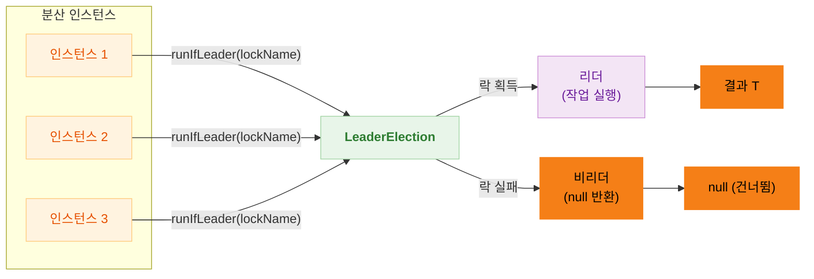
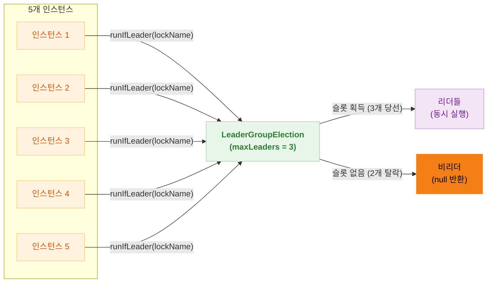
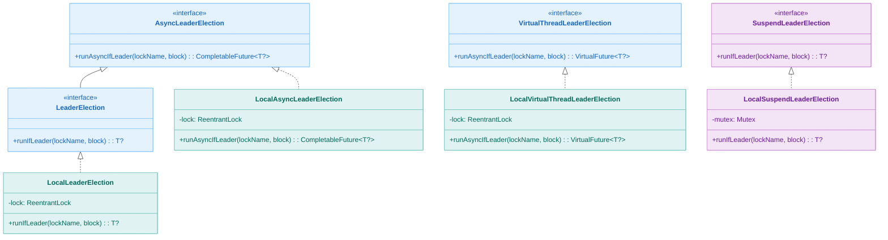
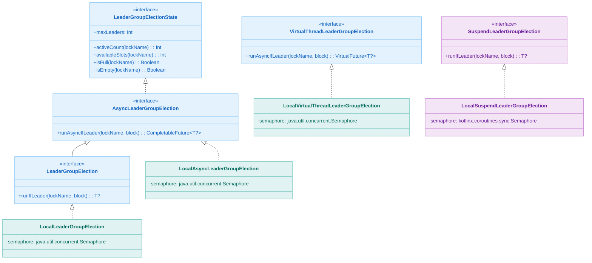
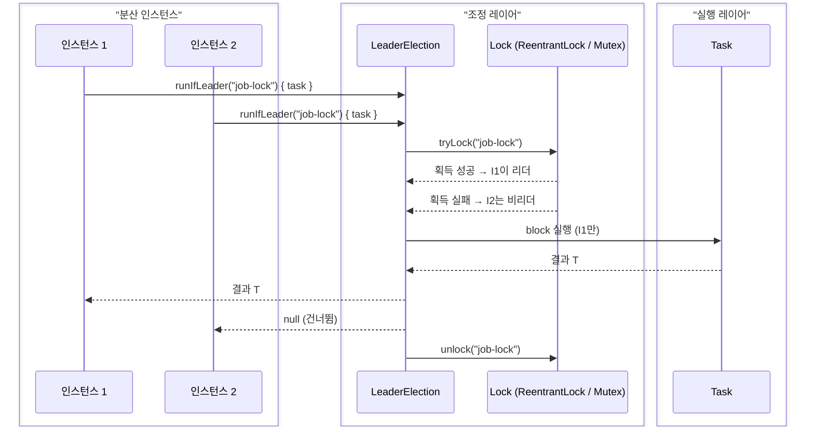

# bluetape4k-leader

[English](./README.md) | 한국어

분산 환경에서 여러 프로세스/스레드 간에 동일한 작업이 중복 실행되는 것을 방지합니다. **리더**로 선출된 인스턴스만 작업을 실행하고 나머지는 건너뜁니다.

## 사용 시나리오

### 단일 리더 (`LeaderElection`) — 동시에 1개만 실행

| 시나리오    | 효과                                   |
|---------|--------------------------------------|
| 스케줄 작업  | 여러 인스턴스에서 동일한 스케줄 작업이 중복 실행되지 않도록 방지 |
| 캐시 갱신   | 분산 캐시의 갱신 작업을 하나의 인스턴스에서만 수행         |
| 알림 발송   | 중복 알림 방지                             |
| 데이터 동기화 | 외부 시스템과의 동기화 작업 중복 방지                |

### 복수 리더 (`LeaderGroupElection`) — 동시에 N개까지 실행

| 시나리오          | 효과                                  |
|---------------|-------------------------------------|
| 병렬 배치 처리      | 대용량 데이터를 N개 청크로 나누어 동시 처리 (처리 수 제어) |
| Rate Limiting | 외부 API 동시 호출 수 제한                   |
| 작업 풀 관리       | 정해진 수의 워커만 특정 작업을 동시에 수행하도록 제어      |
| 리소스 보호        | DB 연결 등 제한된 리소스를 사용하는 작업의 동시성 제어    |

## 아키텍처

### 개념 개요 — 단일 리더



### 개념 개요 — 복수 리더 (Semaphore)



### 클래스 다이어그램 — 단일 리더



### 클래스 다이어그램 — 복수 리더



### 실행 시퀀스 — 단일 리더



## 사용 예시

### 동기 방식 (`LeaderElection`)

```kotlin
class MyScheduler(private val leaderElection: LeaderElection) {

    fun executeTask() {
        val result = leaderElection.runIfLeader("scheduled-task-lock") {
            println("리더입니다! 스케줄 작업을 수행합니다...")
            performExpensiveOperation()
            "Task completed"
        }

        if (result == null) {
            println("리더가 아닙니다. 작업을 건너뜁니다.")
        }
    }
}
```

### 비동기 방식 (`AsyncLeaderElection`)

```kotlin
class MyAsyncService(private val leaderElection: AsyncLeaderElection) {

    fun executeAsyncTask(): CompletableFuture<String?> {
        return leaderElection.runAsyncIfLeader("async-task-lock") {
            CompletableFuture.supplyAsync { performAsyncOperation() }
        }
    }
}
```

### 코루틴 방식 (`SuspendLeaderElection`)

```kotlin
class MyCoroutineService(private val leaderElection: SuspendLeaderElection) {

    suspend fun executeSuspendTask(): String? {
        return leaderElection.runIfLeader("coroutine-task-lock") {
            withContext(Dispatchers.IO) {
                performSuspendOperation()
            }
        }
    }
}
```

### Virtual Thread 방식 (`VirtualThreadLeaderElection`)

```kotlin
val election = LocalVirtualThreadLeaderElection()

val future = election.runAsyncIfLeader("job-lock") {
    performExpensiveIO()  // I/O 블로킹 시 Virtual Thread가 캐리어 스레드를 양보
}

val result = future.await()
```

### 복수 리더 선출 — 동시에 N개까지 실행

```kotlin
// 동기 방식 — 최대 3개 스레드 동시 실행
val election = LocalLeaderGroupElection(maxLeaders = 3)

val result = election.runIfLeader("batch-job") {
    processChunk()  // 슬롯 획득 → 실행 → 자동 반납
}

// 상태 조회
val state = election.state("batch-job")
println("활성 리더: ${state.activeCount} / ${state.maxLeaders}")
println("남은 슬롯: ${state.availableSlots}")
```

### Spring Boot 통합 예시

```kotlin
@Component
class ScheduledTaskRunner(private val leaderElection: LeaderElection) {

    @Scheduled(fixedRate = 60000)
    fun runScheduledTask() {
        leaderElection.runIfLeader("cleanup-job") {
            cleanupOldData()
        }
    }

    @Scheduled(cron = "0 0 2 * * ?")
    fun runDailyBatch() {
        val result = leaderElection.runIfLeader("daily-batch") {
            runBatchJob()
        }
        log.info("Batch job completed: $result")
    }
}
```

## 의존성

```kotlin
dependencies {
    implementation("io.github.bluetape4k:bluetape4k-leader:${version}")
}
```
