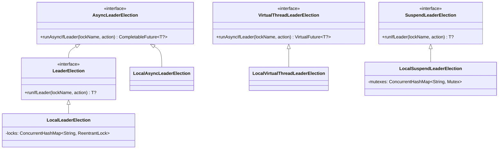
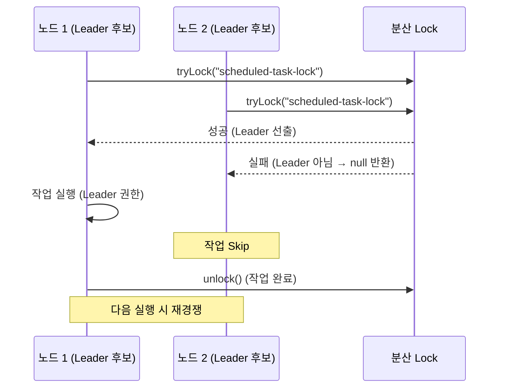

# Module bluetape4k-leader

## 개요

분산 환경에서 여러 프로세스/스레드 간에 동일한 작업이 중복 실행되는 것을 방지하기 위한 리더 선출(Leader Election) 기능을 제공합니다.

Leader로 선출된 인스턴스만 작업을 수행할 수 있어, 스케줄 작업, 배치 작업 등에서 중복 실행을 방지할 수 있습니다.

## 의존성 추가

```kotlin
dependencies {
    implementation("io.github.bluetape4k:bluetape4k-leader:${version}")
}
```

## 인터페이스 계층 구조

### 단일 리더 선출 (lockName당 1개만 동시 실행)

```
AsyncLeaderElection          VirtualThreadLeaderElection  SuspendLeaderElection
       ↑                                                   (코루틴 독립 계층)
LeaderElection
```

- **`AsyncLeaderElection`**: BASE — 비동기 리더 선출 (`CompletableFuture` 반환)
- **`LeaderElection`**: `AsyncLeaderElection` 상속 — 동기 `runIfLeader` 추가
- **`VirtualThreadLeaderElection`**: 독립 — Virtual Thread 기반 비동기 (`VirtualFuture` 반환)
- **`SuspendLeaderElection`**: 독립 — 코루틴 방식 (`suspend fun`)

### 복수 리더 선출 (lockName당 N개 동시 실행, Semaphore 기반)

```
LeaderGroupElectionState  (maxLeaders, activeCount, availableSlots, state)
         ↑
AsyncLeaderGroupElection   VirtualThreadLeaderGroupElection  SuspendLeaderGroupElection
         ↑                       (LeaderGroupElectionState)    (LeaderGroupElectionState)
LeaderGroupElection
```

- **`LeaderGroupElectionState`**: 상태 조회 공통 인터페이스
- **`AsyncLeaderGroupElection`**: BASE — 비동기 복수 리더 선출 (`CompletableFuture` 반환)
- **`LeaderGroupElection`**: `AsyncLeaderGroupElection` 상속 — 동기 `runIfLeader` 추가
- **`VirtualThreadLeaderGroupElection`**: 독립 — Virtual Thread 기반 (`VirtualFuture` 반환)
- **`SuspendLeaderGroupElection`**: 독립 — 코루틴 방식 (`suspend fun`)

### 로컬 구현체

**단일 리더:**

| 구현체 | 인터페이스 | 동기화 방식 |
|--------|-----------|------------|
| `LocalLeaderElection` | `LeaderElection` | `ReentrantLock` (재진입 지원) |
| `LocalAsyncLeaderElection` | `AsyncLeaderElection` | `ReentrantLock` + `CompletableFuture` |
| `LocalVirtualThreadLeaderElection` | `VirtualThreadLeaderElection` | `ReentrantLock` + Virtual Thread |
| `LocalSuspendLeaderElection` | `SuspendLeaderElection` | Kotlin `Mutex` (재진입 불가) |

**복수 리더:**

| 구현체 | 인터페이스 | 동기화 방식 |
|--------|-----------|------------|
| `LocalLeaderGroupElection` | `LeaderGroupElection` | `java.util.concurrent.Semaphore` |
| `LocalAsyncLeaderGroupElection` | `AsyncLeaderGroupElection` | `java.util.concurrent.Semaphore` + `CompletableFuture` |
| `LocalVirtualThreadLeaderGroupElection` | `VirtualThreadLeaderGroupElection` | `java.util.concurrent.Semaphore` + Virtual Thread |
| `LocalSuspendLeaderGroupElection` | `SuspendLeaderGroupElection` | `kotlinx.coroutines.sync.Semaphore` |

## 사용 예시

### 동기 방식 (LeaderElection)

```kotlin
import io.bluetape4k.leader.LeaderElection

class MyScheduler(private val leaderElection: LeaderElection) {

    fun executeTask() {
        // 리더로 선출된 경우에만 작업 수행
        val result = leaderElection.runIfLeader("scheduled-task-lock") {
            // 리더로 선출되면 수행할 코드
            println("I'm a leader! Performing scheduled task...")
            performExpensiveOperation()
            "Task completed"
        }

        // 리더가 아니면 null 반환
        if (result == null) {
            println("Not a leader, skipping task")
        }
    }

    private fun performExpensiveOperation(): String {
        // 시간이 오래 걸리는 작업
        Thread.sleep(1000)
        return "Success"
    }
}
```

### 비동기 방식 (AsyncLeaderElection)

```kotlin
import io.bluetape4k.leader.AsyncLeaderElection
import java.util.concurrent.CompletableFuture

class MyAsyncService(private val leaderElection: AsyncLeaderElection) {

    fun executeAsyncTask(): CompletableFuture<String?> {
        return leaderElection.runAsyncIfLeader("async-task-lock") {
            CompletableFuture.supplyAsync {
                // 비동기 작업 수행
                performAsyncOperation()
            }
        }
    }

    private fun performAsyncOperation(): String {
        return "Async task completed"
    }
}
```

### 코루틴 방식 (SuspendLeaderElection)

```kotlin
import io.bluetape4k.leader.coroutines.SuspendLeaderElection
import kotlinx.coroutines.Dispatchers
import kotlinx.coroutines.withContext

class MyCoroutineService(private val leaderElection: SuspendLeaderElection) {

    suspend fun executeSuspendTask(): String? {
        return leaderElection.runIfLeader("coroutine-task-lock") {
            // suspend 함수 내에서 작업 수행
            withContext(Dispatchers.IO) {
                performSuspendOperation()
            }
        }
    }

    private suspend fun performSuspendOperation(): String {
        // suspend 작업
        kotlinx.coroutines.delay(1000)
        return "Suspend task completed"
    }
}
```

### Virtual Thread 방식 (VirtualThreadLeaderElection)

```kotlin
import io.bluetape4k.leader.local.LocalVirtualThreadLeaderElection

val election = LocalVirtualThreadLeaderElection()

// VirtualFuture 반환 — await() 또는 toCompletableFuture() 로 결과 획득
val future = election.runAsyncIfLeader("job-lock") {
    performExpensiveIO()  // Virtual Thread가 I/O 블로킹 시 carrier thread 반납
}

val result = future.await()
```

### 복수 리더 선출 — 동시에 N개까지 실행 (LeaderGroupElection)

단일 리더가 아닌 최대 `maxLeaders`개까지 동시에 작업을 허용합니다.
슬롯이 가득 찬 경우 빈 슬롯이 생길 때까지 대기합니다.

```kotlin
import io.bluetape4k.leader.local.LocalLeaderGroupElection
import io.bluetape4k.leader.local.LocalAsyncLeaderGroupElection
import io.bluetape4k.leader.local.LocalVirtualThreadLeaderGroupElection
import io.bluetape4k.leader.coroutines.LocalSuspendLeaderGroupElection
import java.util.concurrent.CompletableFuture

// 동기 방식 — 최대 3개 스레드 동시 실행
val election = LocalLeaderGroupElection(maxLeaders = 3)

val result = election.runIfLeader("batch-job") {
    processChunk()  // 슬롯 획득 → 실행 → 슬롯 자동 반납
}

// 상태 조회 (LeaderGroupElectionState 인터페이스)
val state = election.state("batch-job")
println("활성 리더: ${state.activeCount} / ${state.maxLeaders}")
println("남은 슬롯: ${state.availableSlots}")
println("가득 참: ${state.isFull}, 비어 있음: ${state.isEmpty}")

// 비동기 방식 (CompletableFuture) — 동기 runIfLeader 없이 비동기만 필요할 때
val asyncElection = LocalAsyncLeaderGroupElection(maxLeaders = 3)
val future = asyncElection.runAsyncIfLeader("batch-job") {
    CompletableFuture.supplyAsync { processChunk() }
}

// Virtual Thread 방식 — carrier thread를 블로킹하지 않는 비동기
val vtElection = LocalVirtualThreadLeaderGroupElection(maxLeaders = 3)
val vtResult = vtElection.runAsyncIfLeader("batch-job") {
    processChunk()  // action이 () -> T 로 단순
}.await()

// 코루틴 방식 — 최대 3개 코루틴 동시 실행
val suspendElection = LocalSuspendLeaderGroupElection(maxLeaders = 3)
val suspendResult = suspendElection.runIfLeader("batch-job") {
    processChunkSuspend()
}
```

### Spring Boot 통합 예시

```kotlin
import io.bluetape4k.leader.LeaderElection
import org.springframework.scheduling.annotation.Scheduled
import org.springframework.stereotype.Component

@Component
class ScheduledTaskRunner(private val leaderElection: LeaderElection) {

    @Scheduled(fixedRate = 60000)  // 1분마다
    fun runScheduledTask() {
        leaderElection.runIfLeader("cleanup-job") {
            // 리더에서만 실행되는 정리 작업
            cleanupOldData()
        }
    }

    @Scheduled(cron = "0 0 2 * * ?")  // 매일 새벽 2시
    fun runDailyBatch() {
        val result = leaderElection.runIfLeader("daily-batch") {
            runBatchJob()
        }
        log.info("Batch job completed: $result")
    }
}
```

## 주요 기능 상세

### 단일 리더 인터페이스

| 파일 | 설명 |
|------|------|
| `AsyncLeaderElection.kt` | BASE — 비동기 리더 선출 (`CompletableFuture`, `VirtualThreadExecutor` 기본) |
| `LeaderElection.kt` | `AsyncLeaderElection` 상속 — 동기 `runIfLeader` 추가 |
| `VirtualThreadLeaderElection.kt` | 독립 — Virtual Thread 기반 비동기 (`VirtualFuture` 반환) |
| `coroutines/SuspendLeaderElection.kt` | 독립 — 코루틴 방식 (`suspend fun`) |

### 단일 리더 로컬 구현체

| 파일 | 설명 |
|------|------|
| `local/AbstractLocalLeaderElection.kt` | 공통 `ConcurrentHashMap<String, ReentrantLock>` 관리 추상 클래스 |
| `local/LocalLeaderElection.kt` | `ReentrantLock` 기반 단일 리더 선출 (재진입 지원) |
| `local/LocalAsyncLeaderElection.kt` | `ReentrantLock` + `CompletableFuture` 비동기 구현체 |
| `local/LocalVirtualThreadLeaderElection.kt` | `ReentrantLock` + Virtual Thread 기반 구현체 |
| `coroutines/LocalSuspendLeaderElection.kt` | Kotlin `Mutex` 기반 코루틴 구현체 (재진입 불가) |

### 복수 리더 인터페이스

| 파일 | 설명 |
|------|------|
| `LeaderGroupElectionState.kt` | 상태 조회 공통 인터페이스 (`maxLeaders`, `activeCount`, `availableSlots`, `state`) |
| `LeaderGroupState.kt` | 리더 그룹 상태 데이터 클래스 (`isFull`, `isEmpty` 포함) |
| `AsyncLeaderGroupElection.kt` | BASE — 비동기 복수 리더 선출 (`CompletableFuture`, `LeaderGroupElectionState` 상속) |
| `LeaderGroupElection.kt` | `AsyncLeaderGroupElection` 상속 — 동기 `runIfLeader` 추가 |
| `VirtualThreadLeaderGroupElection.kt` | 독립 — Virtual Thread 기반 비동기 (`VirtualFuture` 반환) |
| `coroutines/SuspendLeaderGroupElection.kt` | 독립 — 코루틴 방식 (`suspend fun`, `LeaderGroupElectionState` 상속) |

### 복수 리더 로컬 구현체

| 파일 | 설명 |
|------|------|
| `local/AbstractLocalLeaderGroupElection.kt` | 공통 `ConcurrentHashMap<String, Semaphore>` + 상태 조회 추상 클래스 |
| `local/LocalLeaderGroupElection.kt` | `java.util.concurrent.Semaphore` 기반, 동기 + 비동기 |
| `local/LocalAsyncLeaderGroupElection.kt` | `java.util.concurrent.Semaphore` + `CompletableFuture` 비동기 전용 |
| `local/LocalVirtualThreadLeaderGroupElection.kt` | `java.util.concurrent.Semaphore` + Virtual Thread 기반 |
| `coroutines/LocalSuspendLeaderGroupElection.kt` | `kotlinx.coroutines.sync.Semaphore` 기반 코루틴 구현체 |

## 인터페이스 계층 다이어그램



## 리더 선출 시퀀스



## 사용 시나리오

### 단일 리더 (LeaderElection)

1. **스케줄 작업**: 여러 인스턴스에서 동일한 스케줄 작업이 실행되지 않도록 방지
2. **캐시 갱신**: 분산 캐시의 갱신 작업을 하나의 인스턴스에서만 수행
3. **알림 발송**: 중복 알림 방지
4. **데이터 동기화**: 외부 시스템과의 동기화 작업 중복 방지

### 복수 리더 (LeaderGroupElection)

1. **병렬 배치 처리**: 대용량 데이터를 N개 청크로 나누어 동시 처리 (처리 수 제어)
2. **Rate Limiting**: 외부 API 호출 동시 요청 수 제한
3. **작업 풀 관리**: 정해진 수의 워커만 특정 작업을 동시에 수행하도록 제어
4. **리소스 보호**: DB 연결 등 제한된 리소스를 사용하는 작업의 동시성 제어
