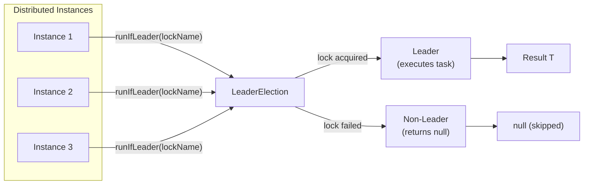
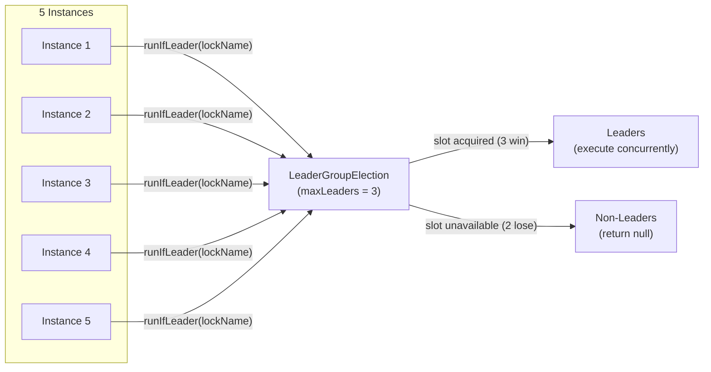
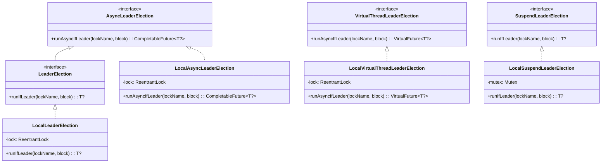
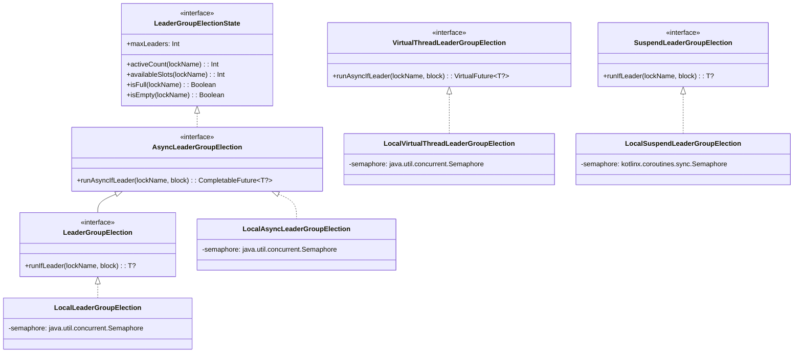
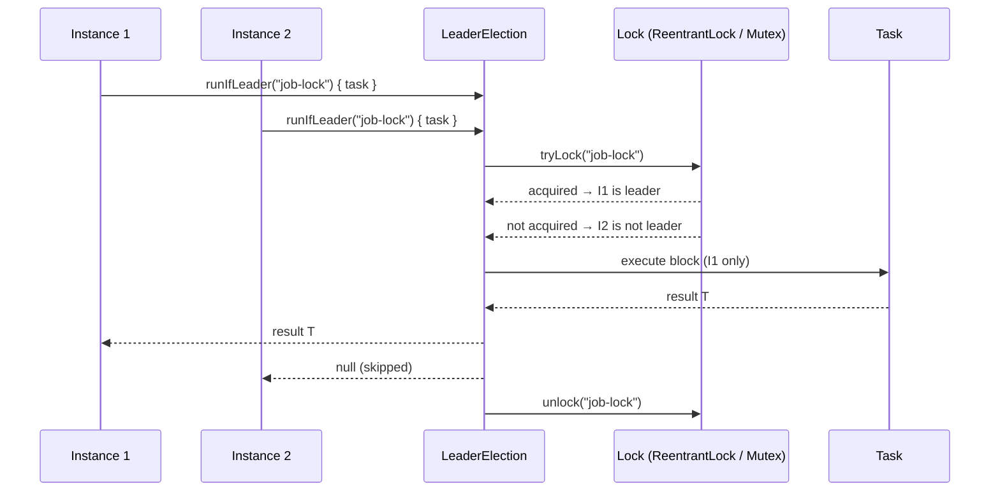

# bluetape4k-leader

English | [한국어](./README.ko.md)

Prevents duplicate execution of the same task across multiple processes or threads in a distributed environment. Only the elected
**leader** instance executes the task — all others skip it.

## Use Cases

### Single Leader (`LeaderElection`) — only 1 concurrent execution

| Scenario             | Why it helps                                                           |
|----------------------|------------------------------------------------------------------------|
| Scheduled jobs       | Prevent the same job from running on multiple instances simultaneously |
| Cache refresh        | Run cache update logic on only one instance at a time                  |
| Notifications        | Prevent duplicate alerts from being sent                               |
| Data synchronization | Prevent duplicate sync jobs with external systems                      |

### Group Leader (`LeaderGroupElection`) — up to N concurrent executions

| Scenario                  | Why it helps                                                                        |
|---------------------------|-------------------------------------------------------------------------------------|
| Parallel batch processing | Split large datasets into N chunks, process concurrently with concurrency control   |
| Rate limiting             | Limit concurrent outbound API calls to a backend or external service                |
| Worker pool management    | Allow only a fixed number of workers to run a task at the same time                 |
| Resource protection       | Control concurrency for tasks that consume limited resources (DB connections, etc.) |

## Architecture

### Concept Overview — Single Leader



### Concept Overview — Group Leader (Semaphore)



### Class Diagram — Single Leader



### Class Diagram — Group Leader



### Execution Sequence — Single Leader



## Usage Examples

### Synchronous (`LeaderElection`)

```kotlin
class MyScheduler(private val leaderElection: LeaderElection) {

    fun executeTask() {
        val result = leaderElection.runIfLeader("scheduled-task-lock") {
            println("I'm the leader! Running scheduled task...")
            performExpensiveOperation()
            "Task completed"
        }

        if (result == null) {
            println("Not the leader, skipping task")
        }
    }
}
```

### Asynchronous (`AsyncLeaderElection`)

```kotlin
class MyAsyncService(private val leaderElection: AsyncLeaderElection) {

    fun executeAsyncTask(): CompletableFuture<String?> {
        return leaderElection.runAsyncIfLeader("async-task-lock") {
            CompletableFuture.supplyAsync { performAsyncOperation() }
        }
    }
}
```

### Coroutine (`SuspendLeaderElection`)

```kotlin
class MyCoroutineService(private val leaderElection: SuspendLeaderElection) {

    suspend fun executeSuspendTask(): String? {
        return leaderElection.runIfLeader("coroutine-task-lock") {
            withContext(Dispatchers.IO) {
                performSuspendOperation()
            }
        }
    }
}
```

### Virtual Thread (`VirtualThreadLeaderElection`)

```kotlin
val election = LocalVirtualThreadLeaderElection()

val future = election.runAsyncIfLeader("job-lock") {
    performExpensiveIO()  // Virtual Thread yields the carrier thread during I/O blocking
}

val result = future.await()
```

### Group Leader — up to N concurrent executions

```kotlin
// Synchronous — up to 3 threads concurrently
val election = LocalLeaderGroupElection(maxLeaders = 3)

val result = election.runIfLeader("batch-job") {
    processChunk()  // acquires slot → executes → releases slot automatically
}

// State query
val state = election.state("batch-job")
println("Active leaders: ${state.activeCount} / ${state.maxLeaders}")
println("Available slots: ${state.availableSlots}")
```

### Spring Boot Integration

```kotlin
@Component
class ScheduledTaskRunner(private val leaderElection: LeaderElection) {

    @Scheduled(fixedRate = 60000)
    fun runScheduledTask() {
        leaderElection.runIfLeader("cleanup-job") {
            cleanupOldData()
        }
    }

    @Scheduled(cron = "0 0 2 * * ?")
    fun runDailyBatch() {
        val result = leaderElection.runIfLeader("daily-batch") {
            runBatchJob()
        }
        log.info("Batch job completed: $result")
    }
}
```

## Dependency

```kotlin
dependencies {
    implementation("io.github.bluetape4k:bluetape4k-leader:${version}")
}
```
