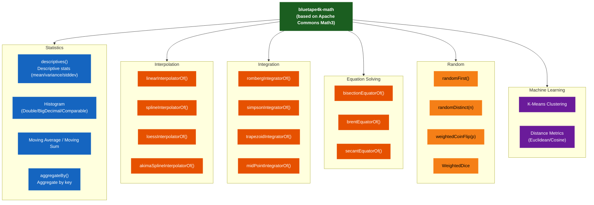
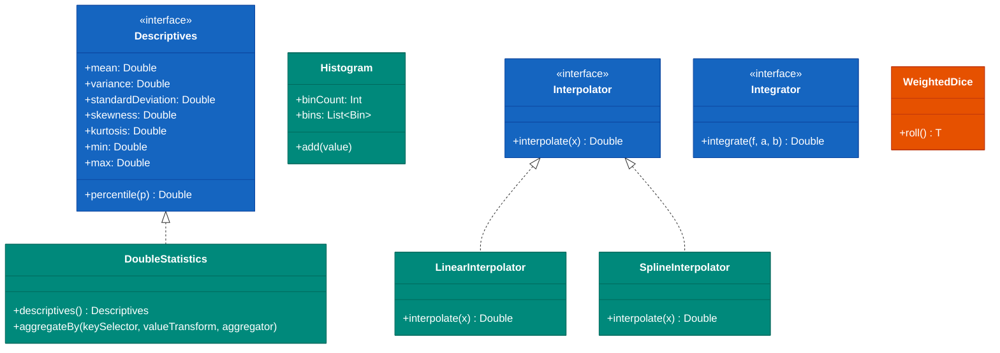

# Module bluetape4k-math

English | [한국어](./README.ko.md)

A library providing a wide range of mathematical capabilities including statistical operations, interpolation, integration, equation solving, and clustering — built on Apache Commons Math3.

## Architecture

### Feature Structure



### Class Diagram



## Key Features

### Statistics and Descriptive Statistics

- Descriptive statistics (mean, variance, standard deviation, skewness, kurtosis)
- Histograms (Double, BigDecimal, Comparable)
- Moving averages, moving sums
- Rank, correlation coefficients

### Mathematical Functions

- Special functions (Gamma, Beta, Factorial, Harmonic)
- Probability distributions
- Combinations/Permutations
- Primality testing

### Interpolation and Integration

- Linear/Spline/Loess interpolation
- Romberg/Simpson/Trapezoid integration

### Equation Solving

- Bisection, Brent, Secant methods, and more

### Linear Algebra

- Matrix/vector operations

### Machine Learning

- Clustering (K-Means, etc.)
- Distance metrics

## Usage Examples

### Descriptive Statistics

```kotlin
import io.bluetape4k.math.*

val data = doubleArrayOf(1.0, 2.0, 3.0, 4.0, 5.0, 6.0, 7.0, 8.0, 9.0, 10.0)
val stats = data.descriptives()

stats.mean           // Mean: 5.5
stats.variance       // Variance
stats.standardDeviation  // Standard deviation
stats.skewness       // Skewness
stats.kurtosis       // Kurtosis
stats.min            // Minimum: 1.0
stats.max            // Maximum: 10.0
stats.sum            // Sum: 55.0
stats.percentile(50) // Median (50th percentile)
```

### Aggregation

```kotlin
import io.bluetape4k.math.*
import java.time.Instant

data class Event(val eventTimestamp: Instant, val durationMs: Long)

val events: List<Event> = emptyList()

// Sum of durations by hour
val sumByHour = events.aggregateBy(
    keySelector = { it.eventTimestamp.truncatedTo(ChronoUnit.HOURS) },
    valueTransform = { it.durationMs },
    aggregator = { it.sum() }
)

// Average duration by hour
val avgByHour = events.aggregateBy(
    keySelector = { it.eventTimestamp.truncatedTo(ChronoUnit.HOURS) },
    valueTransform = { it.durationMs },
    aggregator = { it.average() }
)
```

### Random Sampling

```kotlin
import io.bluetape4k.math.*

val items = listOf("a", "b", "c", "d", "e", "f", "g", "h")

// Pick one random item
val randomItem = items.randomFirst()

// Sampling with replacement (duplicates allowed) — 3 samples
val samples = items.random(3)

// Sampling without replacement (no duplicates) — 3 samples
val distinctSamples = items.randomDistinct(3)

// Weighted coin flip
val isHeads = weightedCoinFlip(0.7)  // true with 70% probability

// Weighted dice
val dice = WeightedDice(
    "A" to 0.5,   // 50% probability
    "B" to 0.3,   // 30% probability
    "C" to 0.2    // 20% probability
)
val result = dice.roll()
```

### Histogram

```kotlin
import io.bluetape4k.math.*

val data = doubleArrayOf(1.0, 2.0, 2.5, 3.0, 3.5, 4.0, 5.0, 5.5, 6.0)

// Double histogram
val histogram = DoubleHistogram.of(data, numBins = 5)
histogram.bins.forEach { bin ->
    println("Range: ${bin.lowerBound} - ${bin.upperBound}, Count: ${bin.count}")
}

// BigDecimal histogram
val bdHistogram = BigDecimalHistogram.of(bigDecimalData, numBins = 10)

// Comparable histogram
val compHistogram = ComparableHistogram.of(comparableData, numBins = 5)
```

### Interpolation

```kotlin
import io.bluetape4k.math.interpolation.*

val x = doubleArrayOf(0.0, 1.0, 2.0, 3.0, 4.0)
val y = doubleArrayOf(0.0, 1.0, 4.0, 9.0, 16.0)

// Linear interpolation
val linear = linearInterpolatorOf(x, y)
linear.interpolate(1.5)  // 2.5

// Spline interpolation
val spline = splineInterpolatorOf(x, y)
spline.interpolate(1.5)

// Loess interpolation (locally weighted regression)
val loess = loessInterpolatorOf(x, y)
loess.interpolate(1.5)

// Akima spline interpolation
val akima = akimaSplineInterpolatorOf(x, y)
akima.interpolate(1.5)
```

### Integration

```kotlin
import io.bluetape4k.math.integration.*

// f(x) = x^2
val function = { x: Double -> x * x }

// Romberg integration
val romberg = rombergIntegratorOf()
val result1 = romberg.integrate(function, 0.0, 2.0)  // ~2.667

// Simpson integration
val simpson = simpsonIntegratorOf()
val result2 = simpson.integrate(function, 0.0, 2.0)

// Trapezoid integration
val trapezoid = trapezoidIntegratorOf()
val result3 = trapezoid.integrate(function, 0.0, 2.0)

// MidPoint integration
val midpoint = midPointIntegratorOf()
val result4 = midpoint.integrate(function, 0.0, 2.0)
```

### Equation Solving

```kotlin
import io.bluetape4k.math.equation.*

// f(x) = x^2 - 4, roots at x = 2 or x = -2
val function = { x: Double -> x * x - 4.0 }

// Bisection method
val bisection = bisectionEquatorOf(function, 0.0, 3.0, 1e-10)
val root1 = bisection.solve()  // ~2.0

// Brent method — fast and robust
val brent = brentEquatorOf(function, 0.0, 3.0, 1e-10)
val root2 = brent.solve()

// Secant method
val secant = secantEquatorOf(function, 0.0, 3.0, 1e-10)
val root3 = secant.solve()
```

### Special Functions

```kotlin
import io.bluetape4k.math.special.*

// Factorial
factorial(5)     // 120
factorial(10)    // 3,628,800

// Gamma function
gamma(5.0)       // 24.0 (= 4!)

// Beta function
beta(2.0, 3.0)

// Combinations
combinations(10, 3)  // 120

// Permutations
permutations(5, 3)   // 60
```

## Key Files

| File                      | Description                                                    |
|---------------------------|----------------------------------------------------------------|
| `Aggregation.kt`          | Collection aggregation functions                               |
| `Descriptives.kt`         | Descriptive statistics interface                               |
| `DoubleStatistics.kt`     | Double statistics                                              |
| `BigDecimalStatistics.kt` | BigDecimal statistics                                          |
| `DoubleHistogram.kt`      | Double histogram                                               |
| `RandomSupport.kt`        | Random sampling                                                |
| `interpolation/*.kt`      | Interpolation algorithms (Linear, Spline, Loess, Akima)        |
| `integration/*.kt`        | Integration algorithms (Romberg, Simpson, Trapezoid, MidPoint) |
| `equation/*.kt`           | Equation solvers (Bisection, Brent, Secant, Ridders)           |
| `special/*.kt`            | Special functions (Gamma, Beta, Factorial)                     |
| `linear/*.kt`             | Linear algebra (Matrix, Vector)                                |
| `ml/clustering/*.kt`      | Clustering algorithms                                          |
| `ml/distance/*.kt`        | Distance metrics                                               |
| `commons/*.kt`            | Apache Commons Math utilities                                  |

## Dependency

```kotlin
dependencies {
    implementation("io.github.bluetape4k:bluetape4k-math:${version}")
}
```
