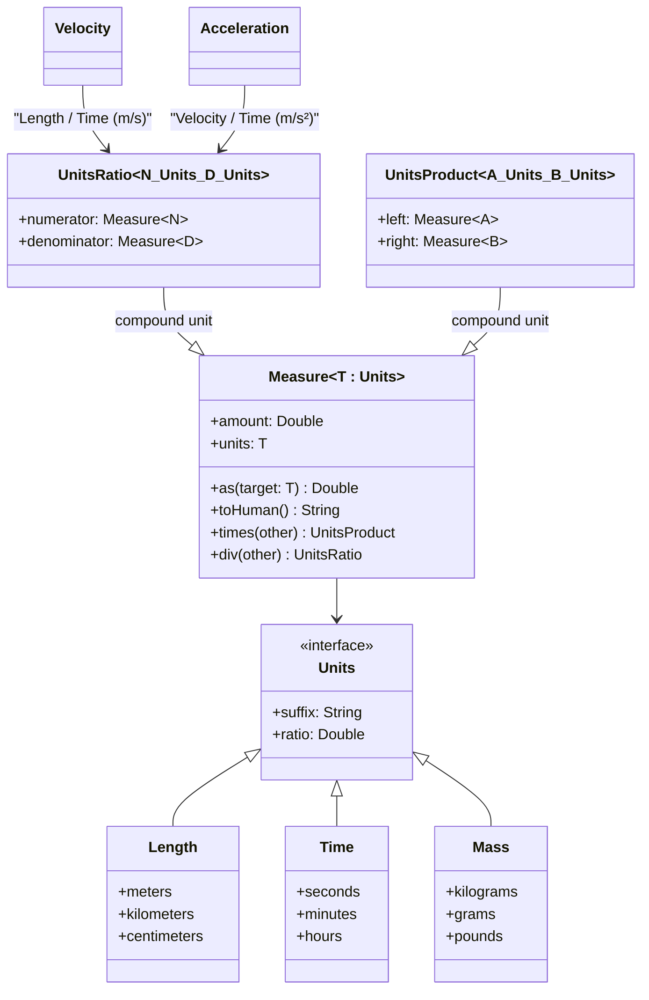
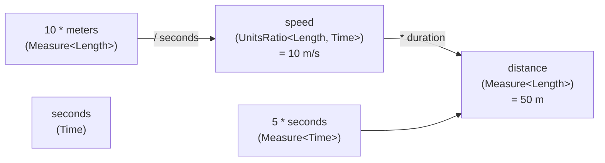

# Module bluetape4k-measured

English | [한국어](./README.ko.md)

`bluetape4k-measured` represents compound units such as `m/s` and
`kg*m/s^2` in a type-safe way, based on composable unit types (`Units`) and measured values (`Measure`).

## Core Concepts

- `Units`: a unit definition, including suffix and ratio relative to the base unit
- `Measure<T: Units>`: value + unit
- `UnitsProduct`, `UnitsRatio`, `InverseUnits`: representations of compound units

## Provided Units

- Length: `Length`
- Time: `Time`
- Mass: `Mass`
- Volume: `Volume`
- Temperature: `Temperature` / `TemperatureDelta`
- Angle: `Angle`
- Area: `Area`
- Storage capacity: `Storage`
- Digital size: `BinarySize`
- Frequency: `Frequency`
- Energy / Power: `Energy`, `Power`
- Motion-unit utilities: `MotionUnits`, `Velocity`, `Acceleration`
- Graphics length: `GraphicsLength`
- Pressure: `Pressure`

## Quick Example

```kotlin
import io.bluetape4k.measured.*
import io.bluetape4k.measured.Length.Companion.meters
import io.bluetape4k.measured.Time.Companion.seconds

val speed = 10 * meters / seconds
val duration = 5 * seconds
val distance = speed * duration

println(distance `as` meters) // 50.0 m
println(distance.toHuman())    // 50.0 m
```

## Test

```bash
./gradlew :bluetape4k-measured:test
```

## Class Diagram



## Unit Composition Flow



## Compatibility Adapter for `units`

Compatibility extension functions are available so you can migrate gradually from `bluetape4k-units` to
`bluetape4k-measured`.

```kotlin
import io.bluetape4k.measured.*

val legacyLength = io.bluetape4k.units.Length(1500.0, io.bluetape4k.units.LengthUnit.METER)
val measuredLength = legacyLength.toMeasuredLength()
val roundTrip = measuredLength.toLegacyLength()

println(measuredLength.toHuman())   // 1.5 km
println(roundTrip.inMeter())        // 1500.0
```
