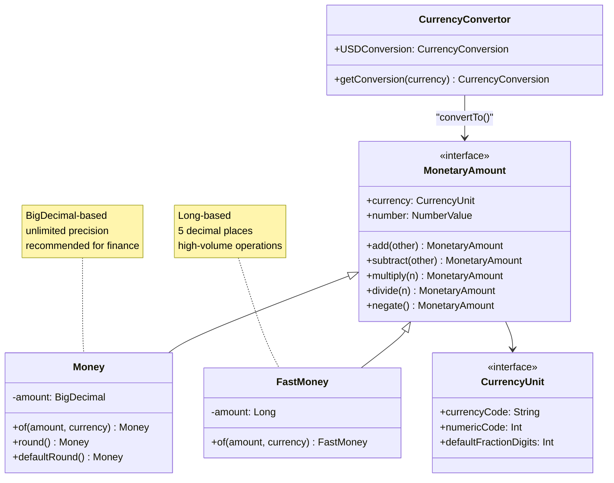
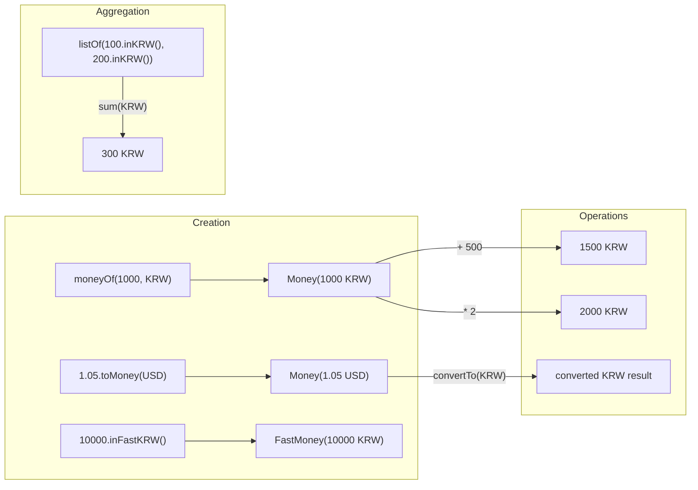

# Module bluetape4k-money

English | [한국어](./README.ko.md)

## Overview

A library built on the Java standard Money API (JSR-354) to simplify financial and currency operations. It uses the [JavaMoney Moneta](https://javamoney.github.io/ri.html) implementation for currency units, money calculations, and exchange-rate conversion.

## Adding the Dependency

```kotlin
dependencies {
    implementation("io.github.bluetape4k:bluetape4k-money:${version}")
}
```

## Key Features

- **Currency units (`CurrencyUnit`)**: support and caching for major currencies such as KRW, USD, EUR, CNY, and JPY
- **Money (`Money`)**: create and operate on currency amounts backed by `BigDecimal`
- **High-performance money (`FastMoney`)**: fast money operations backed by `Long`
- **Arithmetic operators**: overloads for `+`, `-`, `*`, `/`, and unary `-`
- **Value extraction**: property extensions such as `intValue`, `longValue`, `doubleValue`, and `bigDecimalValue`
- **Rounding**: support for `round()` and `defaultRound()`
- **Exchange-rate conversion**: convert currencies using ECB and IMF exchange-rate data
- **Aggregation**: `Collection<MonetaryAmount>.sum()` extension

## Usage Examples

### Create Currency Units

```kotlin
import io.bluetape4k.money.*

// create from currency code (uses internal cache)
val krw = currencyUnitOf("KRW")
val usd = currencyUnitOf("USD")
val eur = currencyUnitOf("EUR")

// create from Locale
val usCurrency = currencyUnitOf(Locale.US)        // USD
val koreaCurrency = currencyUnitOf(Locale.KOREA)  // KRW

// predefined constants
val koreanWon = KRW      // Korean won
val usDollar = USD       // US dollar
val euro = EUR           // Euro
val chineseYuan = CNY    // Chinese yuan
val japaneseYen = JPY    // Japanese yen

// validate currency codes
"USD".isAvailableCurrency()  // true
"AAA".isAvailableCurrency()  // false
```

### Create Money (`Money`)

```kotlin
import io.bluetape4k.money.*

// basic creation
val won = moneyOf(1024L, KRW)       // 1,024 KRW
val dollar = moneyOf(1.05, USD)     // 1.05 USD

// create from currency code string
val yen = moneyOf(1000, "JPY")      // 1,000 JPY

// extension functions
val won2 = 1024L.toMoney(KRW)       // 1,024 KRW
val dollar2 = 1.05.toMoney("USD")   // 1.05 USD

// convenience helpers
val krwMoney = 10000.inKRW()        // 10,000 KRW
val usdMoney = 100.50.inUSD()       // 100.50 USD
val eurMoney = 50.inEUR()           // 50 EUR
```

### High-Performance Money (`FastMoney`)

`FastMoney` uses only the `Long` type internally to provide higher-performance operations.

```kotlin
import io.bluetape4k.money.*

// create FastMoney
val fastWon = fastMoneyOf(1024L, KRW)
val fastDollar = fastMoneyOf(1.05, USD)

// extension functions
val fastKrw = 10000.toFastMoney("KRW")
val fastUsd = 100.50.toFastMoney(USD)

// create from minor units (amount with decimal places)
// interpret 1245 with scale 2 = 12.45
val money = fastMoneyMinorOf("USD", 1245L, 2)  // $12.45
val money2 = 1245L.toFastMoneyMinor(USD, 2)    // $12.45

// convenience helpers
val fastKrw2 = 10000.inFastKRW()
val fastUsd2 = 100.50.inFastUSD()
val fastEur2 = 50.inFastEUR()
```

### Create `MonetaryAmount`

`MonetaryAmount` is the common super-interface of `Money` and `FastMoney`.

```kotlin
import io.bluetape4k.money.*

val amount = monetaryAmountOf(100, "KRW")
val amount2 = monetaryAmountOf(1.05, USD)
val amount3 = 500.toMonetaryAmount(KRW)
val amount4 = 99.99.toMonetaryAmount("USD")
```

### Money Arithmetic

Kotlin operator overloading makes arithmetic feel natural at the call site.

```kotlin
import io.bluetape4k.money.*

val price1 = 1000.toMoney(KRW)
val price2 = 500.toMoney(KRW)

// addition
val total = price1 + price2  // 1,500 KRW
val added = price1 + 200     // 1,200 KRW

// subtraction
val diff = price1 - price2   // 500 KRW
val subtracted = price1 - 100 // 900 KRW

// multiplication (commutative law supported)
val doubled = price1 * 2     // 2,000 KRW
val doubled2 = 2 * price1    // 2,000 KRW

// division
val half = price1 / 2        // 500 KRW

// sign inversion
val negated = -price1        // -1,000 KRW
```

### Extract Numeric Values

```kotlin
import io.bluetape4k.money.*

val m = moneyOf(12.5, USD)

// property extensions
m.intValue          // 12
m.longValue         // 12L
m.floatValue        // 12.5f
m.doubleValue       // 12.5
m.bigDecimalValue   // BigDecimal(12.5)
m.bigIntValue       // BigInteger(12)

// generic form
val bd: BigDecimal = m.numberValue()
val d: Double = m.numberValue()
```

### Rounding

```kotlin
import io.bluetape4k.money.*

val usd = 1.31473908.toMoney(USD)
usd.round()         // USD 1.31 (currency-specific default rounding)
usd.defaultRound()  // USD 1.31 (system default rounding)

val krw = 131.473908.toMoney(KRW)
krw.round()          // KRW 131 (KRW uses 0 decimal places)
```

### Aggregation

```kotlin
import io.bluetape4k.money.*

val amounts = listOf(100.toMonetaryAmount(KRW), 200.toMonetaryAmount(KRW), 300.toMonetaryAmount(KRW))
val total = amounts.sum(KRW)  // KRW 600

// empty collection
emptyList<MonetaryAmount>().sum(USD)  // USD 0
```

### Currency Conversion

```kotlin
import io.bluetape4k.money.*

// convert USD to EUR
val usd = 100.0.toMoney(USD)
val eur = usd.convertTo(EUR)
val krw = usd.convertTo(KRW)

// reverse conversion check
eur.convertTo(USD).doubleValue  // ≈ 100.0
krw.convertTo(USD).doubleValue  // ≈ 100.0

// use CurrencyConvertor
val conversion = CurrencyConvertor.getConversion(USD)
val usdConversion = CurrencyConvertor.USDConversion

// check conversion availability
"USD".isCurrencyConversionAvailable  // true
USD.isCurrencyConversionAvailable    // true
"AAA".isCurrencyConversionAvailable  // false
```

## Main Files

| File                           | Description                                                                              |
|--------------------------------|------------------------------------------------------------------------------------------|
| `CurrencySupport.kt`           | create and cache currency units (KRW, USD, EUR, CNY, JPY)                                |
| `MoneySupport.kt`              | extensions for creating `Money` instances                                                |
| `FastMoneySupport.kt`          | extensions for creating `FastMoney` instances                                            |
| `MoneyAmountSupport.kt`        | arithmetic operators, value extraction, rounding, conversion, and aggregation extensions |
| `CurrencyConverter.kt`         | currency converter using ECB and IMF data                                                |
| `CurrencyConversionSupport.kt` | extensions for checking whether conversion is available                                  |

## `Money` vs `FastMoney`

| Feature             | Money                                  | FastMoney                                           |
|---------------------|----------------------------------------|-----------------------------------------------------|
| Internal type       | BigDecimal                             | Long                                                |
| Precision           | unlimited                              | up to 5 decimal places                              |
| Performance         | moderate                               | very fast                                           |
| Exchange conversion | accurate                               | may lose precision                                  |
| Recommended use     | financial calculations, high precision | high-volume operations, performance-sensitive paths |

## Class Diagram



## Currency Operation Flow



> **Note**: For currency conversion, `Money` is recommended for accuracy.
> `FastMoney` uses a default scale of 5, so values beyond 5 decimal places can lose precision.
