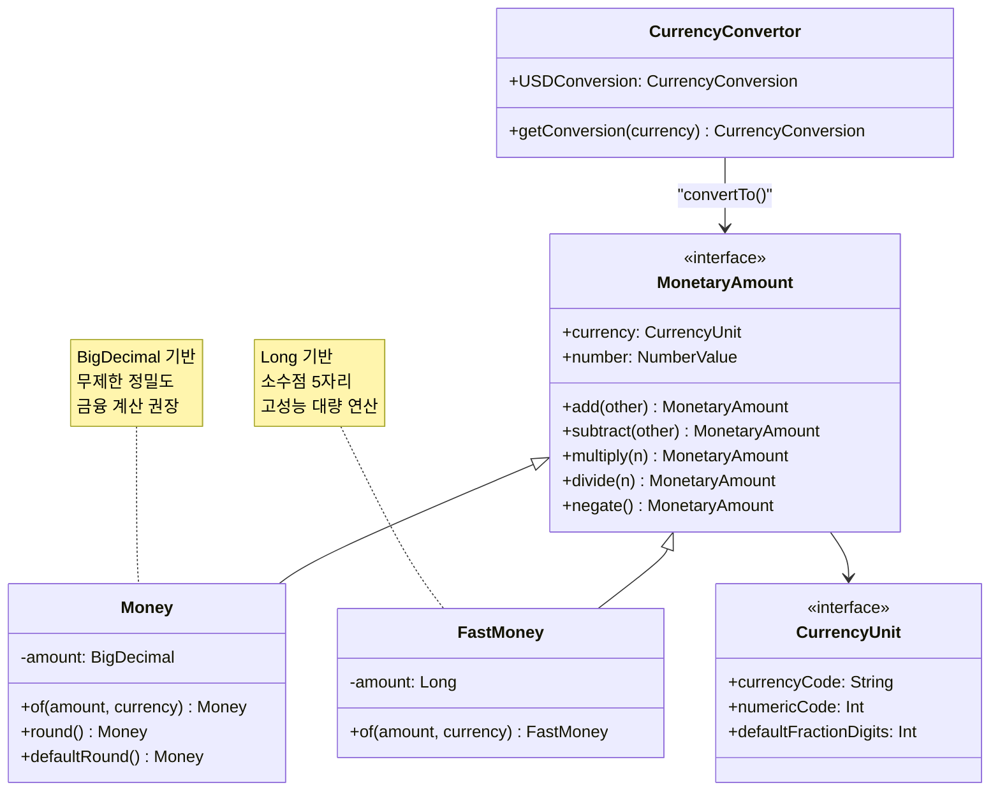
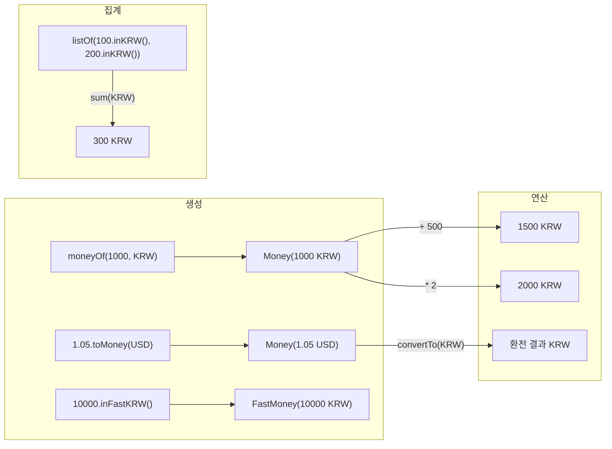

# Module bluetape4k-money

## 개요

Java 표준 Money API (JSR-354)를 기반으로 금융 및 통화 연산을 쉽게 수행할 수 있는 라이브러리입니다.
[JavaMoney Moneta](https://javamoney.github.io/ri.html) 구현체를 사용하여 통화 단위, 금액 계산, 환율 변환을 지원합니다.

## 의존성 추가

```kotlin
dependencies {
    implementation("io.github.bluetape4k:bluetape4k-money:${version}")
}
```

## 주요 기능

- **통화 단위 (CurrencyUnit)**: KRW, USD, EUR, CNY, JPY 등 주요 통화 지원 및 캐시
- **금액 (Money)**: BigDecimal 기반 통화 금액 생성 및 연산
- **고성능 금액 (FastMoney)**: Long 기반의 고성능 금액 연산
- **산술 연산자**: `+`, `-`, `*`, `/`, 단항 `-` 연산자 오버로딩
- **금액 값 추출**: `intValue`, `longValue`, `doubleValue`, `bigDecimalValue` 등 프로퍼티 확장
- **반올림**: `round()`, `defaultRound()` 지원
- **환율 변환**: ECB, IMF 환율 데이터를 이용한 통화 변환
- **합산**: `Collection<MonetaryAmount>.sum()` 확장 함수

## 사용 예시

### 통화 단위 생성

```kotlin
import io.bluetape4k.money.*

// 통화 코드로 생성 (내부 캐시 사용)
val krw = currencyUnitOf("KRW")
val usd = currencyUnitOf("USD")
val eur = currencyUnitOf("EUR")

// Locale로 생성
val usCurrency = currencyUnitOf(Locale.US)        // USD
val koreaCurrency = currencyUnitOf(Locale.KOREA)  // KRW

// 사전 정의된 통화 단위 상수
val koreanWon = KRW      // 한국 원화
val usDollar = USD       // 미국 달러
val euro = EUR           // 유로
val chineseYuan = CNY    // 중국 위안
val japaneseYen = JPY    // 일본 엔

// 통화 코드 유효성 검증
"USD".isAvailableCurrency()  // true
"AAA".isAvailableCurrency()  // false
```

### 금액 생성 (Money)

```kotlin
import io.bluetape4k.money.*

// 기본 방식
val won = moneyOf(1024L, KRW)       // 1,024 KRW
val dollar = moneyOf(1.05, USD)     // 1.05 USD

// 통화 코드 문자열로 생성
val yen = moneyOf(1000, "JPY")      // 1,000 JPY

// 확장 함수 사용
val won2 = 1024L.toMoney(KRW)       // 1,024 KRW
val dollar2 = 1.05.toMoney("USD")   // 1.05 USD

// 편의 함수
val krwMoney = 10000.inKRW()        // 10,000 KRW
val usdMoney = 100.50.inUSD()       // 100.50 USD
val eurMoney = 50.inEUR()           // 50 EUR
```

### 고성능 금액 (FastMoney)

`FastMoney`는 내부적으로 Long 타입만 사용하여 고성능 연산을 제공합니다.

```kotlin
import io.bluetape4k.money.*

// FastMoney 생성
val fastWon = fastMoneyOf(1024L, KRW)
val fastDollar = fastMoneyOf(1.05, USD)

// 확장 함수
val fastKrw = 10000.toFastMoney("KRW")
val fastUsd = 100.50.toFastMoney(USD)

// Minor 단위로 생성 (소수점 포함 금액)
// 1245를 소수점 2자리로 해석 = 12.45
val money = fastMoneyMinorOf("USD", 1245L, 2)  // $12.45
val money2 = 1245L.toFastMoneyMinor(USD, 2)    // $12.45

// 편의 함수
val fastKrw2 = 10000.inFastKRW()
val fastUsd2 = 100.50.inFastUSD()
val fastEur2 = 50.inFastEUR()
```

### MonetaryAmount 생성

`MonetaryAmount`는 `Money`, `FastMoney`의 상위 인터페이스입니다.

```kotlin
import io.bluetape4k.money.*

val amount = monetaryAmountOf(100, "KRW")
val amount2 = monetaryAmountOf(1.05, USD)
val amount3 = 500.toMonetaryAmount(KRW)
val amount4 = 99.99.toMonetaryAmount("USD")
```

### 금액 연산

Kotlin 연산자 오버로딩으로 자연스러운 산술 연산을 지원합니다.

```kotlin
import io.bluetape4k.money.*

val price1 = 1000.toMoney(KRW)
val price2 = 500.toMoney(KRW)

// 덧셈
val total = price1 + price2  // 1,500 KRW
val added = price1 + 200     // 1,200 KRW

// 뺄셈
val diff = price1 - price2   // 500 KRW
val subtracted = price1 - 100 // 900 KRW

// 곱셈 (교환법칙 지원)
val doubled = price1 * 2     // 2,000 KRW
val doubled2 = 2 * price1    // 2,000 KRW

// 나눗셈
val half = price1 / 2        // 500 KRW

// 부호 반전
val negated = -price1        // -1,000 KRW
```

### 금액 값 추출

```kotlin
import io.bluetape4k.money.*

val m = moneyOf(12.5, USD)

// 프로퍼티 확장
m.intValue          // 12
m.longValue         // 12L
m.floatValue        // 12.5f
m.doubleValue       // 12.5
m.bigDecimalValue   // BigDecimal(12.5)
m.bigIntValue       // BigInteger(12)

// 제네릭 방식
val bd: BigDecimal = m.numberValue()
val d: Double = m.numberValue()
```

### 반올림

```kotlin
import io.bluetape4k.money.*

val usd = 1.31473908.toMoney(USD)
usd.round()         // USD 1.31 (통화별 기본 반올림)
usd.defaultRound()  // USD 1.31 (시스템 기본 반올림)

val krw = 131.473908.toMoney(KRW)
krw.round()          // KRW 131 (원화는 소수점 0자리)
```

### 합산

```kotlin
import io.bluetape4k.money.*

val amounts = listOf(100.toMonetaryAmount(KRW), 200.toMonetaryAmount(KRW), 300.toMonetaryAmount(KRW))
val total = amounts.sum(KRW)  // KRW 600

// 빈 컬렉션
emptyList<MonetaryAmount>().sum(USD)  // USD 0
```

### 환율 변환

```kotlin
import io.bluetape4k.money.*

// USD를 EUR로 변환
val usd = 100.0.toMoney(USD)
val eur = usd.convertTo(EUR)
val krw = usd.convertTo(KRW)

// 역변환 검증
eur.convertTo(USD).doubleValue  // ≈ 100.0
krw.convertTo(USD).doubleValue  // ≈ 100.0

// CurrencyConvertor 사용
val conversion = CurrencyConvertor.getConversion(USD)
val usdConversion = CurrencyConvertor.USDConversion

// 환전 가능 여부 확인
"USD".isCurrencyConversionAvailable  // true
USD.isCurrencyConversionAvailable    // true
"AAA".isCurrencyConversionAvailable  // false
```

## 주요 파일

| 파일                             | 설명                                  |
|--------------------------------|-------------------------------------|
| `CurrencySupport.kt`           | 통화 단위 생성 및 캐시 (KRW, USD, EUR, CNY, JPY) |
| `MoneySupport.kt`              | Money 인스턴스 생성 확장 함수                 |
| `FastMoneySupport.kt`          | FastMoney 인스턴스 생성 확장 함수             |
| `MoneyAmountSupport.kt`        | 산술 연산자, 값 추출, 반올림, 환전, 합산 확장 함수   |
| `CurrencyConverter.kt`         | 환율 변환기 (ECB, IMF 데이터 사용)            |
| `CurrencyConversionSupport.kt` | 환전 가능 여부 확인 확장 함수                  |

## Money vs FastMoney

| 특징    | Money            | FastMoney    |
|-------|------------------|--------------|
| 내부 타입 | BigDecimal       | Long         |
| 정밀도   | 무제한              | 소수점 5자리까지    |
| 성능    | 보통               | 매우 빠름        |
| 환전    | 정확               | 정밀도 손실 가능    |
| 사용 예시 | 금융 계산, 높은 정밀도 필요 | 대량 연산, 성능 중요 |

## 클래스 다이어그램



## 통화 연산 흐름



> **참고**: 환전 작업은 정확성을 위해 `Money`를 사용하는 것을 권장합니다.
> `FastMoney`는 기본 스케일이 5이므로, 소수점 5자리 이하의 값은 손실될 수 있습니다.
