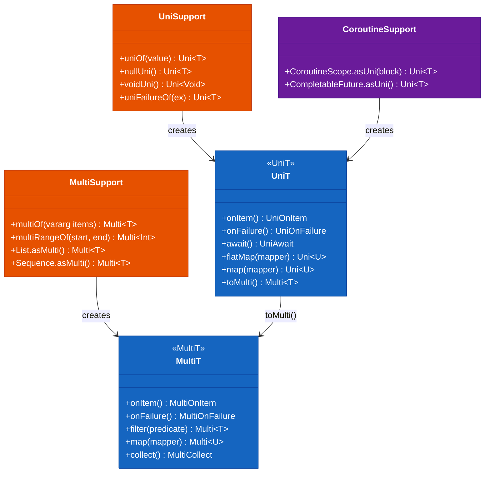
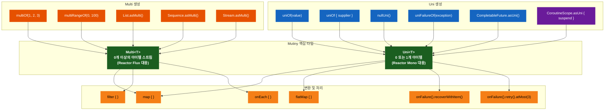
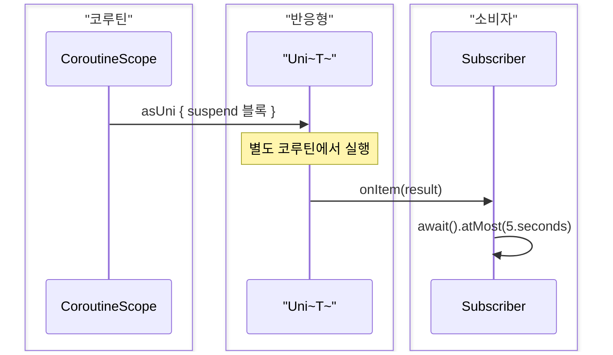

# Module bluetape4k-mutiny

[English](./README.md) | 한국어

## 개요

[SmallRye Mutiny](https://smallrye.io/smallrye-mutiny/) 반응형 라이브러리를 Kotlin에서 더 쉽게 사용할 수 있도록 확장 함수와 유틸리티를 제공합니다.

Mutiny는 이벤트 기반 반응형 프로그래밍을 위한 라이브러리로, `Uni`(0 또는 1개의 아이템)와 `Multi`(0개 이상의 아이템 스트림) 두 가지 주요 타입을 제공합니다.

## 의존성 추가

```kotlin
dependencies {
    implementation("io.github.bluetape4k:bluetape4k-mutiny:${version}")
}
```

## 주요 기능

- **Uni 생성**: 다양한 소스에서 Uni 생성
- **Multi 생성**: 컬렉션, 시퀀스, 스트림에서 Multi 생성
- **Coroutine 연동**: suspend 함수와 Uni 변환
- **Kotlin 친화적 API**: 확장 함수 제공

## 사용 예시

### Uni 생성

```kotlin
import io.bluetape4k.mutiny.*
import io.smallrye.mutiny.Uni

// 값으로부터 Uni 생성
val uni1: Uni<String> = uniOf("Hello")

// Supplier로부터 Uni 생성
val uni2: Uni<Int> = uniOf { 42 }

// null Uni 생성
val nullUni: Uni<String> = nullUni()

// void Uni 생성
val voidUni: Uni<Void> = voidUni()

// 실패 Uni 생성
val failureUni: Uni<String> = uniFailureOf(RuntimeException("Error"))

// CompletableFuture/CompletionStage에서 변환
val futureUni: Uni<String> = CompletableFuture.completedFuture("Hello").asUni()

// 상태와 매퍼로 생성
val uni3: Uni<String> = uniOf("World") { state -> "Hello, $state!" }
```

### Uni 변환

```kotlin
import io.bluetape4k.mutiny.*
import java.time.Duration

val uni = uniOf("Hello")

// 각 아이템 처리
uni.onEach { item ->
    println("Processing: $item")
}

// CompletableFuture로 변환
val future = uni.subscribeAsCompletionStage()

// 대기 및 결과 획득
val result = uni.await().atMost(Duration.ofSeconds(5))
```

### Multi 생성

```kotlin
import io.bluetape4k.mutiny.*
import io.smallrye.mutiny.Multi

// vararg로부터 Multi 생성
val multi1: Multi<Int> = multiOf(1, 2, 3, 4, 5)

// 범위로부터 Multi 생성
val multi2: Multi<Int> = multiRangeOf(0, 100)

// 컬렉션에서 변환
val list = listOf("a", "b", "c")
val multi3: Multi<String> = list.asMulti()

// 시퀀스에서 변환
val sequence = sequenceOf(1, 2, 3)
val multi4: Multi<Int> = sequence.asMulti()

// Stream에서 변환
val stream = Stream.of("x", "y", "z")
val multi5: Multi<String> = stream.asMulti()

// 배열에서 변환
val array = intArrayOf(1, 2, 3, 4, 5)
val multi6: Multi<Int> = array.asMulti()

// 진행(Progression)에서 변환
val range = 1..10
val multi7: Multi<Int> = range.asMulti()
```

### Multi 변환

```kotlin
import io.bluetape4k.mutiny.*

val multi = multiOf(1, 2, 3, 4, 5)

// 각 아이템 처리
multi.onEach { item ->
    println("Item: $item")
}

// 변환
val transformed = multi.map { it * 2 }

// 필터링
val filtered = multi.filter { it % 2 == 0 }

// 수집
val list = multi.collect().asList().await().indefinitely()
```

### Coroutine 연동

```kotlin
import io.bluetape4k.mutiny.*
import kotlinx.coroutines.CoroutineScope
import kotlinx.coroutines.Dispatchers

// CoroutineScope에서 Uni 생성
fun CoroutineScope.fetchData(): Uni<String> = asUni {
    // suspend 함수 실행
    delay(100)
    "Data from coroutine"
}

// 사용
val scope = CoroutineScope(Dispatchers.IO)
val uni = scope.fetchData()
val result = uni.await().indefinitely()
```

### Uni와 Multi 변환

```kotlin
import io.bluetape4k.mutiny.*
import io.smallrye.mutiny.Uni

// Uni를 반복하여 Multi 생성
val uni: Uni<Int> = uniOf { (0..100).random() }
val multi = uni.toMulti()
    .repeat().atMost(5)  // 최대 5회 반복

// Uni 리스트를 Multi로 변환
val unis = listOf(uniOf(1), uniOf(2), uniOf(3))
val multiFromUnis = Multi.createFrom().iterable(unis)
    .onItem().transformToUniAndConcatenate { it }
```

### 에러 처리

```kotlin
import io.bluetape4k.mutiny.*

val uni = uniOf {
    if (Random.nextBoolean()) throw RuntimeException("Random error")
    "Success"
}

// 에러 시 기본값 반환
val result = uni.onFailure().recoverWithItem("Default")

// 에러 시 대체 Uni 실행
val result2 = uni.onFailure().recoverWithUni {
    uniOf("Fallback")
}

// 재시도
val result3 = uni.onFailure().retry().atMost(3)
```

### 비동기 작업 체이닝

```kotlin
import io.bluetape4k.mutiny.*

fun fetchUser(id: Int): Uni<User> = uniOf { userRepository.findById(id) }

fun fetchOrders(user: User): Uni<List<Order>> = uniOf { orderRepository.findByUser(user) }

fun calculateTotal(orders: List<Order>): Uni<BigDecimal> = uniOf {
    orders.map { it.amount }.fold(BigDecimal.ZERO) { acc, amount -> acc + amount }
}

// 체이닝
val totalAmount = fetchUser(1)
    .flatMap { user -> fetchOrders(user) }
    .flatMap { orders -> calculateTotal(orders) }
    .map { "Total: $it" }

val result = totalAmount.await().indefinitely()
```

## Uni vs Multi

| 특징         | Uni              | Multi          |
|------------|------------------|----------------|
| 아이템 수      | 0 또는 1           | 0개 이상          |
| 사용 예시      | 단일 결과 조회, RPC 호출 | 스트림 처리, 이벤트 소스 |
| 완료         | 아이템 방출 후 즉시 완료   | 모든 아이템 방출 후 완료 |
| Reactor 대응 | Mono             | Flux           |

## 주요 기능 상세

| 파일                    | 설명                   |
|-----------------------|----------------------|
| `UniSupport.kt`       | Uni 생성 및 변환 확장 함수    |
| `MultiSupport.kt`     | Multi 생성 및 변환 확장 함수  |
| `CoroutineSupport.kt` | Coroutine과 Mutiny 연동 |

## Mutiny 타입 다이어그램



## Mutiny 처리 흐름



## Coroutine 연동 흐름



## Mutiny vs 다른 반응형 라이브러리

| 라이브러리           | 특징                           |
|-----------------|------------------------------|
| **Mutiny**      | 이벤트 기반, 명시적 비동기, Quarkus 친화적 |
| **Reactor**     | Netty 기반, Spring WebFlux 기본  |
| **RxJava**      | Observable 패턴, 안드로이드 친화적     |
| **Kotlin Flow** | Coroutine 기반, Kotlin 네이티브    |

Mutiny는 이벤트 구동 방식으로, 명시적인 비동기 처리를 선호하고 Quarkus 생태계와 함께 사용할 때 적합합니다.
