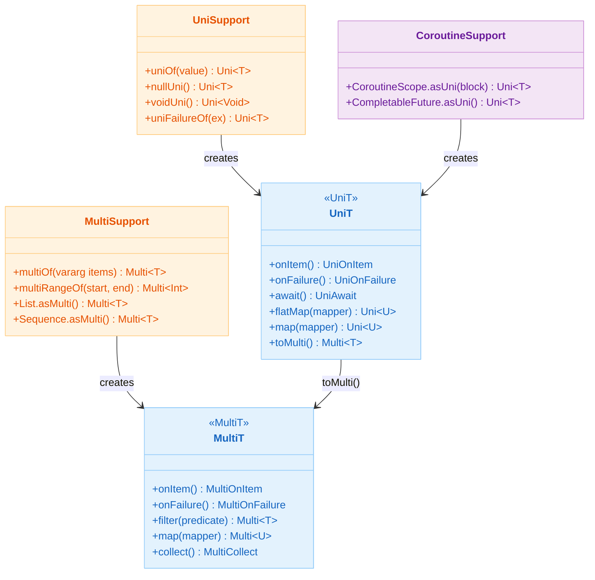
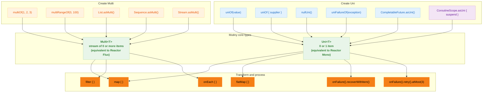
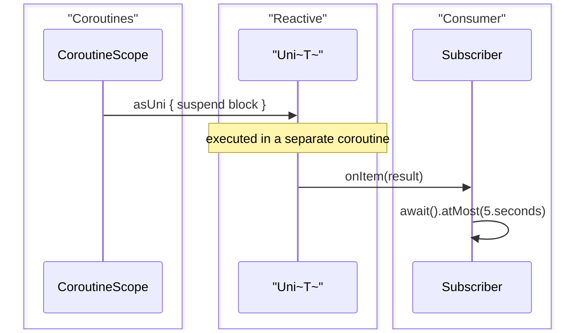

# Module bluetape4k-mutiny

English | [한국어](./README.ko.md)

## Overview

Provides extension functions and utilities that make the [SmallRye Mutiny](https://smallrye.io/smallrye-mutiny/) reactive library easier to use in Kotlin.

Mutiny is an event-driven reactive programming library with two main types: `Uni` (0 or 1 item) and
`Multi` (a stream of 0 or more items).

## Adding the Dependency

```kotlin
dependencies {
    implementation("io.github.bluetape4k:bluetape4k-mutiny:${version}")
}
```

## Key Features

- **Create `Uni`**: create `Uni` from various sources
- **Create `Multi`**: create `Multi` from collections, sequences, and streams
- **Coroutine interop**: convert suspend functions and coroutine blocks into `Uni`
- **Kotlin-friendly API**: extension functions for idiomatic usage

## Usage Examples

### Create `Uni`

```kotlin
import io.bluetape4k.mutiny.*
import io.smallrye.mutiny.Uni

// create Uni from a value
val uni1: Uni<String> = uniOf("Hello")

// create Uni from a supplier
val uni2: Uni<Int> = uniOf { 42 }

// create null Uni
val nullUni: Uni<String> = nullUni()

// create void Uni
val voidUni: Uni<Void> = voidUni()

// create failure Uni
val failureUni: Uni<String> = uniFailureOf(RuntimeException("Error"))

// convert from CompletableFuture / CompletionStage
val futureUni: Uni<String> = CompletableFuture.completedFuture("Hello").asUni()

// create from state and mapper
val uni3: Uni<String> = uniOf("World") { state -> "Hello, $state!" }
```

### Transform `Uni`

```kotlin
import io.bluetape4k.mutiny.*
import java.time.Duration

val uni = uniOf("Hello")

// process each item
uni.onEach { item ->
    println("Processing: $item")
}

// convert to CompletableFuture
val future = uni.subscribeAsCompletionStage()

// wait and get the result
val result = uni.await().atMost(Duration.ofSeconds(5))
```

### Create `Multi`

```kotlin
import io.bluetape4k.mutiny.*
import io.smallrye.mutiny.Multi

// create Multi from varargs
val multi1: Multi<Int> = multiOf(1, 2, 3, 4, 5)

// create Multi from a range
val multi2: Multi<Int> = multiRangeOf(0, 100)

// convert from a collection
val list = listOf("a", "b", "c")
val multi3: Multi<String> = list.asMulti()

// convert from a sequence
val sequence = sequenceOf(1, 2, 3)
val multi4: Multi<Int> = sequence.asMulti()

// convert from a Stream
val stream = Stream.of("x", "y", "z")
val multi5: Multi<String> = stream.asMulti()

// convert from an array
val array = intArrayOf(1, 2, 3, 4, 5)
val multi6: Multi<Int> = array.asMulti()

// convert from a progression
val range = 1..10
val multi7: Multi<Int> = range.asMulti()
```

### Transform `Multi`

```kotlin
import io.bluetape4k.mutiny.*

val multi = multiOf(1, 2, 3, 4, 5)

// process each item
multi.onEach { item ->
    println("Item: $item")
}

// transform
val transformed = multi.map { it * 2 }

// filter
val filtered = multi.filter { it % 2 == 0 }

// collect
val list = multi.collect().asList().await().indefinitely()
```

### Coroutine Interop

```kotlin
import io.bluetape4k.mutiny.*
import kotlinx.coroutines.CoroutineScope
import kotlinx.coroutines.Dispatchers

// create Uni from a CoroutineScope
fun CoroutineScope.fetchData(): Uni<String> = asUni {
    // run suspend function
    delay(100)
    "Data from coroutine"
}

// usage
val scope = CoroutineScope(Dispatchers.IO)
val uni = scope.fetchData()
val result = uni.await().indefinitely()
```

### Convert Between `Uni` and `Multi`

```kotlin
import io.bluetape4k.mutiny.*
import io.smallrye.mutiny.Uni

// repeat a Uni to create a Multi
val uni: Uni<Int> = uniOf { (0..100).random() }
val multi = uni.toMulti()
    .repeat().atMost(5)  // repeat up to 5 times

// convert a list of Uni into a Multi
val unis = listOf(uniOf(1), uniOf(2), uniOf(3))
val multiFromUnis = Multi.createFrom().iterable(unis)
    .onItem().transformToUniAndConcatenate { it }
```

### Error Handling

```kotlin
import io.bluetape4k.mutiny.*

val uni = uniOf {
    if (Random.nextBoolean()) throw RuntimeException("Random error")
    "Success"
}

// return a default value on failure
val result = uni.onFailure().recoverWithItem("Default")

// run a fallback Uni on failure
val result2 = uni.onFailure().recoverWithUni {
    uniOf("Fallback")
}

// retry
val result3 = uni.onFailure().retry().atMost(3)
```

### Chain Asynchronous Work

```kotlin
import io.bluetape4k.mutiny.*

fun fetchUser(id: Int): Uni<User> = uniOf { userRepository.findById(id) }

fun fetchOrders(user: User): Uni<List<Order>> = uniOf { orderRepository.findByUser(user) }

fun calculateTotal(orders: List<Order>): Uni<BigDecimal> = uniOf {
    orders.map { it.amount }.fold(BigDecimal.ZERO) { acc, amount -> acc + amount }
}

// chaining
val totalAmount = fetchUser(1)
    .flatMap { user -> fetchOrders(user) }
    .flatMap { orders -> calculateTotal(orders) }
    .map { "Total: $it" }

val result = totalAmount.await().indefinitely()
```

## `Uni` vs `Multi`

| Feature            | Uni                                          | Multi                              |
|--------------------|----------------------------------------------|------------------------------------|
| Item count         | 0 or 1                                       | 0 or more                          |
| Use case           | single result lookup, RPC call               | stream processing, event source    |
| Completion         | completes immediately after emitting an item | completes after emitting all items |
| Reactor equivalent | Mono                                         | Flux                               |

## Feature Details

| File                  | Description                                    |
|-----------------------|------------------------------------------------|
| `UniSupport.kt`       | extensions for creating and converting `Uni`   |
| `MultiSupport.kt`     | extensions for creating and converting `Multi` |
| `CoroutineSupport.kt` | interop between coroutines and Mutiny          |

## Mutiny Type Diagram



## Mutiny Processing Flow



## Coroutine Interop Flow



## Mutiny vs Other Reactive Libraries

| Library         | Characteristics                                      |
|-----------------|------------------------------------------------------|
| **Mutiny**      | event-driven, explicit async model, Quarkus-friendly |
| **Reactor**     | Netty-based, default for Spring WebFlux              |
| **RxJava**      | Observable pattern, Android-friendly                 |
| **Kotlin Flow** | coroutine-based, Kotlin-native                       |

Mutiny is well suited to event-driven programming, explicit asynchronous handling, and use within the Quarkus ecosystem.
