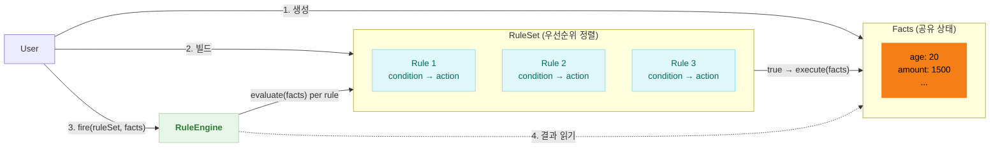
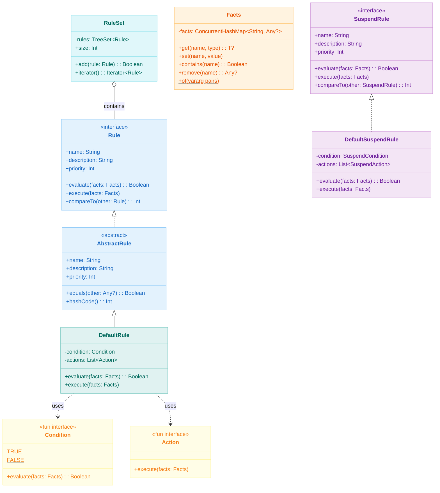
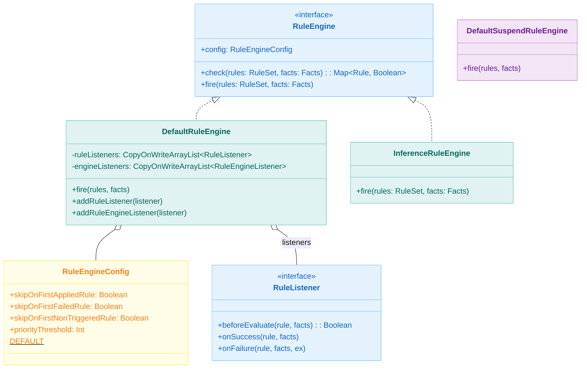
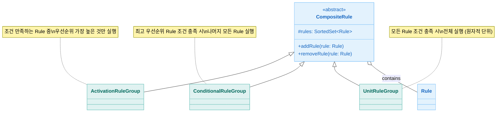
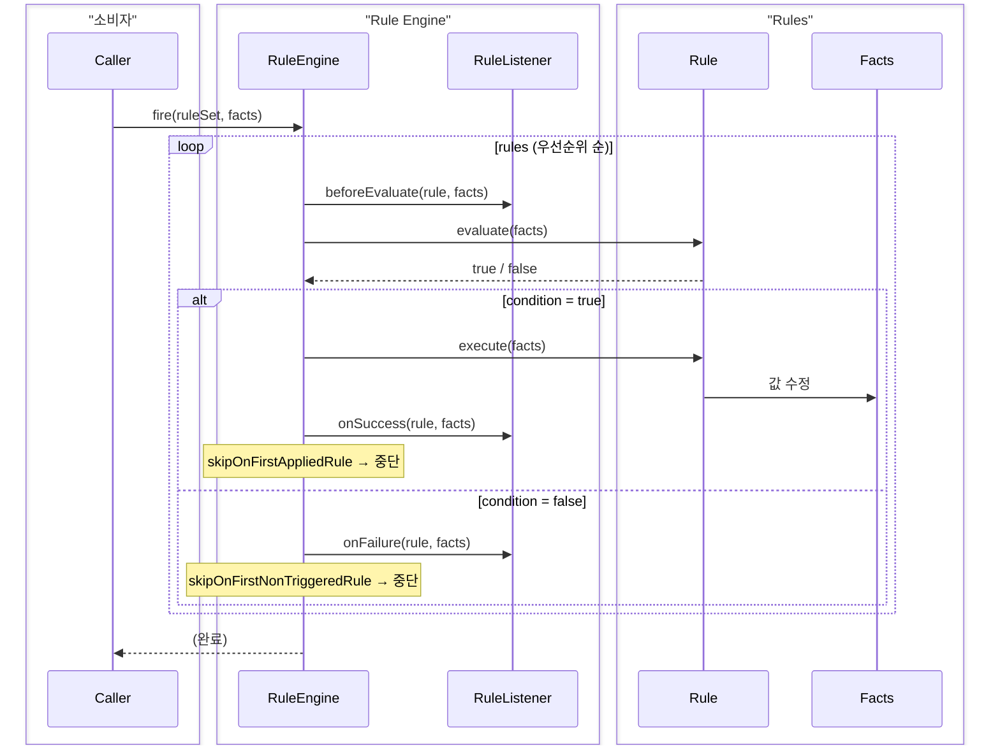
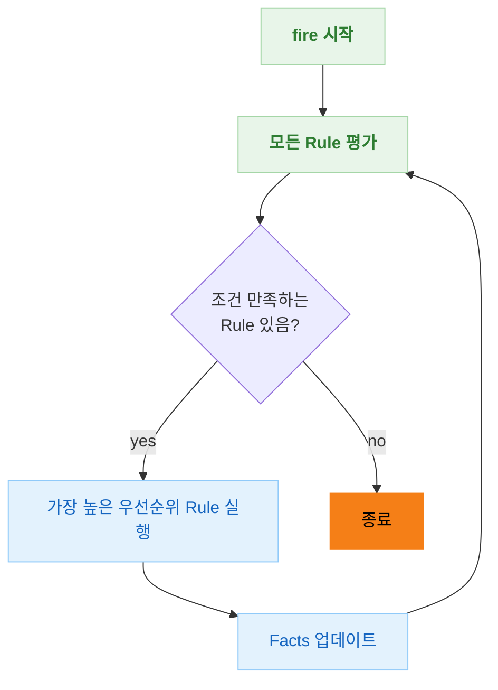
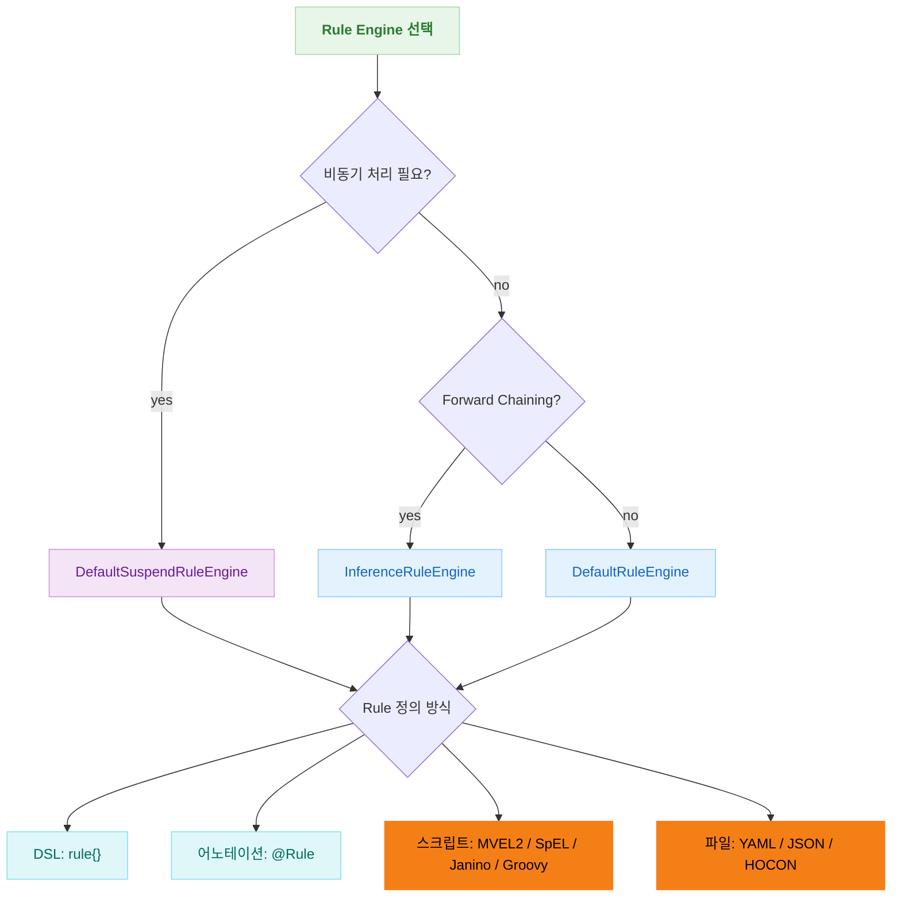
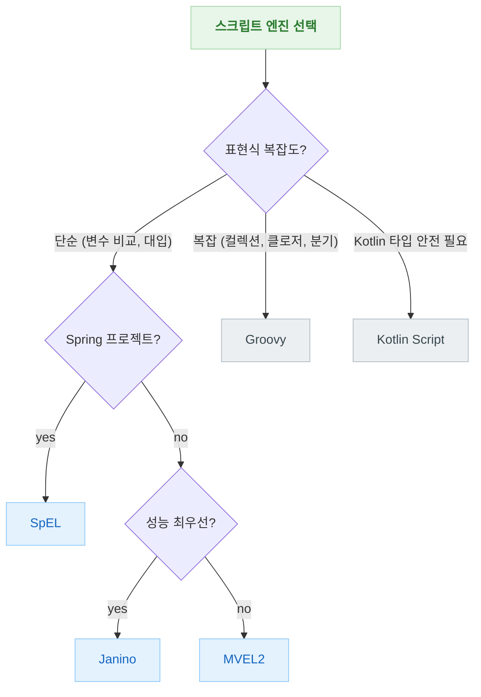

# bluetape4k-rule-engine

[English](./README.md) | 한국어

Kotlin 기반의 경량 Rule Engine 라이브러리입니다. Easy Rules 패턴을 기반으로 하되, Kotlin DSL, 코루틴(SuspendRule), 어노테이션 기반 Rule 정의를 지원합니다.

## 아키텍처

### 개념 개요

세 가지 핵심 구성 요소와 상호 작용:



`Rule`은 **condition** (`Facts` 검사 Predicate)과 **action** (`Facts` 수정 함수)으로 구성됩니다.  
`RuleEngine.fire()`는 우선순위 순으로 Rule을 순회하며 조건을 평가하고, 만족하는 Rule의 Action을 실행합니다.

### 핵심 클래스 다이어그램



### Rule Engine 클래스 다이어그램



### Composite Rule 다이어그램



### Rule 실행 시퀀스



### InferenceRuleEngine (Forward Chaining)



### Rule Engine 선택 가이드



## 핵심 기능

- **DSL 기반 Rule 정의**: `rule {}`, `suspendRule {}`, `ruleEngine {}` DSL
- **어노테이션 기반 Rule**: `@Rule`, `@Condition`, `@Action`, `@Fact` 어노테이션으로 POJO 클래스를 Rule로 변환
- **코루틴 지원**: `SuspendRule`, `SuspendRuleEngine`으로 비동기 Rule 실행
- **Cancellation 인지 suspend 엔진**: `DefaultSuspendRuleEngine`은 `CancellationException`을 일반 Rule 실패로 삼키지 않고 다시 던집니다
- **스크립트 엔진**: MVEL2, SpEL, Kotlin Script, Janino, Groovy 기반 동적 Rule 정의
- **Rule Reader**: YAML, JSON, HOCON 포맷으로 외부 파일에서 Rule 정의 로딩
- **Composite Rule**: `ActivationRuleGroup`, `ConditionalRuleGroup`, `UnitRuleGroup`으로 복합 Rule 조합
- **Forward Chaining**: `InferenceRuleEngine`으로 조건 만족 시 반복 실행

## 사용 예시

### DSL 기반 Rule

```kotlin
val discountRule = rule {
    name = "discount"
    description = "1000원 이상 구매 시 할인 적용"
    priority = 1
    condition { facts -> facts.get<Int>("amount")!! > 1000 }
    action { facts -> facts["discount"] = true }
}

val engine = ruleEngine { skipOnFirstAppliedRule = true }
val facts = Facts.of("amount" to 1500)
engine.fire(ruleSetOf(discountRule), facts)
```

### 어노테이션 기반 Rule

```kotlin
@Rule(name = "ageCheck", description = "성인 확인", priority = 1)
class AgeCheckRule {
    @Condition
    fun isAdult(facts: Facts): Boolean = facts.get<Int>("age")!! >= 18

    @Action
    fun allow(facts: Facts) {
        facts["allowed"] = true
    }
}

val rule = AgeCheckRule().asRule()
val facts = Facts.of("age" to 20)
DefaultRuleEngine().fire(ruleSetOf(rule), facts)
```

### 코루틴 기반 SuspendRule

```kotlin
val asyncRule = suspendRule {
    name = "asyncProcess"
    condition { facts -> facts.get<Int>("value")!! > 0 }
    action { facts ->
        delay(100)
        facts["processed"] = true
    }
}

val engine = DefaultSuspendRuleEngine()
engine.fire(suspendRuleSetOf(asyncRule), facts)
```

### MVEL2 스크립트 Rule

```kotlin
val rule = MvelRule(name = "discount", priority = 1)
    .whenever("amount > 1000")
    .then("discount = true")
```

### SpEL 스크립트 Rule

```kotlin
val rule = SpelRule(name = "discount", priority = 1)
    .whenever("#amount > 1000")
    .then("#discount = true")
```

### Janino 스크립트 Rule (바이트코드 컴파일 Java)

Janino는 런타임에 Java 표현식을 바이트코드로 컴파일하여 네이티브에 가까운 속도로 실행합니다.
대량의 룰 반복 평가(가격 계산, 유효성 검증, 할인 정책)에 최적입니다.

```kotlin
val rule = JaninoRule(name = "discount", priority = 1)
    .whenever("((Integer)facts.get(\"amount\")).intValue() > 1000")
    .then("facts.put(\"discount\", Boolean.TRUE);")
```

**Janino 작성 시 주의사항:**

- **Condition은 순수 표현식만 지원**: `ExpressionEvaluator` 기반이므로 변수 선언(`int x = ...`)이 불가합니다.
  복잡한 조건은 인라인으로 작성하세요.
  ```java
  // ✅ 올바른 Condition
  "((Integer)facts.get(\"age\")).intValue() >= 18 && ((Integer)facts.get(\"age\")).intValue() <= 65"
  
  // ❌ 컴파일 오류 — 변수 선언은 표현식이 아님
  "int age = ((Integer)facts.get(\"age\")).intValue(); age >= 18 && age <= 65"
  ```
- **Action은 문장(statement) 블록 지원**: `ScriptEvaluator` 기반이므로 변수 선언, if-else, for/while 루프 모두 가능합니다.
- **명시적 타입 캐스팅 필수**: `facts`는 `Map<String, Object>` 타입이므로 `facts.get()` 결과를 반드시 캐스팅해야 합니다.
- **복잡한 조건 로직이 필요하면 Groovy를 추천합니다** — Groovy는 변수 직접 접근, 범위 연산자(`in 18..65`), 클로저를 지원합니다.

### Groovy 스크립트 Rule

Groovy는 동적 타이핑, 클로저, Java 호환 문법을 제공합니다.
복잡한 룰 로직을 표현력 높은 문법으로 작성할 수 있습니다.

```kotlin
val rule = GroovyRule(name = "discount", priority = 1)
    .whenever("amount > 1000")
    .then("discount = true")

// Groovy는 클로저와 풍부한 표현식 지원
val tierRule = GroovyRule(name = "tier")
    .whenever("amount > 0")
    .then("tier = amount > 5000 ? 'gold' : amount > 2000 ? 'silver' : 'bronze'")
```

**Groovy 편의 기능:**

- **Null 안전 바인딩**: `NullSafeBinding`을 사용하여 Facts에 없는 키를 참조하면 예외 대신 `null`을 반환합니다.
  Elvis 연산자와 safe navigation이 자연스럽게 동작합니다.
  ```groovy
  // Facts에 'name' 키가 없어도 MissingPropertyException 발생하지 않음
  displayName = name ?: 'Guest'         // Elvis — null이면 기본값
  upper = name?.toUpperCase()           // safe navigation — null이면 null
  ```
- **GString 자동 변환**: Groovy 문자열 보간(`"Hello, ${name}!"`) 결과는 `GString` 타입인데,
  Facts에 반영 시 자동으로 `String`으로 변환되므로 `facts.get<String>()`이 안전합니다.
- **변수 직접 접근**: Facts의 키가 Groovy 변수로 바인딩되어 `facts.get("amount")` 대신 `amount`로 바로 접근합니다.
- **새 변수 자동 반영**: 스크립트에서 대입한 변수(`discount = true`)는 자동으로 Facts에 저장됩니다.

### 스크립트 엔진 비교

| 엔진 | 언어 | 컴파일 방식 | 표현식 문법 | 적합한 용도 |
|------|------|-----------|----------|-----------|
| MVEL2 | MVEL | 하이브리드 (인터프리터 + 바이트코드) | `amount > 1000` | 간단한 동적 표현식 |
| SpEL | Spring EL | 하이브리드 (컴파일 옵션) | `#amount > 1000` | Spring 생태계 통합 |
| Janino | Java 서브셋 | **바이트코드** (네이티브 속도) | `((Integer)facts.get("amount")).intValue() > 1000` | 고빈도 반복 평가, 단순 조건 |
| Groovy | Groovy | **바이트코드** | `amount > 1000` | 클로저/컬렉션 활용 복잡한 로직 |
| Kotlin Script | Kotlin | 바이트코드 (콜드스타트 느림) | 전체 Kotlin 문법 | 타입 안전 Kotlin 표현식 |

### 스크립트 엔진 선택 가이드



| 시나리오 | 추천 엔진 | 이유 |
|---------|---------|------|
| 가격 비교, 임계값 체크 | Janino | 바이트코드 컴파일, 최고 성능 |
| Spring 컨텍스트 내 빈 참조 | SpEL | `#bean.method()` 직접 호출 |
| 할인 정책, 등급 분류 | MVEL2 / Groovy | 간결한 문법 |
| 컬렉션 필터/변환, 복잡한 분기 | Groovy | `collect`, `findAll`, `switch-range`, 클로저 |
| optional 필드 처리 | Groovy | `NullSafeBinding` + Elvis/safe navigation |
| 타입 안전 표현식 | Kotlin Script | 전체 Kotlin 문법 (콜드스타트 느림) |

### YAML에서 Rule 로딩

```yaml
# rules.yml
rules:
    -   name: "discount"
        condition: "amount > 1000"
        actions:
            - "discount = true"
```

```kotlin
val reader = YamlRuleReader()
val definitions = reader.readAll(source).toList()
val mvelRules = definitions.map { it.toMvelRule() }
```

## 설정 옵션

| 옵션                            | 설명                   | 기본값             |
|-------------------------------|----------------------|-----------------|
| `skipOnFirstAppliedRule`      | 첫 번째 성공 Rule 이후 중단   | `false`         |
| `skipOnFirstFailedRule`       | 첫 번째 실패 Rule 이후 중단   | `false`         |
| `skipOnFirstNonTriggeredRule` | 첫 번째 미트리거 Rule 이후 중단 | `false`         |
| `priorityThreshold`           | 이 값 초과 우선순위 Rule 무시  | `Int.MAX_VALUE` |

## 의존성

```kotlin
implementation(project(":bluetape4k-rule-engine"))

// optional (compileOnly)
implementation("org.mvel:mvel2:2.5.2.Final")              // MVEL2 엔진
implementation("org.codehaus.janino:janino:3.1.12")        // Janino 엔진
implementation("org.apache.groovy:groovy:4.0.27")          // Groovy 엔진
implementation("org.springframework:spring-expression")     // SpEL 엔진
implementation("org.jetbrains.kotlin:kotlin-scripting-jvm-host") // Kotlin Script 엔진
implementation("com.fasterxml.jackson.dataformat:jackson-dataformat-yaml") // YAML 리더
implementation("com.typesafe:config:1.4.3")                // HOCON 리더
```
