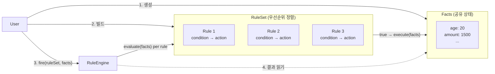
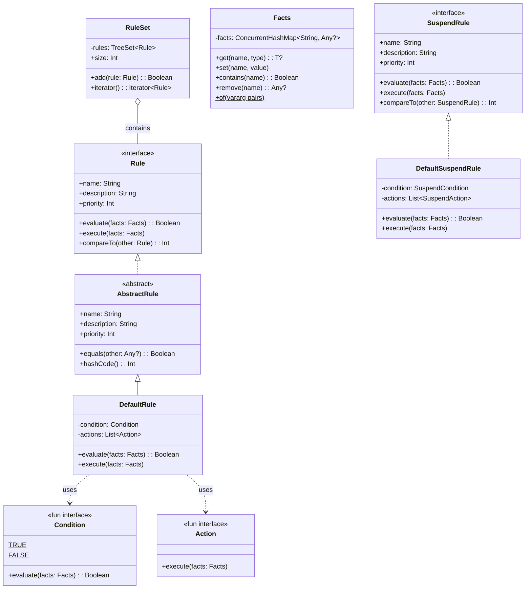
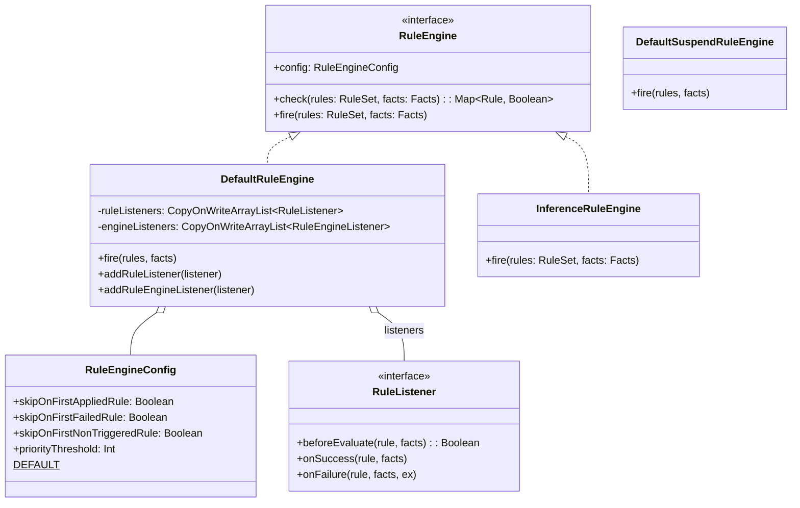
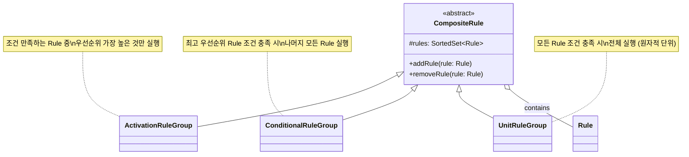
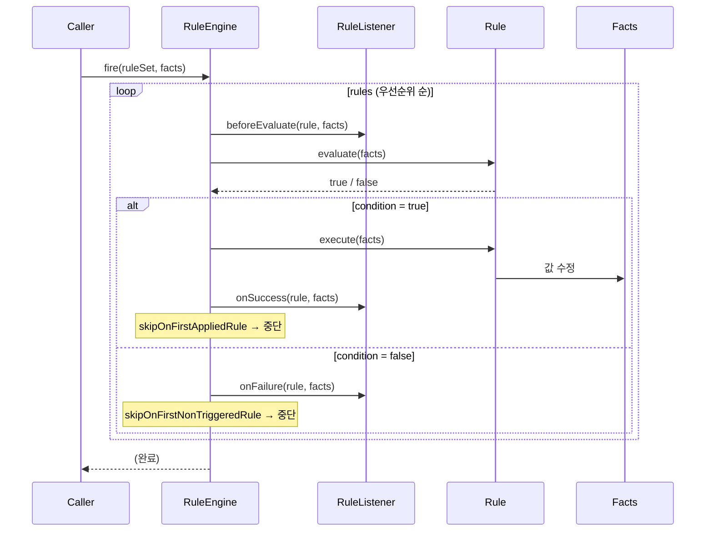
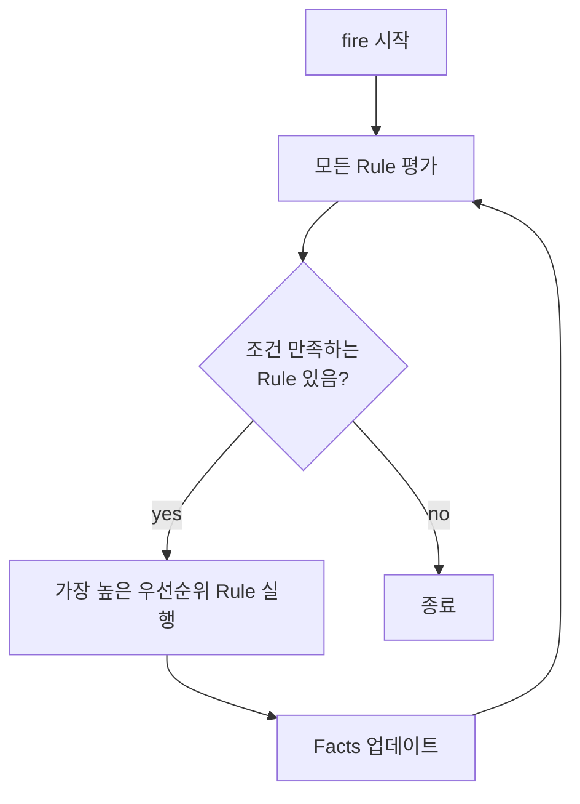
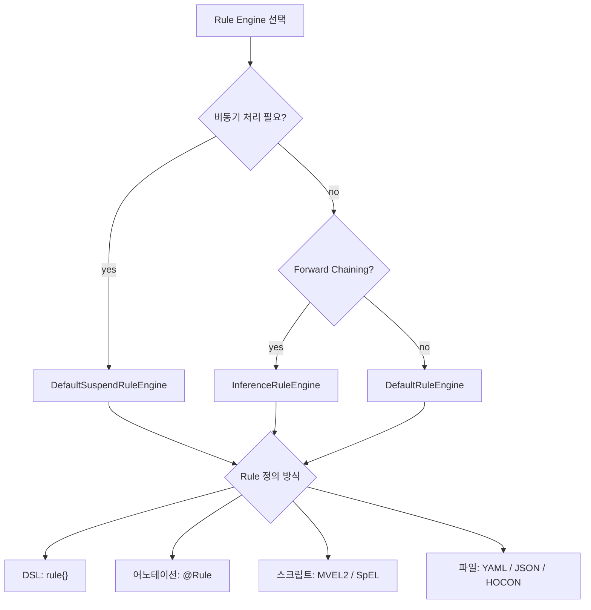

# bluetape4k-rule-engine

[English](./README.md) | 한국어

Kotlin 기반의 경량 Rule Engine 라이브러리입니다. Easy Rules 패턴을 기반으로 하되, Kotlin DSL, 코루틴(SuspendRule), 어노테이션 기반 Rule 정의를 지원합니다.

## 아키텍처

### 개념 개요

세 가지 핵심 구성 요소와 상호 작용:



`Rule`은 **condition** (`Facts` 검사 Predicate)과 **action** (`Facts` 수정 함수)으로 구성됩니다.  
`RuleEngine.fire()`는 우선순위 순으로 Rule을 순회하며 조건을 평가하고, 만족하는 Rule의 Action을 실행합니다.

### 핵심 클래스 다이어그램



### Rule Engine 클래스 다이어그램



### Composite Rule 다이어그램



### Rule 실행 시퀀스



### InferenceRuleEngine (Forward Chaining)



### Rule Engine 선택 가이드



## 핵심 기능

- **DSL 기반 Rule 정의**: `rule {}`, `suspendRule {}`, `ruleEngine {}` DSL
- **어노테이션 기반 Rule**: `@Rule`, `@Condition`, `@Action`, `@Fact` 어노테이션으로 POJO 클래스를 Rule로 변환
- **코루틴 지원**: `SuspendRule`, `SuspendRuleEngine`으로 비동기 Rule 실행
- **스크립트 엔진**: MVEL2, SpEL, Kotlin Script 기반 동적 Rule 정의
- **Rule Reader**: YAML, JSON, HOCON 포맷으로 외부 파일에서 Rule 정의 로딩
- **Composite Rule**: `ActivationRuleGroup`, `ConditionalRuleGroup`, `UnitRuleGroup`으로 복합 Rule 조합
- **Forward Chaining**: `InferenceRuleEngine`으로 조건 만족 시 반복 실행

## 사용 예시

### DSL 기반 Rule

```kotlin
val discountRule = rule {
    name = "discount"
    description = "1000원 이상 구매 시 할인 적용"
    priority = 1
    condition { facts -> facts.get<Int>("amount")!! > 1000 }
    action { facts -> facts["discount"] = true }
}

val engine = ruleEngine { skipOnFirstAppliedRule = true }
val facts = Facts.of("amount" to 1500)
engine.fire(ruleSetOf(discountRule), facts)
```

### 어노테이션 기반 Rule

```kotlin
@Rule(name = "ageCheck", description = "성인 확인", priority = 1)
class AgeCheckRule {
    @Condition
    fun isAdult(facts: Facts): Boolean = facts.get<Int>("age")!! >= 18

    @Action
    fun allow(facts: Facts) {
        facts["allowed"] = true
    }
}

val rule = AgeCheckRule().asRule()
val facts = Facts.of("age" to 20)
DefaultRuleEngine().fire(ruleSetOf(rule), facts)
```

### 코루틴 기반 SuspendRule

```kotlin
val asyncRule = suspendRule {
    name = "asyncProcess"
    condition { facts -> facts.get<Int>("value")!! > 0 }
    action { facts ->
        delay(100)
        facts["processed"] = true
    }
}

val engine = DefaultSuspendRuleEngine()
engine.fire(suspendRuleSetOf(asyncRule), facts)
```

### MVEL2 스크립트 Rule

```kotlin
val rule = MvelRule(name = "discount", priority = 1)
    .whenever("amount > 1000")
    .then("discount = true")
```

### SpEL 스크립트 Rule

```kotlin
val rule = SpelRule(name = "discount", priority = 1)
    .whenever("#amount > 1000")
    .then("#discount = true")
```

### YAML에서 Rule 로딩

```yaml
# rules.yml
rules:
    -   name: "discount"
        condition: "amount > 1000"
        actions:
            - "discount = true"
```

```kotlin
val reader = YamlRuleReader()
val definitions = reader.readAll(source).toList()
val mvelRules = definitions.map { it.toMvelRule() }
```

## 설정 옵션

| 옵션                            | 설명                   | 기본값             |
|-------------------------------|----------------------|-----------------|
| `skipOnFirstAppliedRule`      | 첫 번째 성공 Rule 이후 중단   | `false`         |
| `skipOnFirstFailedRule`       | 첫 번째 실패 Rule 이후 중단   | `false`         |
| `skipOnFirstNonTriggeredRule` | 첫 번째 미트리거 Rule 이후 중단 | `false`         |
| `priorityThreshold`           | 이 값 초과 우선순위 Rule 무시  | `Int.MAX_VALUE` |

## 의존성

```kotlin
implementation(project(":bluetape4k-rule-engine"))

// optional (compileOnly)
implementation("org.mvel:mvel2:2.5.2.Final")              // MVEL2 엔진
implementation("org.springframework:spring-expression")     // SpEL 엔진
implementation("org.jetbrains.kotlin:kotlin-scripting-jvm-host") // Kotlin Script 엔진
implementation("com.fasterxml.jackson.dataformat:jackson-dataformat-yaml") // YAML 리더
implementation("com.typesafe:config:1.4.3")                // HOCON 리더
```
